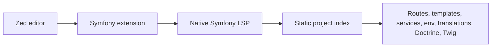

# Symfony for Zed

[](https://github.com/nymo/zed-symfony/actions/workflows/ci.yml)
[](LICENSE)

[](https://zed.dev/extensions)

**Framework-aware navigation, completion, hover, and diagnostics for Symfony projects in [Zed](https://zed.dev).**

Symfony for Zed is a native Rust language server launched by a small Zed extension. It understands the relationships between your routes, templates, services, translations, environment variables, Doctrine entities, and Twig components, and it complements your existing PHP and Twig tooling instead of replacing it.

> **Status: pre-release.** The core static features are implemented, and end-to-end LSP behavior and the PHP rename policy are covered by automated tests. Verifying multi-server behavior and watcher delivery in a real Zed window, and publishing the first release assets, remain open. See the [public release scope](docs/release-scope.md) before relying on a feature in production.

## Table of contents

- [How it works](#how-it-works)
- [Features](#features)
- [Requirements](#requirements)
- [Installation](#installation)
- [Usage](#usage)
- [Configuration](#configuration)
- [PHP language server compatibility](#php-language-server-compatibility)
- [Documentation](#documentation)
- [Contributing](#contributing)
- [License](#license)

## How it works



The server reads your project's static files — Composer metadata, PHP source, YAML/XML/PHP configuration, Twig templates, translation catalogs, and `.env*` files — and builds an in-memory index. It never boots Symfony, runs `bin/console`, reads the compiled container, or connects to a database.

## Features

The server detects Symfony applications from Composer metadata (with a structural fallback), discovers PHP classes from Composer `psr-4`/`psr-0` roots as well as conventional directories, and indexes common Symfony patterns to provide:

- **Routing:** PHP `#[Route]` attributes and common YAML route declarations, route references, controller links, route-parameter completion, hover, and missing-route diagnostics.
- **Twig templates:** references from PHP render calls and Twig include/extends/embed syntax, definition navigation, path completion, document links, missing-template diagnostics, and file-aware rename.
- **Environment variables:** root `.env*` files, YAML `%env(...)%`, and PHP/Twig `env(...)` references, with completion, navigation, hover, and missing-key warnings.
- **Translations:** YAML and XLIFF key indexing plus common PHP/Twig translation references, completion, hover, and navigation.
- **Services:** common YAML/XML/PHP service definitions, aliases, tags, references, constructor-service suggestions, and selected service quick fixes.
- **Doctrine:** PHP attribute and XML/YAML mapping metadata, relation-target navigation, missing-target warnings, and mapped-field completion for common QueryBuilder aliases.
- **Forms:** FormType fields and option completion, `data_class` navigation, Doctrine-field suggestions, and Twig `form.field` references.
- **Twig extensions and UX components:** registered functions, filters, tests, custom tags, component names/props/templates, and component usage navigation.
- **Quick actions:** create a missing template, add a route attribute, add common service tags, or inject a matching service property.

This is syntax-shaped static analysis. It intentionally does not infer dynamic configuration or evaluate arbitrary PHP. The [feature matrix](docs/feature-matrix.md) lists supported forms and current limits.

## Requirements

- A recent [Zed](https://zed.dev) build.
- To build from source: stable Rust via [`rustup`](https://rustup.rs) and the `wasm32-wasip2` target.

## Installation

### From the Zed extension gallery

Once a version-matched GitHub release exists, installing the extension from the gallery downloads the matching platform binary automatically — no `PATH` setup required. Releases are produced by [`.github/workflows/release.yml`](.github/workflows/release.yml); see [publishing a release](docs/development.md#publishing-a-release).

### From source (development)

Until the first release is published, install this checkout as a dev extension and make the native binary available on `PATH`:

```sh
cargo build -p symfony-lsp
export PATH="$PWD/target/debug:$PATH"
zed --foreground /path/to/your-symfony-project
```

In Zed, run `zed: install dev extension` and select this repository. If Zed is started from the GUI, make sure the binary directory is in Zed's environment, or start Zed from the shell as above. See [development setup](docs/development.md) for details.

## Usage

Open a Symfony project and start navigating. For example, given a controller:

```php
// src/Controller/HelloController.php
#[Route('/hello/{name}', name: 'hello_world')]
public function index(string $name): Response
{
    return $this->render('hello/index.html.twig', ['name' => $name]);
}
```

and a template that uses the route:

```twig
{# templates/hello/index.html.twig #}
{{ path('hello_world', { name: 'Zed' }) }}
```

the server provides:

- completion and go-to-definition for the route name `hello_world` and its `name` parameter,
- navigation from `hello/index.html.twig` to the template file,
- warnings for missing routes, templates, environment variables, translations, services, and Doctrine targets,
- quick fixes such as creating a missing template or adding a route attribute.

## Configuration

The launcher forwards `initialization_options` and `settings` to the server. A minimal shape is:

```json
{
  "lsp": {
    "symfony-lsp": {
      "initialization_options": {},
      "settings": {}
    }
  }
}
```

Settings are reserved for future user-configurable indexing and analysis options.

## PHP language server compatibility

Keep your preferred PHP server installed for general PHP analysis. Zed merges hover, definition, references, completion, diagnostics, and code actions across all attached servers, so Symfony's PHP features work alongside your PHP server. Rename is the exception: Zed sends Rename Symbol to the first server that advertises it and does not fall back, so only one server can own PHP rename.

The recommended default keeps your PHP server first, which preserves ordinary PHP symbol rename; framework-string rename still works in Twig, YAML, XML, and Env. To rename route names, template paths, or service IDs from PHP instead, put Symfony first:

```json
{
  "languages": {
    "PHP": {
      "language_servers": ["symfony-lsp", "..."]
    }
  }
}
```

This makes Symfony the PHP rename provider, so ordinary PHP symbol rename stops working; verify your workflow with your PHP server. This is a Zed routing limitation, not a Symfony parser limitation. See the [compatibility notes](docs/compatibility.md#php-rename-provider-priority).

## Documentation

- [Public release scope and open gates](docs/release-scope.md)
- [Feature matrix](docs/feature-matrix.md)
- [Compatibility and multi-LSP behavior](docs/compatibility.md)
- [Zed integration checklist](docs/zed-integration.md)
- [Architecture](docs/architecture.md)
- [Development](docs/development.md)
- [Troubleshooting](docs/troubleshooting.md)

## Contributing

Contributions are welcome — bug reports, feature requests, documentation fixes, and code. Start with [`CONTRIBUTING.md`](CONTRIBUTING.md), and open an issue if you are unsure where to begin.

The local check suite is the same one CI runs:

```sh
cargo fmt --all -- --check
cargo clippy --workspace --all-targets -- -D warnings
cargo test -p symfony-lsp
cargo check -p symfony-zed --target wasm32-wasip2
python3 scripts/lsp_smoke.py target/debug/symfony-lsp
```

`cargo test -p symfony-lsp` runs both the parser/helper unit tests and the end-to-end LSP request/response tests in [`symfony-lsp/tests/lsp_e2e.rs`](symfony-lsp/tests/lsp_e2e.rs), which spawn the real server and drive it over stdio JSON-RPC. The smoke test only covers the `initialize`/`shutdown` handshake. For editor-visible behavior, install the checkout as a dev extension and test it in Zed; the [Zed integration checklist](docs/zed-integration.md) lists what to verify.

## License

GNU General Public License v3.0. See [`LICENSE`](LICENSE).
