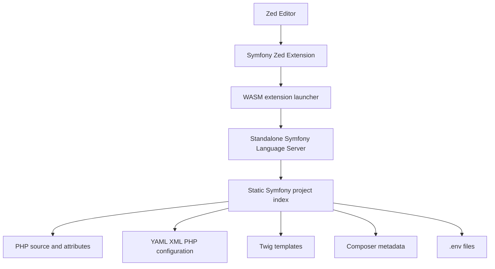

## User

I want to develop a Zed Extension for the Zed Editor.
@fetch https://zed.dev/docs/extensions/developing-extensions

The zed extension should be a Symfony Framework Extension which helps developers to work with Syfmony Framework in the Zed Editor. For the Features we should check which one of the one from the PHPStorm Plugin @fetch https://github.com/Haehnchen/idea-php-symfony2-plugin @fetch https://espend.de/phpstorm/plugin/symfony is possible for a zed extension.

For the implementation have a look at @fetch https://github.com/mike-bronner/zed-laravel to see how such a extension is bneing developed. Check also if some of this features can be used in our extension for Symfony.

Lets first analyze and make a Plan which we can discuss.

## Assistant

<thinking>
**Planning a project analysis**

I need to formulate an answer plan without making edits. First, I’ll fetch relevant URLs and possibly inspect the current project. The user has asked for analysis and planning, so I should grab the necessary documents and repositories. I'll use fetching tools in parallel for efficiency. Additionally, it makes sense to list the project since I have access to the root. Inspection of the existing project is essential for tailoring my approach. Let's fetch all four resources at once!
</thinking>

I’ll first compare Zed’s extension model with the Laravel reference implementation and the Symfony PhpStorm plugin’s feature set, then map feasible features to a staged implementation plan. I’ll also inspect the current workspace structure so the plan fits the existing project rather than assuming a blank extension.

**Tool Call: Fetch https://zed.dev/docs/extensions/developing\-extensions**
Status: Completed

Agent documentation index: llms.txt. Markdown versions are available for docs pages.                                                                                                                                                                                                                 Search docs…                    S                                                    Search…                                                                                                                                                                    
                        - Light
                        - Dark
                    
                                                                                                        Download                                                                                                                                                                                                             
                        
                                                                                                                      

# Developing Extensions

Zed extensions are Git repositories containing an `extension.toml` manifest. They can provide languages, themes, debuggers, snippets, and MCP servers.

## Extension Features

Extensions can provide:
- Languages
- Debuggers
- Themes
- Icon Themes
- Snippets
- MCP Servers

## Developing an Extension Locally

Before starting to develop an extension for Zed, be sure to install Rust via rustup.

Zed uses the `wasm32-wasip2` Rust target to compile extensions. If Rust is installed via rustup, Zed will install the target automatically. If Rust is installed another way (e.g., via Homebrew or Nix), you must make the `wasm32-wasip2` target available yourself — for example, by adding it to the `targets` of a Nix rust-overlay or fenix toolchain.

Extensions that provide grammars additionally require the wasi-sdk to compile Tree-sitter parsers. Zed downloads it automatically, but you can point Zed at an existing installation by setting the `WASI_SDK_PATH` environment variable to its root directory (the one containing `bin/clang`).

When developing an extension, you can use it in Zed without needing to publish it by installing it as a _dev extension_.

From the extensions page, click the `Install Dev Extension` button (or the `zed: install dev extension` action) and select the directory containing your extension.

If you need to troubleshoot, check Zed.log ( `zed: open log`) for additional output. For debug output, close and relaunch Zed from the command line with `zed --foreground`, which shows more verbose INFO-level logs.

If you already have the published version of the extension installed, the published version will be uninstalled prior to the installation of the dev extension. After successful installation, the `Extensions` page will indicate that the upstream extension is “Overridden by dev extension”.

## Directory Structure of a Zed Extension

A Zed extension is a Git repository that contains an `extension.toml`. This file must contain some basic information about the extension:

```
id = "my-extension"
name = "My extension"
version = "0.0.1"
schema_version = 1
authors = ["Your Name <you@example.com>"]
description = "Example extension"
repository = "https://github.com/your-name/my-zed-extension"

```

In addition to this, there are several other optional files and directories that can be used to add functionality to a Zed extension. An example directory structure of an extension that provides all capabilities is as follows:

```
my-extension/
  extension.toml
  Cargo.toml
  src/
    lib.rs
  languages/
    my-language/
      config.toml
      highlights.scm
  themes/
    my-theme.json
  snippets/
    snippets.json
    rust.json

```

## Rust and WebAssembly

Please note that most extensions will work properly without any Rust code present. In particular, only language server, context server and debugger extensions require the presence of custom Rust in order to function properly.

Procedural parts of extensions are written in Rust and compiled to WebAssembly. To develop an extension that includes custom code, include a `Cargo.toml` like this:

```
[package]
name = "my-extension"
version = "0.0.1"
edition = "2021"

[lib]
crate-type = ["cdylib"]

[dependencies]
zed_extension_api = "0.1.0"

```

Use the latest version of the `zed_extension_api` available on crates.io. Make sure it’s still compatible with Zed versions you want to support.

In the `src/lib.rs` file in your Rust crate you will need to define a struct for your extension and implement the `Extension` trait, as well as use the `register_extension!` macro to register your extension:

```
use zed_extension_api as zed;

struct MyExtension {
    // ... state
}

impl zed::Extension for MyExtension {
    // ...
}

zed::register_extension!(MyExtension);

```

Since your extension will be compiled to WebAssembly, some Rust features might not work like you would expect them to. For example, `cfg` - directives will not work and `std::env::var` will also not yield the expected results. Instead, use the `zed_extension_api::current_platform` method to get information about the current environment and familiarize yourself with the `Worktree` struct and its methods for reading environment variables and finding binaries in the user’s `PATH`.

### Debugging your Rust extension

`stdout`/ `stderr` is forwarded directly to the Zed process. In order to see `println!`/ `dbg!` output from your extension, you can start Zed in your terminal with a `--foreground` flag.                                                                                                                    Installing Extensions                                                                                         Publishing Your Extension                                                                                                                                                                                                                                 •                            Back to Site                            •                            Releases                            •                            Roadmap                            •                            GitHub                            •                            Blog                            •                                                            Manage Site Cookies                                                                                                                                                                                                                                                                                                                                                                                                                                                                                             

                    Zed uses cookies to improve your experience and for marketing. Read our cookie policy for more details.                                                                             Strictly Necessary                                                                                                                                            Analytics                                                                                                                                            Marketing                                                                                                                                                                                                                                                                                                                                                                    Reject all                                                                 Accept all

**Tool Call: Fetch https://github.com/Haehnchen/idea\-php\-symfony2\-plugin**
Status: Completed

Skip to content                                                                                    

## Navigation Menu

Sign inAppearance settingsSearch/Sign inSign upAppearance settings                             You signed in with another tab or window. Reload to refresh your session.        You signed out in another tab or window. Reload to refresh your session.        You switched accounts on another tab or window. Reload to refresh your session.          Dismiss alert                                                                                                                                         Haehnchen        /    **      idea-php-symfony2-plugin    **    Public                                    
             -                                        

###         Uh oh!

      

        

There was an error while loading. Please reload this page.

            
          -                     Notifications    You must be signed in to change notification settings  
  -                   Fork     144  
  -                                   Star          929  

                                                                                    masterBranchesTagsGo to fileCodeOpen more actions menu

## Latest commit

 

## History

4,165 Commits4,165 Commits

## Folders and files

| Name | Name | Last commit message | Last commit date |
| --- | --- | --- | --- |
| .claude/skills/intellij-plugin-development | .claude/skills/intellij-plugin-development |   |   |
| .devcontainer | .devcontainer |   |   |
| .github | .github |   |   |
| gradle/wrapper | gradle/wrapper |   |   |
| src | src |   |   |
| .gitignore | .gitignore |   |   |
| .gitmodules | .gitmodules |   |   |
| AGENTS.md | AGENTS.md |   |   |
| CHANGELOG.md | CHANGELOG.md |   |   |
| CLAUDE.md | CLAUDE.md |   |   |
| CODE_OF_CONDUCT.md | CODE_OF_CONDUCT.md |   |   |
| LICENSE | LICENSE |   |   |
| MAINTENANCE.md | MAINTENANCE.md |   |   |
| README.md | README.md |   |   |
| build.gradle.kts | build.gradle.kts |   |   |
| gradle.properties | gradle.properties |   |   |
| gradlew | gradlew |   |   |
| gradlew.bat | gradlew.bat |   |   |
| plugin-diagram.webp | plugin-diagram.webp |   |   |
| prepare-release.sh | prepare-release.sh |   |   |
| settings.gradle.kts | settings.gradle.kts |   |   |
| View all files |

## Repository files navigation

# IntelliJ IDEA / PhpStorm Symfony Plugin

| Key | Value |
| --- | --- |
| Plugin Url | https://plugins.jetbrains.com/plugin/7219 |
| ID | fr.adrienbrault.idea.symfony2plugin |
| Documentation | https://espend.de/phpstorm/plugin/symfony |
| Changelog | CHANGELOG |
| Build and Deployment | MAINTENANCE |

## Install

- Install the plugin by going to `Settings -> Plugins -> Browse repositories` and then search for `Symfony`.
- Enabled it per project (File -> Settings -> Languages & Framework -> PHP -> Symfony)
- Install Php Annotation plugin to enjoy all the annotation stuff
- Plugin needs a valid PhpStorm indexer, use "File > Invalidate Caches / Restart" if something crazy is going on

## Freemium

Since PhpStorm 2022.1 this plugin is marked a "Freemium".
- All features which are inside GitHub are free to use, unless there is reason (e.g. Supporting old Symfony Version, ...)
- Non-free features are flagged with _[paid]_ inside Documentation and inside the CHANGELOG
- There is ~15min grace period after project opening where all features are available
- A license must be activated via PhpStorm / Intellij: use menu "Help -> Register" or use "Search Everywhere" by searching for "Manage License..." action

_A license can be bought at JetBrains Marketplace_

## Version

- This plugin supports Symfony 2, 3, 4, ...

## Documentation and tutorials

- Documentation / Feature List read online
- JetBrains: Symfony Development using PhpStorm
- KnpUniversity: Lean and Mean Dev with PhpStorm (for Symfony)
- Slides: PhpStorm: Symfony2 Plugin

## Autocomplete (or something else) is not working! Help! 😮

- You usually need to trigger the autocomplete popup yourself, by pressing CTRL+SPACE (maybe a different shortcut depending on your keymap).
- Check your File -> Settings -> PHP -> Symfony -> Enable Plugin for this Project

## Technical Diagram (Work In Progress)

## Building, debugging and other

- Install IntelliJ IDEA (Community Edition works fine)
- Open this project
- Choose `View > Tool Windows > Gradle`
- Double click `idea-php-symfony2-plugin > Tasks > intellij > runIde`

If you are having difficulties, consult the documentation: https://plugins.jetbrains.com/docs/intellij/phpstorm.html
- Want to sponsor my development? Nice! You can sponsor me via PayPal or Github. Github matches your donation so the total donation will be doubled.

## What? Something still does not work? Damn! 😢

You can browse the existing issues at https://github.com/Haehnchen/idea-php-symfony2-plugin/issues

If your issue already exists, don't hesitate to add a comment to help contributors resolve the issue more easily. If your issue does not exist, open a new issue 😃.

Make sure to provide the maximum amount of information, such as:
- What version of PhpStorm are you using?
- What version of the plugin are you using?
- The stack trace if an error occurred
- Check if you are in PhpStorm eap channel

## About

IntelliJ IDEA / PhpStorm Symfony Pluginplugins.jetbrains.com/plugin/7219

### Topics

annotationautocompletedoctrinedrupalintellijintellij-pluginjavajetbrainsphpphpstormphpstorm-pluginsymfonytwig

### Resources

ReadmeMIT license

### Code of conduct

Code of conductActivity

### Stars

**929** stars

### Watchers

**28** watching

### Forks

**144** forksReport repository

## Releases

## Sponsor this project

## Packages

## Used by

## Contributors

## Languages

                         

## Footer

                                           © 2026 GitHub, Inc.                                                     You can’t perform that action at this time.

**Tool Call: Fetch https://espend.de/phpstorm/plugin/symfony**
Status: Completed

espend.de                        
                - PhpStorm Plugins
            
                                                                                                                                     PhpStorm Plugins                                                                                                                                                      Symfony Support                                                    

Support for Symfony framework / components.                            

## Links

                                                                                                                                                                                                                            GitHub                                                                                        

Issues & Source Code                                                                                                                                                                                                                                                                                                        JetBrains Marketplace                                                                                        

Buy a license                                                                                                                                                                                                                                                                                                        Legacy Documentation                                                                                        

Open Source Documentation                                                                                                                                                                                                                                                                                                        PhpStorm Documentation                                                                                        

PhpStorm Symfony Documentation Section                                                                                        

## Features

                         RSS Feed                                                                                                                                                                                                                                     

#### Premium

                

######                              Full Line Completion: Complete and inject service classes via property`IncompletePropertyServiceInjectionContributor`                        2024-04-07        

        

            Completion                                    PHP                                Paid                                  

Completes an unresolved controller or service property and inserts the matching constructor dependency so the property is backed by a real Symfony service.        

This premium completion uses indexed autowireable services and keeps the generated property, constructor argument, and method-call completion together.            

                                                                            **Code Example**                                                                                                

Before completion:            

```
final class ProductController
{
    public function index(): Response
    {
        $products = $this->productRepository->findAll();
    }
}
```
                            

After applying the suggestion:            

```
final class ProductController
{
    public function __construct(
        private readonly ProductRepository $productRepository,
    ) {
    }

    public function index(): Response
    {
        $products = $this->productRepository->findAll();
    }
}
```
                                                                                                                                                                                                                                                        

######                              Full Line Completion: Doctrine QueryBuilder`IncompleteQueryBuilderJoinContributor`                        2024-04-14        

        

            Completion                                    PHP                                Doctrine                                Paid                                  

Completes Doctrine QueryBuilder joins and parameter bindings from the current query chain, including known aliases, relations, and unresolved DQL parameters.        

The premium completion proposes whole method calls such as `join(...)` or `setParameter(...)` instead of only method names.            

                                                                            **Code Example**                                                                                                

Join completion:            

```
$qb = $this->createQueryBuilder(alias: 'bike');
$qb->join('bike.category', 'category');
```
                            

Parameter completion:            

```
$qb->andWhere('bike.id = :bikeId');
$qb->setParameter('bikeId', $bikeId);
```
                                                                                                                                                                                                                                                                        

######                                                                                     Deprecated Doctrine Table attribute arguments                                                                      `DoctrineTableAttributeDeprecatedPropertiesInspection`                        2026-05-04        

                                    Inspection                                        PHP                                Doctrine                                Paid                                             

Reports Doctrine ORM `#[ORM\Table]` attributes that still pass `indexes` or `uniqueConstraints`. Doctrine ORM deprecates these arguments because they no longer have an effect and will be removed in ORM 4.0.        

Use standalone `#[ORM\Index]` and `#[ORM\UniqueConstraint]` attributes instead.                                                                                        **Code Example**                                                                                                

Deprecated Table arguments:            

```
use Doctrine\ORM\Mapping as ORM;

#[ORM\Entity]
#[ORM\Table(indexes: [
    new ORM\Index(name: 'idx_product_sku', columns: ['sku']),
])]
class Product
{
}
```
                            

Use dedicated attributes:            

```
use Doctrine\ORM\Mapping as ORM;

#[ORM\Entity]
#[ORM\Index(name: 'idx_product_sku', columns: ['sku'])]
class Product
{
}
```
                                                                                                                           

######                                                                                     Bundle registerCommands() is deprecated                                                                      `RegisterCommandsDeprecationInspection`                        2026-06-02        

                                    Inspection                                        PHP                                Paid                                             

Reports application bundles that override the deprecated Symfony `Bundle::registerCommands()` hook when the installed vendor method is marked deprecated since Symfony 8.1.        

Use `#[AsCommand]` on command classes or the `console.command` service tag instead.                                                                                        **Code Example**                                                                                                

Deprecated bundle hook:            

```
use Symfony\Component\Console\Application;
use Symfony\Component\HttpKernel\Bundle\Bundle;

final class AppBundle extends Bundle
{
    public function registerCommands(Application $application): void
    {
        $application->add(new ReindexProductsCommand());
    }
}
```
                            

Attribute-based command registration:            

```
use Symfony\Component\Console\Attribute\AsCommand;
use Symfony\Component\Console\Command\Command;

#[AsCommand(name: 'app:reindex-products')]
final class ReindexProductsCommand extends Command
{
}
```
                                                                                                                           

######                                                                                     Doctrine join column nullable is ignored                                                                      `DoctrineJoinColumnNullableDeprecationInspection`                        2026-06-03        

                                    Inspection                                        PHP                                XML                                Yaml                                Doctrine                                Paid                                             

Reports Doctrine ORM mapping metadata that explicitly sets `nullable` on join columns where Doctrine ORM 3.6 ignores the value and Doctrine ORM 4.0 rejects it.        

The inspection covers many-to-many join columns and identifier to-one join columns in PHP attributes, XML mapping files, and YAML mapping files.                                                                                        **Code Example**                                                                                                

Deprecated PHP attribute metadata:            

```
#[ORM\ManyToMany(targetEntity: Group::class)]
#[ORM\JoinTable(joinColumns: [
    new ORM\JoinColumn(name: 'user_id', nullable: true),
])]
private Collection $groups;
```
                            

Remove the ignored nullable flag:            

```
#[ORM\ManyToMany(targetEntity: Group::class)]
#[ORM\JoinTable(joinColumns: [
    new ORM\JoinColumn(name: 'user_id'),
])]
private Collection $groups;
```
                            

XML mapping is covered too:            

```
<join-column name="group_id" referenced-column-name="id" nullable="false" />
```
                                                                                                                           

######                                                                                     Doctrine mapping ArrayAccess is deprecated                                                                      `DoctrineMappingArrayAccessDeprecationInspection`                        2026-06-02        

                                    Inspection                                        PHP                                Doctrine                                Paid                                             

Reports deprecated array access on Doctrine ORM mapping value objects that use `Doctrine\ORM\Mapping\ArrayAccessImplementation`.        

The quick fix rewrites safe array reads to public property access when Doctrine's vendor deprecation is available in the project.                                                                                        **Code Example**                                                                                                

Deprecated mapping array access:            

```
$metadata = $entityManager->getClassMetadata(Entity::class);
$fieldMapping = $metadata->getFieldMapping('fieldName');
$length = $fieldMapping['length'] ?? null;
```
                            

Use property access:            

```
$metadata = $entityManager->getClassMetadata(Entity::class);
$fieldMapping = $metadata->getFieldMapping('fieldName');
$length = $fieldMapping->length ?? null;
```
                                                                                                                           

######                                                                                     Doctrine current date/time string defaults are deprecated                                                                      `DoctrineCurrentDateTimeDefaultExpressionInspection`                        2026-06-02        

                                    Inspection                                        PHP                                XML                                Yaml                                Doctrine                                Paid                                             

Reports Doctrine date, time, and timestamp field defaults that still use SQL strings such as `CURRENT_TIMESTAMP`.        

Doctrine ORM 3.6 deprecates these string defaults for date/time fields; use DBAL `DefaultExpression` value objects instead. The inspection covers PHP attributes, XML, and YAML metadata when the matching vendor support is installed.                                                                                        **Code Example**                                                                                                

Deprecated string default:            

```
#[ORM\Column(
    type: Types::DATETIME_IMMUTABLE,
    options: ['default' => 'CURRENT_TIMESTAMP'],
)]
private \DateTimeImmutable $createdAt;
```
                            

Use a DBAL DefaultExpression:            

```
use Doctrine\DBAL\Schema\DefaultExpression\CurrentTimestamp;

#[ORM\Column(
    type: Types::DATETIME_IMMUTABLE,
    options: ['default' => new CurrentTimestamp()],
)]
private \DateTimeImmutable $createdAt;
```
                                                                                                                           

######                                                                                     Doctrine discriminator map duplicate classes                                                                      `DoctrineDiscriminatorMapDuplicateClassInspection`                        2026-06-02        

                                    Inspection                                        PHP                                XML                                Doctrine                                Paid                                             

Reports discriminator maps where the same class is mapped to multiple discriminator values.        

Doctrine ORM 3.4 deprecates duplicate class entries in a discriminator map, and Doctrine ORM 4.0 turns this into an error. The inspection covers PHP attributes, `ClassMetadata::setDiscriminatorMap()`, and XML mapping files.                                                                                        **Code Example**                                                                                                

Deprecated duplicate class mapping:            

```
#[ORM\DiscriminatorMap([
    'user' => User::class,
    'legacy_user' => User::class,
])]
abstract class BaseUser
{
}
```
                            

Keep one discriminator value per class:            

```
#[ORM\DiscriminatorMap([
    'user' => User::class,
])]
abstract class BaseUser
{
}
```
                                                                                                                           

######                                                                                     Doctrine Criteria ordering API deprecations                                                                      `DoctrineCollectionsCriteriaOrderingDeprecationInspection`                        2026-06-02        

                                    Inspection                                        PHP                                Doctrine                                Paid                                             

Reports deprecated Doctrine Collections `Criteria` APIs around ordering and null offsets.        

The inspection detects `Criteria::getOrderings()`, string order directions passed to `orderBy()`, and explicit `null` first-result offsets.                                                                                        **Code Example**                                                                                                

Deprecated Criteria calls:            

```
$criteria->getOrderings();
$criteria->orderBy(['name' => 'ASC']);
$criteria->setFirstResult(null);
new Criteria($expr, [], null);
```
                            

Use the newer API:            

```
use Doctrine\Common\Collections\Order;

$criteria->orderings();
$criteria->orderBy(['name' => Order::Ascending]);
$criteria->setFirstResult(0);
new Criteria($expr, [], 0);
```
                                                                                                               

#### Inspections

                

######                                                                                     Deprecated Request/Response property writes                                                                      `HttpFoundationPropertyWriteInspection`                        2026-09-12        

                                    Inspection                                        PHP                                Paid                                             

Reports direct Request bag and Response header assignments deprecated in Symfony 8.1.                                                                                        **Code Example**                                                                                                

Deprecated assignments:            

```
$request->attributes = new ParameterBag(['locale' => 'en']);
$response->headers = new ResponseHeaderBag(['X-Request-Id' => '123']);
```
                            

Use constructor arguments:            

```
$request = new Request(attributes: ['locale' => 'en']);
$response = new Response(headers: ['X-Request-Id' => '123']);
```
                                                                                                                           

######                                                                                     Conflicting Console input modes                                                                      `ConsoleInputModeInspection`                        2026-09-12        

                                    Inspection                                        PHP                                Paid                                             

Reports conflicting `InputArgument` and `InputOption` base modes deprecated in Symfony 8.1.                                                                                        **Code Example**                                                                                                

Conflicting modes:            

```
new InputArgument('file', InputArgument::REQUIRED | InputArgument::OPTIONAL);
new InputOption('format', null, InputOption::VALUE_REQUIRED | InputOption::VALUE_OPTIONAL);
```
                            

Use one base mode:            

```
new InputArgument('file', InputArgument::REQUIRED);
new InputOption('format', null, InputOption::VALUE_OPTIONAL);
```
                                                                                                                           

######                                                                                     Deprecated Filesystem mirror option                                                                      `FilesystemMirrorCopyOnWindowsInspection`                        2026-09-12        

                                    Inspection                                        PHP                                Paid                                             

Reports `copy_on_windows` in literal `mirror()` options, deprecated in Symfony 8.1. Quick-fix renames it to `follow_symlinks`, preserving the value.                                                                                        **Code Example**                                                                                                

Deprecated option:            

```
$filesystem->mirror($from, $to, options: ['copy_on_windows' => true]);
```
                            

After quick-fix:            

```
$filesystem->mirror($from, $to, options: ['follow_symlinks' => true]);
```
                                                                                                                           

######                                                                                     Deprecated tagged collection default methods                                                                      `TaggedCollectionDefaultMethodInspection`                        2026-09-12        

                                    Inspection                                        PHP                                Paid                                             

Reports deprecated tagged iterator and locator defaults on constructor parameters in Symfony 8.1. Set index and priority with `#[AsTaggedItem]`.                                                                                        **Code Example**                                                                                                

Default priority method:            

```
final class HandlerRegistry
{
    public function __construct(
        #[AutowireIterator('app.handler', defaultPriorityMethod: 'getDefaultPriority')]
        private iterable $handlers,
    ) {}
}

final class ExampleHandler
{
    public static function getDefaultPriority(): int { return 100; }
}
```
                            

Use AsTaggedItem:            

```
final class HandlerRegistry
{
    public function __construct(
        #[AutowireIterator('app.handler')]
        private iterable $handlers,
    ) {}
}

#[AsTaggedItem(priority: 100)]
final class ExampleHandler {}
```
                                                                                                                           

######                                                                                     Conflicting from_callable service options                                                                      `FromCallableOptionInspection`                        2026-09-13        

                                    Inspection                                        Yaml                                Paid                                             

Reports YAML service options incompatible with `from_callable`, deprecated in Symfony 8.1.        

Checks `alias`, `parent`, `synthetic`, `file`, `arguments`, `properties`, `configurator`, and `calls`.                                                                                        **Code Example**                                                                                                

Conflicting arguments:            

```
services:
    app.callback:
        from_callable: ['App\Factory', 'create']
        arguments: ['@logger'] # deprecated with from_callable
```
                                                                                                                           

######                                                                                     Deprecated grouped controller attributes                                                                      `HttpKernelEventArgumentInspection`                        2026-09-13        

                                    Inspection                                        PHP                                Paid                                             

Reports grouped attributes in `ControllerEvent::setController()`, deprecated in Symfony 8.1. Pass a flat list.                                                                                        **Code Example**                                                                                                

Grouped by attribute class:            

```
$event->setController($controller, [Cache::class => [new Cache()]]);
```
                            

Flat attribute list:            

```
$event->setController($controller, [new Cache()]);
```
                                                                                                                           

######                                                                                     Missing ConstraintViolationList findByCodes()                                                                      `ConstraintViolationListFindByCodesInspection`                        2026-09-13        

                                    Inspection                                        PHP                                Paid                                             

Reports concrete `ConstraintViolationListInterface` implementations without `findByCodes()`, deprecated in Symfony 8.1. Includes anonymous classes.                                                                                        **Code Example**                                                                                                

Missing method:            

```
class CustomViolationList implements ConstraintViolationListInterface
{
    // Other interface methods omitted.
    // findByCodes() is missing.
}
```
                                                                                                                           

######                                                                                     You probably dont want to inject a Controller here                                                                      `AutowireControllerAsServiceInspection`                        2022-03-19        

                                    Inspection                                        PHP                                Paid                                             

Reports when a Symfony Controller is injected as a dependency into another service. Controllers are designed to be invoked by the framework via routing, not used as dependencies in other services.        

This inspection helps identify incorrect service injection patterns that may lead to architectural issues.                                                                                        **Code Example**                                                                                                

Avoid:            

```
public function __construct(private ProductController $controller) {}
```
                                                                                                                                                                                                                                                                

######                                                                                     You probably dont want to inject a "{class}" here                                                                      `AutowireWrongClassInspection`                        2022-03-19        

                                    Inspection                                        PHP                                Paid                                             

Reports constructor parameters that reference classes which cannot be resolved to a valid service in the container. This typically occurs when:        
            - Using a concrete class instead of an interface (e.g., `EntityManager` instead of `EntityManagerInterface`)
            - Referencing a class that is not registered as a service
            - Using a deprecated or non-existent class name
        
                                                                                        **Code Example**                                                                                                

Instead of:            

```
public function __construct(private EntityManager $em) {}
```
                            

Use the interface:            

```
public function __construct(private EntityManagerInterface $em) {}
```
                                                                                                                                                                                                                                                                

######                                                                                     Invokable command __invoke() should have int return type                                                                      `CommandInvokableReturnTypeInspection`                        2025-12-03        

                                    Inspection                                        PHP                                             

Reports invokable Symfony Commands using `#[AsCommand]` attribute whose `__invoke()` method lacks an `int` return type. Since Symfony 7.3, commands should declare `int` as return type for the exit code (e.g., `Command::SUCCESS`, `Command::FAILURE`).                                                                                        **Code Example**                                                                                                

Instead of:            

```
#[AsCommand(name: 'app:my-command')]
class MyCommand extends Command
{
    public function __invoke()
    {
        return Command::SUCCESS;
    }
}
```
                            

Use:            

```
#[AsCommand(name: 'app:my-command')]
class MyCommand extends Command
{
    public function __invoke(): int
    {
        return Command::SUCCESS;
    }
}
```
                                                                                                                           

######                                                                                     Invokable command must return an integer value                                                                      `CommandInvokableReturnValueInspection`                        2025-12-03        

                                    Inspection                                        PHP                                             

Reports invokable Symfony Commands using `#[AsCommand]` attribute whose `__invoke()` method returns non-integer values. Since Symfony 7.3, commands must return an integer exit code (e.g., `Command::SUCCESS`, `Command::FAILURE`).                                                                                        **Code Example**                                                                                                

Instead of:            

```
#[AsCommand(name: 'app:my-command')]
class MyCommand extends Command
{
    public function __invoke(): int
    {
        return null; // or return 'success';
    }
}
```
                            

Use:            

```
#[AsCommand(name: 'app:my-command')]
class MyCommand extends Command
{
    public function __invoke(): int
    {
        return Command::SUCCESS;
        // or: Command::FAILURE
        // or: Command::INVALID
    }
}
```
                                                                                                                           

######                                                                                     A RequestStack request must no be used inside a constructor                                                                      `ConstructorNoRequestStackInspection`                        2022-03-19        

                                    Inspection                                        PHP                                Paid                                             

Reports when `RequestStack::getCurrentRequest()` is called inside a service constructor. The current Request is not available during service construction, resulting in `null`.                                                                                        **Code Example**                                                                                                

Avoid:            

```
public function __construct(private RequestStack $requestStack)
{
    $request = $requestStack->getCurrentRequest(); // Returns null!
}
```
                            

Instead, inject RequestStack and use it in your methods:            

```
public function someMethod()
{
    $request = $this->requestStack->getCurrentRequest();
}
```
                                                                                                                                                                                                                                                                

######                                                                                     Avoid heavy construction in non lazy Command                                                                      `ConstructorCommandHeavyConstructorInspection`                        2022-05-31        

                                    Inspection                                        PHP                                Paid                                             

Reports Console Commands with heavy dependencies in their constructor. Commands with heavy services (like database connections) should be marked as lazy to improve container compilation performance.        

See Symfony Documentation for more details.                                                                                        **Code Example**                                                                                                

```
// Add 'lazy: true' to make the command lazy-loaded:
#[AsCommand(name: 'app:my-command', lazy: true)]
class MyCommand extends Command
{
    public function __construct(private HeavyService $service)
    {
        parent::__construct();
    }
}
```
                                                                                                                                                                                                                                                                

######                                                                                     A Session must not be used inside a constructor                                                                      `ConstructorNoSessionInspection`                        2022-03-19        

                                    Inspection                                        PHP                                Paid                                             

Reports when a Session is started or accessed inside a service constructor. The Session may not be available during service construction, similar to the Request.                                                                                        **Code Example**                                                                                                

Avoid:            

```
public function __construct(private SessionInterface $session)
{
    $session->set('key', 'value'); // May not work!
}
```
                            

Use session in your methods instead:            

```
public function someMethod()
{
    $this->session->set('key', 'value');
}
```
                                                                                                                                                                                                                                                                

######                                                                                     A token fetch must not be used inside a constructor                                                                      `ConstructorNoTokenInspection`                        2022-03-19        

                                    Inspection                                        PHP                                Paid                                             

Reports when the security token is fetched via `TokenStorageInterface::getToken()` inside a constructor. The security context is not yet initialized during service construction.                                                                                        **Code Example**                                                                                                

Avoid:            

```
public function __construct(private TokenStorageInterface $tokenStorage)
{
    $token = $tokenStorage->getToken(); // Returns null!
    $user = $token->getUser(); // Error!
}
```
                                                                                                                                                                                                                                                                

######                                                                                     A User must not be used inside a constructor                                                                      `ConstructorNoUserInspection`                        2022-03-19        

                                    Inspection                                        PHP                                Paid                                             

Reports when the current User is fetched from the TokenStorage in a constructor. The security context (including User) is not available during service construction.                                                                                        **Code Example**                                                                                                

Avoid:            

```
public function __construct(private TokenStorageInterface $tokenStorage)
{
    $user = $tokenStorage->getToken()->getUser(); // Error!
}
```
                            

Use the security helper or fetch user in your methods:            

```
#[Autowire(service: 'security.helper')]
private SecurityHelper $security;

public function someMethod()
{
    $user = $this->security->getUser();
}
```
                                                                                                                                                                                                                                                                

######                                                                                     Avoid heavy construction in Twig extension                                                                      `ConstructorTwigExtensionHeavyConstructorInspection`                        2022-03-24        

                                    Inspection                                        PHP                                Paid                                             

Reports Twig extensions with heavy constructor dependencies (like database connections). Twig extensions are instantiated early during container compilation, which can significantly slow down the application if they have complex dependencies.        

Consider making your Twig extension lazy-loaded or refactoring to avoid heavy dependencies in the constructor.        

See Symfony Documentation for more details.                                                                                        **Code Example**                                                                                                

Avoid:            

```
class MyExtension extends AbstractExtension
{
    public function __construct(private ProductRepository $repository) {}
}
```
                            

Instead, use a runtime loader for lazy loading:            

```
class MyExtension extends AbstractExtension
{
    public function getFunctions(): array
    {
        return [
            new TwigFunction('product_count', [ProductRuntime::class, 'getCount']),
        ];
    }
}

class ProductRuntime
{
    public function __construct(private ProductRepository $repository) {}

    public function getCount(): int
    {
        return $this->repository->count([]);
    }
}
```
                                                                                                                                                                                                                                                                

######                                                                                     Constraint array argument deprecated, use named arguments                                                                      `ConstraintDeprecatedArrayInspection`                        2025-12-01        

                                    Inspection                                        PHP                                Validator                                             

Reports deprecated usage of arrays as first argument in Symfony Constraint constructors. Symfony deprecated passing constraint options as arrays in favor of named arguments.                                                                                        **Code Example**                                                                                                

Instead of:            

```
new Assert\Choice(['choices' => ['a', 'b']]);
new Assert\NotBlank(['message' => 'This value is required']);
```
                            

Use:            

```
new Assert\Choice(choices: ['a', 'b']);
new Assert\NotBlank(message: 'This value is required');
```
                                                                                                                           

######                                                                                     You probably want to inject the parameter "kernel.project_dir"                                                                      `ProjectDirParameterInspection`                        2022-03-19        

                                    Inspection                                        PHP                                Paid                                             

Reports usage of the deprecated `kernel.root_dir` parameter. Since Symfony 4.2, this parameter is deprecated in favor of `kernel.project_dir`.                                                                                        **Code Example**                                                                                                

Instead of:            

```
$dir = $this->getParameter('kernel.root_dir');
```
                            

Use:            

```
$dir = $this->getParameter('kernel.project_dir');
```
                                                                                                                                                                                                                                                                

######                                                                                     Class does not implement 'Symfony\Component\Form\FormTypeInterface'                                                                      `FormTypeBuilderInstanceInspection`                        2022-06-04        

                                    Inspection                                        PHP                                Paid                                             

Reports form type classes that do not properly implement Symfony's form type interface. Valid form types must extend `AbstractType` or implement `FormTypeInterface`.                                                                                        **Code Example**                                                                                                

```
// Make sure your form type extends AbstractType:
use Symfony\Component\Form\AbstractType;

class ProductType extends AbstractType
{
    public function buildForm(FormBuilderInterface $builder, array $options): void
    {
        $builder->add('name', TextType::class);
    }
}
```
                                                                                                                                                                                                                                                                

######                                                                                     Previous QueryBuilder method call should be removed, because is overwritten here                                                                      `DoctrineQueryBuilderAdderInspection`                        2022-06-01        

                                    Inspection                                        PHP                                Paid                                             

Reports when Doctrine QueryBuilder method chaining accidentally overwrites previous conditions. Calling `where()` after `andWhere()` or `orWhere()` will reset the WHERE clause.                                                                                        **Code Example**                                                                                                

Incorrect - second where() overwrites andWhere():            

```
$qb->andWhere('x.status = :status')
   ->where('x.active = true'); // Overwrites previous condition!
```
                            

Correct - use andWhere/orWhere consistently:            

```
$qb->where('x.active = true')
   ->andWhere('x.status = :status');
```
                                                                                                                                                                                                                                                                

######                                                                                     QueryBuilder update()/delete() require alias parameter (Doctrine ORM 3.0)                                                                      `DoctrineQueryBuilderAliasDeprecationInspection`                        2025-12-02        

                                    Inspection                                        PHP                                Doctrine                                Paid                                             

Reports deprecated usage of Doctrine QueryBuilder `update()` and `delete()` methods without providing the alias parameter. In Doctrine ORM 3.0, these methods require the alias parameter to be provided explicitly.                                                                                        **Code Example**                                                                                                

Instead of:            

```
$qb->delete('User u')->where('u.id = :user_id');
$qb->update('User u')->set('u.status', ':status');
```
                            

Use:            

```
$qb->delete('User', 'u')->where('u.id = :user_id');
$qb->update('User', 'u')->set('u.status', ':status');
```
                                                                                                                           

######                                                                                     QueryBuilder array arguments deprecated (Doctrine DBAL 2.11+)                                                                      `DoctrineQueryBuilderArrayDeprecationInspection`                        2025-12-09        

                                    Inspection                                        PHP                                Doctrine                                Paid                                             

Reports deprecated array usage in Doctrine DBAL QueryBuilder methods ( `select()`, `addSelect()`, `groupBy()`, `addGroupBy()`). In Doctrine DBAL 2.11+, these methods no longer accept arrays and require individual arguments.                                                                                        **Code Example**                                                                                                

Instead of:            

```
$qb->select(['u.id', 'p.id']);
$qb->addSelect(['u.name', 'p.name']);
$qb->groupBy(['u.category']);
$qb->addGroupBy(['u.status']);
```
                            

Use:            

```
$qb->select('u.id', 'p.id');
$qb->addSelect('u.name', 'p.name');
$qb->groupBy('u.category');
$qb->addGroupBy('u.status');
```
                                                                                                                           

######                                                                                     Use ON instead of WITH for arbitrary joins                                                                      `DoctrineQueryBuilderJoinWithToOnInspection`                        2026-01-08        

                                    Inspection                                        PHP                                Paid                                Doctrine                                             

Reports deprecated `WITH` usage in Doctrine ORM QueryBuilder join methods and DQL for arbitrary joins. Since Doctrine ORM 3.x, `WITH` should only be used for association joins (defined relations), while `ON` should be used for arbitrary joins (joins with entity class and join condition). The inspection only triggers when the Doctrine ORM version has this deprecation.                                                                                        **Code Example**                                                                                                

QueryBuilder - Before (Deprecated):            

```
$qb->join(Partner::class, 'p', Expr\Join::WITH, 'p.id = u.myId');
$qb->leftJoin('App\Entity\Geo', 'g', 'WITH', 'g.id = u.geoId');
```
                            

QueryBuilder - After (Correct):            

```
$qb->join(Partner::class, 'p', Expr\Join::ON, 'p.id = u.myId');
$qb->leftJoin('App\Entity\Geo', 'g', 'ON', 'g.id = u.geoId');
```
                            

DQL - Before (Deprecated):            

```
$em->createQuery('SELECT u FROM User u JOIN Banlist b WITH u.email = b.email');
$em->createQuery('SELECT u, p FROM User u JOIN ' . CmsPhonenumber::class . ' p WITH u = p.user');
```
                            

DQL - After (Correct):            

```
$em->createQuery('SELECT u FROM User u JOIN Banlist b ON u.email = b.email');
$em->createQuery('SELECT u, p FROM User u JOIN ' . CmsPhonenumber::class . ' p ON u = p.user');
```
                            

Association joins (WITH is still valid):            

```
// No warning - this is an association join (u.orders has a defined relation)
$qb->join('u.orders', 'o', 'WITH', 'o.status = :status');
```
                                                                                                                           

######                                                                                     QueryBuilder setParameters() array deprecated (Doctrine ORM 3.0)                                                                      `DoctrineQueryBuilderSetParametersArrayDeprecationInspection`                        2025-12-02        

                                    Inspection                                        PHP                                Doctrine                                Paid                                             

Reports deprecated array usage in Doctrine QueryBuilder `setParameters()` method. In Doctrine ORM 3.0, `setParameters()` only accepts `ArrayCollection` of `Parameter` objects, not plain arrays.                                                                                        **Code Example**                                                                                                

Instead of:            

```
$qb->setParameters([
    'user_id1' => 1,
    'user_id2' => 2
]);
```
                            

Use:            

```
$qb->setParameters(new ArrayCollection([
    new Parameter('user_id1', 1),
    new Parameter('user_id2', 2)
]));
```
                                                                                                                           

######                                                                                     Empty Table attribute on entities is useless                                                                      `DoctrineEmptyTableAttributeInspection`                        2026-01-09        

                                    Inspection                                        PHP                                Paid                                Doctrine                                             

Reports empty `#[ORM\Table]` attributes on Doctrine entities. An empty Table attribute (with no arguments) provides no additional configuration beyond the default table name and can be safely removed. The inspection only reports when an `Entity` attribute is also present on the class.                                                                                        **Code Example**                                                                                                

Before:            

```
use Doctrine\ORM\Mapping as ORM;

#[ORM\Entity]
#[ORM\Table]  class Product
{
    // ...
}
```
                            

After:            

```
use Doctrine\ORM\Mapping as ORM;

#[ORM\Entity]
class Product
{
    // ...
}
```
                            

Table attribute is only useful when you need custom configuration:            

```
#[ORM\Entity]
#[ORM\Table(name: 'products', schema: 'app')]
class Product
{
    // ...
}
```
                                                                                                                           

######                                                                                     Request type-hint via Action should be used instead of RequestStack                                                                      `RequestStackInActionInspection`                        2022-10-20        

                                    Inspection                                        PHP                                Paid                                             

In controller actions, suggests injecting `Request` directly instead of `RequestStack` and then calling `getCurrentRequest()`. This is cleaner and more straightforward.                                                                                        **Code Example**                                                                                                

Instead of:            

```
public function index(RequestStack $requestStack): Response
{
    $request = $requestStack->getCurrentRequest();
    $id = $request->query->get('id');
}
```
                            

Use:            

```
public function index(Request $request): Response
{
    $id = $request->query->get('id');
}
```
                                                                                                                                                                                                                                                                

######                                                                                     Reports deprecated dependency injection patterns in service constructors.                                                                      `ConstructorDeprecatedInjection`                        2021-09-29        

                                    Inspection                                        PHP                                Paid                                             

Reports constructor parameters using deprecated classes or interfaces that should no longer be injected directly. Symfony deprecates certain injection patterns in favor of accessing these services through other means for better architecture.        

Detected deprecated injections:             
                - `SessionInterface` - deprecated since Symfony 5.3
                - `FlashBagInterface` - deprecated since Symfony 5.1
            
        

                                                                                        **Code Example**                                                                                                

Example 1 - SessionInterface (deprecated since Symfony 5.3):            

Instead of:            

```
use Symfony\Component\HttpFoundation\Session\SessionInterface;

class MyService
{
    public function __construct(private SessionInterface $session)
    {
    }

    public function doSomething()
    {
        $this->session->set('key', 'value');
    }
}
```
            

Use:            

```
use Symfony\Component\HttpFoundation\RequestStack;

class MyService
{
    public function __construct(private RequestStack $requestStack)
    {
    }

    public function doSomething()
    {
        $this->requestStack->getSession()->set('key', 'value');
    }
}
```
                            

Example 2 - FlashBagInterface (deprecated since Symfony 5.1):            

Instead of:            

```
use Symfony\Component\HttpFoundation\Session\Flash\FlashBagInterface;

class MyService
{
    public function __construct(private FlashBagInterface $flashBag)
    {
    }

    public function doSomething()
    {
        $this->flashBag->add('notice', 'Success!');
    }
}
```
            

Use:            

```
use Symfony\Component\HttpFoundation\RequestStack;

class MyService
{
    public function __construct(private RequestStack $requestStack)
    {
    }

    public function doSomething()
    {
        $this->requestStack->getSession()->getFlashBag()->add('notice', 'Success!');
    }
}
```
                                                                                                                                                                                                                                                                

######                                                                                     Probably missing 'throw' for exception                                                                      `ControllerActionMissingExitInspection`                        2022-11-04        

                                    Inspection                                        PHP                                Paid                                             

Reports when an exception is instantiated but not thrown. This typically happens when you create an exception object but forget the `throw` keyword.                                                                                        **Code Example**                                                                                                

Wrong - exception created but not thrown:            

```
new \Exception('Error');
```
                            

Correct:            

```
throw new \Exception('Error');
```
                                                                                                                                                                                                                                                                

######                                                                                     'redirectToRoute' shortcut can be used                                                                      `UseControllerShortcutsInspection`                        2022-11-04        

                                    Inspection                                        PHP                                Paid                                             

Suggests using built-in `AbstractController` shortcut methods instead of directly accessing services. Shortcuts like `render()`, `redirect()`, `json()` provide cleaner, more concise code.                                                                                        **Code Example**                                                                                                

Instead of:            

```
return new Response($this->twig->render('template.html.twig'));
```
                            

Use:            

```
return $this->render('template.html.twig');
```
                                                                                                                                                                                                                                                                

######                                                                                     '$defaultName' deprecated since Symfony 6.1, use the AsCommand attribute instead                                                                      `CommandStaticDeprecationInspection`                        2023-12-17        

                                    Inspection                                        PHP                                Paid                                             

Reports Commands using the deprecated `$defaultName` and `$defaultDescription` static properties. Since Symfony 6.1, use the `#[AsCommand]` attribute instead.                                                                                        **Code Example**                                                                                                

Instead of:            

```
class MyCommand extends Command
{
    protected static $defaultName = 'app:my-command';
    protected static $defaultDescription = 'My command description';
}
```
                            

Use:            

```
#[AsCommand(
    name: 'app:my-command',
    description: 'My command description'
)]
class MyCommand extends Command
{
}
```
                                                                                                                                                                                                                                                                

######                                                                                     Doctrine lifecycle callback methods must be public                                                                      `DoctrineLifecycleMethodVisibilityInspection`                        2026-01-06        

                                    Inspection                                        PHP                                Doctrine                                Paid                                             

Reports methods with Doctrine lifecycle callback attributes that are not public. Doctrine lifecycle callback methods (like `#[PostLoad]`, `#[PrePersist]`, etc.) must be public to work correctly.                                                                                        **Code Example**                                                                                                

Instead of:            

```
#[PostLoad]
private function afterLoad(): void
{
    // ...
}
```
                            

Use:            

```
#[PostLoad]
public function afterLoad(): void
{
    // ...
}
```
                                                                                                                           

######                                                                                     Entity class must have #[HasLifecycleCallbacks] attribute                                                                      `DoctrineLifecycleMissingCallbacksAttributeInspection`                        2026-01-06        

                                    Inspection                                        PHP                                Doctrine                                Paid                                             

Reports entity classes using Doctrine lifecycle callback attributes (like `#[PostLoad]`, `#[PrePersist]`, etc.) without the `#[HasLifecycleCallbacks]` attribute. Doctrine requires this attribute on the entity class to enable lifecycle callbacks.                                                                                        **Code Example**                                                                                                

Instead of:            

```
class User
{
    #[PostLoad]
    public function afterLoad(): void
    {
        // ...
    }
}
```
                            

Use:            

```
#[HasLifecycleCallbacks]
class User
{
    #[PostLoad]
    public function afterLoad(): void
    {
        // ...
    }
}
```
                                                                                                                           

######                                                                                     A template that extends another one cannot include content outside Twig blocks                                                                      `TwigWithExtendsWithRootHtmlInspection`                        2022-04-17        

                                    Inspection                                        Twig                                Paid                                             

Reports when a template that extends another template has content outside of `` tags. Content outside blocks is ignored and not rendered.                                                                                        **Code Example**                                                                                                

Incorrect - content outside blocks is ignored:            

```

<div>This content is ignored!</div>

```
                            

Correct - all content inside blocks:            

```


<div>This content is rendered.</div>

```
                                                                                                                                                                                                                                                                

######                                                                                     Twig conditional 'for' syntax is deprecated as of Twig 2.10                                                                      `TwigForConditionDeprecatedInspection`                        2022-07-11        

                                    Inspection                                        Twig                                Paid                                             

Reports the deprecated `if` condition in `for` loops. Since Twig 2.10, use the `filter` tag instead.                                                                                        **Code Example**                                                                                                

Deprecated:            

```

    {{ item.name }}

```
                            

Use filter instead:            

```

    {{ item.name }}

```
                                                                                                                                                                                                                                                                

######                                                                                     Deprecated Twig extensions (tags, filters, functions)                                                                      `TwigExtensionDeprecatedInspection`                        2020-01-03        

                                    Inspection                                        Twig                                             

Reports deprecated Twig extensions including tags, filters, and functions. The inspection detects usage of deprecated Twig features like `` tag and various deprecated filters/functions.                                                                                        **Code Example**                                                                                                

Deprecated:            

```
{{ content }}
{{ content }}
{{ value|deprecated_filter }}
{{ deprecated_function() }}
```
                            

Use alternative Twig features instead.                                                                                                                           

######                                                                                     Route exists for using 'path'                                                                      `TwigPathReplacementInspection`                        2023-07-02        

                                    Inspection                                        Twig                                Paid                                             

Suggests using `path()` instead of `url()` for internal URLs. The `path()` function generates relative URLs, which is typically what you want for internal links. Use `url()` only when you need absolute URLs.                                                                                        **Code Example**                                                                                                

For internal links, use path():            

```
<a href="{{ path('product_show', {id: product.id}) }}">View Product</a>
```
                            

Use url() only when you need absolute URLs (e.g., for emails):            

```
<a href="{{ url('product_show', {id: product.id}) }}">View Product</a>
```
                                                                                                                                                                                                                                                                                

######                                                                                     Deprecated Twig variables, methods, and properties                                                                      `TwigVariableDeprecatedInspection`                        2016-03-02        

                                    Inspection                                        Twig                                             

Reports deprecated methods, properties, fields, and classes used through Twig variables. When Twig accesses PHP members through property syntax or method calls, this inspection detects deprecations on the resolved PHP target.                                                                                        **Code Example**                                                                                                

Example:            

```
{{ user.getDeprecatedMethod() }}
{{ user.deprecatedProperty }}
{{ deprecated_service.someMethod() }}
```
                            

The inspection will warn when calling deprecated methods like:            

```
Method 'User::getDeprecatedMethod' is deprecated
Field 'User::$deprecatedProperty' is deprecated
Method 'DeprecatedService::someMethod' is deprecated
```
                                                                                                                           

######                                                                                     Detects mixing of Twig block syntax and HTML component syntax                                                                      `TwigComponentMixedSyntaxInspection`                        2026-02-27        

                                    Inspection                                        Twig                                UX                                             

Reports when Twig block syntax `` is used inside HTML component syntax `<twig:Component>`. Inside component contexts, you should use the HTML-compatible `<twig:block>` tag instead.                                                                                        **Code Example**                                                                                                

Invalid - Twig block syntax inside HTML component:            

```
<twig:Card>
    
        Footer content
      <!-- ERROR: Cannot use Twig block syntax inside HTML component -->
</twig:Card>
```
                            

Valid - Use twig:block HTML syntax:            

```
<twig:Card>
    <twig:block name="footer">
        Footer content
    </twig:block>
</twig:Card>
```
                                                                                                                                                                                                                                                                

######                                                                                     Detects invalid _self macro imports inside Twig Components                                                                      `TwigComponentSelfMacroImportInspection`                        2026-02-27        

                                    Inspection                                        Twig                                UX                                             

Reports when `` is used inside a Symfony UX Twig Component. Inside a component context, `_self` does not refer to the current template, so macro imports via `_self` will silently fail at runtime.                                                                                        **Code Example**                                                                                                

Invalid - _self does not work inside components:            

```
<twig:Alert>
      <!-- ERROR: _self doesn't work here -->

    {{ message_formatter(message) }}
</twig:Alert>


    {{ message }}

```
                            

Valid - Use the full template path:            

```
<twig:Alert>
    

    {{ message_formatter(message) }}
</twig:Alert>
```
                                                                                                                                                                                                                                                                

######                                                                                     Twig Enum Function Validation                                                                      `TwigEnumFunctionInspection`                        2026-01-01        

                                    Inspection                                        Twig                                             

Validates class references in Twig `enum()` and `enum_cases()` functions. The inspection checks that the provided class names exist in the project and are actually PHP `enum` types, not regular classes.        

**Detects:**        
            - **Missing class:** The specified class cannot be found in the project
            - **Not an enum:** The class exists but is not an enum type
        
                                                                                        **Code Example**                                                                                

Valid usage:    

```
{# Valid: enum class exists #}
{{ enum('App\\Enum\\Status') }}

{# Valid: returns all cases of the enum #}

    {{ status.value }}

```
    

Error - class doesn't exist:    

```
{# Error: class doesn't exist #}
{{ enum('App\\Enum\\MissingEnum') }}
```
    

Warning - class exists but is not an enum:    

```
{# Warning: class exists but is not an enum #}
{{ enum('App\\Entity\\User') }}
```
    

Various contexts supported:    

```
{{ enum('App\\Enum\\Status') }}
{{ enum_cases('App\\Enum\\Status') }}


```
                                                                                                                   

######                                                                                     OneToMany mapping requires the 'mappedBy' attribute                                                                      `DoctrineOneToManyMappedByRequiredInspection`                        2024-03-21        

                                    Inspection                                        PHP                                Paid                                             

Reports `OneToMany` relationships without the required `mappedBy` attribute. In Doctrine, the `OneToMany` side is always the inverse side and must specify which field on the target entity owns the relationship via `ManyToOne`.                                                                                        **Code Example**                                                                                                

```
class Category
{
    #[ORM\OneToMany(targetEntity: Product::class, mappedBy: 'category')]
    private array $products = [];
}

class Product
{
    #[ORM\ManyToOne(targetEntity: Category::class, inversedBy: 'products')]
    #[ORM\JoinColumn(name: 'category_id')]
    private ?Category $category = null;
}
```
                                                                                                                                                                                                                                                                

######                                                                                     JoinColumn not allowed on inverse side of one-to-one associations                                                                      `DoctrineOneToOneOwingSideDeprecationInspection`                        2023-12-23        

                                    Inspection                                        PHP                                Doctrine                                Paid                                             

Reports `#[JoinColumn]` configuration on the inverse side of one-to-one associations. In Doctrine ORM 3.0+, `JoinColumn` is only allowed on the owning side of bidirectional one-to-one associations (the side without `mappedBy`).                                                                                        **Code Example**                                                                                                

Instead of:            

```
#[OneToOne(mappedBy: 'customer')]
#[JoinColumn]  // Error: JoinColumn not allowed here
private ?Customer $customer = null;
```
                            

Use:            

```
#[OneToOne(mappedBy: 'customer')]
private ?Customer $customer = null;
```
                            

JoinColumn should be on the owning side:            

```
#[OneToOne(inversedBy: 'customer')]
#[JoinColumn]
private ?Address $address = null;
```
                                                                                                                                                                                                                                                                

######                                                                                     Consider using first class callable syntax                                                                      `FirstClassCallableInspection`                        2024-04-04        

                                    Inspection                                        PHP                                Paid                                             

Suggests using PHP 8.1+ first-class callable syntax instead of callable array notation. First-class callables provide better type safety and are more concise.                                                                                        **Code Example**                                                                                                

Instead of:            

```
array_map([$this, 'processItem'], $items);
```
                            

Use first-class callable syntax:            

```
array_map($this->processItem(...), $items);
```
                            

Works with static methods too:            

```
array_map([MyClass::class, 'method'], $items);
// becomes:
array_map(MyClass::method(...), $items);
```
                                                                                                                                                                                                                                                                

######                                                                                     Annotation namespace will be deprecated in > 6.4/7.0 replace with 'Symfony\Component\Routing\Attribute\Route'                                                                      `RouteAttributeNamespaceDeprecatedInspection`                        2023-12-17        

                                    Inspection                                        PHP                                Attribute                                Paid                                             

Reports usage of the deprecated `Symfony\Component\Routing\Annotation\Route` namespace. Since Symfony 6.3, Route attributes should use the `Attribute` namespace instead of `Annotation`.                                                                                        **Code Example**                                                                                                

Instead of:            

```
use Symfony\Component\Routing\Annotation\Route;

#[Route('/product', name: 'app_product')]
public function index(): Response {}
```
                            

Use:            

```
use Symfony\Component\Routing\Attribute\Route;

#[Route('/product', name: 'app_product')]
public function index(): Response {}
```
                                                                                                                                                                                                                                                                

######                                                                                     Calling clear() with any arguments to clear specific entities is deprecated and will not be supported in Doctrine ORM 3.0.                                                                      `DoctrineClearParameterDeprecationInspection`                        2024-04-18        

                                    Inspection                                        PHP                                Paid                                             

Reports calls to `EntityManager::clear()` with arguments. Since Doctrine ORM 2.11, calling `clear()` with entity class names is deprecated and will be removed in Doctrine ORM 3.0.                                                                                        **Code Example**                                                                                                

Instead of:            

```
$entityManager->clear(Foo::class); // Deprecated!
```
                            

Use:            

```
$entityManager->clear(); // Clears all entities
```
                            

Or manage entity state manually:            

```
$entityManager->detach($entity);
```
                                                                                                                                                                                                                                                                

######                                                                                     Missing Service                                                                      `MissingServiceInspection`                        2017-08-30        

                                    Inspection                                        PHP                                Attribute                                             

Reports when `#[Autowire]` attributes reference services that don't exist in the container. This helps catch typos or references to services that haven't been registered yet.                                                                                        **Code Example**                                                                                                

```
#[Autowire(service: 'app.product_repository')] // Service exists
private ProductRepository $productRepository;

#[Autowire(service: 'non_existent_service')] // Error: service not found
private ?SomeService $someService;
```
                                                                                                                                                                                                                                                                

######                                                                                     Named argument does not exists                                                                      `ServiceNamedArgumentExistsInspection`                        2022-06-17        

                                    Inspection                                        Yaml                                             

Reports YAML service configurations that reference non-existent container parameters via named arguments (using `$parameterName` syntax).                                                                                        **Code Example**                                                                                                

```
# config/services.yaml
parameters:
    app.admin_email: 'admin@example.com'

services:
    App\Service\NotificationService:
        arguments:
            $adminEmail: '%app.admin_email%' # Correct
            $unknownParam: '%app.unknown%' # Error: parameter doesn't exist
```
                                                                                                                                                                                                                                                                

######                                                                                     Wrong service instance in PHP service config                                                                      `PhpServiceInstanceInspection`                        2026-03-31        

                                    Inspection                                        PHP                                Service                                             

Reports PHP service configuration arguments whose resolved service class does not match the expected constructor parameter type.        

The inspection works for array-style definitions, fluent `->args([...])` calls, `service()`, `ref()`, raw `@service_id` strings, and class constant service IDs.        

When a better matching service is available, the inspection offers a replacement suggestion directly from the PHP service file.                                                                                        **Code Example**                                                                                                

PHP service configuration with a wrong service type:            

```
use function Symfony\Component\DependencyInjection\Loader\Configurator\service;

return [
    App\Service\Mailer::class => [
        'arguments' => [
            service('logger'),
        ],
    ],
];
```
                            

Fluent configuration is checked as well:            

```
$services->set(App\Service\Mailer::class)
    ->args([
        service('logger'),
    ]);
```
                            

Suggested replacement:            

```
// Constructor expects App\Contract\MailTransportInterface
// Inspection can suggest app.mail_transport instead of logger.
```
                                                                                                                           

######                                                                                     Controller action is deprecated                                                                      `RouteControllerDeprecatedInspection`                        2026-05-26        

                                    Inspection                                        PHP                                Twig                                Yaml                                XML                                Routing                                             

Reports routes and route usages that point to controller actions marked as deprecated. This helps identify outdated routes that should be removed or updated.        

The inspection covers YAML/XML route definitions, PHP route references, and Twig `path()`/ `url()` calls.                                                                                        **Code Example**                                                                                                

```
// Controller with deprecated action:
class ProductController extends AbstractController
{
    #[Route('/old-product', name: 'app_old_product')]
    #[Deprecated('Use app_product_show instead')]
    public function oldAction(): Response
    {
        // ...
    }
}
```
                            

Twig route usage:            

```
{{ url('app_old_product') }}
{{ path('app_old_product') }}
```
                                                                                                                                                                                                                                                    

#### Intentions

                

######                                                                                     Add Route attribute to controller method                                                                      `AddRouteAttributeIntention`                        2025-12-03        

                                    Intention                                        PHP                                Attribute                                                                                         

Adds a `#[Route]` attribute to a public method in a Symfony controller class. The route path and name are automatically generated based on the controller and method name.                                                                                                              **Code Example**                                                                                                                                        

Before:                                

```
namespace App\Controller;

use Symfony\Bundle\FrameworkBundle\Controller\AbstractController;
use Symfony\Component\HttpFoundation\Response;

class ProductController extends AbstractController
{
    public function index(): Response
    {
        return $this->render('product/index.html.twig');
    }
}
```
                                                                                                                                         

After:                                

```
namespace App\Controller;

use Symfony\Bundle\FrameworkBundle\Controller\AbstractController;
use Symfony\Component\HttpFoundation\Response;
use Symfony\Component\Routing\Attribute\Route;

class ProductController extends AbstractController
{
    #[Route('/product', name: 'app_product_index')]
    public function index(): Response
    {
        return $this->render('product/index.html.twig');
    }
}
```
                                                                                                                                                             

######                                                                                     Migrate Symfony Command to invokable style (Symfony 7.3+)                                                                      `CommandToInvokableIntention`                        2025-11-29        

                                    Intention                                        PHP                                Command                                                                                         

Converts traditional Symfony Command with `execute()` method to invokable command style using `__invoke()` with Argument and Option attributes.        

This intention automatically:        
            - Removes `extends Command` and `parent::__construct()` calls
            - Migrates `configure()` arguments/options to method parameters with attributes
            - Replaces `$input->getArgument()` and `$input->getOption()` with direct variable access
            - Removes redundant type casts and self-assignments
        
                                                                                                              **Code Example**                                                                                                                                        

Before:                                

```
namespace App\Command;

use Symfony\Component\Console\Command\Command;
use Symfony\Component\Console\Input\InputArgument;
use Symfony\Component\Console\Input\InputInterface;
use Symfony\Component\Console\Input\InputOption;
use Symfony\Component\Console\Output\OutputInterface;

class CreateUserCommand extends Command
{
    public function __construct()
    {
        parent::__construct();
    }

    protected function configure(): void
    {
        $this
            ->addArgument('username', InputArgument::REQUIRED, 'The username')
            ->addOption('admin', null, InputOption::VALUE_NONE, 'Make user admin');
    }

    protected function execute(InputInterface $input, OutputInterface $output): int
    {
        $username = $input->getArgument('username');
        $isAdmin = $input->getOption('admin');

        $output->writeln("Creating user: $username");

        if ($isAdmin) {
            $output->writeln('User will be admin');
        }

        return Command::SUCCESS;
    }
}
```
                                                                                                                                         

After:                                

```
namespace App\Command;

use Symfony\Component\Console\Attribute\AsCommand;
use Symfony\Component\Console\Input\Attribute\Argument;
use Symfony\Component\Console\Input\Attribute\Option;
use Symfony\Component\Console\Output\OutputInterface;

class CreateUserCommand
{
    public function __construct()
    {
    }

    public function __invoke(
        OutputInterface $output,
        #[Argument(description: 'The username')]
        string $username,
        #[Option(description: 'Make user admin')]
        bool $admin = false
    ): int {
        $output->writeln("Creating user: $username");

        if ($admin) {
            $output->writeln('User will be admin');
        }

        return 0;
    }
}
```
                                                                                                                                                             

######                                                                                     Add parameter to invokable Command __invoke method                                                                      `CommandInvokeParameterIntention`                        2025-12-03        

                                    Intention                                        PHP                                Command                                                                                         

Adds a supported parameter to invokable Symfony Command `__invoke` method. The intention is only available when the class does not extend `Command` and has an `__invoke()` method.                                                                                                              **Code Example**                                                                                                                                        

Before:                                

```
<?php

namespace App\Command;

use Symfony\Component\Console\Attribute\AsCommand;

#[AsCommand(name: 'app:example')]
class ExampleCommand
{
    public function __invoke(): int
    {
        return 0;
    }
}
```
                                                                                                                                         

After:                                

```
<?php

namespace App\Command;

use Symfony\Component\Console\Attribute\AsCommand;
use Symfony\Component\Console\Style\SymfonyStyle;

#[AsCommand(name: 'app:example')]
class ExampleCommand
{
    public function __invoke(SymfonyStyle $io): int
    {
        return 0;
    }
}
```
                                                                                                                                                             

######                                                                                     Generate complete Symfony service definition                                                                      `PhpServiceIntention`                        2015-02-21        

                                    Intention                                        Yaml                                XML                                PHP                                                                                         

Generates a complete Symfony service definition from a PHP class by analyzing the constructor parameters. Opens an interactive dialog that allows customization of service ID, output format, and options.        

Supported output formats include YAML, XML, PHP array config, and PHP fluent configurator code.        

Perfect for quickly creating service definitions for existing PHP classes in Symfony applications.                                                                                                              **Code Example**                                                                                                                                        

Before:                                

```
# PHP class constructor not in sync with services.yaml
# class OrderProcessor
# {
#     public function __construct(
#         private LoggerInterface $logger,
#         private OrderRepository $orderRepository,
#         private EmailService $emailService,
#     ) {
#     }
# }

services:
    App\Service\OrderProcessor:
        arguments:
            - '@logger'
```
                                                                                                                                         

After:                                

```
# Generated service definition (YAML format)
# After using the dialog and clicking "Insert" or "Copy"

services:
    App\Service\OrderProcessor:
        arguments:
            - '@logger'
            - '@App\Repository\OrderRepository'
            - '@App\Service\EmailService'
```
                                                                                                                                                             

######                                                                                     Sync service definition arguments with constructor                                                                      `PhpServiceArgumentIntention`                        2017-10-19        

                                    Intention                                        Yaml                                XML                                                                                         

Automatically updates service definition arguments in YAML or XML configuration files to match the constructor parameters of the PHP class. When you modify a service class constructor by adding, removing, or reordering parameters, this intention synchronizes the service definition to match the new constructor signature.                                                                                           

######                                                                                     Create and register CompilerPass                                                                      `PhpBundleCompilerPassIntention`                        2015-05-01        

                                    Intention                                        PHP                                                                                         

Creates a new CompilerPass file in the `DependencyInjection/Compiler` directory and automatically registers it in the bundle's `build()` method.                                                                                                              **Code Example**                                                                                                                                        

Before:                                

```
namespace App;

use Symfony\Component\HttpKernel\Bundle\Bundle;

class AppBundle extends Bundle
{
}
```
                                                                                                                                         

After:                                

```
namespace App;

use App\DependencyInjection\Compiler\CustomCompilerPass;
use Symfony\Component\DependencyInjection\ContainerBuilder;
use Symfony\Component\HttpKernel\Bundle\Bundle;

class AppBundle extends Bundle
{
    public function build(ContainerBuilder $container): void
    {
        parent::build($container);

        $container->addCompilerPass(new CustomCompilerPass());
    }
}
```
                                                                                                                                                             

######                                                                                     Add parameter to route action method                                                                      `RouteActionParameterIntention`                        2025-12-04        

                                    Intention                                        PHP                                                                                         

Adds a parameter (e.g., Request) to a Symfony route action method. Available when the cursor is inside a public method that has a Route attribute or annotation, or inside an __invoke method where the class has a Route attribute or annotation.                                                                                                              **Code Example**                                                                                                                                        

Before:                                

```
<?php
use Symfony\Component\Routing\Attribute\Route;

class MyController
{
    #[Route('/hello')]
    public function index(): Response
    {
    }
}
```
                                                                                                                                         

After:                                

```
<?php
use Symfony\Component\HttpFoundation\Request;
use Symfony\Component\Routing\Attribute\Route;

class MyController
{
    #[Route('/hello')]
    public function index(Request $request): Response
    {
    }
}
```
                                                                                                                                                             

######                                                                                     Migrate Twig Extension to PHP attributes                                                                      `TwigExtensionToAttributeIntention`                        2025-12-10        

                                    Intention                                        PHP                                Twig                                Attribute                                                                                         

Migrates Twig Extension from `getFilters()`, `getFunctions()`, and `getTests()` methods to PHP attributes.                                                                                                              **Code Example**                                                                                                                                        

Before:                                

```
<?php

namespace App\Twig;

use Twig\Extension\AbstractExtension;
use Twig\TwigFilter;
use Twig\TwigFunction;
use Twig\TwigTest;
use Twig\Environment;

class MyExtension extends AbstractExtension
{
    public function getFilters()
    {
        return [
            new TwigFilter('filter_name', [$this, 'filterMethod'], ['needs_environment' => true]),
        ];
    }

    public function getFunctions()
    {
        return [
            new TwigFunction('function_name', [$this, 'functionMethod'], [
                'needs_environment' => true,
                'needs_context' => true,
                'is_safe' => ['html']
            ]),
        ];
    }

    public function getTests()
    {
        return [
            new TwigTest('test_name', [$this, 'testMethod']),
        ];
    }

    public function filterMethod(Environment $env, $value)
    {
        return $value;
    }

    public function functionMethod(Environment $env, $context, $value)
    {
        return $value;
    }

    public function testMethod($value)
    {
        return $value;
    }
}
```
                                                                                                                                         

After:                                

```
<?php

namespace App\Twig;

use Twig\Attribute\AsTwigFilter;
use Twig\Attribute\AsTwigFunction;
use Twig\Attribute\AsTwigTest;
use Twig\Environment;

class MyExtension
{
    #[AsTwigFilter('filter_name', needsEnvironment: true)]
    public function filterMethod(Environment $env, $value)
    {
        return $value;
    }

    #[AsTwigFunction('function_name', needsEnvironment: true, needsContext: true, isSafe: ['html'])]
    public function functionMethod(Environment $env, $context, $value)
    {
        return $value;
    }

    #[AsTwigTest('test_name')]
    public function testMethod($value)
    {
        return $value;
    }
}
```
                                                                                                                                                             

######                                                                                     Add missing service tags (YAML)                                                                      `YamlServiceTagIntention`                        2015-04-24        

                                    Intention                                        Yaml                                                                                         

Automatically adds missing service tags to a YAML service definition based on the PHP class's interfaces and attributes. This intention analyzes your PHP class and suggests appropriate tags, opening a popup if multiple tags are detected.                                                                                                              **Code Example**                                                                                                                                        

Before:                                

```
# config/services.yaml
#
# PHP class implements EventSubscriberInterface:
# class OrderEventSubscriber implements EventSubscriberInterface
# {
#     public static function getSubscribedEvents(): array
#     {
#         return [OrderPlacedEvent::class => 'onOrderPlaced'];
#     }
# }
#
# But the service definition is missing the kernel.event_subscriber tag:

services:
    App\EventSubscriber\OrderEventSubscriber:
        arguments:
            - '@logger'
```
                                                                                                                                         

After:                                

```
# config/services.yaml
#
# After applying the intention, the kernel.event_subscriber tag is added:

services:
    App\EventSubscriber\OrderEventSubscriber:
        arguments:
            - '@logger'
        tags:
            - kernel.event_subscriber
```
                                                                                                                                                             

######                                                                                     Add missing service tags (XML)                                                                      `XmlServiceTagIntention`                        2015-04-23        

                                    Intention                                        XML                                                                                         

Automatically adds missing `<tag>` elements to an XML service definition based on the PHP class's interfaces and attributes. This intention analyzes your PHP class and suggests appropriate tags, opening a popup if multiple tags are detected.                                                                                                              **Code Example**                                                                                                                                        

Before:                                

```
<!-- config/services.xml -->
<!--
PHP class implements EventSubscriberInterface:
class OrderEventSubscriber implements EventSubscriberInterface
{
    public static function getSubscribedEvents(): array
    {
        return [OrderPlacedEvent::class => 'onOrderPlaced'];
    }
}

But the service definition is missing the kernel.event_subscriber tag:
-->

<services>
    <service id="App\EventSubscriber\OrderEventSubscriber" class="App\EventSubscriber\OrderEventSubscriber">
        <argument type="service" id="logger"/>
    </service>
</services>
```
                                                                                                                                         

After:                                

```
<!-- config/services.xml -->
<!--
After applying the intention, the kernel.event_subscriber tag is added:
-->

<services>
    <service id="App\EventSubscriber\OrderEventSubscriber" class="App\EventSubscriber\OrderEventSubscriber">
        <argument type="service" id="logger"/>
        <tag name="kernel.event_subscriber"/>
    </service>
</services>
```
                                                                                                                                                             

######                                                                                     Sync XML service arguments with constructor                                                                      `XmlServiceArgumentIntention`                        2015-04-12        

                                    Intention                                        XML                                                                                         

Suggests appropriate service IDs for `<argument>` elements based on the constructor parameter types. Available when your cursor is on an `<argument>` element.                                                                                                              **Code Example**                                                                                                                                        

Before:                                

```
<!-- config/services.xml -->
<!--
PHP class constructor:
public function __construct(
    private LoggerInterface $logger,
    private OrderRepository $orderRepository,
    private EmailService $emailService,
) {}

But XML service definition has only one argument:
-->

<services>
    <service id="App\Service\OrderProcessor" class="App\Service\OrderProcessor">
        <argument type="service" id="logger"/>
    </service>
</services>
```
                                                                                                                                         

After:                                

```
<!-- config/services.xml -->
<!--
After applying the intention, all constructor arguments are present:
-->

<services>
    <service id="App\Service\OrderProcessor" class="App\Service\OrderProcessor">
        <argument type="service" id="logger"/>
        <argument type="service" id="App\Repository\OrderRepository"/>
        <argument type="service" id="App\Service\EmailService"/>
    </service>
</services>
```
                                                                                                                                                             

######                                                                                     Suggest service ID for XML argument                                                                      `XmlServiceSuggestIntention`                        2016-03-06        

                                    Intention                                        XML                                                                                         

Suggests appropriate service IDs for an `<argument>` element based on the constructor parameter type. Available when your cursor is on an `<argument>` element.                                                                                                              **Code Example**                                                                                                                                        

Before:                                

```
<!-- config/services.xml -->
<services>
    <service id="App\Service\OrderProcessor" class="App\Service\OrderProcessor">
        <argument type="service" id="logger"/>
        <argument/>
        <!-- Empty argument - need to fill in service ID -->
    </service>
</services>
```
                                                                                                                                         

After:                                

```
<!-- config/services.xml -->
<services>
    <service id="App\Service\OrderProcessor" class="App\Service\OrderProcessor">
        <argument type="service" id="logger"/>
        <argument type="service" id="App\Repository\OrderRepository"/>
        <!-- Service ID filled in from suggestion popup -->
    </service>
</services>
```
                                                                                                                                                             

######                                                                                     Convert Doctrine entity string to class constant                                                                      `DoctrineRepositoryClassConstantIntention`                        2015-12-13        

                                    Intention                                        PHP                                Doctrine                                                                                         

Converts deprecated shortcut notation like `'AppBundle:Product'` or `'App:Product'` to `Product::class`. This modernization provides better refactoring support and is the recommended approach since Doctrine 2.5 and Symfony 4.                                                                                                              **Code Example**                                                                                                                                        

Before:                                

```
namespace App\Controller;

use Doctrine\ORM\EntityManagerInterface;
use Symfony\Bundle\FrameworkBundle\Controller\AbstractController;

class ProductController extends AbstractController
{
    public function __construct(
        private EntityManagerInterface $entityManager
    ) {
    }

    public function show(int $id)
    {
        $repository = $this->entityManager->getRepository('App:Product');
        $product = $this->entityManager->find('App:Product', $id);

        return $this->render('product/show.html.twig', [
            'product' => $product
        ]);
    }
}
```
                                                                                                                                         

After:                                

```
namespace App\Controller;

use App\Entity\Product;
use Doctrine\ORM\EntityManagerInterface;
use Symfony\Bundle\FrameworkBundle\Controller\AbstractController;

class ProductController extends AbstractController
{
    public function __construct(
        private EntityManagerInterface $entityManager
    ) {
    }

    public function show(int $id)
    {
        $repository = $this->entityManager->getRepository(Product::class);
        $product = $this->entityManager->find(Product::class, $id);

        return $this->render('product/show.html.twig', [
            'product' => $product
        ]);
    }
}
```
                                                                                                                                                             

######                                                                                     Convert Form type string alias to class constant                                                                      `FormStringToClassConstantIntention`                        2015-12-12        

                                    Intention                                        PHP                                Form                                                                                         

Converts legacy form type aliases like `'text'` to `TextType::class`.                                                                                                              **Code Example**                                                                                                                                        

Before:                                

```
namespace App\Form;

use Symfony\Component\Form\AbstractType;
use Symfony\Component\Form\FormBuilderInterface;

class ProductType extends AbstractType
{
    public function buildForm(FormBuilderInterface $builder, array $options): void
    {
        $builder
            ->add('name', 'text')
            ->add('description', 'textarea')
            ->add('price', 'number')
            ->add('category', 'entity', [
                'class' => 'App\Entity\Category',
            ])
            ->add('submit', 'submit');
    }
}
```
                                                                                                                                         

After:                                

```
namespace App\Form;

use Symfony\Bridge\Doctrine\Form\Type\EntityType;
use Symfony\Component\Form\AbstractType;
use Symfony\Component\Form\Extension\Core\Type\NumberType;
use Symfony\Component\Form\Extension\Core\Type\SubmitType;
use Symfony\Component\Form\Extension\Core\Type\TextareaType;
use Symfony\Component\Form\Extension\Core\Type\TextType;
use Symfony\Component\Form\FormBuilderInterface;

class ProductType extends AbstractType
{
    public function buildForm(FormBuilderInterface $builder, array $options): void
    {
        $builder
            ->add('name', TextType::class)
            ->add('description', TextareaType::class)
            ->add('price', NumberType::class)
            ->add('category', EntityType::class, [
                'class' => 'App\Entity\Category',
            ])
            ->add('submit', SubmitType::class);
    }
}
```
                                                                                                                                                             

######                                                                                     Inject missing service property via constructor                                                                      `PhpPropertyArgumentIntention`                        2022-04-21        

                                    Intention                                        PHP                                                                                         

Automatically injects a missing service property through the constructor when you reference `$this->serviceProperty` that doesn't exist in the class.                                                                                                              **Code Example**                                                                                                                                        

Before:                                

```
namespace App\Controller;

use Symfony\Bundle\FrameworkBundle\Controller\AbstractController;
use Symfony\Component\HttpFoundation\Response;

class ProductController extends AbstractController
{
    public function index(): Response
    {
        $products = $this->productRepository->findAll();

        return $this->render('product/index.html.twig', [
            'products' => $products
        ]);
    }
}
```
                                                                                                                                         

After:                                

```
namespace App\Controller;

use App\Repository\ProductRepository;
use Symfony\Bundle\FrameworkBundle\Controller\AbstractController;
use Symfony\Component\HttpFoundation\Response;

class ProductController extends AbstractController
{
    public function __construct(
        private ProductRepository $productRepository,
    ) {
    }

    public function index(): Response
    {
        $products = $this->productRepository->findAll();

        return $this->render('product/index.html.twig', [
            'products' => $products
        ]);
    }
}
```
                                                                                                                                                             

######                                                                                     Create missing translation key                                                                      `TwigTranslationKeyIntention`                        2017-03-06        

                                    Intention                                        Twig                                Translation                                                                                         

Creates a missing translation key in the appropriate translation file when using `trans` or `transchoice` filters in Twig templates.                                                                                                              **Code Example**                                                                                                                                        

Before:                                

```
<h1>product.title</h1>
<p>product.description</p>
<button>product.add_to_cart</button>
```
                                                                                                                                         

After:                                

```
# translations/messages.fr.yaml
# After using the intention and entering the French translation:

product:
    title: 'Produit'
    description: 'Description du produit'
    add_to_cart: 'Ajouter au panier'
```
                                                                                                                                                 

#### Completion

                

######                              PHP attribute completion`PhpAttributeCompletionContributor`                        2025-12-17        

        

            Completion                                    PHP                                Attribute                                  

Completes PHP attributes after `#` and adds imports.            

                                                                            **Code Example**                                                                                                

Common suggestions:            

```
#[Route]
#[Template]
#[IsGranted]
#[Cache]
#[AsController]
#[AsCommand]
#[AsTwigComponent]
#[ExposeInTemplate]
#[AsTwigFunction]
#[AsTwigFilter]
#[Entity]
#[Column]
```
                                                                                                                           

######                              Vite and Reprise entry completion`ViteGotoCompletionRegistrar`                        2026-09-09        

        

            Completion                                    Twig                                Navigation                                  

Entry completion and navigation in Vite and Reprise Twig functions.            

                                                                            **Code Example**                                                                                                

Supported Twig functions:            

```
{{ vite_entry_link_tags('app') }}
{{ vite_entry_script_tags('app') }}

{{ reprise_entry_script_tags('app') }}
{{ reprise_entry_link_tags(entryName: 'app') }}


...
```
                                                                                                                           

######                             Form type class constant completion for builder                                

        

            Completion                                    PHP                                                                                                                                                        

######                             Doctrine entity class constant completion                                

        

            Completion                                    PHP                                                                                                                                                        

######                              Constraint message translation completion`ConstraintMessageGotoCompletionRegistrar`                        2026-04-25        

        

            Completion                                    PHP                                Attribute                                Navigation                                  

Completes and navigates validation translation keys used in Symfony Constraint messages.        

In addition to named `message:` arguments, the completion now supports array-style `'message'` keys in PHP constraint configuration.            

                                                                            **Code Example**                                                                                                

Attribute message argument:            

```
#[Assert\NotBlank(message: 'product.name.not_blank')]
private string $name;
```
                            

Array message key:            

```
new Assert\NotBlank([
    'message' => 'product.name.not_blank',
]);
```
                                                                                                                                                                                                                                                        

######                             Tag completion inside Attributes                                

        

            Completion                                    PHP                                Attribute                                                                                                                                                                            

######                             Service completion inside Autowire Attribute                                

        

            Completion                                    PHP                                Attribute                                                                                                                                                        

######                             Parameter completion inside Autowire Attribute                                

        

            Completion                                    PHP                                Attribute                                                                                                                                                        

######                             Service completion inside Autowire AsDecorator                                

        

            Completion                                    PHP                                Attribute                                                                                                                                                        

######                             Doctrine QueryBuilder: Field completion                                

        

            Completion                                    PHP                                Doctrine                                                                                                                                                                            

######                             Prioritized extends templates                                

        

            Completion                                    Twig                                                                                                                                            

######                             Incomplete Yaml named argument                                

        

            Completion                                    Yaml                                                                                                                                                                                

######                              PHP service config argument completion`PhpServiceConfigCompletion`                        2026-04-01        

        

            Completion                                    PHP                                Service                                Navigation                                  

Completes service references for PHP array-style and fluent service definitions by looking at the configured service class constructor and setter signatures.        

Navigation and completion also cover `ServicesConfigurator::alias()` targets in PHP service configuration files.            

                                                                            **Code Example**                                                                                                

Array-style service arguments:            

```
use function Symfony\Component\DependencyInjection\Loader\Configurator\service;

return [
    App\Service\Mailer::class => [
        'arguments' => [
            service('mailer.transport'),
        ],
    ],
];
```
                            

Fluent service config and alias target:            

```
$services->set('app.mailer', App\Service\Mailer::class)
    ->args([service('mailer.transport')]);

$services->alias('App\Contracts\MailerInterface', 'app.mailer');
```
                                                                                                                           

######                             !tagged_iterator tag name                                

        

            Completion                                    Yaml                                                                                                                                            

######                             Prioritized include templates                                

        

            Completion                                    Twig                                                                                                                                                                                

######                             Prioritized embed templates                                

        

            Completion                                    Twig                                                                                                                                            

######                             Incomplete Completion for extends tags                                

        

            Completion                                    Twig                                                                                                                                                        

######                             Incomplete Completion for include tags                                

        

            Completion                                    Twig                                                                                                                                                                                

######                             Incomplete Completion for embed tags                                

        

            Completion                                    Twig                                                                                                                                                        

######                             HTML attribute completion with "function print block"                                

        

            Completion                                    Twig                                                                                                                                                        

######                              Environment variable completion for env() expressions`EnvironmentVariableContributor`                        2026-03-31        

        

            Completion                                    PHP                                Yaml                                XML                                Navigation                                  

Completes environment variable names inside Symfony `env()` expressions and navigates to the matching `.env` declaration.        

The contributor reuses indexed dotenv variables so PHP, YAML, and XML service configuration can reference the same variables consistently.            

                                                                            **Code Example**                                                                                                

PHP service config:            

```
return [
    'parameters' => [
        'dsn' => env('DATABASE_URL'),
    ],
];
```
                            

YAML service config:            

```
parameters:
  dsn: '%env(DATABASE_URL)%'
```
                                                                                                                           

######                              Form translation key completion`FormTranslationCompletion`                        2015-12-01        

        

            Completion                                    PHP                                Navigation                                  

Completes and navigates translation domains and translation keys inside PHP form builders.        

Supported form options include `translation_domain`, `choice_translation_domain`, `label`, `help`, `help_block`, `help_inline`, `placeholder`, and translated choice labels.            

                                                                            **Code Example**                                                                                                

Form option translations:            

```
<?php
$builder->add('status', ChoiceType::class, [
    'translation_domain' => 'admin',
    'label' => 'product.status',
    'help' => 'product.status.help',
    'choices' => [
        'product.status.draft' => 'draft',
        'product.status.published' => 'published',
    ],
]);
```
                            

Domain completion:            

```
<?php
$builder->add('category', ChoiceType::class, [
    'choice_translation_domain' => 'admin',
]);
```
                                                                                                                           

######                              Include and embed context key completion`TwigIncludeEmbedContextKeyCompletion`                        2026-05-10        

        

            Completion                                    Twig                                Navigation                                  

Completes top-level variable names inside Twig `include` and `embed` context hashes from the target template.        

The same context key can navigate back to the variable usage in the included template, so forwarded values stay connected to the template that expects them.            

                                                                            **Code Example**                                                                                                

Included template variables:            

```
{# product/_card.html.twig #}
{{ product.name }}
{{ currentView }}
```
                            

Context key completion:            

```



    {{ product.name }}

```
                                                                                                                           

######                              Controller render parameter key completion`ControllerRenderParameterKeyCompletion`                        2019-08-21        

        

            Completion                                    Twig                                PHP                                Navigation                                  

Completes keys in controller render parameter arrays from the variables used by the rendered Twig template.        

Completion is limited to root-level template variables and also works for templates whose visible variables come from include or embed context handling.            

                                                                            **Code Example**                                                                                                

Rendered template variables:            

```
{# product/show.html.twig #}
{{ product.name }}
{{ breadcrumbs.items|length }}


```
                            

Controller parameter keys:            

```
return $this->render('product/show.html.twig', [
    'product' => $product,
    'breadcrumbs' => $breadcrumbs,
    'teaser' => $teaser,
]);
```
                            

Merged context arrays:            

```
$context = ['product' => $product];

return $this->render('product/show.html.twig', array_merge(
    $context,
    ['breadcrumbs' => $breadcrumbs],
));
```
                                                                                                                           

######                              Twig method-chain type resolution`TwigMethodChainTypeResolution`                        2026-05-18        

        

            Completion                                    Twig                                Navigation                                  

Improves Twig completion, navigation, and inspections across chained method calls, property shortcuts, function/filter return types, and `enum()` cases.        

This enables suggestions on expressions like `entry.children.entries`, method-call chains, and values returned by Twig functions or filters.            

                                                                            **Code Example**                                                                                                

For-loop path resolution:            

```
{# @var root \App\Dto\CategoryTree #}

    {{ entry.name }}

```
                            

Function/filter return type chains:            

```
{{ product_for_sku(sku).manufacturer.name }}
{{ order|latest_invoice.number }}
{{ enum('App\\Enum\\Status').ACTIVE.value }}
```
                                                                                                                           

######                              Complete Twig constant() references`TwigConstantEnumResolver`                        2026-05-28        

        

            Completion                                    Twig                                Navigation                                Find Usages                                  

Completes and resolves PHP constants in Twig `constant()` calls, including fully qualified class constants, namespaced global constants, and object-relative constants.        

The same resolver is used by navigation and Find Usages, so constant references in Twig stay connected to their PHP declarations.            

                                                                            **Code Example**                                                                                                

Class and namespaced constants:            

```
{{ constant('App\\Enum\\Status::ACTIVE') }}
{{ constant('BugDemo\\NAMESPACED_CONST') }}
```
                            

Object-relative constants:            

```
{# @var suite \BugDemo\CardSuite #}
{{ constant('CLUBS', suite) }}
```
                                                                                                                           

######                              Custom Twig operator completion`TwigExpressionParserOperatorCompletion`                        2026-06-19        

        

            Completion                                    Twig                                PHP                                  

Completes custom unary and binary operators from `getExpressionParsers()`, including aliases.            

                                                                            **Code Example**                                                                                                

Twig extension:            

```
public function getExpressionParsers(): array
{
    return [
        new BinaryOperatorExpressionParser(BitwiseAndBinary::class, 'b-and', 18),
        new BinaryOperatorExpressionParser(ElvisBinary::class, '?:', 5, aliases: ['? :']),
        new UnaryOperatorExpressionParser(NotUnary::class, 'expression_not', 70),
    ];
}
```
                            

Twig expression:            

```

    ...

```
                                                                                                               

#### Types

                

######                              Twig @var type resolving`TwigVarTypeResolving`                        2014-10-26        

        

            Type                                    Twig                                Annotation                                Completion                                Navigation                                  

Resolves Twig type comments into PHP types so template variables can use class-aware completion, navigation, inspections, and member lookup.        

Supported formats include variable-first declarations, class-first declarations, array types, multi-line comments, and union types.            

                                                                            **Code Example**                                                                                                

Variable-first and class-first declarations:            

```
{# @var user \App\Entity\User #}
{# @var \App\Entity\Product product #}
{# @var items \App\Entity\Item[] #}
```
                            

Multi-line declarations:            

```
{#
    @var foo \App\Foo
    @var bar \App\Bar
#}
```
                            

Union types:            

```
{# @var item \App\Entity\User|\App\Entity\Admin #}
{{ item.email }}
{{ item.displayName }}
```
                                                                                                                           

######                              Controller render variables for Twig types`TwigControllerRenderVariableTypes`                        2019-08-21        

        

            Type                                    Twig                                PHP                                Completion                                Navigation                                  

Collects variables passed from Symfony controllers and render-like calls so Twig templates get typed root variables for completion, navigation, and inspections.        

Supported calls include `render()`, `renderView()`, `stream()`, `renderBlock()`, `renderBlockView()`, and `Template` attribute or annotation return arrays.        

Supported parameter sources include inline arrays, local array variables, returned arrays, spread array entries, `array_merge()`, `array_merge_recursive()`, `array_replace()`, `array_push()`, array union, and array self-assignment.            

                                                                            **Code Example**                                                                                                

Controller render context:            

```
final class ProductController
{
    public function show(Product $product): Response
    {
        return $this->render('product/show.html.twig', [
            'product' => $product,
            ...$this->sidebarContext(),
        ]);
    }
}
```
                            

Render-like methods:            

```
$this->render('product/show.html.twig', ['product' => $product]);
$this->renderView('product/show.html.twig', ['product' => $product]);
$this->stream('product/show.html.twig', ['product' => $product]);
$this->renderBlock('product/show.html.twig', 'content', ['product' => $product]);
$this->renderBlockView('product/show.html.twig', 'content', ['product' => $product]);
```
                            

Parameter source formats:            

```
$context = ['product' => $product];
$context += ['reviews' => $reviews];

return $this->render('product/show.html.twig', array_merge(
    $context,
    ['sidebar' => $sidebar],
    $this->extraTemplateData(),
));
```
                            

Template attribute return arrays:            

```
#[Template('product/show.html.twig')]
public function show(Product $product): array
{
    return ['product' => $product];
}
```
                            

Resolved Twig variables:            

```
{{ product.name }}
{{ sidebar.items|length }}
```
                                                                                                                           

######                              Twig include and embed context type resolution`TwigIncludeContextParser`                        2026-05-10        

        

            Type                                    Twig                                Navigation                                  

Resolves Twig template variables from `include` and `embed` context hashes so included templates receive the correct root variables for completion, navigation, and inspections.        

Context handling supports explicit keys, inherited parent variables, `only` isolation, `with_context: false`, and array or ternary template targets.            

                                                                            **Code Example**                                                                                                

Include and embed context keys:            

```



    {{ product.name }}

```
                                                                                                                           

######                              Twig loop context type resolution`TwigLoopContextTypeResolution`                        2026-05-18        

        

            Type                                    Twig                                  

Resolves loop variables and the surrounding `loop` scope through included templates, so repeated row templates keep type-aware completion and inspections.        

This also preserves parent context inheritance when a template is included from inside a `for` block.            

                                                                            **Code Example**                                                                                                

Loop context inheritance:            

```

    


{# product/_row.html.twig #}
{{ loop.index }} {{ product.name }}
```
                                                                                                                           

######                              Twig @var annotation highlighting`TwigVarCommentAnnotator`                        2026-02-25        

        

            Type                                    Twig                                Annotation                                  

Highlights Twig `@var` doc comment annotations so the keyword, variable name, class names, array suffixes, and union type separators are easier to read inside templates.        

The highlighting supports variable-first declarations, class-first declarations, array types, multi-line comments, and union types.            

                                                                            **Code Example**                                                                                                

Variable-first and class-first declarations:            

```
{# @var user \App\Entity\User #}
{# @var \App\Entity\Product product #}
{# @var items \App\Entity\Item[] #}

{# Multiple declarations:
   @var foo \App\Foo
   @var bar \App\Bar
#}
```
                            

Union type declarations:            

```
{# @var item \App\Entity\User|\App\Entity\Admin #}
{# @var \App\Dto\SearchResult[] results #}
```
                                                                                                               

#### Navigation

                

######                             !tagged_iterator tag name                                

        

            Navigation                                    Yaml                                                                                                                                                       

######                             Tag navigation in Attributes                                

        

            Navigation                                    PHP                                Attribute                                                                                                                                                       

######                             Doctrine QueryBuilder: Field navigation                                

        

            Navigation                                    PHP                                Doctrine                                                                                                                                                       

######                              Config navigation and resource line markers`PhpConfigGotoDeclarationHandler`                        2026-03-31        

        

            Navigation                                    PHP                                Yaml                                Linemarker                                  

Navigates from root keys in PHP Symfony configuration files to their bundle configuration class, including conditional `when@env` sections.        

PHP and YAML resource entries get line markers for imported files, directories, and globbed service resources, so generated resource-based services still navigate back to the matching config entry.            

                                                                            **Code Example**                                                                                                

Root config key navigation:            

```
return [
    'framework' => [
        'mailer' => null,
    ],
    'when@prod' => [
        'twig' => [
            'strict_variables' => false,
        ],
    ],
];
```
                            

Imported PHP resource line marker:            

```
return [
    'imports' => [
        ['resource' => 'packages/security.php'],
    ],
];
```
                            

YAML service resource glob:            

```
services:
    _defaults:
        autowire: true

    App\Service\:
        resource: '../src/Service/*'
        exclude:
            - '../src/Service/Internal/*'
```
                            

PHP service resource glob:            

```
return [
    'services' => [
        'App\\' => [
            'resource' => '../src/',
            'exclude' => ['../src/Entity/', '../src/Kernel.php'],
        ],
    ],
];
```
                                                                                                                                                  

######                              PHP RoutingConfigurator route support`PhpRouteReferenceContributorRoutingConfigurator`                        2026-04-16        

        

            Navigation                                    PHP                                Routing                                  

Indexes routes declared with Symfony's PHP `RoutingConfigurator` API and enables completion/navigation for route names, controller targets, methods, defaults, prefixes, and name prefixes.        

Routes declared in `config/routes.php` are available to route completion, route inspections, controller related navigation, and Search Everywhere route lookup.            

                                                                            **Code Example**                                                                                                

PHP route configuration:            

```
use Symfony\Component\Routing\Loader\Configurator\RoutingConfigurator;

return static function (RoutingConfigurator $routes): void {
    $routes->add('app_product_show', '/product/{id}')
        ->controller('App\Controller\ProductController::show')
        ->methods(['GET']);
};
```
                                                                                                                                                  

######                              Navigation for typed and named default service bindings`YamlDefaultServiceBindingNavigation`                        2026-05-28        

        

            Navigation                                    Yaml                                Service                                  

Navigates from YAML `_defaults.bind` entries to the matching PHP type, parameter, or class target.        

This covers both typed bindings and named argument bindings, so default wiring rules remain traceable in larger service files.            

                                                                            **Code Example**                                                                                                

Typed and named bindings:            

```
services:
  _defaults:
    bind:
      Psr\Log\LoggerInterface: '@monolog.logger'
      string $projectDir: '%kernel.project_dir%'
```
                                                                                                                                      

#### Documentation

                

######                              Quick Documentation for Symfony routes`RouteDocumentationTargetProvider`                        2026-09-12        

                    Documentation                                    Routing                                PHP                                Twig                                Find Usages                                  

Shows route path, methods, defaults, requirements, controller, and Twig usage count. Includes Find Usages.                                                                                        **Code Example**                                                                                                

Route declaration:            

```
use Symfony\Component\Routing\Attribute\Route;

#[Route('/products/{id}', name: 'app_product_show', requirements: ['id' => '\d+'], methods: ['GET'])]
public function show(int $id): Response
{
    // ...
}
```
                            

Route references:            

```
$this->generateUrl('app_product_show', ['id' => 42]);
```
            

```
{{ path('app_product_show', {id: 42}) }}
{{ url('app_product_show', {id: 42}) }}
```
                                                                                                                           

######                              Quick Documentation for Twig templates`TwigTemplateDocumentationTargetProvider`                        2026-09-12        

                    Documentation                                    Twig                                PHP                                Find Usages                                  

Shows template paths, inheritance, PHP callers, and Twig usage counts. Includes Find Usages.                                                                                        **Code Example**                                                                                                

PHP render call:            

```
return $this->render('product/show.html.twig', [
    'product' => $product,
]);
```
                            

Twig references:            

```



    

```
                                                                                                                           

######                              Quick Documentation for Twig component props`TwigComponentAttributeDocumentationProvider`                        2026-07-05        

                    Documentation                                    Twig                                UX                                HTML                                Type                                  

Shows prop type, description, and default value in Quick Documentation for Twig component attributes.                                                                                        **Code Example**                                                                                                

Component template:            

```


{## The alert body. #}

```
                            

Open Quick Documentation on `variant`:            

```
<twig:Alert variant="destructive" />
```
                                                                                                               

#### Linemarker

                

######                             Annotation routing loading                                

        

            Linemarker                                    Yaml                                XML                                                                                                                                                                                

######                             Autowired resources classes                                

        

            Linemarker                                    Yaml                                XML                                                                                                                                                                                

######                             Linked class to "data_class" configuration                                

        

            Linemarker                                    PHP                                                                                                                                

#### Generator

                

######                             Prioritized extends generator                                

                                    Generator                                        Twig                                                                                                                                                      

######                             Block Overwrite                                

                                    Generator                                        Twig                                                                                                                                          

#### UX

                

######                              Symfony type icons for PHP classes`PhpClassFileIconProvider`                        2026-06-08        

        

            Other                                    PHP                                UX                                Doctrine                                Form                                Console                                  

Decorates PHP class files with Symfony-specific icons so controllers, entities, repositories, form types, and console commands are easier to distinguish in the project tree.        

The icon decoration is configurable in the Symfony plugin settings and uses the same Symfony metadata that powers navigation and inspections.            

                                                                            **Code Example**                                                                                                

Decorated PHP class types:            

```
#[AsCommand(name: 'app:reindex-products')]
final class ReindexProductsCommand extends Command
{
}

#[ORM\Entity(repositoryClass: ProductRepository::class)]
final class Product
{
}

final class ProductType extends AbstractType
{
}

#[Route('/products')]
final class ProductController extends AbstractController
{
}
```
                                                                                                                           

######                             Component Template Navigation                                

        

            Linemarker                                    PHP                                Twig                                      

Navigate between component classes and templates, including `twig.component` services.                

                                                                                                                                  

######                              Component Usage Navigation`TwigLineMarkerProvider`                        2026-02-27        

        

            Linemarker                                    Twig                                  

Navigate from UX component templates to usages, including components with `twig.component` tags. Supports all Twig component syntaxes with target resolution.            

                                                                            **Code Example**                                                                                                

Function syntax:            

```
{{ component('Alert', { type: 'success' }) }}
```
                            

Tag syntax:            

```

    Content here

```
                            

HTML syntax:            

```
<twig:Alert type="success">
    Content here
</twig:Alert>
```
                                                                                                  

######                             AsTwigTemplate Template                                

        

            Completion                                    PHP                                Twig                                                                                                                                                    

######                             Variable Expose                                

        

            Other                                    Completion                                Navigation                                Twig                                                                                                                                                                                                                                                    

######                             Component HTML Syntax                                

        

            Other                                    Navigation                                Completion                                Twig                                                                                                                                                                                                        

######                             Component Function                                

        

            Navigation                                    Twig                                                                                                                                                                                           

######                             Incomplete Component Completion                                

        

            Completion                                    Navigation                                Twig                                                                                                                                                        

######                              Stimulus Controller Completion`StimulusControllerCompletionRegistrar`                        2026-01-17        

        

            Completion                                    UX                                HTML                                Twig                                  

Auto-completes Stimulus controller names in HTML `data-controller` attributes and Twig `stimulus_controller()` function calls. The completion shows all registered Stimulus controllers from the project, including those from Symfony UX packages.        

In HTML, normalized names are provided (e.g., `symfony--ux-chartjs--chart`). In Twig, both normalized names and original module names (e.g., `@symfony/ux-chartjs/chart`) are supported. Navigation from controller name to the source JavaScript file is also available.            

                                                                            **Code Example**                                                                                

HTML - data-controller attribute:    

```
<div data-controller="symfony--ux-chartjs--chart">
    <canvas data-symfony--ux-chartjs--chart-target="canvas"></canvas>
</div>
```
    

Twig - stimulus_controller() function:    

```
{{ stimulus_controller('symfony--ux-chartjs--chart', {
    'data': chartData
}) }}
```
                                                                                                                   

######                              Twig  Tag Class Completion`TwigTypesTagCompletion`                        2026-03-01        

        

            Completion                                    Twig                                Navigation                                  

Provides class completion for the `` Twig tag, which is used to declare variable types in templates. The completion suggests PHP class names including namespace support.        

Supports the optional marker syntax ( `?:`) for nullable types and array notation ( `[]`) for collections. Navigate to class definitions via Ctrl+Click or Cmd+Click.            

                                                                            **Code Example**                                                                                

Basic type declaration:    

```

```
    

Optional types and arrays:    

```

```
    

Completion in action:    

```

{# Completion suggests: Entity, Entity\User, Entity\Product #}
```
                                                                                                                   

######                              Twig Route Parameter Completion`TwigPathParameterCompletion`                        2013-10-27        

        

            Completion                                    Twig                                Routing                                Navigation                                  

Provides autocompletion for route parameters in Twig `path()` and `url()` functions. The plugin reads route definitions and suggests available parameters for each route.        

Supports multiple hash key syntaxes: quoted keys `{{'slug': value}}`, unquoted keys `{{slug: value}}`, and shorthand syntax `{{slug}}`. Navigate to route definitions via Ctrl+Click or Cmd+Click.            

                                                                            **Code Example**                                                                                

Quoted hash key syntax:    

```
{{ path('product_show', {{''}}) }}
```
    

```
{{ path('product_show', {{'slug': product.slug}}) }}
```
    

Unquoted hash key syntax:    

```
{{ path('product_show', {}) }}
```
    

```
{{ path('product_show', {slug: product.slug}) }}
```
    

Shorthand syntax:    

```
{{ path('product_show', {slug}) }}
```
    

Navigation support:    

```
{{ path('product_show', {slug}) }}
{# Ctrl+Click navigates to route definition #}
```
                                                                                                                   

######                              Twig Component <twig:block> Tag Completion`TwigComponentBlockCompletion`                        2026-03-01        

        

            Completion                                    Twig                                UX                                Component                                  

Provides completion for `<twig:block>` tags inside Symfony UX Twig components. When editing a component usage at the root level, the plugin suggests block names defined in the component template and automatically inserts the full block tag structure.            

                                                                            **Code Example**                                                                                

Block tag completion:    

```
<twig:Alert>
    <caret>  {# Suggests: <twig:block name="message">, <twig:block name="actions"> #}
</twig:Alert>
```
                                                                                                                   

######                              Twig Component Block Name Completion`TwigComponentBlockNameCompletion`                        2026-03-01        

        

            Completion                                    Twig                                UX                                Component                                  

Provides completion for block names inside the `name=""` attribute of `<twig:block>` tags. The plugin suggests block names defined in the component template.            

                                                                            **Code Example**                                                                                

Block name completion:    

```
<twig:Alert>
    <twig:block name="<caret>">  {# Suggests: message, actions #}
    </twig:block>
</twig:Alert>
```
                                                                                                                   

######                              Twig UX documentation comments`TwigUxToolkitAnnotator`                        2026-07-05        

        

            Other                                    Twig                                UX                                Type                                  

Highlights `##` markers and prop types in Twig documentation comments. Shows prop details on hover.            

                                                                            **Code Example**                                                                                                

```


{## The alert body. #}

```
                                                                                                                           

######                              Twig component prop completion with types`TwigComponentPropCompletion`                        2026-07-05        

        

            Completion                                    Twig                                UX                                HTML                                Type                                  

Completes Twig component props with types from `##` documentation comments.            

                                                                            **Code Example**                                                                                                

Component template:            

```


{## The alert body. #}

```
                            

Component usage:            

```
<twig:Alert <caret> />
<twig:Alert :<caret> />
```
                                                                                                                           

######                              Twig {{ enum_cases() }} Function Completion`EnumCasesTwigFunction`                        2026-01-01        

        

            Completion                                    Twig                                Navigation                                  

Provides autocompletion for PHP enum classes in the Twig `enum_cases()` function. The plugin suggests enum class names with namespace support and filters results to show only enum classes.        

Supports namespace completion with backslash separators. Navigate to enum class definitions via Ctrl+Click or Cmd+Click.            

                                                                            **Code Example**                                                                                

Basic enum completion:    

```
{{ enum_cases('') }}
```
    

```
{{ enum_cases('App\\Enum\\Status') }}
```
    

Namespace completion:    

```
{{ enum_cases('App\\') }}
```
    

```
{{ enum_cases('App\\Enum\\Status') }}
```
    

Using in control structures:    

```

    {{ status.name }}

```
    

Navigation support:    

```
{{ enum_cases('App\\Enum\\Status') }}
{# Ctrl+Click navigates to enum class definition #}
```
                                                                                                       

#### Search Everywhere

                

######                             Route pattern match search                                

        

            Other                                    Navigation                                                                                                                                            

#### MCP Tools

                

######                                                                                     Symfony Console Commands MCP Tool                                                                      `CommandMcpToolset`                        2026-01-11        

                                                            MCP                                PHP                                             

Lists all Symfony console commands available in the project. This MCP tool provides access to configured console commands with their class names, file paths, options, and arguments.        

The tool accepts an Ant-style `fileGlob` on command class paths for scoped command inventories.                                                                                        **Code Example**                                                                                                

```
name,className,filePath,options,arguments
cache:clear,\App\Command\CacheClearCommand,src/Command/CacheClearCommand.php,,
app:sync,\App\Command\SyncCommand,src/Command/SyncCommand.php,"[{name: --dry-run}]","[{name: target}]"
```
                                                                                         

######                                                                                     Doctrine Entity Fields MCP Tool                                                                      `DoctrineEntityFieldsMcpToolset`                        2026-01-11        

                                                            MCP                                Doctrine                                PHP                                             

Lists all fields of a Doctrine entity as CSV. This MCP tool provides detailed field information for a specific entity class including field names, column names, types, and relations.        

The tool returns CSV format with columns: `name`, `column`, `type`, `relation`, `relationType`, `enumType`, `propertyType`.                                                                                        **Code Example**                                                                                                

```
name,column,type,relation,relationType,enumType,propertyType
id,id,integer,,,,int
username,username,string,,,string
status,status,string,,,\App\Enum\Status,\App\Enum\Status
orders,orders,,App\Entity\Order,OneToMany,,
```
                                                                                         

######                                                                                     Doctrine Entities MCP Tool                                                                      `DoctrineEntityMcpToolset`                        2026-01-11        

                                                            MCP                                Doctrine                                PHP                                             

Lists all Doctrine ORM entities in the project as CSV. This MCP tool provides access to all configured Doctrine entities with their class names and file paths.        

The tool returns CSV format with columns: `className`, `filePath`.                                                                                        **Code Example**                                                                                                

```
className,filePath
App\Entity\User,src/Entity/User.php
App\Entity\Product,src/Entity/Product.php
App\Entity\Order,src/Entity/Order.php
```
                                                                                         

######                                                                                     Symfony Form Types MCP Tool                                                                      `FormTypeMcpToolset`                        2026-01-11        

                                                            MCP                                Form                                PHP                                             

Lists all Symfony form types configured in the project. This MCP tool provides access to form type aliases, class names, and their file locations.        

The tool returns CSV format with columns: `name`, `className`, `filePath`.                                                                                        **Code Example**                                                                                                

```
name,className,filePath
user,App\Form\UserType,src/Form/UserType.php
email,Symfony\Component\Form\Extension\Core\Type\EmailType,vendor/symfony/form/Extension/Core/Type/EmailType.php
```
                                                                                         

######                                                                                     Symfony Form Type Options MCP Tool                                                                      `FormTypeOptionsMcpToolset`                        2026-01-14        

                                                            MCP                                Form                                PHP                                             

Lists all available options for a specific Symfony form type. This MCP tool provides detailed information about option names, their types (DEFAULT, REQUIRED, DEFINED), and the source classes that define them.        

The tool accepts a form type name or FQN and returns CSV format with columns: `name`, `type`, `source`.                                                                                        **Code Example**                                                                                                

```
name,type,source
label,DEFAULT,Symfony\Component\Form\Extension\Core\Type\FormType
required,DEFAULT,Symfony\Component\Form\Extension\Core\Type\FormType
data,DEFAULT,Symfony\Component\Form\Extension\Core\Type\FormType
```
                                                                                         

######                                                                                     Symfony Profiler Requests MCP Tool                                                                      `ProfilerRequestsMcpToolset`                        2026-01-14        

                                                            MCP                                Profiler                                PHP                                             

Lists recent Symfony Profiler requests with filters for URL, hash, controller, and route.                                                                                        **Code Example**                                                                                                

```
list_symfony_profiler(url: '/user', limit: 10)
```
                                                                                         

######                                                                                     Symfony Profiler request details MCP tool                                                                      `ProfilerRequestDetailsMcpToolset`                        2026-08-16        

                                                            MCP                                Profiler                                PHP                                             

Shows request, logs, events, timing, memory, Twig, Doctrine, and translation details. Use `latest` for the newest request.                                                                                        **Code Example**                                                                                                

Doctrine collector:            

```
get_symfony_profiler_details(
    hash: 'latest',
    collector: 'db',
    page: 1
)
```
                                                                                         

######                                                                                     Symfony MCP exposed tools integration                                                                      `SymfonyMcpToolsetIntegration`                        2026-04-02        

                                                            MCP                                PHP                                             

Registers Symfony MCP tools through JetBrains' MCP server toolset API, so Symfony tools are managed from the IDE's exposed tools UI instead of a plugin-specific tool registry.        

Route, command, template usage, and template variable tools also support Ant-style `fileGlob` filters for scoped project analysis.                                                                                        **Code Example**                                                                                                

Scoped MCP requests:            

```
list_symfony_routes_url_controllers
fileGlob: src/Controller/Admin/**/*.php

list_symfony_commands
fileGlob: src/Command/**/*.php

list_twig_template_variables
fileGlob: templates/admin/**/*.html.twig
```
                                                                                         

######                                                                                     Symfony Routes and URL MCP Tool                                                                      `RouteMcpToolset`                        2026-04-02        

                                                            MCP                                Routing                                PHP                                             

Lists Symfony routes with URL mappings, controller mappings, file paths, line numbers, and rendered Twig templates.        

The unified route tool supports filtering by route name, controller, URL path, or Ant-style controller `fileGlob`, so AI assistants can move from request URLs to controllers, source locations, and templates without a second lookup.                                                                                        **Code Example**                                                                                                

```
name,controller,path,filePath,lineNumber,templates
app_home,App\Controller\HomeController::index,/,src/Controller/HomeController.php,12,home/index.html.twig
api_users_list,App\Controller\UserController::list,/api/users,src/Controller/UserController.php,28,user/list.html.twig;user/_pagination.html.twig
```
                                                                                         

######                                                                                     Symfony Service Definition Generator MCP Tool                                                                      `ServiceDefinitionMcpToolset`                        2026-04-02        

                                                            MCP                                Service                                PHP                                Generator                                             

Generates Symfony service definitions for one or more PHP classes. This MCP tool analyzes constructors and setter methods to identify dependencies and creates explicit service arguments.        

The tool supports YAML, XML, PHP array, and PHP fluent output, with per-argument suggestions and service-ID strategy options.                                                                                        **Code Example**                                                                                                

**YAML example:**            

```
App\Service\EmailService:
    arguments: ['@mailer', '@logger']
```
            

**XML example:**            

```
<service id="App\Service\EmailService">
    <argument type="service" id="mailer"/>
</service>
```
            

**PHP fluent example:**            

```
$services->set(App\Service\EmailService::class)
    ->args([
        service('mailer'),
        service('logger'),
    ]);
```
                                                                                         

######                                                                                     Symfony Service Container MCP Tool                                                                      `ServiceMcpToolset`                        2026-04-08        

                                                            MCP                                Service                                PHP                                             

Locates where a Symfony service is defined in configuration files by service name or class name. This MCP tool provides access to service definitions with their file paths and line numbers.        

The service-locator output now uses structured text as well, so agents can read locator mappings without guessing from raw dumps.        

The tool returns CSV format with columns: `serviceName`, `className`, `filePath`, `lineNumber`.                                                                                        **Code Example**                                                                                                

```
serviceName,className,filePath,lineNumber
app.service.my_service,\App\Service\MyService,config/services.yaml,15
app.my_service_alias,\App\Service\MyService,config/services.yaml,25

serviceLocator,serviceName,className,filePath,lineNumber
App\Controller\ProductController::getSubscribedServices,product.repository,\App\Repository\ProductRepository,config/services.yaml,42
```
                                                                                         

######                                                                                     Twig Extensions MCP Tool                                                                      `TwigExtensionMcpToolset`                        2026-01-11        

                                                            MCP                                Twig                                PHP                                             

Lists available Twig template extensions for code generation and template assistance. This MCP tool provides unified access to all Twig extensions including filters, functions, tests, and tags.        

The tool returns CSV format with columns: `extension_type`, `name`, `className`, `methodName`, `parameters`.                                                                                        **Code Example**                                                                                                

```
extension_type,name,className,methodName,parameters
filter,upper,\Twig\Extension\CoreExtension,upper,"value,encoding"
function,path,\Twig\Extension\AssetExtension,path,"url,name"
filter,date,\Twig\Extension\CoreExtension,date,"date,format"
```
                                                                                         

######                                                                                     Symfony UX Twig Components MCP Tool                                                                      `TwigComponentMcpToolset`                        2026-02-28        

                                                            MCP                                Twig                                UX                                PHP                                             

Lists Symfony UX Twig components and their composition metadata. This MCP tool provides access to all Twig components with their templates, syntax variants, props, and blocks.        

Supports partial component name search (case-insensitive).                                                                                        **Code Example**                                                                                                             

```
component_name,template_relative_path,component_tag,twig_component_syntax,component_print_block_syntax,twig_tag_composition_syntax,props,template_blocks
Alert,templates/components/Alert.html.twig,,{{ component('Alert') }},{{ block('footer') }},...,message;type,content;footer
Admin:Card,templates/components/Admin/Card.html.twig,,{{ component('Admin:Card') }},,...,title,body
```
                                                                                                      

######                                                                                     Twig Template Usages MCP Tool                                                                      `TwigTemplateUsageMcpToolset`                        2026-02-28        

                                                            MCP                                Twig                                Routing                                PHP                                             

Lists usages of Twig templates across the project. This MCP tool finds all locations where a template is used, including controllers, includes, extends, embeds, and more.        

Accepts a partial template name, a project-relative file path (e.g. `"templates/home/index.html.twig"` resolves to `"home/index.html.twig"`), or an Ant-style `fileGlob` for scoped template usage scans.        

**Includes Symfony route information:** For templates rendered by controllers, the output includes the associated route name and path.                                                                                        **Code Example**                                                                                                

```
template,controller,twig_include,twig_embed,twig_extends,twig_import,twig_use,twig_form_theme,twig_component,route_name,route_path
partials/nav.html.twig,App\Controller\BaseController::index,templates/layouts/base.html.twig,,,,,,,app_base_index,/
layouts/base.html.twig,,,,,templates/pages/home.html.twig;templates/pages/about.html.twig,,,,
```
                                                                                         

######                                                                                     Twig Template Variables MCP Tool                                                                      `TwigTemplateVariablesMcpToolset`                        2026-04-12        

                                                            MCP                                Twig                                PHP                                             

Lists all variables available in one or more Twig templates with their PHP types and first-level accessible properties. Accepts template names, project-relative file paths, or Ant-style `fileGlob` filters.        

Variables are collected from controller render calls, include/embed contexts, Twig `` tags, and `@var` annotations.                                                                                        **Code Example**                                                                                                

```
variable,type,properties
user,\App\Entity\User,"id,email,name,roles,createdAt"
app,\Symfony\Bridge\Twig\AppVariable,"user,request,session,environment,debug,token,flashes"
products,\App\Entity\Product[],"id,title,price,category,isActive"
```
                                                                             

#### Other

                

######                              IntelliJ Endpoints Tool Window Integration`SymfonyEndpointProvider`                        2026-03-02        

        

            Other                                    Routing                                Intellij-ultimate                                  

Integrates Symfony routes with IntelliJ Ultimate's **Endpoints** tool window. Routes are displayed with HTTP methods, paths, and controller information.            

                                     

######                              Find Usages for Symfony routes`RouteFindUsagesHandler`                        2026-04-09        

        

            Other                                    Routing                                PHP                                Twig                                Find Usages                                  

Runs IntelliJ's **Find Usages** on route declarations and returns PHP and Twig route references in one result view.        

Twig route usages are indexed from `path()`, `url()`, route comparisons, and other route-aware Twig contexts, while PHP usages are filtered to real route references.            

                                                                            **Code Example**                                                                                                

Route declaration:            

```
#[Route('/product/{id}', name: 'app_product_show')]
public function show(Product $product): Response
{
}
```
                            

Twig and PHP usages:            

```
<a href="{{ path('app_product_show', {id: product.id}) }}">
    {{ product.name }}
</a>
```
            

```
$url = $urlGenerator->generate('app_product_show', [
    'id' => $product->getId(),
]);
```
                                                                                                                           

######                              Find Usages for PHP symbols from Twig`TwigFindUsagesHandlerFactory`                        2026-04-15        

        

            Other                                    Twig                                PHP                                Find Usages                                  

Runs **Find Usages** from Twig variables, properties, methods, functions, filters, constants, enum cases, and `@var` type declarations, then delegates to the resolved PHP target.        

Usages are grouped as Twig usages so a PHP method or field search also shows property-style Twig shortcuts such as `product.name` and method calls such as `product.getName()`.            

                                                                            **Code Example**                                                                                                

PHP member usages in Twig:            

```
{# @var product \App\Entity\Product #}
{{ product.name }}
{{ product.getName() }}
```
                            

Twig extension and constant usages:            

```
{{ product_number(product) }}
{{ product.sku|product_label }}
{{ constant('App\\Enum\\Status::ACTIVE') }}
```
                                                                                                                           

######                              Find Usages for Twig Templates`TwigTemplateReferencesSearchExecutor`                        2026-03-03        

        

            Other                                    Twig                                Navigation                                Find Usages                                  

Use IntelliJ's **Find Usages** (Alt+F7) on any Twig template to see all references grouped by semantic type: extends, include, embed, import, from, form_theme, controller, and component.            

                                                                            **Code Example**                                                                                                

extends:            

```

```
                            

include:            

```

{{ include('partials/nav.html.twig') }}
{{ source('partials/nav.html.twig') }}
```
                            

embed:            

```

    Override

```
                            

import / from:            

```


```
                            

form_theme:            

```

```
                            

controller:            

```
return $this->render('home/index.html.twig');
return $this->renderView('home/index.html.twig');
```
                            

component:            

```
{{ component('Alert', { type: 'success' }) }}

<twig:Alert type="success"></twig:Alert>
```
                                                                                                                           

######                              Find Usages for Symfony form fields`FormFieldReferencesSearchExecutor`                        2026-09-07        

        

            Other                                    PHP                                Form                                Find Usages                                  

Find Usages on PHP properties and getters/setters includes matching form fields mapped via `data_class`.            

                                                                            **Code Example**                                                                                                

Find Usages on Product::$title:            

```
class Product {
    public string $title;
}
```
                            

Matching field in ProductType:            

```
// configureOptions()
$resolver->setDefaults(['data_class' => Product::class]);

// buildForm()
$builder->add('title');
```
                                                                                                                           

######                              Twig block() function template resolution`TwigBlockFunctionTemplateResolution`                        2026-04-01        

        

            Navigation                                    Twig                                  

Resolves template names passed to Twig's `block()` function and includes them in template navigation, move/rename handling, and template usage classification.            

                                                                            **Code Example**                                                                                                

Template argument in block():            

```
{{ block('teaser', 'partials/_teaser.html.twig') }}
```
                                                                                                                                                  

######                              PHP attribute implicit usage detection`SymfonyImplicitUsageProvider`                        2026-04-12        

        

            Other                                    PHP                                  

Marks Symfony, Doctrine, and MCP attribute-driven classes and callback methods as used so IDE unused-declaration inspections do not flag framework entry points.        

Covered attributes include commands, event listeners, message handlers, schedules, Twig components, Doctrine listeners, Doctrine lifecycle callbacks, validator callbacks, workflow listeners, autoconfigure tags, and MCP capabilities.            

                                                                            **Code Example**                                                                                                

Attribute-driven entry points:            

```
<?php

#[AsCommand(name: 'app:sync')]
final class SyncCommand extends Command
{
    public function __invoke(): int {}
}

#[AsEventListener(event: KernelEvents::EXCEPTION, method: 'onKernelException')]
final class ExceptionListener
{
    public function onKernelException(): void {}
}

#[ORM\PrePersist]
public function updateTimestamps(): void {}
```
                                                                                                                           

######                              Method-based command completion and navigation`SymfonyMethodBasedCommandSupport`                        2026-06-12        

        

            Completion                                    PHP                                Completion                                Navigation                                  

Provides completion and navigation for commands declared with `#[AsCommand]` on public methods.            

                                                                            **Code Example**                                                                                                

```
use Symfony\Component\Console\Attribute\Argument;
use Symfony\Component\Console\Attribute\AsCommand;
use Symfony\Component\Console\Attribute\Option;
use Symfony\Component\Console\Command\Command;

final class UserCommands
{
    #[AsCommand('app:user:create')]
    public function create(
        #[Argument(description: 'User name')] string $username,
        #[Option(name: 'dry-run', shortcut: 'd')] bool $dryRun = false,
    ): int {
        return Command::SUCCESS;
    }
}
```
                                                                                                                           

######                              Symfony Profiler status bar navigation`SymfonyProfilerWidget`                        2014-02-08        

        

            Other                                    Profiler                                Navigation                                Twig                                UX                                  

Shows recent profiler requests in the status bar and navigates to profiler pages, project files, and rendered Twig components.            

                                     

######                             AssetMapper: importmap function                                

        

            Completion                                    Navigation                                Twig                                                                                                                                                        

######                             Controller shortcut: renderBlock                                

        

            Other                                    Completion                                Navigation                                PHP                                                                                                                                            

######                             Related template target                                

        

            Other                                    Twig                                                                                                                                            

######                             Related method targets                                

        

            Other                                    PHP                                                                                                                                            

######                              Symfony Console Command Completion in Terminal`CommandNameTerminalCompletionContributor`                        2025-12-11        

        

            Other                                    Terminal                                Completion                                  

Provides intelligent code completion for Symfony console commands directly in the integrated terminal. When typing `bin/console` or `console` commands, the plugin automatically suggests available commands, and for command options after the command name.        

Supports completion for:        
            - Command names: `bin/console cac<Tab>` → suggests `cache:clear`, `cache:pool:clear`, etc.
            - Command options: `bin/console app:greet Fabien -<Tab>` → suggests available options like `--help`, `--quiet`, `-v`, etc.
            - Option shortcuts and long forms are both supported
        
            

                                                                            **Code Example**                                                                                                

```
bin/console NAME
```
                                                                                                                                                                                                                                                                                                                        Copyright ©2026 All rights reserved.                             RSS                 LLMs                Imprint                LLM24                Legends Army

**Tool Call: Fetch https://github.com/mike\-bronner/zed\-laravel**
Status: Completed

Skip to content                                                                                    

## Navigation Menu

Sign inAppearance settingsSearch/Sign inSign upAppearance settings                             You signed in with another tab or window. Reload to refresh your session.        You signed out in another tab or window. Reload to refresh your session.        You switched accounts on another tab or window. Reload to refresh your session.          Dismiss alert                                                                                                                                                     mike-bronner        /    **      zed-laravel    **    Public                                    
             -                                        

###         Uh oh!

      

        

There was an error while loading. Please reload this page.

            
          -                     Notifications    You must be signed in to change notification settings  
  -                   Fork     0  
  -                                   Star          102  

                                                                                    mainBranchesTagsGo to fileCodeOpen more actions menu

## Latest commit

 

## History

327 Commits327 Commits

## Folders and files

| Name | Name | Last commit message | Last commit date |
| --- | --- | --- | --- |
| .github | .github |   |   |
| .zed | .zed |   |   |
| docs | docs |   |   |
| examples | examples |   |   |
| laravel-lsp | laravel-lsp |   |   |
| scripts | scripts |   |   |
| src | src |   |   |
| test-project | test-project |   |   |
| .gitignore | .gitignore |   |   |
| .rules | .rules |   |   |
| CLAUDE.md | CLAUDE.md |   |   |
| CONTRIBUTING.md | CONTRIBUTING.md |   |   |
| Cargo.toml | Cargo.toml |   |   |
| LICENSE | LICENSE |   |   |
| README.md | README.md |   |   |
| extension.toml | extension.toml |   |   |
| View all files |

## Repository files navigation

  

# Laravel (Community Edition) for Zed

**Cmd+Click your way through Laravel projects**

A community extension — not affiliated with Laravel LLC.Listed on the Zed marketplace as **Laravel (Community Edition)**; abbreviated to **Laravel CE** or **laravel-ce** wherever Zed's UI is tight (status bar, language-server list, progress titles).

## Contents

- ❤️ Why we built this
- ⚖️ Which one should you use?
- ✨ Features
- 📦 Install
- ⚙️ Configuration
- 🩺 Troubleshooting
- 🚧 Planned Features
- 🤝 Contributing

📚 Full documentation index

## ❤️ Why we built this

We love Laravel, and we love Zed. When we moved our Laravel work into Zed, the deep, framework-aware tooling we'd relied on elsewhere wasn't there yet — so we built it. This extension exists to give Laravel first-class support in Zed, because a framework this good deserves great tooling everywhere its developers work.

The intelligence lives in a standalone language server (LSP) — the same protocol your editor already speaks for other languages. Today it targets Zed; because it's LSP-based, the same engine could reach other LSP-capable editors (Neovim, Helix, Sublime Text, and more) down the road. That's a direction we'd love to grow toward, not something we ship yet.

### How it works — static analysis

Everything is parsed statically with tree-sitter: the extension reads your files, it never runs them. It only touches your database when _you_ opt into schema-backed completion, and it keeps working even when your app won't boot — a half-applied migration, a missing `.env`, or a dirty branch won't stop it. Declared Eloquent magic is resolved statically through a project-wide semantic index — scopes, accessors, relationships, columns, and dynamic finders, in both property and call form, including builder chains. The honest trade-off: truly runtime-only behaviour (dynamic member _names_ like `$model->$attribute`, runtime-registered routes) stays out of reach, and ambiguous sites are dropped rather than guessed.

**⚡ Indexing performance.** The extension indexes every PHP and Blade file in your project (including `vendor/`) at startup so find-references and goto-definition return instantly. A persistent on-disk cache makes subsequent project opens near-instant — only files whose `mtime` has changed since they were last indexed get re-parsed. External changes (a `git pull`, a `composer install`, a formatter running outside Zed) are picked up live via `workspace/didChangeWatchedFiles`. The status bar shows progress during the initial warmup.

## ⚖️ Which one should you use?

Laravel now ships an **official Zed extension** of its own. Both are good tools that answer the same questions in different ways: the official server boots your app via `artisan tinker` and asks the framework directly; this one reads your code and never runs it. Pick on that split — it's the part that won't change. Feature lists on both sides move every release.

⚠️ **You probably shouldn't run both at the same time.** Both register a language server for PHP and Blade, and both answer the same requests for the same patterns. Zed merges what every attached server returns, so running the pair tends to show you everything twice: two hover cards on one `view()` call, duplicate completion entries, two diagnostics for a single missing view. Nothing breaks — it's just noisy, the same way running three PHP LSPs at once is. If you'd rather keep both installed, disable one with a `"!"` prefix in your PHP / Blade `language_servers` list.

| Choose **Laravel CE** — reads your code, never runs it | Choose the **official extension** — asks your running app directly |
| --- | --- |
| You spend time on branches where the app isn't always runnable: a half-applied migration, a missing `.env`, an unregistered provider, a database you're not connected to. Parsing carries on regardless. | Your app boots cleanly on demand, and you'd like Laravel itself to be the source of truth |
| You open packages, libraries, and shared component sets — repos with no application at the root | You work on full applications, where running the app is already part of the loop |
| You like knowing your editor only ever reads: no provider `boot()`, no container, nothing executed on your behalf | You're glad to have the editor run `artisan tinker` for you — it's what you'd type by hand to answer the same question |
| You want what's **written** — the code on disk right now, including edits you haven't run yet | You want what's **resolved** — runtime-registered routes, computed config, and container state only a booted kernel can report |
| You want re-indexing to stay cheap and incremental: an mtime-based cache, only changed files re-parsed | You want each index gathered fresh from the framework, so what you see matches what your app would do right now |
| You want tooling that works the moment you clone a repo, with no PHP runtime to locate first | Your PHP environment is set up and humming (Herd / Valet / Sail / Lando / DDEV), and you want tooling that runs on the very same runtime your app does |

⚖️ **Full comparison →** — Laravel tooling across editors, plus architecture, LSP capabilities, and a feature-by-feature snapshot against the official extension.

## ✨ Features

Each feature has a focused reference under `docs/` — click through to dive in.

| Feature | What it does |
| --- | --- |
| 🔗 Go-to-Definition | Jump to views, components, routes, config, translations, env, assets, middleware, bindings, Artisan commands — plus query-chain columns / relations / tables and Eloquent magic members |
| ℹ️ Hover | Intelephense-style summary cards for every recognised pattern, including semantic cards for Eloquent magic (scopes, accessors, relationships, cast-aware column types) |
| 🔍 Find References | Every call site across the project, vendor packages included — including the magic-member usages Intelephense can't see |
| ✏️ Rename | Atomic rename of routes, configs, translations, env vars, views, components, Livewire, middleware, bindings, PHP classes (models, controllers, jobs, services, form requests), magic members, function-local PHP variables, database columns (migration included) — and scope-aware Blade template variables, including the controller→view `view('x', ['key' => …])` / `compact('key')` binding linkage |
| 🔢 Code Lens | Opt-in reference counts above magic members, routes, config / translation / env keys, and Blade templates — plus an unused-symbol warning |
| 💡 Autocomplete | Cast types, model properties, query chains, builder methods, Blade / loop / slot variables, Pennant flags |
| ❌ Diagnostics | Missing views / components / features, invalid rules, query-chain typos against your real schema |
| ⚡ Quick Actions | One-click create missing views, components, middleware, features, and migrations |
| 🎨 Blade Editing | Directive autocomplete, smart bracket expansion, closing-tag navigation |
| 🗺️ Outline Panel | Laravel-aware route + Blade structure in Zed's outline and breadcrumbs |
| 🌱 Quiet `.env` files | Why shellcheck's false "appears unused" warning fires on every `.env` line, and four one-time settings you can apply to silence it |

## 📦 Install

Search **"Laravel"** in Zed Extensions and install **Laravel (Community Edition)**.

The official **Laravel** extension shows up in the same search results — you'll probably want just one of the two.

### 🤝 Recommended companions

Also install the following extensions for a more complete experience:
- **Laravel Blade** extension (`bajrangCoder/zed-laravel-blade`) for Blade-related fetures, syntax highlighting, etc.
- **PHP** (Intelephense) for php intellisense functionality
- **phpcs** PHP CodeSniffer linting
- **phpmd** PHP Mess Detector linting

### From source

Clone the repo, run `cargo build --release` in `laravel-lsp/`, then use "zed: install dev extension".

## ⚙️ Configuration

The extension works out of the box with **zero configuration** — it auto-discovers your view paths, component namespaces, route files, and service providers. Everything else is optional.

⚠️ **The one thing that trips people up.** If you set an explicit `language_servers` list for PHP or Blade (common when pinning a PHP LSP), that list _replaces_ Zed's defaults — you **must** include `"laravel-lsp"` or the extension won't attach. Symptom: features work in `.env` files but do nothing in `.php` / `.blade.php`.

⚙️ **Full settings reference →** — every option at its default (autocomplete debounce, Blade directive spacing, code lens, diagnostic severity), the third-party LSP tweaks, database-connection setup, and the outline-panel toggles.

## 🩺 Troubleshooting

**Installed, but nothing happens?** The usual causes, in order: Zed older than **0.205** (the minimum this extension builds against), the file isn't classified as PHP / Blade, or a `language_servers` override that omits `laravel-lsp`.

🩺 **Troubleshooting guide →** — the full seven-step decision tree, the duplicate-results fix when a second PHP LSP is attached, why `F2` rename on a class name can go missing next to PHPantom, how to read the language-server log, and the manual binary fallback for blocked downloads.

## 🚧 Planned Features

**Rename — remaining work** (the class-backed kinds, the FQCN class-rename engine across all common PHP class kinds, magic members, database columns, function-local PHP variables, and scope-aware Blade template variables shipped):
- 🔧 **Class-property rename** — `$this->foo`, `self::$bar`, and dynamic property access have different reference shapes than local variables, so they get their own scope-aware pass.

**Framework integrations:**
- 🎨 **Inertia.js support** — go-to-definition and autocomplete for `Inertia::render('Page')` calls
- 📁 **Folio page routing** — surface Folio's filesystem-routed pages in goto-definition / completion / find-references

## 🤝 Contributing

Contributions are welcome! See **CONTRIBUTING.md** for the project layout, local development setup, building the LSP, running tests, and code style.

MIT · mike-bronner

## About

Laravel LSP for Zed editor.

### Topics

bladelanguagelaravellsp-serverzed

### Resources

ReadmeMIT license

### Contributing

ContributingActivityCustom properties

### Stars

**102** stars

### Watchers

**1** watching

### Forks

**0** forksReport repository

## Releases

## Sponsor this project

## Packages

## Used by

## Contributors

## Languages

                         

## Footer

                                           © 2026 GitHub, Inc.                                                     You can’t perform that action at this time.

**Tool Call: List the `/Users/panek/dev/zed-symfony` directory's contents**
Status: Completed

/Users/panek/dev/zed-symfony is empty.


## Assistant

The workspace is currently empty, so this is a greenfield extension rather than an adaptation of existing code. The first comparison already suggests the key architectural choice: Symfony-specific intelligence should live in an LSP, while the Zed extension acts as the integration/installation layer; I’m checking the exact Zed APIs and Laravel project structure before turning that into milestones.

**Tool Call: Fetch https://zed.dev/docs/extensions/language\-servers**
Status: Failed

status error 404, response: "<!DOCTYPE html><html lang=\"en\"><head><meta charSet=\"utf-8\"/><meta name=\"viewport\" content=\"width=device-width, initial-scale=1\"/><link rel=\"stylesheet\" href=\"/_next/static/chunks/42mgy2f05oake.css\" data-precedence=\"next\"/><link rel=\"stylesheet\" href=\"/_next/static/chunks/2thr42cqzry33.css\" data-precedence=\"next\"/><link rel=\"preload\" as=\"script\" fetchPriority=\"low\" href=\"/_next/static/chunks/0w4thwhm34j76.js\"/><script src=\"/_next/static/chunks/3mqref7oytdbq.js\" async=\"\"></script><script src=\"/_next/static/chunks/074_mfnn0_nat.js\" async=\"\"></script><script src=\"/_next/static/chunks/29xcukp7behcj.js\" async=\"\"></script><script src=\"/_next/static/chunks/3k03fftjjot81.js\" async=\"\"></script><script src=\"/_next/static/chunks/turbopack-0nqbmqs_4bqv7.js\" async=\"\"></script><script src=\"/_next/static/chunks/1zsi43gf27pre.js\" async=\"\" crossorigin=\"\"></script><script src=\"/_next/static/chunks/3wzvlkojwq_9v.js\" async=\"\" crossorigin=\"\"></script><script src=\"/_next/static/chunks/3yfnobd93v3mq.js\" async=\"\" crossorigin=\"\"></script><script src=\"/_next/static/chunks/37ub59kwx9sto.js\" async=\"\" crossorigin=\"\"></script><script src=\"/_next/static/chunks/26mu__z4w7enq.js\" async=\"\" crossorigin=\"\"></script><script src=\"/_next/static/chunks/2-ky6-hkq_ct5.js\" async=\"\" crossorigin=\"\"></script><script src=\"/_next/static/chunks/1n8jkl5xu8usb.js\" async=\"\" crossorigin=\"\"></script><script src=\"/_next/static/chunks/1mykitgexsbnm.js\" async=\"\" crossorigin=\"\"></script><script src=\"/_next/static/chunks/132dodtl3jxaa.js\" async=\"\" crossorigin=\"\"></script><script src=\"/_next/static/chunks/2aq9klmzcy0xe.js\" async=\"\" crossorigin=\"\"></script><script src=\"/_next/static/chunks/1jhtkoi5w7_5x.js\" async=\"\" crossorigin=\"\"></script><script src=\"/_next/static/chunks/1f4906-760mey.js\" async=\"\" crossorigin=\"\"></script><script src=\"/_next/static/chunks/1jibcgqx4o5xw.js\" async=\"\" crossorigin=\"\"></script><script src=\"/_next/static/chunks/24jhz6o9yqku3.js\" async=\"\" crossorigin=\"\"></script><script src=\"/_next/static/chunks/3z-urefzglj6m.js\" async=\"\" crossorigin=\"\"></script><script src=\"/_next/static/chunks/0gufdp4dx0_1i.js\" async=\"\" crossorigin=\"\"></script><script src=\"/_next/static/chunks/1tw10s-6xb1fd.js\" async=\"\" crossorigin=\"\"></script><script src=\"/_next/static/chunks/3399xsr8t0lmk.js\" async=\"\" crossorigin=\"\"></script><meta name=\"robots\" content=\"noindex\"/><title>Zed: Not Found</title><meta name=\"description\" content=\"Zed is a high-performance, multiplayer code editor from the creators of Atom and Tree-sitter.\"/><meta property=\"og:title\" content=\"Zed — Your last next editor\"/><meta property=\"og:description\" content=\"Zed is a high-performance, multiplayer code editor from the creators of Atom and Tree-sitter.\"/><meta property=\"og:url\" content=\"https://www.zed.dev\"/><meta property=\"og:site_name\" content=\"Zed\"/><meta property=\"og:locale\" content=\"en_US\"/><meta property=\"og:image\" content=\"https://zed.dev/img/home/og.webp\"/><meta property=\"og:type\" content=\"website\"/><meta name=\"twitter:card\" content=\"summary_large_image\"/><meta name=\"twitter:site\" content=\"@zeddotdev\"/><meta name=\"twitter:creator\" content=\"@zeddotdev\"/><meta name=\"twitter:title\" content=\"Zed — Your last next editor\"/><meta name=\"twitter:description\" content=\"Zed is a high-performance, multiplayer code editor from the creators of Atom and Tree-sitter.\"/><meta name=\"twitter:image\" content=\"https://zed.dev/img/home/og.webp\"/><meta name=\"next-size-adjust\" content=\"\"/><meta name=\"theme-color\" content=\"var(--nav-bg-color)\"/><link rel=\"icon\" type=\"image/png\" sizes=\"16x16\" href=\"/favicon_black_16.png\" media=\"(prefers-color-scheme: light)\"/><link rel=\"icon\" type=\"image/png\" sizes=\"32x32\" href=\"/favicon_black_32.png\" media=\"(prefers-color-scheme: light)\"/><link rel=\"icon\" type=\"image/png\" sizes=\"64x64\" href=\"/favicon_black_64.png\" media=\"(prefers-color-scheme: light)\"/><link rel=\"icon\" type=\"image/png\" sizes=\"16x16\" href=\"/favicon_white_16.png\" media=\"(prefers-color-scheme: dark)\"/><link rel=\"icon\" type=\"image/png\" sizes=\"32x32\" href=\"/favicon_white_32.png\" media=\"(prefers-color-scheme: dark)\"/><link rel=\"icon\" type=\"image/png\" sizes=\"64x64\" href=\"/favicon_white_64.png\" media=\"(prefers-color-scheme: dark)\"/><link rel=\"alternate\" type=\"application/rss+xml\" title=\"Zed Industries - Blog\" href=\"https://zed.dev/blog.rss\"/><link rel=\"alternate\" type=\"application/rss+xml\" title=\"Zed Industries - Stable Releases\" href=\"https://zed.dev/stable-releases.rss\"/><script src=\"/_next/static/chunks/0cz1d0mv5g_q7.js\" noModule=\"\"></script></head><body class=\"zedmono_68b2ac9d-module__4lpCoG__variable plexserif_862275b0-module__0DTfsG__variable writer_f4f848f3-module__djrV5W__className relative min-h-screen w-screen overflow-x-hidden text-offgray dark:text-offgray-300 bg-cream-100/20 dark:bg-[hsl(218,_13%,_7.5%)]\"><div hidden=\"\"><!--$--><!--/$--></div><style id=\"c15t-theme\">:root, .c15t-theme-root {\n--c15t-primary: hsl(228, 100%, 60%);\n--c15t-primary-hover: hsl(228, 100%, 55%);\n--c15t-surface: hsl(0, 0%, 100%);\n--c15t-surface-hover: hsl(0, 0%, 98%);\n--c15t-border: hsl(0, 0%, 90%);\n--c15t-border-hover: hsl(0, 0%, 85%);\n--c15t-text: hsl(0, 0%, 10%);\n--c15t-text-muted: hsl(0, 0%, 40%);\n--c15t-text-on-primary: hsl(0, 0%, 100%);\n--c15t-overlay: hsla(0, 0%, 0%, 0.5);\n--c15t-switch-track: hsl(0, 0%, 85%);\n--c15t-switch-track-active: hsl(228, 100%, 60%);\n--c15t-switch-thumb: hsl(0, 0%, 100%);\n--c15t-font-family: system-ui, -apple-system, sans-serif;\n--c15t-font-size-sm: 0.875rem;\n--c15t-font-size-base: 1rem;\n--c15t-font-size-lg: 1.125rem;\n--c15t-font-weight-normal: 400;\n--c15t-font-weight-medium: 500;\n--c15t-font-weight-semibold: 600;\n--c15t-line-height-tight: 1.25;\n--c15t-line-height-normal: 1.5;\n--c15t-line-height-relaxed: 1.75;\n--c15t-space-xs: 0.25rem;\n--c15t-space-sm: 0.5rem;\n--c15t-space-md: 1rem;\n--c15t-space-lg: 1.5rem;\n--c15t-space-xl: 2rem;\n--c15t-radius-sm: 0.25rem;\n--c15t-radius-md: 0.5rem;\n--c15t-radius-lg: 0.75rem;\n--c15t-radius-full: 9999px;\n--c15t-shadow-sm: 0 1px 2px hsla(0, 0%, 0%, 0.05);\n--c15t-shadow-md: 0 4px 12px hsla(0, 0%, 0%, 0.08);\n--c15t-shadow-lg: 0 8px 24px hsla(0, 0%, 0%, 0.12);\n--c15t-duration-fast: 80ms;\n--c15t-duration-normal: 150ms;\n--c15t-duration-slow: 200ms;\n--c15t-easing: cubic-bezier(0.4, 0, 0.2, 1);\n--c15t-easing-out: cubic-bezier(0.215, 0.61, 0.355, 1);\n--c15t-easing-in-out: cubic-bezier(0.645, 0.045, 0.355, 1);\n--c15t-easing-spring: cubic-bezier(0.34, 1.56, 0.64, 1);\n}\n\n:root.dark, .dark .c15t-theme-root, :root.c15t-dark, .c15t-dark .c15t-theme-root {\n--c15t-primary: hsl(228, 100%, 70%);\n--c15t-primary-hover: hsl(228, 100%, 65%);\n--c15t-surface: hsl(0, 0%, 7%);\n--c15t-surface-hover: hsl(0, 0%, 10%);\n--c15t-border: hsl(0, 0%, 20%);\n--c15t-border-hover: hsl(0, 0%, 25%);\n--c15t-text: hsl(0, 0%, 93%);\n--c15t-text-muted: hsl(0, 0%, 60%);\n--c15t-text-on-primary: hsl(0, 0%, 100%);\n--c15t-overlay: hsla(0, 0%, 0%, 0.7);\n--c15t-switch-track: hsl(0, 0%, 25%);\n--c15t-switch-track-active: hsl(228, 100%, 70%);\n--c15t-switch-thumb: hsl(0, 0%, 93%);\n--c15t-font-family: system-ui, -apple-system, sans-serif;\n--c15t-font-size-sm: 0.875rem;\n--c15t-font-size-base: 1rem;\n--c15t-font-size-lg: 1.125rem;\n--c15t-font-weight-normal: 400;\n--c15t-font-weight-medium: 500;\n--c15t-font-weight-semibold: 600;\n--c15t-line-height-tight: 1.25;\n--c15t-line-height-normal: 1.5;\n--c15t-line-height-relaxed: 1.75;\n--c15t-space-xs: 0.25rem;\n--c15t-space-sm: 0.5rem;\n--c15t-space-md: 1rem;\n--c15t-space-lg: 1.5rem;\n--c15t-space-xl: 2rem;\n--c15t-radius-sm: 0.25rem;\n--c15t-radius-md: 0.5rem;\n--c15t-radius-lg: 0.75rem;\n--c15t-radius-full: 9999px;\n--c15t-shadow-sm: 0 1px 2px hsla(0, 0%, 0%, 0.05);\n--c15t-shadow-md: 0 4px 12px hsla(0, 0%, 0%, 0.08);\n--c15t-shadow-lg: 0 8px 24px hsla(0, 0%, 0%, 0.12);\n--c15t-duration-fast: 80ms;\n--c15t-duration-normal: 150ms;\n--c15t-duration-slow: 200ms;\n--c15t-easing: cubic-bezier(0.4, 0, 0.2, 1);\n--c15t-easing-out: cubic-bezier(0.215, 0.61, 0.355, 1);\n--c15t-easing-in-out: cubic-bezier(0.645, 0.045, 0.355, 1);\n--c15t-easing-spring: cubic-bezier(0.34, 1.56, 0.64, 1);\n}\n\n/*\n * Utility class to disable transitions during theme switching.\n * Apply this class to the root element before switching themes,\n * then remove it after a short delay to prevent flash of\n * animated content during the color scheme change.\n *\n * Example usage:\n *   document.documentElement.classList.add('c15t-no-transitions');\n *   // Switch theme...\n *   requestAnimationFrame(() => {\n *     document.documentElement.classList.remove('c15t-no-transitions');\n *   });\n */\n.c15t-no-transitions,\n.c15t-no-transitions *,\n.c15t-no-transitions *::before,\n.c15t-no-transitions *::after {\n\ttransition: none !important;\n\tanimation: none !important;\n}</style><script>((a,b,c,d,e,f,g,h)=>{let i=document.documentElement,j=[\"light\",\"dark\"];function k(b){var c;(Array.isArray(a)?a:[a]).forEach(a=>{let c=\"class\"===a,d=c&&f?e.map(a=>f[a]||a):e;c?(i.classList.remove(...d),i.classList.add(f?.[b]?f[b]:b)):i.setAttribute(a,b)}),c=b,h&&j.includes(c)&&(i.style.colorScheme=c)}if(d)k(d);else try{let a=localStorage.getItem(b)||c,d=g&&\"system\"===a?window.matchMedia(\"(prefers-color-scheme: dark)\").matches?\"dark\":\"light\":a;k(d)}catch(a){}})(\"class\",\"theme\",\"system\",null,[\"light\",\"dark\"],null,true,true)</script><div style=\"background-image:url(/_next/static/media/noise.39crxspbwi88m.webp)\" class=\"pointer-events-none [z-index:-1] absolute inset-0 bg-[size:180px] bg-repeat opacity-[0.03] dark:opacity-[0.012]\"></div><div class=\"shrink-0 h-full w-4 sm:w-6 md:w-12 nav-background absolute top-0 z-[-1] left-0\"></div><div class=\"shrink-0 h-full w-4 sm:w-6 md:w-12 nav-background absolute top-0 z-[-1] right-0\"></div><div class=\"relative overflow-clip\"><div data-inactive=\"\" class=\"absolute inset-0\"></div><div data-inactive=\"\" style=\"--drawer-swipe-progress:0\" class=\"relative transition-[transform,border-radius] duration-[400ms] ease-[cubic-bezier(0.32,0.72,0,1)] origin-[center_top] will-change-transform data-[active]:[transform:scale(0.98)_translateY(0.25rem)] data-[active]:[border-top-left-radius:0.5rem] data-[active]:[border-top-right-radius:0.5rem]\"><section class=\"relative flex min-h-[450px] min-w-0 outer-section-node-offset\"><div class=\"absolute z-99 size-1.5 rotate-45 border border-offgray-100 dark:border-offgray-900 bg-white dark:bg-[hsl(219,_92%,_2%)] [top:calc(-1*var(--node-vertical-offset))] [left:var(--node-horizontal-offset)]\"></div><div class=\"absolute z-99 size-1.5 rotate-45 border border-offgray-100 dark:border-offgray-900 bg-white dark:bg-[hsl(219,_92%,_2%)] [top:calc(-1*var(--node-vertical-offset))] [right:var(--node-horizontal-offset)]\"></div><div class=\"absolute z-99 size-1.5 rotate-45 border border-offgray-100 dark:border-offgray-900 bg-white dark:bg-[hsl(219,_92%,_2%)] [bottom:calc(-1*var(--node-vertical-offset))] [left:var(--node-horizontal-offset)]\"></div><div class=\"absolute z-99 size-1.5 rotate-45 border border-offgray-100 dark:border-offgray-900 bg-white dark:bg-[hsl(219,_92%,_2%)] [bottom:calc(-1*var(--node-vertical-offset))] [right:var(--node-horizontal-offset)]\"></div><span class=\"relative z-1 w-4 sm:w-6 md:w-12 shrink-0 border-r lg:border-r-0 border-transparent\"><div class=\"absolute top-0 bottom-0 default-border-text-color\" style=\"width:10px;height:100%;right:-0.5px;transform:translateX(50%)\"><div class=\"absolute top-0 bottom-0 left-1/2 -translate-x-1/2 flex flex-col\" style=\"width:1px\"><div style=\"flex:3.572919846779164;width:1px;background-color:currentColor\"></div><div style=\"flex:1.1581249237796873;width:1px;background-color:currentColor\"></div><div style=\"flex:2.278926849960781;width:1px;background-color:currentColor\"></div><div style=\"flex:4.658977510248766;width:1px;background-color:currentColor\"></div><div style=\"flex:3.6814842236607728;width:1px;background-color:currentColor\"></div></div></div></span><span class=\"relative z-1 hidden flex-1 lg:block border-x border-transparent\"><div class=\"absolute top-0 bottom-0 default-border-text-color\" style=\"width:10px;height:100%;right:-0.5px;transform:translateX(50%)\"><div class=\"absolute top-0 bottom-0 left-1/2 -translate-x-1/2 flex flex-col\" style=\"width:1px\"><div style=\"flex:4.539593817451779;width:1px;background-image:repeating-linear-gradient(to bottom, currentColor 0px, currentColor 4px, transparent 4px, transparent 8px)\"></div><div style=\"flex:4.40485060373547;width:1px;background-color:currentColor\"></div></div></div></span><div class=\"relative container-max-w max-md:min-w-0 flex-1 [--node-horizontal-offset:-3.5px]\"><div class=\"absolute z-99 size-1.5 rotate-45 border border-offgray-100 dark:border-offgray-900 bg-white dark:bg-[hsl(219,_92%,_2%)] [top:calc(-1*var(--node-vertical-offset))] [left:var(--node-horizontal-offset)] hidden lg:block\"></div><div class=\"absolute z-99 size-1.5 rotate-45 border border-offgray-100 dark:border-offgray-900 bg-white dark:bg-[hsl(219,_92%,_2%)] [top:calc(-1*var(--node-vertical-offset))] [right:var(--node-horizontal-offset)] hidden lg:block\"></div><div class=\"absolute z-99 size-1.5 rotate-45 border border-offgray-100 dark:border-offgray-900 bg-white dark:bg-[hsl(219,_92%,_2%)] [bottom:calc(-1*var(--node-vertical-offset))] [left:var(--node-horizontal-offset)] hidden lg:block\"></div><div class=\"absolute z-99 size-1.5 rotate-45 border border-offgray-100 dark:border-offgray-900 bg-white dark:bg-[hsl(219,_92%,_2%)] [bottom:calc(-1*var(--node-vertical-offset))] [right:var(--node-horizontal-offset)] hidden lg:block\"></div><div class=\"isolate overflow-clip p-4 relative size-full flex flex-col items-center justify-center gap-4 px-4 py-10 lg:py-24\"><div class=\"relative isolate\"><svg width=\"672\" height=\"336\" viewBox=\"0 0 672 336\" fill=\"none\" xmlns=\"http://www.w3.org/2000/svg\" class=\"aspect-2 relative z-2 block w-full lg:w-[500px] dark:hidden\"><g filter=\"url(#filter0_d_802_17667)\"><path fill-rule=\"evenodd\" clip-rule=\"evenodd\" d=\"M25.4991 166.5V24.0001H22.4991V169.5H166.499V312H169.499V24.0001H166.499V166.5H25.4991Z\" fill=\"#084CCF\"></path><path d=\"M10.2417 163.757L19.7565 154.243C22.0996 151.9 25.8986 151.9 28.2417 154.243L37.7565 163.757C40.0996 166.101 40.0996 169.9 37.7565 172.243L28.2417 181.757C25.8986 184.101 22.0996 184.101 19.7565 181.757L10.2417 172.243C7.89859 169.9 7.89859 166.101 10.2417 163.757Z\" fill=\"#DAE4F8\"></path><path fill-rule=\"evenodd\" clip-rule=\"evenodd\" d=\"M21.8778 156.364L12.3631 165.879C11.1915 167.05 11.1915 168.95 12.3631 170.121L21.8778 179.636C23.0494 180.808 24.9488 180.808 26.1204 179.636L35.6351 170.121C36.8067 168.95 36.8067 167.05 35.6351 165.879L26.1204 156.364C24.9488 155.192 23.0494 155.192 21.8778 156.364ZM19.7565 154.243L10.2417 163.757C7.89859 166.101 7.89859 169.9 10.2417 172.243L19.7565 181.757C22.0996 184.101 25.8986 184.101 28.2417 181.757L37.7565 172.243C40.0996 169.9 40.0996 166.101 37.7565 163.757L28.2417 154.243C25.8986 151.9 22.0996 151.9 19.7565 154.243Z\" fill=\"#084CCF\"></path><path d=\"M154.242 163.757L163.756 154.243C166.1 151.9 169.899 151.9 172.242 154.243L181.756 163.757C184.1 166.101 184.1 169.9 181.756 172.243L172.242 181.757C169.899 184.101 166.1 184.101 163.756 181.757L154.242 172.243C151.899 169.9 151.899 166.101 154.242 163.757Z\" fill=\"#DAE4F8\"></path><path fill-rule=\"evenodd\" clip-rule=\"evenodd\" d=\"M165.878 156.364L156.363 165.879C155.191 167.05 155.191 168.95 156.363 170.121L165.878 179.636C167.049 180.808 168.949 180.808 170.12 179.636L179.635 170.121C180.807 168.95 180.807 167.05 179.635 165.879L170.12 156.364C168.949 155.192 167.049 155.192 165.878 156.364ZM163.756 154.243L154.242 163.757C151.899 166.101 151.899 169.9 154.242 172.243L163.756 181.757C166.1 184.101 169.899 184.101 172.242 181.757L181.756 172.243C184.1 169.9 184.1 166.101 181.756 163.757L172.242 154.243C169.899 151.9 166.1 151.9 163.756 154.243Z\" fill=\"#084CCF\"></path><path d=\"M10.2417 19.7574L19.7565 10.2427C22.0996 7.89957 25.8986 7.89956 28.2417 10.2427L37.7565 19.7574C40.0996 22.1006 40.0996 25.8996 37.7565 28.2427L28.2417 37.7574C25.8986 40.1006 22.0996 40.1006 19.7565 37.7574L10.2417 28.2427C7.89859 25.8996 7.89859 22.1006 10.2417 19.7574Z\" fill=\"#DAE4F8\"></path><path fill-rule=\"evenodd\" clip-rule=\"evenodd\" d=\"M21.8778 12.364L12.3631 21.8788C11.1915 23.0503 11.1915 24.9498 12.3631 26.1214L21.8778 35.6361C23.0494 36.8077 24.9488 36.8077 26.1204 35.6361L35.6351 26.1214C36.8067 24.9498 36.8067 23.0503 35.6351 21.8788L26.1204 12.364C24.9488 11.1925 23.0494 11.1925 21.8778 12.364ZM19.7565 10.2427L10.2417 19.7574C7.89859 22.1006 7.89859 25.8996 10.2417 28.2427L19.7565 37.7574C22.0996 40.1006 25.8986 40.1006 28.2417 37.7574L37.7565 28.2427C40.0996 25.8996 40.0996 22.1006 37.7565 19.7574L28.2417 10.2427C25.8986 7.89956 22.0996 7.89957 19.7565 10.2427Z\" fill=\"#084CCF\"></path><path d=\"M154.242 19.7574L163.756 10.2427C166.1 7.89957 169.899 7.89956 172.242 10.2427L181.756 19.7574C184.1 22.1006 184.1 25.8996 181.756 28.2427L172.242 37.7574C169.899 40.1006 166.1 40.1006 163.756 37.7574L154.242 28.2427C151.899 25.8996 151.899 22.1006 154.242 19.7574Z\" fill=\"#DAE4F8\"></path><path fill-rule=\"evenodd\" clip-rule=\"evenodd\" d=\"M165.878 12.364L156.363 21.8788C155.191 23.0503 155.191 24.9498 156.363 26.1214L165.878 35.6361C167.049 36.8077 168.949 36.8077 170.12 35.6361L179.635 26.1214C180.807 24.9498 180.807 23.0503 179.635 21.8788L170.12 12.364C168.949 11.1925 167.049 11.1925 165.878 12.364ZM163.756 10.2427L154.242 19.7574C151.899 22.1006 151.899 25.8996 154.242 28.2427L163.756 37.7574C166.1 40.1006 169.899 40.1006 172.242 37.7574L181.756 28.2427C184.1 25.8996 184.1 22.1006 181.756 19.7574L172.242 10.2427C169.899 7.89956 166.1 7.89957 163.756 10.2427Z\" fill=\"#084CCF\"></path><path d=\"M154.242 307.757L163.756 298.243C166.1 295.9 169.899 295.9 172.242 298.243L181.756 307.757C184.1 310.101 184.1 313.9 181.756 316.243L172.242 325.757C169.899 328.101 166.1 328.101 163.756 325.757L154.242 316.243C151.899 313.9 151.899 310.101 154.242 307.757Z\" fill=\"#DAE4F8\"></path><path fill-rule=\"evenodd\" clip-rule=\"evenodd\" d=\"M165.878 300.364L156.363 309.879C155.191 311.05 155.191 312.95 156.363 314.121L165.878 323.636C167.049 324.808 168.949 324.808 170.12 323.636L179.635 314.121C180.807 312.95 180.807 311.05 179.635 309.879L170.12 300.364C168.949 299.192 167.049 299.192 165.878 300.364ZM163.756 298.243L154.242 307.757C151.899 310.101 151.899 313.9 154.242 316.243L163.756 325.757C166.1 328.101 169.899 328.101 172.242 325.757L181.756 316.243C184.1 313.9 184.1 310.101 181.756 307.757L172.242 298.243C169.899 295.9 166.1 295.9 163.756 298.243Z\" fill=\"#084CCF\"></path><path fill-rule=\"evenodd\" clip-rule=\"evenodd\" d=\"M505.499 166.5V24.0001H502.499V169.5H646.499V312H649.499V24.0001H646.499V166.5H505.499Z\" fill=\"#084CCF\"></path><path d=\"M490.242 163.757L499.756 154.243C502.1 151.9 505.899 151.9 508.242 154.243L517.756 163.757C520.1 166.101 520.1 169.9 517.756 172.243L508.242 181.757C505.899 184.101 502.1 184.101 499.756 181.757L490.242 172.243C487.899 169.9 487.899 166.101 490.242 163.757Z\" fill=\"#DAE4F8\"></path><path fill-rule=\"evenodd\" clip-rule=\"evenodd\" d=\"M501.878 156.364L492.363 165.879C491.191 167.05 491.191 168.95 492.363 170.121L501.878 179.636C503.049 180.808 504.949 180.808 506.12 179.636L515.635 170.121C516.807 168.95 516.807 167.05 515.635 165.879L506.12 156.364C504.949 155.192 503.049 155.192 501.878 156.364ZM499.756 154.243L490.242 163.757C487.899 166.101 487.899 169.9 490.242 172.243L499.756 181.757C502.1 184.101 505.899 184.101 508.242 181.757L517.756 172.243C520.1 169.9 520.1 166.101 517.756 163.757L508.242 154.243C505.899 151.9 502.1 151.9 499.756 154.243Z\" fill=\"#084CCF\"></path><path d=\"M634.242 163.757L643.756 154.243C646.1 151.9 649.899 151.9 652.242 154.243L661.756 163.757C664.1 166.101 664.1 169.9 661.756 172.243L652.242 181.757C649.899 184.101 646.1 184.101 643.756 181.757L634.242 172.243C631.899 169.9 631.899 166.101 634.242 163.757Z\" fill=\"#DAE4F8\"></path><path fill-rule=\"evenodd\" clip-rule=\"evenodd\" d=\"M645.878 156.364L636.363 165.879C635.191 167.05 635.191 168.95 636.363 170.121L645.878 179.636C647.049 180.808 648.949 180.808 650.12 179.636L659.635 170.121C660.807 168.95 660.807 167.05 659.635 165.879L650.12 156.364C648.949 155.192 647.049 155.192 645.878 156.364ZM643.756 154.243L634.242 163.757C631.899 166.101 631.899 169.9 634.242 172.243L643.756 181.757C646.1 184.101 649.899 184.101 652.242 181.757L661.756 172.243C664.1 169.9 664.1 166.101 661.756 163.757L652.242 154.243C649.899 151.9 646.1 151.9 643.756 154.243Z\" fill=\"#084CCF\"></path><path d=\"M490.242 19.7574L499.756 10.2427C502.1 7.89957 505.899 7.89956 508.242 10.2427L517.756 19.7574C520.1 22.1006 520.1 25.8996 517.756 28.2427L508.242 37.7574C505.899 40.1006 502.1 40.1006 499.756 37.7574L490.242 28.2427C487.899 25.8996 487.899 22.1006 490.242 19.7574Z\" fill=\"#DAE4F8\"></path><path fill-rule=\"evenodd\" clip-rule=\"evenodd\" d=\"M501.878 12.364L492.363 21.8788C491.191 23.0503 491.191 24.9498 492.363 26.1214L501.878 35.6361C503.049 36.8077 504.949 36.8077 506.12 35.6361L515.635 26.1214C516.807 24.9498 516.807 23.0503 515.635 21.8788L506.12 12.364C504.949 11.1925 503.049 11.1925 501.878 12.364ZM499.756 10.2427L490.242 19.7574C487.899 22.1006 487.899 25.8996 490.242 28.2427L499.756 37.7574C502.1 40.1006 505.899 40.1006 508.242 37.7574L517.756 28.2427C520.1 25.8996 520.1 22.1006 517.756 19.7574L508.242 10.2427C505.899 7.89956 502.1 7.89957 499.756 10.2427Z\" fill=\"#084CCF\"></path><path d=\"M634.242 19.7574L643.756 10.2427C646.1 7.89957 649.899 7.89956 652.242 10.2427L661.756 19.7574C664.1 22.1006 664.1 25.8996 661.756 28.2427L652.242 37.7574C649.899 40.1006 646.1 40.1006 643.756 37.7574L634.242 28.2427C631.899 25.8996 631.899 22.1006 634.242 19.7574Z\" fill=\"#DAE4F8\"></path><path fill-rule=\"evenodd\" clip-rule=\"evenodd\" d=\"M645.878 12.364L636.363 21.8788C635.191 23.0503 635.191 24.9498 636.363 26.1214L645.878 35.6361C647.049 36.8077 648.949 36.8077 650.12 35.6361L659.635 26.1214C660.807 24.9498 660.807 23.0503 659.635 21.8788L650.12 12.364C648.949 11.1925 647.049 11.1925 645.878 12.364ZM643.756 10.2427L634.242 19.7574C631.899 22.1006 631.899 25.8996 634.242 28.2427L643.756 37.7574C646.1 40.1006 649.899 40.1006 652.242 37.7574L661.756 28.2427C664.1 25.8996 664.1 22.1006 661.756 19.7574L652.242 10.2427C649.899 7.89956 646.1 7.89957 643.756 10.2427Z\" fill=\"#084CCF\"></path><path d=\"M634.242 307.757L643.756 298.243C646.1 295.9 649.899 295.9 652.242 298.243L661.756 307.757C664.1 310.101 664.1 313.9 661.756 316.243L652.242 325.757C649.899 328.101 646.1 328.101 643.756 325.757L634.242 316.243C631.899 313.9 631.899 310.101 634.242 307.757Z\" fill=\"#DAE4F8\"></path><path fill-rule=\"evenodd\" clip-rule=\"evenodd\" d=\"M645.878 300.364L636.363 309.879C635.191 311.05 635.191 312.95 636.363 314.121L645.878 323.636C647.049 324.808 648.949 324.808 650.12 323.636L659.635 314.121C660.807 312.95 660.807 311.05 659.635 309.879L650.12 300.364C648.949 299.192 647.049 299.192 645.878 300.364ZM643.756 298.243L634.242 307.757C631.899 310.101 631.899 313.9 634.242 316.243L643.756 325.757C646.1 328.101 649.899 328.101 652.242 325.757L661.756 316.243C664.1 313.9 664.1 310.101 661.756 307.757L652.242 298.243C649.899 295.9 646.1 295.9 643.756 298.243Z\" fill=\"#084CCF\"></path><path fill-rule=\"evenodd\" clip-rule=\"evenodd\" d=\"M262.499 22.5001H409.499V313.5H262.499V22.5001ZM266.426 25.5001L406.499 305.646V25.5001H266.426ZM405.572 310.5L265.499 30.3542V310.5H405.572Z\" fill=\"#084CCF\"></path><path d=\"M250.242 19.7574L259.756 10.2427C262.1 7.89957 265.899 7.89956 268.242 10.2427L277.756 19.7574C280.1 22.1006 280.1 25.8996 277.756 28.2427L268.242 37.7574C265.899 40.1006 262.1 40.1006 259.756 37.7574L250.242 28.2427C247.899 25.8996 247.899 22.1006 250.242 19.7574Z\" fill=\"#DAE4F8\"></path><path fill-rule=\"evenodd\" clip-rule=\"evenodd\" d=\"M261.878 12.364L252.363 21.8788C251.191 23.0503 251.191 24.9498 252.363 26.1214L261.878 35.6361C263.049 36.8077 264.949 36.8077 266.12 35.6361L275.635 26.1214C276.807 24.9498 276.807 23.0503 275.635 21.8788L266.12 12.364C264.949 11.1925 263.049 11.1925 261.878 12.364ZM259.756 10.2427L250.242 19.7574C247.899 22.1006 247.899 25.8996 250.242 28.2427L259.756 37.7574C262.1 40.1006 265.899 40.1006 268.242 37.7574L277.756 28.2427C280.1 25.8996 280.1 22.1006 277.756 19.7574L268.242 10.2427C265.899 7.89956 262.1 7.89957 259.756 10.2427Z\" fill=\"#084CCF\"></path><path d=\"M250.242 307.757L259.756 298.243C262.1 295.9 265.899 295.9 268.242 298.243L277.756 307.757C280.1 310.101 280.1 313.9 277.756 316.243L268.242 325.757C265.899 328.101 262.1 328.101 259.756 325.757L250.242 316.243C247.899 313.9 247.899 310.101 250.242 307.757Z\" fill=\"#DAE4F8\"></path><path fill-rule=\"evenodd\" clip-rule=\"evenodd\" d=\"M261.878 300.364L252.363 309.879C251.191 311.05 251.191 312.95 252.363 314.121L261.878 323.636C263.049 324.808 264.949 324.808 266.12 323.636L275.635 314.121C276.807 312.95 276.807 311.05 275.635 309.879L266.12 300.364C264.949 299.192 263.049 299.192 261.878 300.364ZM259.756 298.243L250.242 307.757C247.899 310.101 247.899 313.9 250.242 316.243L259.756 325.757C262.1 328.101 265.899 328.101 268.242 325.757L277.756 316.243C280.1 313.9 280.1 310.101 277.756 307.757L268.242 298.243C265.899 295.9 262.1 295.9 259.756 298.243Z\" fill=\"#084CCF\"></path><path d=\"M394.242 307.757L403.756 298.243C406.1 295.9 409.899 295.9 412.242 298.243L421.756 307.757C424.1 310.101 424.1 313.9 421.756 316.243L412.242 325.757C409.899 328.101 406.1 328.101 403.756 325.757L394.242 316.243C391.899 313.9 391.899 310.101 394.242 307.757Z\" fill=\"#DAE4F8\"></path><path fill-rule=\"evenodd\" clip-rule=\"evenodd\" d=\"M405.878 300.364L396.363 309.879C395.191 311.05 395.191 312.95 396.363 314.121L405.878 323.636C407.049 324.808 408.949 324.808 410.12 323.636L419.635 314.121C420.807 312.95 420.807 311.05 419.635 309.879L410.12 300.364C408.949 299.192 407.049 299.192 405.878 300.364ZM403.756 298.243L394.242 307.757C391.899 310.101 391.899 313.9 394.242 316.243L403.756 325.757C406.1 328.101 409.899 328.101 412.242 325.757L421.756 316.243C424.1 313.9 424.1 310.101 421.756 307.757L412.242 298.243C409.899 295.9 406.1 295.9 403.756 298.243Z\" fill=\"#084CCF\"></path><path d=\"M394.242 19.7574L403.756 10.2427C406.1 7.89957 409.899 7.89956 412.242 10.2427L421.756 19.7574C424.1 22.1006 424.1 25.8996 421.756 28.2427L412.242 37.7574C409.899 40.1006 406.1 40.1006 403.756 37.7574L394.242 28.2427C391.899 25.8996 391.899 22.1006 394.242 19.7574Z\" fill=\"#DAE4F8\"></path><path fill-rule=\"evenodd\" clip-rule=\"evenodd\" d=\"M405.878 12.364L396.363 21.8788C395.191 23.0503 395.191 24.9498 396.363 26.1214L405.878 35.6361C407.049 36.8077 408.949 36.8077 410.12 35.6361L419.635 26.1214C420.807 24.9498 420.807 23.0503 419.635 21.8788L410.12 12.364C408.949 11.1925 407.049 11.1925 405.878 12.364ZM403.756 10.2427L394.242 19.7574C391.899 22.1006 391.899 25.8996 394.242 28.2427L403.756 37.7574C406.1 40.1006 409.899 40.1006 412.242 37.7574L421.756 28.2427C424.1 25.8996 424.1 22.1006 421.756 19.7574L412.242 10.2427C409.899 7.89956 406.1 7.89957 403.756 10.2427Z\" fill=\"#084CCF\"></path></g><defs><filter id=\"filter0_d_802_17667\" x=\"8.48438\" y=\"8.48535\" width=\"655.029\" height=\"319.029\" filterUnits=\"userSpaceOnUse\" color-interpolation-filters=\"sRGB\"><feFlood flood-opacity=\"0\" result=\"BackgroundImageFix\"></feFlood><feColorMatrix in=\"SourceAlpha\" type=\"matrix\" values=\"0 0 0 0 0 0 0 0 0 0 0 0 0 0 0 0 0 0 127 0\" result=\"hardAlpha\"></feColorMatrix><feOffset></feOffset><feComposite in2=\"hardAlpha\" operator=\"out\"></feComposite><feColorMatrix type=\"matrix\" values=\"0 0 0 0 0.964706 0 0 0 0 0.960784 0 0 0 0 0.941176 0 0 0 1 0\"></feColorMatrix><feBlend mode=\"normal\" in2=\"BackgroundImageFix\" result=\"effect1_dropShadow_802_17667\"></feBlend><feBlend mode=\"normal\" in=\"SourceGraphic\" in2=\"effect1_dropShadow_802_17667\" result=\"shape\"></feBlend></filter></defs></svg><svg width=\"672\" height=\"336\" viewBox=\"0 0 672 336\" fill=\"none\" xmlns=\"http://www.w3.org/2000/svg\" class=\"aspect-2 relative z-2 hidden w-full lg:w-[450px] dark:block\"><g filter=\"url(#filter0_d_802_17667)\"><path fill-rule=\"evenodd\" clip-rule=\"evenodd\" d=\"M25.4991 166.5V24.0001H22.4991V169.5H166.499V312H169.499V24.0001H166.499V166.5H25.4991Z\" fill=\"#4482F8\"></path><path d=\"M10.2417 163.757L19.7565 154.243C22.0996 151.9 25.8986 151.9 28.2417 154.243L37.7565 163.757C40.0996 166.101 40.0996 169.9 37.7565 172.243L28.2417 181.757C25.8986 184.101 22.0996 184.101 19.7565 181.757L10.2417 172.243C7.89859 169.9 7.89859 166.101 10.2417 163.757Z\" fill=\"#1B1E23\"></path><path fill-rule=\"evenodd\" clip-rule=\"evenodd\" d=\"M21.8778 156.364L12.3631 165.879C11.1915 167.05 11.1915 168.95 12.3631 170.121L21.8778 179.636C23.0494 180.808 24.9488 180.808 26.1204 179.636L35.6351 170.121C36.8067 168.95 36.8067 167.05 35.6351 165.879L26.1204 156.364C24.9488 155.192 23.0494 155.192 21.8778 156.364ZM19.7565 154.243L10.2417 163.757C7.89859 166.101 7.89859 169.9 10.2417 172.243L19.7565 181.757C22.0996 184.101 25.8986 184.101 28.2417 181.757L37.7565 172.243C40.0996 169.9 40.0996 166.101 37.7565 163.757L28.2417 154.243C25.8986 151.9 22.0996 151.9 19.7565 154.243Z\" fill=\"#4482F8\"></path><path d=\"M154.242 163.757L163.756 154.243C166.1 151.9 169.899 151.9 172.242 154.243L181.756 163.757C184.1 166.101 184.1 169.9 181.756 172.243L172.242 181.757C169.899 184.101 166.1 184.101 163.756 181.757L154.242 172.243C151.899 169.9 151.899 166.101 154.242 163.757Z\" fill=\"#1B1E23\"></path><path fill-rule=\"evenodd\" clip-rule=\"evenodd\" d=\"M165.878 156.364L156.363 165.879C155.191 167.05 155.191 168.95 156.363 170.121L165.878 179.636C167.049 180.808 168.949 180.808 170.12 179.636L179.635 170.121C180.807 168.95 180.807 167.05 179.635 165.879L170.12 156.364C168.949 155.192 167.049 155.192 165.878 156.364ZM163.756 154.243L154.242 163.757C151.899 166.101 151.899 169.9 154.242 172.243L163.756 181.757C166.1 184.101 169.899 184.101 172.242 181.757L181.756 172.243C184.1 169.9 184.1 166.101 181.756 163.757L172.242 154.243C169.899 151.9 166.1 151.9 163.756 154.243Z\" fill=\"#4482F8\"></path><path d=\"M10.2417 19.7574L19.7565 10.2427C22.0996 7.89957 25.8986 7.89956 28.2417 10.2427L37.7565 19.7574C40.0996 22.1006 40.0996 25.8996 37.7565 28.2427L28.2417 37.7574C25.8986 40.1006 22.0996 40.1006 19.7565 37.7574L10.2417 28.2427C7.89859 25.8996 7.89859 22.1006 10.2417 19.7574Z\" fill=\"#1B1E23\"></path><path fill-rule=\"evenodd\" clip-rule=\"evenodd\" d=\"M21.8778 12.364L12.3631 21.8788C11.1915 23.0503 11.1915 24.9498 12.3631 26.1214L21.8778 35.6361C23.0494 36.8077 24.9488 36.8077 26.1204 35.6361L35.6351 26.1214C36.8067 24.9498 36.8067 23.0503 35.6351 21.8788L26.1204 12.364C24.9488 11.1925 23.0494 11.1925 21.8778 12.364ZM19.7565 10.2427L10.2417 19.7574C7.89859 22.1006 7.89859 25.8996 10.2417 28.2427L19.7565 37.7574C22.0996 40.1006 25.8986 40.1006 28.2417 37.7574L37.7565 28.2427C40.0996 25.8996 40.0996 22.1006 37.7565 19.7574L28.2417 10.2427C25.8986 7.89956 22.0996 7.89957 19.7565 10.2427Z\" fill=\"#4482F8\"></path><path d=\"M154.242 19.7574L163.756 10.2427C166.1 7.89957 169.899 7.89956 172.242 10.2427L181.756 19.7574C184.1 22.1006 184.1 25.8996 181.756 28.2427L172.242 37.7574C169.899 40.1006 166.1 40.1006 163.756 37.7574L154.242 28.2427C151.899 25.8996 151.899 22.1006 154.242 19.7574Z\" fill=\"#1B1E23\"></path><path fill-rule=\"evenodd\" clip-rule=\"evenodd\" d=\"M165.878 12.364L156.363 21.8788C155.191 23.0503 155.191 24.9498 156.363 26.1214L165.878 35.6361C167.049 36.8077 168.949 36.8077 170.12 35.6361L179.635 26.1214C180.807 24.9498 180.807 23.0503 179.635 21.8788L170.12 12.364C168.949 11.1925 167.049 11.1925 165.878 12.364ZM163.756 10.2427L154.242 19.7574C151.899 22.1006 151.899 25.8996 154.242 28.2427L163.756 37.7574C166.1 40.1006 169.899 40.1006 172.242 37.7574L181.756 28.2427C184.1 25.8996 184.1 22.1006 181.756 19.7574L172.242 10.2427C169.899 7.89956 166.1 7.89957 163.756 10.2427Z\" fill=\"#4482F8\"></path><path d=\"M154.242 307.757L163.756 298.243C166.1 295.9 169.899 295.9 172.242 298.243L181.756 307.757C184.1 310.101 184.1 313.9 181.756 316.243L172.242 325.757C169.899 328.101 166.1 328.101 163.756 325.757L154.242 316.243C151.899 313.9 151.899 310.101 154.242 307.757Z\" fill=\"#1B1E23\"></path><path fill-rule=\"evenodd\" clip-rule=\"evenodd\" d=\"M165.878 300.364L156.363 309.879C155.191 311.05 155.191 312.95 156.363 314.121L165.878 323.636C167.049 324.808 168.949 324.808 170.12 323.636L179.635 314.121C180.807 312.95 180.807 311.05 179.635 309.879L170.12 300.364C168.949 299.192 167.049 299.192 165.878 300.364ZM163.756 298.243L154.242 307.757C151.899 310.101 151.899 313.9 154.242 316.243L163.756 325.757C166.1 328.101 169.899 328.101 172.242 325.757L181.756 316.243C184.1 313.9 184.1 310.101 181.756 307.757L172.242 298.243C169.899 295.9 166.1 295.9 163.756 298.243Z\" fill=\"#4482F8\"></path><path fill-rule=\"evenodd\" clip-rule=\"evenodd\" d=\"M505.499 166.5V24.0001H502.499V169.5H646.499V312H649.499V24.0001H646.499V166.5H505.499Z\" fill=\"#4482F8\"></path><path d=\"M490.242 163.757L499.756 154.243C502.1 151.9 505.899 151.9 508.242 154.243L517.756 163.757C520.1 166.101 520.1 169.9 517.756 172.243L508.242 181.757C505.899 184.101 502.1 184.101 499.756 181.757L490.242 172.243C487.899 169.9 487.899 166.101 490.242 163.757Z\" fill=\"#1B1E23\"></path><path fill-rule=\"evenodd\" clip-rule=\"evenodd\" d=\"M501.878 156.364L492.363 165.879C491.191 167.05 491.191 168.95 492.363 170.121L501.878 179.636C503.049 180.808 504.949 180.808 506.12 179.636L515.635 170.121C516.807 168.95 516.807 167.05 515.635 165.879L506.12 156.364C504.949 155.192 503.049 155.192 501.878 156.364ZM499.756 154.243L490.242 163.757C487.899 166.101 487.899 169.9 490.242 172.243L499.756 181.757C502.1 184.101 505.899 184.101 508.242 181.757L517.756 172.243C520.1 169.9 520.1 166.101 517.756 163.757L508.242 154.243C505.899 151.9 502.1 151.9 499.756 154.243Z\" fill=\"#4482F8\"></path><path d=\"M634.242 163.757L643.756 154.243C646.1 151.9 649.899 151.9 652.242 154.243L661.756 163.757C664.1 166.101 664.1 169.9 661.756 172.243L652.242 181.757C649.899 184.101 646.1 184.101 643.756 181.757L634.242 172.243C631.899 169.9 631.899 166.101 634.242 163.757Z\" fill=\"#1B1E23\"></path><path fill-rule=\"evenodd\" clip-rule=\"evenodd\" d=\"M645.878 156.364L636.363 165.879C635.191 167.05 635.191 168.95 636.363 170.121L645.878 179.636C647.049 180.808 648.949 180.808 650.12 179.636L659.635 170.121C660.807 168.95 660.807 167.05 659.635 165.879L650.12 156.364C648.949 155.192 647.049 155.192 645.878 156.364ZM643.756 154.243L634.242 163.757C631.899 166.101 631.899 169.9 634.242 172.243L643.756 181.757C646.1 184.101 649.899 184.101 652.242 181.757L661.756 172.243C664.1 169.9 664.1 166.101 661.756 163.757L652.242 154.243C649.899 151.9 646.1 151.9 643.756 154.243Z\" fill=\"#4482F8\"></path><path d=\"M490.242 19.7574L499.756 10.2427C502.1 7.89957 505.899 7.89956 508.242 10.2427L517.756 19.7574C520.1 22.1006 520.1 25.8996 517.756 28.2427L508.242 37.7574C505.899 40.1006 502.1 40.1006 499.756 37.7574L490.242 28.2427C487.899 25.8996 487.899 22.1006 490.242 19.7574Z\" fill=\"#1B1E23\"></path><path fill-rule=\"evenodd\" clip-rule=\"evenodd\" d=\"M501.878 12.364L492.363 21.8788C491.191 23.0503 491.191 24.9498 492.363 26.1214L501.878 35.6361C503.049 36.8077 504.949 36.8077 506.12 35.6361L515.635 26.1214C516.807 24.9498 516.807 23.0503 515.635 21.8788L506.12 12.364C504.949 11.1925 503.049 11.1925 501.878 12.364ZM499.756 10.2427L490.242 19.7574C487.899 22.1006 487.899 25.8996 490.242 28.2427L499.756 37.7574C502.1 40.1006 505.899 40.1006 508.242 37.7574L517.756 28.2427C520.1 25.8996 520.1 22.1006 517.756 19.7574L508.242 10.2427C505.899 7.89956 502.1 7.89957 499.756 10.2427Z\" fill=\"#4482F8\"></path><path d=\"M634.242 19.7574L643.756 10.2427C646.1 7.89957 649.899 7.89956 652.242 10.2427L661.756 19.7574C664.1 22.1006 664.1 25.8996 661.756 28.2427L652.242 37.7574C649.899 40.1006 646.1 40.1006 643.756 37.7574L634.242 28.2427C631.899 25.8996 631.899 22.1006 634.242 19.7574Z\" fill=\"#1B1E23\"></path><path fill-rule=\"evenodd\" clip-rule=\"evenodd\" d=\"M645.878 12.364L636.363 21.8788C635.191 23.0503 635.191 24.9498 636.363 26.1214L645.878 35.6361C647.049 36.8077 648.949 36.8077 650.12 35.6361L659.635 26.1214C660.807 24.9498 660.807 23.0503 659.635 21.8788L650.12 12.364C648.949 11.1925 647.049 11.1925 645.878 12.364ZM643.756 10.2427L634.242 19.7574C631.899 22.1006 631.899 25.8996 634.242 28.2427L643.756 37.7574C646.1 40.1006 649.899 40.1006 652.242 37.7574L661.756 28.2427C664.1 25.8996 664.1 22.1006 661.756 19.7574L652.242 10.2427C649.899 7.89956 646.1 7.89957 643.756 10.2427Z\" fill=\"#4482F8\"></path><path d=\"M634.242 307.757L643.756 298.243C646.1 295.9 649.899 295.9 652.242 298.243L661.756 307.757C664.1 310.101 664.1 313.9 661.756 316.243L652.242 325.757C649.899 328.101 646.1 328.101 643.756 325.757L634.242 316.243C631.899 313.9 631.899 310.101 634.242 307.757Z\" fill=\"#1B1E23\"></path><path fill-rule=\"evenodd\" clip-rule=\"evenodd\" d=\"M645.878 300.364L636.363 309.879C635.191 311.05 635.191 312.95 636.363 314.121L645.878 323.636C647.049 324.808 648.949 324.808 650.12 323.636L659.635 314.121C660.807 312.95 660.807 311.05 659.635 309.879L650.12 300.364C648.949 299.192 647.049 299.192 645.878 300.364ZM643.756 298.243L634.242 307.757C631.899 310.101 631.899 313.9 634.242 316.243L643.756 325.757C646.1 328.101 649.899 328.101 652.242 325.757L661.756 316.243C664.1 313.9 664.1 310.101 661.756 307.757L652.242 298.243C649.899 295.9 646.1 295.9 643.756 298.243Z\" fill=\"#4482F8\"></path><path fill-rule=\"evenodd\" clip-rule=\"evenodd\" d=\"M262.499 22.5001H409.499V313.5H262.499V22.5001ZM266.426 25.5001L406.499 305.646V25.5001H266.426ZM405.572 310.5L265.499 30.3542V310.5H405.572Z\" fill=\"#4482F8\"></path><path d=\"M250.242 19.7574L259.756 10.2427C262.1 7.89957 265.899 7.89956 268.242 10.2427L277.756 19.7574C280.1 22.1006 280.1 25.8996 277.756 28.2427L268.242 37.7574C265.899 40.1006 262.1 40.1006 259.756 37.7574L250.242 28.2427C247.899 25.8996 247.899 22.1006 250.242 19.7574Z\" fill=\"#1B1E23\"></path><path fill-rule=\"evenodd\" clip-rule=\"evenodd\" d=\"M261.878 12.364L252.363 21.8788C251.191 23.0503 251.191 24.9498 252.363 26.1214L261.878 35.6361C263.049 36.8077 264.949 36.8077 266.12 35.6361L275.635 26.1214C276.807 24.9498 276.807 23.0503 275.635 21.8788L266.12 12.364C264.949 11.1925 263.049 11.1925 261.878 12.364ZM259.756 10.2427L250.242 19.7574C247.899 22.1006 247.899 25.8996 250.242 28.2427L259.756 37.7574C262.1 40.1006 265.899 40.1006 268.242 37.7574L277.756 28.2427C280.1 25.8996 280.1 22.1006 277.756 19.7574L268.242 10.2427C265.899 7.89956 262.1 7.89957 259.756 10.2427Z\" fill=\"#4482F8\"></path><path d=\"M250.242 307.757L259.756 298.243C262.1 295.9 265.899 295.9 268.242 298.243L277.756 307.757C280.1 310.101 280.1 313.9 277.756 316.243L268.242 325.757C265.899 328.101 262.1 328.101 259.756 325.757L250.242 316.243C247.899 313.9 247.899 310.101 250.242 307.757Z\" fill=\"#1B1E23\"></path><path fill-rule=\"evenodd\" clip-rule=\"evenodd\" d=\"M261.878 300.364L252.363 309.879C251.191 311.05 251.191 312.95 252.363 314.121L261.878 323.636C263.049 324.808 264.949 324.808 266.12 323.636L275.635 314.121C276.807 312.95 276.807 311.05 275.635 309.879L266.12 300.364C264.949 299.192 263.049 299.192 261.878 300.364ZM259.756 298.243L250.242 307.757C247.899 310.101 247.899 313.9 250.242 316.243L259.756 325.757C262.1 328.101 265.899 328.101 268.242 325.757L277.756 316.243C280.1 313.9 280.1 310.101 277.756 307.757L268.242 298.243C265.899 295.9 262.1 295.9 259.756 298.243Z\" fill=\"#4482F8\"></path><path d=\"M394.242 307.757L403.756 298.243C406.1 295.9 409.899 295.9 412.242 298.243L421.756 307.757C424.1 310.101 424.1 313.9 421.756 316.243L412.242 325.757C409.899 328.101 406.1 328.101 403.756 325.757L394.242 316.243C391.899 313.9 391.899 310.101 394.242 307.757Z\" fill=\"#1B1E23\"></path><path fill-rule=\"evenodd\" clip-rule=\"evenodd\" d=\"M405.878 300.364L396.363 309.879C395.191 311.05 395.191 312.95 396.363 314.121L405.878 323.636C407.049 324.808 408.949 324.808 410.12 323.636L419.635 314.121C420.807 312.95 420.807 311.05 419.635 309.879L410.12 300.364C408.949 299.192 407.049 299.192 405.878 300.364ZM403.756 298.243L394.242 307.757C391.899 310.101 391.899 313.9 394.242 316.243L403.756 325.757C406.1 328.101 409.899 328.101 412.242 325.757L421.756 316.243C424.1 313.9 424.1 310.101 421.756 307.757L412.242 298.243C409.899 295.9 406.1 295.9 403.756 298.243Z\" fill=\"#4482F8\"></path><path d=\"M394.242 19.7574L403.756 10.2427C406.1 7.89957 409.899 7.89956 412.242 10.2427L421.756 19.7574C424.1 22.1006 424.1 25.8996 421.756 28.2427L412.242 37.7574C409.899 40.1006 406.1 40.1006 403.756 37.7574L394.242 28.2427C391.899 25.8996 391.899 22.1006 394.242 19.7574Z\" fill=\"#1B1E23\"></path><path fill-rule=\"evenodd\" clip-rule=\"evenodd\" d=\"M405.878 12.364L396.363 21.8788C395.191 23.0503 395.191 24.9498 396.363 26.1214L405.878 35.6361C407.049 36.8077 408.949 36.8077 410.12 35.6361L419.635 26.1214C420.807 24.9498 420.807 23.0503 419.635 21.8788L410.12 12.364C408.949 11.1925 407.049 11.1925 405.878 12.364ZM403.756 10.2427L394.242 19.7574C391.899 22.1006 391.899 25.8996 394.242 28.2427L403.756 37.7574C406.1 40.1006 409.899 40.1006 412.242 37.7574L421.756 28.2427C424.1 25.8996 424.1 22.1006 421.756 19.7574L412.242 10.2427C409.899 7.89956 406.1 7.89957 403.756 10.2427Z\" fill=\"#4482F8\"></path></g><defs><filter id=\"filter0_d_802_17667\" x=\"8.48438\" y=\"8.48535\" width=\"655.029\" height=\"319.029\" filterUnits=\"userSpaceOnUse\" color-interpolation-filters=\"sRGB\"><feFlood flood-opacity=\"0\" result=\"BackgroundImageFix\"></feFlood><feColorMatrix in=\"SourceAlpha\" type=\"matrix\" values=\"0 0 0 0 0 0 0 0 0 0 0 0 0 0 0 0 0 0 127 0\" result=\"hardAlpha\"></feColorMatrix><feOffset></feOffset><feComposite in2=\"hardAlpha\" operator=\"out\"></feComposite><feColorMatrix type=\"matrix\" values=\"0 0 0 0 0.964706 0 0 0 0 0.960784 0 0 0 0 0.941176 0 0 0 1 0\"></feColorMatrix><feBlend mode=\"normal\" in2=\"BackgroundImageFix\" result=\"effect1_dropShadow_802_17667\"></feBlend><feBlend mode=\"normal\" in=\"SourceGraphic\" in2=\"effect1_dropShadow_802_17667\" result=\"shape\"></feBlend></filter></defs></svg></div><div class=\"max-w-lg text-center text-balance space-y-2\"><h1 class=\"font-plex-serif text-balance scroll-mt-24 h2 high-contrast-text\">Page Not Found</h1><p class=\"leading-relaxed mb-4\">We couldn&#x27;t find the page you were looking for.\nIf you think this is an error, you can <a class=\"fv-style inline text-accent-blue dark:text-blue-300 underline decoration-accent-blue/20 hover:decoration-accent-blue/80 dark:decoration-blue-300/20 dark:hover:decoration-blue-400/80 group-hover:decoration-accent-blue/80 dark:group-hover:decoration-blue-400/80\" href=\"mailto:hi@zed.dev?subject=Website404\">let us know</a>.</p></div></div></div><span class=\"relative z-1 hidden flex-1 lg:block border-x border-transparent\"><div class=\"absolute top-0 bottom-0 default-border-text-color\" style=\"width:10px;height:100%;left:-0.5px;transform:translateX(-50%)\"><div class=\"absolute top-0 bottom-0 left-1/2 -translate-x-1/2 flex flex-col\" style=\"width:1px\"><div style=\"flex:3.2554044734013288;width:1px;background-color:currentColor\"></div><div style=\"flex:2.717936516608082;width:1px;background-color:currentColor\"></div><div style=\"flex:2.1470823293305386;width:1px;background-image:repeating-linear-gradient(to bottom, currentColor 0px, currentColor 4px, transparent 4px, transparent 8px)\"></div><div style=\"flex:1.851923942962626;width:1px;background-color:currentColor\"></div></div></div></span><span class=\"relative z-1 w-4 sm:w-6 md:w-12 shrink-0 border-l lg:border-l-0 border-transparent\"><div class=\"absolute top-0 bottom-0 default-border-text-color\" style=\"width:10px;height:100%;left:-0.5px;transform:translateX(-50%)\"><div class=\"absolute top-0 bottom-0 left-1/2 -translate-x-1/2 flex flex-col\" style=\"width:1px\"><div style=\"flex:1.3314447404497511;width:1px;background-color:currentColor\"></div><div style=\"flex:4.812956334935947;width:1px;background-color:currentColor\"></div><div style=\"flex:1.6229424479524337;width:1px;background-color:currentColor\"></div><div style=\"flex:1.6133308413500576;width:1px;background-image:repeating-linear-gradient(to bottom, currentColor 0px, currentColor 4px, transparent 4px, transparent 8px)\"></div><div style=\"flex:4.863633634459057;width:1px;background-color:currentColor\"></div></div></div></span></section><!--$--><!--/$--></div></div><script src=\"/_next/static/chunks/0w4thwhm34j76.js\" id=\"_R_\" async=\"\"></script><script>(self.__next_f=self.__next_f||[]).push([0])</script><script>self.__next_f.push([1,\"1:\\\"$Sreact.fragment\\\"\\n2:I[108515,[\\\"/_next/static/chunks/1zsi43gf27pre.js\\\",\\\"/_next/static/chunks/3wzvlkojwq_9v.js\\\",\\\"/_next/static/chunks/3yfnobd93v3mq.js\\\",\\\"/_next/static/chunks/37ub59kwx9sto.js\\\",\\\"/_next/static/chunks/26mu__z4w7enq.js\\\",\\\"/_next/static/chunks/2-ky6-hkq_ct5.js\\\",\\\"/_next/static/chunks/1n8jkl5xu8usb.js\\\",\\\"/_next/static/chunks/1mykitgexsbnm.js\\\",\\\"/_next/static/chunks/132dodtl3jxaa.js\\\",\\\"/_next/static/chunks/2aq9klmzcy0xe.js\\\",\\\"/_next/static/chunks/1jhtkoi5w7_5x.js\\\",\\\"/_next/static/chunks/1f4906-760mey.js\\\",\\\"/_next/static/chunks/1jibcgqx4o5xw.js\\\",\\\"/_next/static/chunks/24jhz6o9yqku3.js\\\",\\\"/_next/static/chunks/3z-urefzglj6m.js\\\"],\\\"default\\\"]\\n3:I[695705,[\\\"/_next/static/chunks/1zsi43gf27pre.js\\\",\\\"/_next/static/chunks/3wzvlkojwq_9v.js\\\",\\\"/_next/static/chunks/3yfnobd93v3mq.js\\\",\\\"/_next/static/chunks/37ub59kwx9sto.js\\\",\\\"/_next/static/chunks/26mu__z4w7enq.js\\\",\\\"/_next/static/chunks/2-ky6-hkq_ct5.js\\\",\\\"/_next/static/chunks/1n8jkl5xu8usb.js\\\",\\\"/_next/static/chunks/1mykitgexsbnm.js\\\",\\\"/_next/static/chunks/132dodtl3jxaa.js\\\",\\\"/_next/static/chunks/2aq9klmzcy0xe.js\\\",\\\"/_next/static/chunks/1jhtkoi5w7_5x.js\\\",\\\"/_next/static/chunks/1f4906-760mey.js\\\",\\\"/_next/static/chunks/1jibcgqx4o5xw.js\\\",\\\"/_next/static/chunks/24jhz6o9yqku3.js\\\",\\\"/_next/static/chunks/3z-urefzglj6m.js\\\"],\\\"ThemeProvider\\\"]\\n4:I[227088,[\\\"/_next/static/chunks/1zsi43gf27pre.js\\\",\\\"/_next/static/chunks/3wzvlkojwq_9v.js\\\",\\\"/_next/static/chunks/3yfnobd93v3mq.js\\\",\\\"/_next/static/chunks/37ub59kwx9sto.js\\\",\\\"/_next/static/chunks/26mu__z4w7enq.js\\\",\\\"/_next/static/chunks/2-ky6-hkq_ct5.js\\\",\\\"/_next/static/chunks/1n8jkl5xu8usb.js\\\",\\\"/_next/static/chunks/1mykitgexsbnm.js\\\",\\\"/_next/static/chunks/132dodtl3jxaa.js\\\",\\\"/_next/static/chunks/2aq9klmzcy0xe.js\\\",\\\"/_next/static/chunks/1jhtkoi5w7_5x.js\\\",\\\"/_next/static/chunks/1f4906-760mey.js\\\",\\\"/_next/static/chunks/1jibcgqx4o5xw.js\\\",\\\"/_next/static/chunks/24jhz6o9yqku3.js\\\",\\\"/_next/static/chunks/3z-urefzglj6m.js\\\"],\\\"Providers\\\"]\\n5:I[700534,[\\\"/_next/static/chunks/1zsi43gf27pre.js\\\",\\\"/_next/static/chunks/3wzvlkojwq_9v.js\\\",\\\"/_next/static/chunks/3yfnobd93v3mq.js\\\",\\\"/_next/static/chunks/37ub59kwx9sto.js\\\",\\\"/_next/static/chunks/26mu__z4w7enq.js\\\",\\\"/_next/static/chunks/2-ky6-hkq_ct5.js\\\",\\\"/_next/static/chunks/1n8jkl5xu8usb.js\\\",\\\"/_next/static/chunks/1mykitgexsbnm.js\\\",\\\"/_next/static/chunks/132dodtl3jxaa.js\\\",\\\"/_next/static/chunks/2aq9klmzcy0xe.js\\\",\\\"/_next/static/chunks/1jhtkoi5w7_5x.js\\\",\\\"/_next/static/chunks/1f4906-760mey.js\\\",\\\"/_next/static/chunks/1jibcgqx4o5xw.js\\\",\\\"/_next/static/chunks/24jhz6o9yqku3.js\\\",\\\"/_next/static/chunks/3z-urefzglj6m.js\\\"],\\\"ErrorBoundary\\\"]\\n6:I[2963,[\\\"/_next/static/chunks/1zsi43gf27pre.js\\\",\\\"/_next/static/chunks/3wzvlkojwq_9v.js\\\",\\\"/_next/static/chunks/3yfnobd93v3mq.js\\\",\\\"/_next/static/chunks/37ub59kwx9sto.js\\\",\\\"/_next/static/chunks/26mu__z4w7enq.js\\\",\\\"/_next/static/chunks/2-ky6-hkq_ct5.js\\\",\\\"/_next/static/chunks/1n8jkl5xu8usb.js\\\",\\\"/_next/static/chunks/1mykitgexsbnm.js\\\",\\\"/_next/static/chunks/132dodtl3jxaa.js\\\",\\\"/_next/static/chunks/2aq9klmzcy0xe.js\\\",\\\"/_next/static/chunks/1jhtkoi5w7_5x.js\\\",\\\"/_next/static/chunks/1f4906-760mey.js\\\",\\\"/_next/static/chunks/1jibcgqx4o5xw.js\\\",\\\"/_next/static/chunks/24jhz6o9yqku3.js\\\",\\\"/_next/static/chunks/3z-urefzglj6m.js\\\"],\\\"default\\\"]\\n7:I[851412,[\\\"/_next/static/chunks/1zsi43gf27pre.js\\\",\\\"/_next/static/chunks/3wzvlkojwq_9v.js\\\",\\\"/_next/static/chunks/3yfnobd93v3mq.js\\\",\\\"/_next/static/chunks/37ub59kwx9sto.js\\\",\\\"/_next/static/chunks/26mu__z4w7enq.js\\\",\\\"/_next/static/chunks/2-ky6-hkq_ct5.js\\\",\\\"/_next/static/chunks/1n8jkl5xu8usb.js\\\",\\\"/_next/static/chunks/1mykitgexsbnm.js\\\",\\\"/_next/static/chunks/132dodtl3jxaa.js\\\",\\\"/_next/static/chunks/2aq9klmzcy0xe.js\\\",\\\"/_next/static/chunks/1jhtkoi5w7_5x.js\\\",\\\"/_next/static/chunks/1f4906-760mey.js\\\",\\\"/_next/static/chunks/1jibcgqx4o5xw.js\\\",\\\"/_next/static/chunks/24jhz6o9yqku3.js\\\",\\\"/_next/static/chunks/3z-urefzglj6m.js\\\"],\\\"default\\\"]\\n13:I[563491,[\\\"/_next/static/chunks/1zsi43gf27pre.js\\\",\\\"/_next/static/chunks/3wzvlkojwq_9v.js\\\",\\\"/_next/static/chunks/3yfnobd93v3mq.js\\\",\\\"/_next/static/chunks/37ub59kwx9sto.js\\\",\\\"/_next/static/chunks/26mu__z4w7enq.js\\\",\\\"/_next/static/chunks/2-ky6-hkq_ct5.js\\\",\\\"/_next/static/chunks/1n8jkl5xu8usb.js\\\",\\\"/_next/static/chunks/1mykitgexsbnm.js\\\",\\\"/_next/static/chunks/132dodtl3jxaa.js\\\",\\\"/_next/static/chunks/2aq9klmzcy0xe.js\\\",\\\"/_next/static/chunks/1jhtkoi5w7_5x.js\\\",\\\"/_next/static/chunks/1f4906-760mey.js\\\",\\\"/_next/static/chunks/1jibcgqx4o5xw.js\\\",\\\"/_next/static/chunks/24jhz6o9yqku3.js\\\",\\\"/_next/static/chunks/3z-urefzglj6m.js\\\",\\\"/_next/static/chunks/0gufdp4dx0_1i.js\\\"],\\\"default\\\"]\\n:HL[\\\"/_next/static/chunks/42mgy2f05oake.css\\\",\\\"style\\\"]\\n:HL[\\\"/_next/static/chunks/2thr42cqzry33.css\\\",\\\"style\\\"]\\n11:X\\n0:{\\\"P\\\":null,\\\"c\\\":[\\\"\\\",\\\"_not-found\\\"],\\\"q\\\":\\\"\\\",\\\"i\\\":false,\\\"f\\\":[[[\\\"\\\",{\\\"children\\\":[\\\"/_not-found\\\",{\\\"children\\\":[\\\"__PAGE__\\\",{},\\\"$undefined\\\",\\\"$undefined\\\",4096]},\\\"$undefined\\\",\\\"$undefined\\\",4096]},\\\"$undefined\\\",\\\"$undefined\\\",4112],[[\\\"$\\\",\\\"$1\\\",\\\"c\\\",{\\\"children\\\":[[[\\\"$\\\",\\\"link\\\",\\\"0\\\",{\\\"rel\\\":\\\"stylesheet\\\",\\\"href\\\":\\\"/_next/static/chunks/42mgy2f05oake.css\\\",\\\"precedence\\\":\\\"next\\\",\\\"crossOrigin\\\":\\\"$undefined\\\",\\\"nonce\\\":\\\"$undefined\\\"}],[\\\"$\\\",\\\"link\\\",\\\"1\\\",{\\\"rel\\\":\\\"stylesheet\\\",\\\"href\\\":\\\"/_next/static/chunks/2thr42cqzry33.css\\\",\\\"precedence\\\":\\\"next\\\",\\\"crossOrigin\\\":\\\"$undefined\\\",\\\"nonce\\\":\\\"$undefined\\\"}],[\\\"$\\\",\\\"script\\\",\\\"script-0\\\",{\\\"src\\\":\\\"/_next/static/chunks/1zsi43gf27pre.js\\\",\\\"async\\\":true,\\\"nonce\\\":\\\"$undefined\\\"}],[\\\"$\\\",\\\"script\\\",\\\"script-1\\\",{\\\"src\\\":\\\"/_next/static/chunks/3wzvlkojwq_9v.js\\\",\\\"async\\\":true,\\\"nonce\\\":\\\"$undefined\\\"}],[\\\"$\\\",\\\"script\\\",\\\"script-2\\\",{\\\"src\\\":\\\"/_next/static/chunks/3yfnobd93v3mq.js\\\",\\\"async\\\":true,\\\"nonce\\\":\\\"$undefined\\\"}],[\\\"$\\\",\\\"script\\\",\\\"script-3\\\",{\\\"src\\\":\\\"/_next/static/chunks/37ub59kwx9sto.js\\\",\\\"async\\\":true,\\\"nonce\\\":\\\"$undefined\\\"}],[\\\"$\\\",\\\"script\\\",\\\"script-4\\\",{\\\"src\\\":\\\"/_next/static/chunks/26mu__z4w7enq.js\\\",\\\"async\\\":true,\\\"nonce\\\":\\\"$undefined\\\"}],[\\\"$\\\",\\\"script\\\",\\\"script-5\\\",{\\\"src\\\":\\\"/_next/static/chunks/2-ky6-hkq_ct5.js\\\",\\\"async\\\":true,\\\"nonce\\\":\\\"$undefined\\\"}],[\\\"$\\\",\\\"script\\\",\\\"script-6\\\",{\\\"src\\\":\\\"/_next/static/chunks/1n8jkl5xu8usb.js\\\",\\\"async\\\":true,\\\"nonce\\\":\\\"$undefined\\\"}],[\\\"$\\\",\\\"script\\\",\\\"script-7\\\",{\\\"src\\\":\\\"/_next/static/chunks/1mykitgexsbnm.js\\\",\\\"async\\\":true,\\\"nonce\\\":\\\"$undefined\\\"}],[\\\"$\\\",\\\"script\\\",\\\"script-8\\\",{\\\"src\\\":\\\"/_next/static/chunks/132dodtl3jxaa.js\\\",\\\"async\\\":true,\\\"nonce\\\":\\\"$undefined\\\"}],[\\\"$\\\",\\\"script\\\",\\\"script-9\\\",{\\\"src\\\":\\\"/_next/static/chunks/2aq9klmzcy0xe.js\\\",\\\"async\\\":true,\\\"nonce\\\":\\\"$undefined\\\"}],[\\\"$\\\",\\\"script\\\",\\\"script-10\\\",{\\\"src\\\":\\\"/_next/static/chunks/1jhtkoi5w7_5x.js\\\",\\\"async\\\":true,\\\"nonce\\\":\\\"$undefined\\\"}],[\\\"$\\\",\\\"script\\\",\\\"script-11\\\",{\\\"src\\\":\\\"/_next/static/chunks/1f4906-760mey.js\\\",\\\"async\\\":true,\\\"nonce\\\":\\\"$undefined\\\"}],[\\\"$\\\",\\\"script\\\",\\\"script-12\\\",{\\\"src\\\":\\\"/_next/static/chunks/1jibcgqx4o5xw.js\\\",\\\"async\\\":true,\\\"nonce\\\":\\\"$undefined\\\"}],[\\\"$\\\",\\\"script\\\",\\\"script-13\\\",{\\\"src\\\":\\\"/_next/static/chunks/24jhz6o9yqku3.js\\\",\\\"async\\\":true,\\\"nonce\\\":\\\"$undefined\\\"}],[\\\"$\\\",\\\"script\\\",\\\"script-14\\\",{\\\"src\\\":\\\"/_next/static/chunks/3z-urefzglj6m.js\\\",\\\"async\\\":true,\\\"nonce\\\":\\\"$undefined\\\"}]],[\\\"$\\\",\\\"html\\\",null,{\\\"lang\\\":\\\"en\\\",\\\"suppressHydrationWarning\\\":true,\\\"children\\\":[[\\\"$\\\",\\\"head\\\",null,{\\\"children\\\":[false,[\\\"$\\\",\\\"meta\\\",null,{\\\"name\\\":\\\"theme-color\\\",\\\"content\\\":\\\"var(--nav-bg-color)\\\"}],[\\\"$\\\",\\\"link\\\",null,{\\\"rel\\\":\\\"icon\\\",\\\"type\\\":\\\"image/png\\\",\\\"sizes\\\":\\\"16x16\\\",\\\"href\\\":\\\"/favicon_black_16.png\\\",\\\"media\\\":\\\"(prefers-color-scheme: light)\\\"}],[\\\"$\\\",\\\"link\\\",null,{\\\"rel\\\":\\\"icon\\\",\\\"type\\\":\\\"image/png\\\",\\\"sizes\\\":\\\"32x32\\\",\\\"href\\\":\\\"/favicon_black_32.png\\\",\\\"media\\\":\\\"(prefers-color-scheme: light)\\\"}],[\\\"$\\\",\\\"link\\\",null,{\\\"rel\\\":\\\"icon\\\",\\\"type\\\":\\\"image/png\\\",\\\"sizes\\\":\\\"64x64\\\",\\\"href\\\":\\\"/favicon_black_64.png\\\",\\\"media\\\":\\\"(prefers-color-scheme: light)\\\"}],[\\\"$\\\",\\\"link\\\",null,{\\\"rel\\\":\\\"icon\\\",\\\"type\\\":\\\"image/png\\\",\\\"sizes\\\":\\\"16x16\\\",\\\"href\\\":\\\"/favicon_white_16.png\\\",\\\"media\\\":\\\"(prefers-color-scheme: dark)\\\"}],[\\\"$\\\",\\\"link\\\",null,{\\\"rel\\\":\\\"icon\\\",\\\"type\\\":\\\"image/png\\\",\\\"sizes\\\":\\\"32x32\\\",\\\"href\\\":\\\"/favicon_white_32.png\\\",\\\"media\\\":\\\"(prefers-color-scheme: dark)\\\"}],[\\\"$\\\",\\\"link\\\",null,{\\\"rel\\\":\\\"icon\\\",\\\"type\\\":\\\"image/png\\\",\\\"sizes\\\":\\\"64x64\\\",\\\"href\\\":\\\"/favicon_white_64.png\\\",\\\"media\\\":\\\"(prefers-color-scheme: dark)\\\"}],[\\\"$\\\",\\\"link\\\",null,{\\\"rel\\\":\\\"alternate\\\",\\\"type\\\":\\\"application/rss+xml\\\",\\\"title\\\":\\\"Zed Industries - Blog\\\",\\\"href\\\":\\\"https://zed.dev/blog.rss\\\"}],[\\\"$\\\",\\\"link\\\",null,{\\\"rel\\\":\\\"alternate\\\",\\\"type\\\":\\\"application/rss+xml\\\",\\\"title\\\":\\\"Zed Industries - Stable Releases\\\",\\\"href\\\":\\\"https://zed.dev/stable-releases.rss\\\"}]]}],[\\\"$\\\",\\\"body\\\",null,{\\\"className\\\":\\\"zedmono_68b2ac9d-module__4lpCoG__variable plexserif_862275b0-module__0DTfsG__variable writer_f4f848f3-module__djrV5W__className relative min-h-screen w-screen overflow-x-hidden text-offgray dark:text-offgray-300 bg-cream-100/20 dark:bg-[hsl(218,_13%,_7.5%)]\\\",\\\"children\\\":[\\\"$\\\",\\\"$L2\\\",null,{\\\"children\\\":[\\\"$\\\",\\\"$L3\\\",null,{\\\"attribute\\\":\\\"class\\\",\\\"enableSystem\\\":true,\\\"disableTransitionOnChange\\\":true,\\\"children\\\":[[\\\"$\\\",\\\"div\\\",null,{\\\"style\\\":{\\\"backgroundImage\\\":\\\"url(/_next/static/media/noise.39crxspbwi88m.webp)\\\"},\\\"className\\\":\\\"pointer-events-none [z-index:-1] absolute inset-0 bg-[size:180px] bg-repeat opacity-[0.03] dark:opacity-[0.012]\\\"}],[\\\"$\\\",\\\"div\\\",null,{\\\"className\\\":\\\"shrink-0 h-full w-4 sm:w-6 md:w-12 nav-background absolute top-0 z-[-1] left-0\\\"}],[\\\"$\\\",\\\"div\\\",null,{\\\"className\\\":\\\"shrink-0 h-full w-4 sm:w-6 md:w-12 nav-background absolute top-0 z-[-1] right-0\\\"}],[\\\"$\\\",\\\"$L4\\\",null,{\\\"children\\\":[\\\"$\\\",\\\"$L5\\\",null,{\\\"children\\\":[\\\"$\\\",\\\"$L6\\\",null,{\\\"parallelRouterKey\\\":\\\"children\\\",\\\"error\\\":\\\"$undefined\\\",\\\"errorStyles\\\":\\\"$undefined\\\",\\\"errorScripts\\\":\\\"$undefined\\\",\\\"template\\\":[\\\"$\\\",\\\"$L7\\\",null,{}],\\\"templateStyles\\\":\\\"$undefined\\\",\\\"templateScripts\\\":\\\"$undefined\\\",\\\"notFound\\\":[[\\\"$\\\",\\\"section\\\",null,{\\\"id\\\":\\\"$undefined\\\",\\\"className\\\":\\\"relative flex min-h-[450px] min-w-0 outer-section-node-offset\\\",\\\"children\\\":[\\\"$L8\\\",\\\"$L9\\\",\\\"$La\\\",\\\"$Lb\\\",\\\"$Lc\\\",\\\"$Ld\\\",\\\"$Le\\\"]}],[]],\\\"forbidden\\\":\\\"$undefined\\\",\\\"unauthorized\\\":\\\"$undefined\\\"}]}]}]]}]}]}]]}]]}],{\\\"children\\\":[\\\"$Lf\\\",{\\\"children\\\":[\\\"$L10\\\",{},null,false,null]},null,false,\\\"$11\\\"]},null,false,null],\\\"$L12\\\",false]],\\\"m\\\":\\\"$undefined\\\",\\\"G\\\":[\\\"$13\\\",[\\\"$L14\\\",\\\"$L15\\\"]],\\\"S\\\":true,\\\"h\\\":null,\\\"r\\\":\\\"$undefined\\\",\\\"s\\\":\\\"$undefined\\\",\\\"a\\\":\\\"$undefined\\\",\\\"l\\\":\\\"$undefined\\\",\\\"p\\\":\\\"$undefined\\\",\\\"d\\\":\\\"$undefined\\\",\\\"b\\\":\\\"QT-WG045nrl_t-uhXkBi3\\\"}\\n3a:I[976190,[\\\"/_next/static/chunks/1zsi43gf27pre.js\\\",\\\"/_next/static/chunks/3wzvlkojwq_9v.js\\\",\\\"/_next/static/chunks/3yfnobd93v3mq.js\\\",\\\"/_next/static/chunks/37ub59kwx9sto.js\\\",\\\"/_next/static/chunks/26mu__z4w7enq.js\\\",\\\"/_next/static/chunks/2-ky6-hkq_ct5.js\\\",\\\"/_next/static/chunks/1n8jkl5xu8usb.js\\\",\\\"/_next/static/chunks/1mykitgexsbnm.js\\\",\\\"/_next/static/chunks/132dodtl3jxaa.js\\\",\\\"/_next/static/chunks/2aq9klmzcy0xe.js\\\",\\\"/_next/static/chunks/1jhtkoi5w7_5x.js\\\",\\\"/_next/static/chunks/1f4906-760mey.js\\\",\\\"/_next/static/chunks/1jibcgqx4o5xw.js\\\",\\\"/_next/static/chunks/24jhz6o9yqku3.js\\\",\\\"/_next/static/chunks/3z-urefzglj6m.js\\\"],\\\"ViewportBoundary\\\"]\\n3c:I[976190,[\\\"/_next/static/chunks/1zsi43gf27pre.js\\\",\\\"/_next/static/chunks/3wzvlkojwq_9v.js\\\",\\\"/_next/static/chunks/3yfnobd93v3mq.js\\\",\\\"/_next/static/chunks/37ub59kwx9sto.js\\\",\\\"/_next/static/chunks/26mu__z4w7enq.js\\\",\\\"/_next/static/chunks/2-ky6-hkq_ct5.js\\\",\\\"/_next/static/chunks/1n8jkl5xu8usb.js\\\",\\\"/_next/static/chunks/1mykitgexsbnm.js\\\",\\\"/_next/static/chunks/132dodtl3jxaa.js\\\",\\\"/_next/static/chunks/2aq9klmzcy0xe.js\\\",\\\"/_next/static/chunks/1jhtkoi5w7_5x.js\\\",\\\"/_next/static/chunks/1f4906-760mey.js\\\",\\\"/_next/static/chunks/1jibcgqx4o5xw.js\\\",\\\"/_next/static/chunks/24jhz6o9yqku3.js\\\",\\\"/_next/static/chunks/3z-urefzglj6m.js\\\"],\\\"MetadataBoundary\\\"]\\n3d:\\\"$Sreact.suspense\\\"\\n8:[[\\\"$\\\",\\\"div\\\",null,{\\\"style\\\":\\\"$undefined\\\",\\\"className\\\":\\\"absolute z-99 size-1.5 rotate-45 border border-offgray-100 dark:border-offgray-900 bg-white dark:bg-[hsl(219,_92%,_2%)] [top:calc(-1*var(--node-vertical-offset))] [left:var(--node-horizontal-offset)]\\\"}],[\\\"$\\\",\\\"div\\\",null,{\\\"style\\\":\\\"$undefined\\\",\\\"className\\\":\\\"absolute z-99 size-1.5 rotate-45 border border-offgray-100 dark:border-offgray-900 bg-white dark:bg-[hsl(219,_92%,_2%)] [top:calc(-1*var(--node-vertical-offset))] [right:var(--node-horizontal-offset)]\\\"}],false,false]\\n9:[\\\"$undefined\\\",\\\"$undefined\\\",[\\\"$\\\",\\\"div\\\",null,{\\\"style\\\":\\\"$undefined\\\",\\\"className\\\":\\\"absolute z-99 size-1.5 rotate-45 border border-offgray-100 dark:border-offgray-900 bg-white dark:bg-[hsl(219,_92%,_2%)] [bottom:calc(-1*var(--node-vertical-offset))] [left:var(--node-horizontal-offset)]\\\"}],[\\\"$\\\",\\\"div\\\",null,{\\\"style\\\":\\\"$undefined\\\",\\\"className\\\":\\\"absolute z-99 size-1.5 rotate-45 border border-offgray-100 dark:border-offgray-900 bg-white dark:bg-[hsl(219,_92%,_2%)] [bottom:calc(-1*var(--node-vertical-offset))] [right:var(--node-horizontal-offset)]\\\"}]]\\na:[\\\"$\\\",\\\"span\\\",null,{\\\"className\\\":\\\"relative z-1 w-4 sm:w-6 md:w-12 shrink-0 border-r lg:border-r-0 border-transparent\\\",\\\"children\\\":[\\\"$undefined\\\",[\\\"$\\\",\\\"div\\\",null,{\\\"className\\\":\\\"absolute top-0 bottom-0 default-border-text-color\\\",\\\"style\\\":{\\\"width\\\":10,\\\"height\\\":\\\"100%\\\",\\\"right\\\":-0.5,\\\"transform\\\":\\\"translateX(50%)\\\"},\\\"children\\\":[\\\"$\\\",\\\"div\\\",null,{\\\"className\\\":\\\"absolute top-0 bottom-0 left-1/2 -translate-x-1/2 flex flex-col\\\",\\\"style\\\":{\\\"width\\\":1},\\\"children\\\":[[\\\"$\\\",\\\"div\\\",\\\"segment-0-2.31-false\\\",{\\\"style\\\":{\\\"flex\\\":2.306244850766959,\\\"width\\\":1,\\\"backgroundColor\\\":\\\"currentColor\\\"}}],[\\\"$\\\",\\\"div\\\",\\\"segment-1-3.14-false\\\",{\\\"style\\\":{\\\"flex\\\":3.137230874103136,\\\"width\\\":1,\\\"backgroundColor\\\":\\\"currentColor\\\"}}],[\\\"$\\\",\\\"div\\\",\\\"segment-2-2.18-true\\\",{\\\"style\\\":{\\\"flex\\\":2.183732033327097,\\\"width\\\":1,\\\"backgroundImage\\\":\\\"repeating-linear-gradient(to bottom, currentColor 0px, currentColor 4px, transparent 4px, transparent 8px)\\\"}}],[\\\"$\\\",\\\"div\\\",\\\"segment-3-2.33-false\\\",{\\\"style\\\":{\\\"flex\\\":2.328072667740319,\\\"width\\\":1,\\\"backgroundColor\\\":\\\"currentColor\\\"}}]]}]}],\\\"$undefined\\\"]}]\\nb:[\\\"$\\\",\\\"span\\\",null,{\\\"className\\\":\\\"relative z-1 hidden flex-1 lg:block border-x border-transparent\\\",\\\"children\\\":[\\\"$undefined\\\",[\\\"$\\\",\\\"div\\\",null,{\\\"className\\\":\\\"absolute top-0 bottom-0 default-border-text-color\\\",\\\"style\\\":{\\\"width\\\":10,\\\"height\\\":\\\"100%\\\",\\\"right\\\":-0.5,\\\"transform\\\":\\\"translateX(50%)\\\"},\\\"children\\\":[\\\"$\\\",\\\"div\\\",null,{\\\"className\\\":\\\"absolute top-0 bottom-0 left-1/2 -translate-x-1/2 flex flex-col\\\",\\\"style\\\":{\\\"width\\\":1},\\\"children\\\":[[\\\"$\\\",\\\"div\\\",\\\"segment-0-4.67-false\\\",{\\\"style\\\":{\\\"flex\\\":4.665577890195687,\\\"width\\\":1,\\\"backgroundColor\\\":\\\"currentColor\\\"}}],[\\\"$\\\",\\\"div\\\",\\\"segment-1-3.71-false\\\",{\\\"style\\\":{\\\"flex\\\":3.712903024029407,\\\"width\\\":1,\\\"backgroundColor\\\":\\\"currentColor\\\"}}],[\\\"$\\\",\\\"div\\\",\\\"segment-2-4.43-true\\\",{\\\"style\\\":{\\\"flex\\\":4.428135873483557,\\\"width\\\":1,\\\"backgroundImage\\\":\\\"repeating-linear-gradient(to bottom, currentColor 0px, currentColor 4px, transparent 4px, transparent 8px)\\\"}}],[\\\"$\\\",\\\"div\\\",\\\"segment-3-3.87-false\\\",{\\\"style\\\":{\\\"flex\\\":3.867428900146591,\\\"width\\\":1,\\\"backgroundColor\\\":\\\"currentColor\\\"}}]]}]}],\\\"$undefined\\\"]}]\\nc:[\\\"$\\\",\\\"div\\\",null,{\\\"className\\\":\\\"relative container-max-w max-md:min-w-0 flex-1 [--node-horizontal-offset:-3.5px]\\\",\\\"children\\\":[[[\\\"$\\\",\\\"div\\\",null,{\\\"style\\\":\\\"$undefined\\\",\\\"className\\\":\\\"absolute z-99 size-1.5 rotate-45 border border-offgray-100 dark:border-offgray-900 bg-white dark:bg-[hsl(219,_92%,_2%)] [top:calc(-1*var(--node-vertical-offset))] [left:var(--node-horizontal-offset)] hidden lg:block\\\"}],[\\\"$\\\",\\\"div\\\",null,{\\\"style\\\":\\\"$undefined\\\",\\\"className\\\":\\\"absolute z-99 size-1.5 rotate-45 border border-offgray-100 dark:border-offgray-900 bg-white dark:bg-[hsl(219,_92%,_2%)] [top:calc(-1*var(--node-vertical-offset))] [right:var(--node-horizontal-offset)] hidden lg:block\\\"}],false,false],[\\\"$undefined\\\",\\\"$undefined\\\",[\\\"$\\\",\\\"div\\\",null,{\\\"style\\\":\\\"$undefined\\\",\\\"className\\\":\\\"absolute z-99 size-1.5 rotate-45 border border-offgray-100 dark:border-offgray-900 bg-white dark:bg-[hsl(219,_92%,_2%)] [bottom:calc(-1*var(--node-vertical-offset))] [left:var(--node-horizontal-offset)] hidden lg:block\\\"}],[\\\"$\\\",\\\"div\\\",null,{\\\"style\\\":\\\"$undefined\\\",\\\"className\\\":\\\"absolute z-99 size-1.5 rotate-45 border border-offgray-100 dark:border-offgray-900 bg-white dark:bg-[hsl(219,_92%,_2%)] [bottom:calc(-1*var(--node-vertical-offset))] [right:var(--node-horizontal-offset)] hidden lg:block\\\"}]],[\\\"$\\\",\\\"div\\\",null,{\\\"className\\\":\\\"isolate overflow-clip p-4 relative size-full flex flex-col items-center justify-center gap-4 px-4 py-10 lg:py-24\\\",\\\"children\\\":[[\\\"$\\\",\\\"div\\\",null,{\\\"className\\\":\\\"relative isolate\\\",\\\"children\\\":[[[\\\"$\\\",\\\"svg\\\",null,{\\\"width\\\":\\\"672\\\",\\\"height\\\":\\\"336\\\",\\\"viewBox\\\":\\\"0 0 672 336\\\",\\\"fill\\\":\\\"none\\\",\\\"xmlns\\\":\\\"http://www.w3.org/2000/svg\\\",\\\"className\\\":\\\"aspect-2 relative z-2 block w-full lg:w-[500px] dark:hidden\\\",\\\"children\\\":[[\\\"$\\\",\\\"g\\\",null,{\\\"filter\\\":\\\"url(#filter0_d_802_17667)\\\",\\\"children\\\":[[\\\"$\\\",\\\"path\\\",null,{\\\"fillRule\\\":\\\"evenodd\\\",\\\"clipRule\\\":\\\"evenodd\\\",\\\"d\\\":\\\"M25.4991 166.5V24.0001H22.4991V169.5H166.499V312H169.499V24.0001H166.499V166.5H25.4991Z\\\",\\\"fill\\\":\\\"#084CCF\\\"}],[\\\"$\\\",\\\"path\\\",null,{\\\"d\\\":\\\"M10.2417 163.757L19.7565 154.243C22.0996 151.9 25.8986 151.9 28.2417 154.243L37.7565 163.757C40.0996 166.101 40.0996 169.9 37.7565 172.243L28.2417 181.757C25.8986 184.101 22.0996 184.101 19.7565 181.757L10.2417 172.243C7.89859 169.9 7.89859 166.101 10.2417 163.757Z\\\",\\\"fill\\\":\\\"#DAE4F8\\\"}],[\\\"$\\\",\\\"path\\\",null,{\\\"fillRule\\\":\\\"evenodd\\\",\\\"clipRule\\\":\\\"evenodd\\\",\\\"d\\\":\\\"M21.8778 156.364L12.3631 165.879C11.1915 167.05 11.1915 168.95 12.3631 170.121L21.8778 179.636C23.0494 180.808 24.9488 180.808 26.1204 179.636L35.6351 170.121C36.8067 168.95 36.8067 167.05 35.6351 165.879L26.1204 156.364C24.9488 155.192 23.0494 155.192 21.8778 156.364ZM19.7565 154.243L10.2417 163.757C7.89859 166.101 7.89859 169.9 10.2417 172.243L19.7565 181.757C22.0996 184.101 25.8986 184.101 28.2417 181.757L37.7565 172.243C40.0996 169.9 40.0996 166.101 37.7565 163.757L28.2417 154.243C25.8986 151.9 22.0996 151.9 19.7565 154.243Z\\\",\\\"fill\\\":\\\"#084CCF\\\"}],[\\\"$\\\",\\\"path\\\",null,{\\\"d\\\":\\\"M154.242 163.757L163.756 154.243C166.1 151.9 169.899 151.9 172.242 154.243L181.756 163.757C184.1 166.101 184.1 169.9 181.756 172.243L172.242 181.757C169.899 184.101 166.1 184.101 163.756 181.757L154.242 172.243C151.899 169.9 151.899 166.101 154.242 163.757Z\\\",\\\"fill\\\":\\\"#DAE4F8\\\"}],[\\\"$\\\",\\\"path\\\",null,{\\\"fillRule\\\":\\\"evenodd\\\",\\\"clipRule\\\":\\\"evenodd\\\",\\\"d\\\":\\\"M165.878 156.364L156.363 165.879C155.191 167.05 155.191 168.95 156.363 170.121L165.878 179.636C167.049 180.808 168.949 180.808 170.12 179.636L179.635 170.121C180.807 168.95 180.807 167.05 179.635 165.879L170.12 156.364C168.949 155.192 167.049 155.192 165.878 156.364ZM163.756 154.243L154.242 163.757C151.899 166.101 151.899 169.9 154.242 172.243L163.756 181.757C166.1 184.101 169.899 184.101 172.242 181.757L181.756 172.243C184.1 169.9 184.1 166.101 181.756 163.757L172.242 154.243C169.899 151.9 166.1 151.9 163.756 154.243Z\\\",\\\"fill\\\":\\\"#084CCF\\\"}],\\\"$L16\\\",\\\"$L17\\\",\\\"$L18\\\",\\\"$L19\\\",\\\"$L1a\\\",\\\"$L1b\\\",\\\"$L1c\\\",\\\"$L1d\\\",\\\"$L1e\\\",\\\"$L1f\\\",\\\"$L20\\\",\\\"$L21\\\",\\\"$L22\\\",\\\"$L23\\\",\\\"$L24\\\",\\\"$L25\\\",\\\"$L26\\\",\\\"$L27\\\",\\\"$L28\\\",\\\"$L29\\\",\\\"$L2a\\\",\\\"$L2b\\\",\\\"$L2c\\\",\\\"$L2d\\\",\\\"$L2e\\\",\\\"$L2f\\\"]}],\\\"$L30\\\"]}],\\\"$L31\\\"],\\\"$L32\\\"]}],\\\"$L33\\\"]}]]}]\\nd:[\\\"$\\\",\\\"span\\\",null,{\\\"className\\\":\\\"relative z-1 hidden flex-1 lg:block border-x border-transparent\\\",\\\"children\\\":[\\\"$undefined\\\",[\\\"$\\\",\\\"div\\\",null,{\\\"className\\\":\\\"absolute top-0 bottom-0 default-border-text-color\\\",\\\"style\\\":{\\\"width\\\":10,\\\"height\\\":\\\"100%\\\",\\\"left\\\":-0.5,\\\"transform\\\":\\\"translateX(-50%)\\\"},\\\"children\\\":[\\\"$\\\",\\\"div\\\",null,{\\\"className\\\":\\\"absolute top-0 bottom-0 left-1/2 -translate-x-1/2 flex flex-col\\\",\\\"style\\\":{\\\"width\\\":1},\\\"children\\\":[[\\\"$\\\",\\\"div\\\",\\\"segment-0-1.82-false\\\",{\\\"style\\\":{\\\"flex\\\":1.8163566593156926,\\\"width\\\":1,\\\"backgroundColor\\\":\\\"currentColor\\\"}}],[\\\"$\\\",\\\"div\\\",\\\"segment-1-1.27-false\\\",{\\\"style\\\":{\\\"flex\\\":1.2711882592510377,\\\"width\\\":1,\\\"backgroundColor\\\":\\\"currentColor\\\"}}],[\\\"$\\\",\\\"div\\\",\\\"segment-2-2.00-false\\\",{\\\"style\\\":{\\\"flex\\\":1.9970121388309692,\\\"width\\\":1,\\\"backgroundColor\\\":\\\"currentColor\\\"}}],[\\\"$\\\",\\\"div\\\",\\\"segment-3-3.73-true\\\",{\\\"style\\\":{\\\"flex\\\":3.7273664487187594,\\\"width\\\":1,\\\"backgroundImage\\\":\\\"repeating-linear-gradient(to bottom, currentColor 0px, currentColor 4px, transparent 4px, transparent 8px)\\\"}}],[\\\"$\\\",\\\"div\\\",\\\"segment-4-3.90-false\\\",{\\\"style\\\":{\\\"flex\\\":3.9028501524137567,\\\"width\\\":1,\\\"backgroundColor\\\":\\\"currentColor\\\"}}]]}]}],\\\"$undefined\\\"]}]\\ne:[\\\"$\\\",\\\"span\\\",null,{\\\"className\\\":\\\"relative z-1 w-4 sm:w-6 md:w-12 shrink-0 border-l lg:border-l-0 border-transparent\\\",\\\"children\\\":[\\\"$undefined\\\",[\\\"$\\\",\\\"div\\\",null,{\\\"className\\\":\\\"absolute top-0 bottom-0 default-border-text-color\\\",\\\"style\\\":{\\\"width\\\":10,\\\"height\\\":\\\"100%\\\",\\\"left\\\":-0.5,\\\"transform\\\":\\\"translateX(-50%)\\\"},\\\"children\\\":[\\\"$\\\",\\\"div\\\",null,{\\\"className\\\":\\\"absolute top-0 bottom-0 left-1/2 -translate-x-1/2 flex flex-col\\\",\\\"style\\\":{\\\"width\\\":1},\\\"children\\\":[[\\\"$\\\",\\\"div\\\",\\\"segment-0-1.17-false\\\",{\\\"style\\\":{\\\"flex\\\":1.1707705260118333,\\\"width\\\":1,\\\"backgroundColor\\\":\\\"currentColor\\\"}}],[\\\"$\\\",\\\"div\\\",\\\"segment-1-2.38-true\\\",{\\\"style\\\":{\\\"flex\\\":2.381311894106358,\\\"width\\\":1,\\\"backgroundImage\\\":\\\"repeating-linear-gradient(to bottom, currentColor 0px, currentColor 4px, transparent 4px, transparent 8px)\\\"}}]]}]}],\\\"$undefined\\\"]}]\\nf:[\\\"$\\\",\\\"$1\\\",\\\"c\\\",{\\\"children\\\":[null,[\\\"$\\\",\\\"$L6\\\",null,{\\\"parallelRouterKey\\\":\\\"children\\\",\\\"error\\\":\\\"$undefined\\\",\\\"errorStyles\\\":\\\"$undefined\\\",\\\"errorScripts\\\":\\\"$undefined\\\",\\\"template\\\":[\\\"$\\\",\\\"$L7\\\",null,{}],\\\"templateStyles\\\":\\\"$undefined\\\",\\\"templateScripts\\\":\\\"$undefined\\\",\\\"notFound\\\":\\\"$undefined\\\",\\\"forbidden\\\":\\\"$undefined\\\",\\\"unauthorized\\\":\\\"$undefined\\\"}]]}]\\n10:[\\\"$\\\",\\\"$1\\\",\\\"c\\\",{\\\"children\\\":[[\\\"$\\\",\\\"section\\\",null,{\\\"id\\\":\\\"$undefined\\\",\\\"className\\\":\\\"relative flex min-h-[450px] min-w-0 outer-section-node-offset\\\",\\\"children\\\":[[[\\\"$\\\",\\\"div\\\",null,{\\\"style\\\":\\\"$undefined\\\",\\\"className\\\":\\\"absolute z-99 size-1.5 rotate-45 border border-offgray-100 dark:border-offgray-900 bg-white dark:bg-[hsl(219,_92%,_2%)] [top:calc(-1*var(--node-vertical-offset))] [left:var(--node-horizontal-offset)]\\\"}],[\\\"$\\\",\\\"div\\\",null,{\\\"style\\\":\\\"$undefined\\\",\\\"className\\\":\\\"absolute z-99 size-1.5 rotate-45 border border-offgray-100 dark:border-offgray-900 bg-white dark:bg-[hsl(219,_92%,_2%)] [top:calc(-1*var(--node-vertical-offset))] [right:var(--node-horizontal-offset)]\\\"}],false,false],[\\\"$undefined\\\",\\\"$undefined\\\",[\\\"$\\\",\\\"div\\\",null,{\\\"style\\\":\\\"$undefined\\\",\\\"className\\\":\\\"absolute z-99 size-1.5 rotate-45 border border-offgray-100 dark:border-offgray-900 bg-white dark:bg-[hsl(219,_92%,_2%)] [bottom:calc(-1*var(--node-vertical-offset))] [left:var(--node-horizontal-offset)]\\\"}],[\\\"$\\\",\\\"div\\\",null,{\\\"style\\\":\\\"$undefined\\\",\\\"className\\\":\\\"absolute z-99 size-1.5 rotate-45 border border-offgray-100 dark:border-offgray-900 bg-white dark:bg-[hsl(219,_92%,_2%)] [bottom:calc(-1*var(--node-vertical-offset))] [right:var(--node-horizontal-offset)]\\\"}]],[\\\"$\\\",\\\"span\\\",null,{\\\"className\\\":\\\"relative z-1 w-4 sm:w-6 md:w-12 shrink-0 border-r lg:border-r-0 border-transparent\\\",\\\"children\\\":[\\\"$undefined\\\",[\\\"$\\\",\\\"div\\\",null,{\\\"className\\\":\\\"absolute top-0 bottom-0 default-border-text-color\\\",\\\"style\\\":{\\\"width\\\":10,\\\"height\\\":\\\"100%\\\",\\\"right\\\":-0.5,\\\"transform\\\":\\\"translateX(50%)\\\"},\\\"children\\\":[\\\"$\\\",\\\"div\\\",null,{\\\"className\\\":\\\"absolute top-0 bottom-0 left-1/2 -translate-x-1/2 flex flex-col\\\",\\\"style\\\":{\\\"width\\\":1},\\\"children\\\":[[\\\"$\\\",\\\"div\\\",\\\"segment-0-3.57-false\\\",{\\\"style\\\":{\\\"flex\\\":3.572919846779164,\\\"width\\\":1,\\\"backgroundColor\\\":\\\"currentColor\\\"}}],[\\\"$\\\",\\\"div\\\",\\\"segment-1-1.16-false\\\",{\\\"style\\\":{\\\"flex\\\":1.1581249237796873,\\\"width\\\":1,\\\"backgroundColor\\\":\\\"currentColor\\\"}}],[\\\"$\\\",\\\"div\\\",\\\"segment-2-2.28-false\\\",{\\\"style\\\":{\\\"flex\\\":2.278926849960781,\\\"width\\\":1,\\\"backgroundColor\\\":\\\"currentColor\\\"}}],[\\\"$\\\",\\\"div\\\",\\\"segment-3-4.66-false\\\",{\\\"style\\\":{\\\"flex\\\":4.658977510248766,\\\"width\\\":1,\\\"backgroundColor\\\":\\\"currentColor\\\"}}],[\\\"$\\\",\\\"div\\\",\\\"segment-4-3.68-false\\\",{\\\"style\\\":{\\\"flex\\\":3.6814842236607728,\\\"width\\\":1,\\\"backgroundColor\\\":\\\"currentColor\\\"}}]]}]}],\\\"$undefined\\\"]}],[\\\"$\\\",\\\"span\\\",null,{\\\"className\\\":\\\"relative z-1 hidden flex-1 lg:block border-x border-transparent\\\",\\\"children\\\":[\\\"$undefined\\\",[\\\"$\\\",\\\"div\\\",null,{\\\"className\\\":\\\"absolute top-0 bottom-0 default-border-text-color\\\",\\\"style\\\":{\\\"width\\\":10,\\\"height\\\":\\\"100%\\\",\\\"right\\\":-0.5,\\\"transform\\\":\\\"translateX(50%)\\\"},\\\"children\\\":[\\\"$\\\",\\\"div\\\",null,{\\\"className\\\":\\\"absolute top-0 bottom-0 left-1/2 -translate-x-1/2 flex flex-col\\\",\\\"style\\\":{\\\"width\\\":1},\\\"children\\\":[[\\\"$\\\",\\\"div\\\",\\\"segment-0-4.54-true\\\",{\\\"style\\\":{\\\"flex\\\":4.539593817451779,\\\"width\\\":1,\\\"backgroundImage\\\":\\\"repeating-linear-gradient(to bottom, currentColor 0px, currentColor 4px, transparent 4px, transparent 8px)\\\"}}],[\\\"$\\\",\\\"div\\\",\\\"segment-1-4.40-false\\\",{\\\"style\\\":{\\\"flex\\\":4.40485060373547,\\\"width\\\":1,\\\"backgroundColor\\\":\\\"currentColor\\\"}}]]}]}],\\\"$undefined\\\"]}],[\\\"$\\\",\\\"div\\\",null,{\\\"className\\\":\\\"relative container-max-w max-md:min-w-0 flex-1 [--node-horizontal-offset:-3.5px]\\\",\\\"children\\\":[[[\\\"$\\\",\\\"div\\\",null,{\\\"style\\\":\\\"$undefined\\\",\\\"className\\\":\\\"absolute z-99 size-1.5 rotate-45 border border-offgray-100 dark:border-offgray-900 bg-white dark:bg-[hsl(219,_92%,_2%)] [top:calc(-1*var(--node-vertical-offset))] [left:var(--node-horizontal-offset)] hidden lg:block\\\"}],[\\\"$\\\",\\\"div\\\",null,{\\\"style\\\":\\\"$undefined\\\",\\\"className\\\":\\\"absolute z-99 size-1.5 rotate-45 border border-offgray-100 dark:border-offgray-900 bg-white dark:bg-[hsl(219,_92%,_2%)] [top:calc(-1*var(--node-vertical-offset))] [right:var(--node-horizontal-offset)] hidden lg:block\\\"}],false,false],[\\\"$undefined\\\",\\\"$undefined\\\",[\\\"$\\\",\\\"div\\\",null,{\\\"style\\\":\\\"$undefined\\\",\\\"className\\\":\\\"absolute z-99 size-1.5 rotate-45 border border-offgray-100 dark:border-offgray-900 bg-white dark:bg-[hsl(219,_92%,_2%)] [bottom:calc(-1*var(--node-vertical-offset))] [left:var(--node-horizontal-offset)] hidden lg:block\\\"}],[\\\"$\\\",\\\"div\\\",null,{\\\"style\\\":\\\"$undefined\\\",\\\"className\\\":\\\"absolute z-99 size-1.5 rotate-45 border border-offgray-100 dark:border-offgray-900 bg-white dark:bg-[hsl(219,_92%,_2%)] [bottom:calc(-1*var(--node-vertical-offset))] [right:var(--node-horizontal-offset)] hidden lg:block\\\"}]],\\\"$L34\\\"]}],\\\"$L35\\\",\\\"$L36\\\"]}],[\\\"$L37\\\",\\\"$L38\\\"],\\\"$L39\\\"]}]\\n12:[\\\"$\\\",\\\"$1\\\",\\\"h\\\",{\\\"children\\\":[[\\\"$\\\",\\\"meta\\\",null,{\\\"name\\\":\\\"robots\\\",\\\"content\\\":\\\"noindex\\\"}],[\\\"$\\\",\\\"$L3a\\\",null,{\\\"children\\\":\\\"$L3b\\\"}],[\\\"$\\\",\\\"div\\\",null,{\\\"hidden\\\":true,\\\"children\\\":[\\\"$\\\",\\\"$L3c\\\",null,{\\\"children\\\":[\\\"$\\\",\\\"$3d\\\",null,{\\\"name\\\":\\\"Next.Metadata\\\",\\\"children\\\":\\\"$L3e\\\"}]}]}],[\\\"$\\\",\\\"meta\\\",null,{\\\"name\\\":\\\"next-size-adjust\\\",\\\"content\\\":\\\"\\\"}]]}]\\n14:[\\\"$\\\",\\\"link\\\",\\\"0\\\",{\\\"rel\\\":\\\"stylesheet\\\",\\\"href\\\":\\\"/_next/static/chunks/42mgy2f05oake.css\\\",\\\"precedence\\\":\\\"next\\\",\\\"crossOrigin\\\":\\\"$undefined\\\",\\\"nonce\\\":\\\"$undefined\\\"}]\\n15:[\\\"$\\\",\\\"link\\\",\\\"1\\\",{\\\"rel\\\":\\\"stylesheet\\\",\\\"href\\\":\\\"/_next/static/chunks/2thr42cqzry33.css\\\",\\\"precedence\\\":\\\"next\\\",\\\"crossOrigin\\\":\\\"$undefined\\\",\\\"nonce\\\":\\\"$undefined\\\"}]\\n57:I[267741,[\\\"/_next/static/chunks/1zsi43gf27pre.js\\\",\\\"/_next/static/chunks/3wzvlkojwq_9v.js\\\",\\\"/_next/static/chunks/3yfnobd93v3mq.js\\\",\\\"/_next/static/chunks/37ub59kwx9sto.js\\\",\\\"/_next/static/chunks/26mu__z4w7enq.js\\\",\\\"/_next/static/chunks/2-ky6-hkq_ct5.js\\\",\\\"/_next/static/chunks/1n8jkl5xu8usb.js\\\",\\\"/_next/static/chunks/1mykitgexsbnm.js\\\",\\\"/_next/static/chunks/132dodtl3jxaa.js\\\",\\\"/_next/static/chunks/2aq9klmzcy0xe.js\\\",\\\"/_next/static/chunks/1jhtkoi5w7_5x.js\\\",\\\"/_next/static/chunks/1f4906-760mey.js\\\",\\\"/_next/static/chunks/1jibcgqx4o5xw.js\\\",\\\"/_next/static/chunks/24jhz6o9yqku3.js\\\",\\\"/_next/static/chunks/3z-urefzglj6m.js\\\",\\\"/_next/static/chunks/1tw10s-6xb1fd.js\\\",\\\"/_next/static/chunks/3399xsr8t0lmk.js\\\"],\\\"Image\\\"]\\n58:I[564782,[\\\"/_next/static/chunks/1zsi43gf27pre.js\\\",\\\"/_next/static/chunks/3wzvlkojwq_9v.js\\\",\\\"/_next/static/chunks/3yfnobd93v3mq.js\\\",\\\"/_next/static/chunks/37ub59kwx9sto.js\\\",\\\"/_next/static/chunks/26mu__z4w7enq.js\\\",\\\"/_next/static/chunks/2-ky6-hkq_ct5.js\\\",\\\"/_next/static/chunks/1n8jkl5xu8usb.js\\\",\\\"/_next/static/chunks/1mykitgexsbnm.js\\\",\\\"/_next/static/chunks/132dodtl3jxaa.js\\\",\\\"/_next/static/chunks/2aq9klmzcy0xe.js\\\",\\\"/_next/static/chunks/1jhtkoi5w7_5x.js\\\",\\\"/_next/static/chunks/1f4906-760mey.js\\\",\\\"/_next/static/chunks/1jibcgqx4o5xw.js\\\",\\\"/_next/static/chunks/24jhz6o9yqku3.js\\\",\\\"/_next/static/chunks/3z-urefzglj6m.js\\\",\\\"/_next/static/chunks/1tw10s-6xb1fd.js\\\",\\\"/_next/static/chunks/3399xsr8t0lmk.js\\\"],\\\"\\\"]\\n74:I[976190,[\\\"/_next/static/chunks/1zsi43gf27pre.js\\\",\\\"/_next/static/chunks/3wzvlkojwq_9v.js\\\",\\\"/_next/static/chunks/3yfnobd93v3mq.js\\\",\\\"/_next/static/chunks/37ub59kwx9sto.js\\\",\\\"/_next/static/chunks/26mu__z4w7enq.js\\\",\\\"/_next/static/chunks/2-ky6-hkq_ct5.js\\\",\\\"/_next/static/chunks/1n8jkl5xu8usb.js\\\",\\\"/_next/static/chunks/1mykitgexsbnm.js\\\",\\\"/_next/static/chunks/132dodtl3jxaa.js\\\",\\\"/_next/static/chunks/2aq9klmzcy0xe.js\\\",\\\"/_next/static/chunks/1jhtkoi5w7_5x.js\\\",\\\"/_next/static/chunks/1f4906-760mey.js\\\",\\\"/_next/static/chunks/1jibcgqx4o5xw.js\\\",\\\"/_next/static/chunks/24jhz6o9yqku3.js\\\",\\\"/_next/static/chunks/3z-urefzglj6m.js\\\"],\\\"OutletBoundary\\\"]\\n11:C\\n16:[\\\"$\\\",\\\"path\\\",null,{\\\"d\\\":\\\"M10.2417 19.7574L19.7565 10.2427C22.0996 7.89957 25.8986 7.89956 28.2417 10.2427L37.7565 19.7574C40.0996 22.1006 40.0996 25.8996 37.7565 28.2427L28.2417 37.7574C25.8986 40.1006 22.0996 40.1006 19.7565 37.7574L10.2417 28.2427C7.89859 25.8996 7.89859 22.1006 10.2417 19.7574Z\\\",\\\"fill\\\":\\\"#DAE4F8\\\"}]\\n17:[\\\"$\\\",\\\"path\\\",null,{\\\"fillRule\\\":\\\"evenodd\\\",\\\"clipRule\\\":\\\"evenodd\\\",\\\"d\\\":\\\"M21.8778 12.364L12.3631 21.8788C11.1915 23.0503 11.1915 24.9498 12.3631 26.1214L21.8778 35.6361C23.0494 36.8077 24.9488 36.8077 26.1204 35.6361L35.6351 26.1214C36.8067 24.9498 36.8067 23.0503 35.6351 21.8788L26.1204 12.364C24.9488 11.1925 23.0494 11.1925 21.8778 12.364ZM19.7565 10.2427L10.2417 19.7574C7.89859 22.1006 7.89859 25.8996 10.2417 28.2427L19.7565 37.7574C22.0996 40.1006 25.8986 40.1006 28.2417 37.7574L37.7565 28.2427C40.0996 25.8996 40.0996 22.1006 37.7565 19.7574L28.2417 10.2427C25.8986 7.89956 22.0996 7.89957 19.7565 10.2427Z\\\",\\\"fill\\\":\\\"#084CCF\\\"}]\\n18:[\\\"$\\\",\\\"path\\\",null,{\\\"d\\\":\\\"M154.242 19.7574L163.756 10.2427C166.1 7.89957 169.899 7.89956 172.242 10.2427L181.756 19.7574C184.1 22.1006 184.1 25.8996 181.756 28.2427L172.242 37.7574C169.899 40.1006 166.1 40.1006 163.756 37.7574L154.242 28.2427C151.899 25.8996 151.899 22.1006 154.242 19.7574Z\\\",\\\"fill\\\":\\\"#DAE4F8\\\"}]\\n19:[\\\"$\\\",\\\"path\\\",null,{\\\"fillRule\\\":\\\"evenodd\\\",\\\"clipRule\\\":\\\"evenodd\\\",\\\"d\\\":\\\"M165.878 12.364L156.363 21.8788C155.191 23.0503 155.191 24.9498 156.363 26.1214L165.878 35.6361C167.049 36.8077 168.949 36.8077 170.12 35.6361L179.635 26.1214C180.807 24.9498 180.807 23.0503 179.635 21.8788L170.12 12.364C168.949 11.1925 167.049 11.1925 165.878 12.364ZM163.756 10.2427L154.242 19.7574C151.899 22.1006 151.899 25.8996 154.242 28.2427L163.756 37.7574C166.1 40.1006 169.899 40.1006 172.242 37.7574L181.756 28.2427C184.1 25.8996 184.1 22.1006 181.756 19.7574L172.242 10.2427C169.899 7.89956 166.1 7.89957 163.756 10.2427Z\\\",\\\"fill\\\":\\\"#084CCF\\\"}]\\n1a:[\\\"$\\\",\\\"path\\\",null,{\\\"d\\\":\\\"M154.242 307.757L163.756 298.243C166.1 295.9 169.899 295.9 172.242 298.243L181.756 307.757C184.1 310.101 184.1 313.9 181.756 316.243L172.242 325.757C169.899 328.101 166.1 328.101 163.756 325.757L154.242 316.243C151.899 313.9 151.899 310.101 154.242 307.757Z\\\",\\\"fill\\\":\\\"#DAE4F8\\\"}]\\n1b:[\\\"$\\\",\\\"path\\\",null,{\\\"fillRule\\\":\\\"evenodd\\\",\\\"clipRule\\\":\\\"evenodd\\\",\\\"d\\\":\\\"M165.878 300.364L156.363 309.879C155.191 311.05 155.191 312.95 156.363 314.121L165.878 323.636C167.049 324.808 168.949 324.808 170.12 323.636L179.635 314.121C180.807 312.95 180.807 311.05 179.635 309.879L170.12 300.364C168.949 299.192 167.049 299.192 165.878 300.364ZM163.756 298.243L154.242 307.757C151.899 310.101 151.899 313.9 154.242 316.243L163.756 325.757C166.1 328.101 169.899 328.101 172.242 325.757L181.756 316.243C184.1 313.9 184.1 310.101 181.756 307.757L172.242 298.243C169.899 295.9 166.1 295.9 163.756 298.243Z\\\",\\\"fill\\\":\\\"#084CCF\\\"}]\\n1c:[\\\"$\\\",\\\"path\\\",null,{\\\"fillRule\\\":\\\"evenodd\\\",\\\"clipRule\\\":\\\"evenodd\\\",\\\"d\\\":\\\"M505.499 166.5V24.0001H502.499V169.5H646.499V312H649.499V24.0001H646.499V166.5H505.499Z\\\",\\\"fill\\\":\\\"#084CCF\\\"}]\\n1d:[\\\"$\\\",\\\"path\\\",null,{\\\"d\\\":\\\"M490.242 163.757L499.756 154.243C502.1 151.9 505.899 151.9 508.242 154.243L517.756 163.757C520.1 166.101 520.1 169.9 517.756 172.243L508.242 181.757C505.899 184.101 502.1 184.101 499.756 181.757L490.242 172.243C487.899 169.9 487.899 166.101 490.242 163.757Z\\\",\\\"fill\\\":\\\"#DAE4F8\\\"}]\\n1e:[\\\"$\\\",\\\"path\\\",null,{\\\"fillRule\\\":\\\"evenodd\\\",\\\"clipRule\\\":\\\"evenodd\\\",\\\"d\\\":\\\"M501.878 156.364L492.363 165.879C491.191 167.05 491.191 168.95 492.363 170.121L501.878 179.636C503.049 180.808 504.949 180.808 506.12 179.636L515.635 170.121C516.807 168.95 516.807 167.05 515.635 165.879L506.12 156.364C504.949 155.192 503.049 155.192 501.878 156.364ZM499.756 154.243L490.242 163.757C487.899 166.101 487.899 169.9 490.242 172.243L499.756 181.757C502.1 184.101 505.899 184.101 508.242 181.757L517.756 172.243C520.1 169.9 520.1 166.101 517.756 163.757L508.242 154.243C505.899 151.9 502.1 151.9 499.756 154.243Z\\\",\\\"fill\\\":\\\"#084CCF\\\"}]\\n1f:[\\\"$\\\",\\\"path\\\",null,{\\\"d\\\":\\\"M634.242 163.757L643.756 154.243C646.1 151.9 649.899 151.9 652.242 154.243L661.756 163.757C664.1 166.101 664.1 169.9 661.756 172.243L652.242 181.757C649.899 184.101 646.1 184.101 643.756 181.757L634.242 172.243C631.899 169.9 631.899 166.101 634.242 163.757Z\\\",\\\"fill\\\":\\\"#DAE4F8\\\"}]\\n20:[\\\"$\\\",\\\"path\\\",null,{\\\"fillRule\\\":\\\"evenodd\\\",\\\"clipRule\\\":\\\"evenodd\\\",\\\"d\\\":\\\"M645.878 156.364L636.363 165.879C635.191 167.05 635.191 168.95 636.363 170.121L645.878 179.636C647.049 180.808 648.949 180.808 650.12 179.636L659.635 170.121C660.807 168.95 660.807 167.05 659.635 165.879L650.12 156.364C648.949 155.192 647.049 155.192 645.878 156.364ZM643.756 154.243L634.242 163.757C631.899 166.101 631.899 169.9 634.242 172.243L643.756 181.757C646.1 184.101 649.899 184.101 652.242 181.757L661.756 172.243C664.1 169.9 664.1 166.101 661.756 163.757L652.242 154.243C649.899 151.9 646.1 151.9 643.756 154.243Z\\\",\\\"fill\\\":\\\"#084CCF\\\"}]\\n21:[\\\"$\\\",\\\"path\\\",null,{\\\"d\\\":\\\"M490.242 19.7574L499.756 10.2427C502.1 7.89957 505.899 7.89956 508.242 10.2427L517.756 19.7574C520.1 22.1006 520.1 25.8996 517.756 28.2427L508.242 37.7574C505.899 40.1006 502.1 40.1006 499.756 37.7574L490.242 28.2427C487.899 25.8996 487.899 22.1006 490.242 19.7574Z\\\",\\\"fill\\\":\\\"#DAE4F8\\\"}]\\n22:[\\\"$\\\",\\\"path\\\",null,{\\\"fillRule\\\":\\\"evenodd\\\",\\\"clipRule\\\":\\\"evenodd\\\",\\\"d\\\":\\\"M501.878 12.364L492.363 21.8788C491.191 23.0503 491.191 24.9498 492.363 26.1214L501.878 35.6361C503.049 36.8077 504.949 36.8077 506.12 35.6361L515.635 26.1214C516.807 24.9498 516.807 23.0503 515.635 21.8788L506.12 12.364C504.949 11.1925 503.049 11.1925 501.878 12.364ZM499.756 10.2427L490.242 19.7574C487.899 22.1006 487.899 25.8996 490.242 28.2427L499.756 37.7574C502.1 40.1006 505.899 40.1006 508.242 37.7574L517.756 28.2427C520.1 25.8996 520.1 22.1006 517.756 19.7574L508.242 10.2427C505.899 7.89956 502.1 7.89957 499.756 10.2427Z\\\",\\\"fill\\\":\\\"#084CCF\\\"}]\\n23:[\\\"$\\\",\\\"path\\\",null,{\\\"d\\\":\\\"M634.242 19.7574L643.756 10.2427C646.1 7.89957 649.899 7.89956 652.242 10.2427L661.756 19.7574C664.1 22.1006 664.1 25.8996 661.756 28.2427L652.242 37.7574C649.899 40.1006 646.1 40.1006 643.756 37.7574L634.242 28.2427C631.899 25.8996 631.899 22.1006 634.242 19.7574Z\\\",\\\"fill\\\":\\\"#DAE4F8\\\"}]\\n24:[\\\"$\\\",\\\"path\\\",null,{\\\"fillRule\\\":\\\"evenodd\\\",\\\"clipRule\\\":\\\"evenodd\\\",\\\"d\\\":\\\"M645.878 12.364L636.363 21.8788C635.191 23.0503 635.191 24.9498 636.363 26.1214L645.878 35.6361C647.049 36.8077 648.949 36.8077 650.12 35.6361L659.635 26.1214C660.807 24.9498 660.807 23.0503 659.635 21.8788L650.12 12.364C648.949 11.1925 647.049 11.1925 645.878 12.364ZM643.756 10.2427L634.242 19.7574C631.899 22.1006 631.899 25.8996 634.242 28.2427L643.756 37.7574C646.1 40.1006 649.899 40.1006 652.242 37.7574L661.756 28.2427C664.1 25.8996 664.1 22.1006 661.756 19.7574L652.242 10.2427C649.899 7.89956 646.1 7.89957 643.756 10.2427Z\\\",\\\"fill\\\":\\\"#084CCF\\\"}]\\n25:[\\\"$\\\",\\\"path\\\",null,{\\\"d\\\":\\\"M634.242 307.757L643.756 298.243C646.1 295.9 649.899 295.9 652.242 298.243L661.756 307.757C664.1 310.101 664.1 313.9 661.756 316.243L652.242 325.757C649.899 328.101 646.1 328.101 643.756 325.757L634.242 316.243C631.899 313.9 631.899 310.101 634.242 307.757Z\\\",\\\"fill\\\":\\\"#DAE4F8\\\"}]\\n26:[\\\"$\\\",\\\"path\\\",null,{\\\"fillRule\\\":\\\"evenodd\\\",\\\"clipRule\\\":\\\"evenodd\\\",\\\"d\\\":\\\"M645.878 300.364L636.363 309.879C635.191 311.05 635.191 312.95 636.363 314.121L645.878 323.636C647.049 324.808 648.949 324.808 650.12 323.636L659.635 314.121C660.807 312.95 660.807 311.05 659.635 309.879L650.12 300.364C648.949 299.192 647.049 299.192 645.878 300.364ZM643.756 298.243L634.242 307.757C631.899 310.101 631.899 313.9 634.242 316.243L643.756 325.757C646.1 328.101 649.899 328.101 652.242 325.757L661.756 316.243C664.1 313.9 664.1 310.101 661.756 307.757L652.242 298.243C649.899 295.9 646.1 295.9 643.756 298.243Z\\\",\\\"fill\\\":\\\"#084CCF\\\"}]\\n27:[\\\"$\\\",\\\"path\\\",null,{\\\"fillRule\\\":\\\"evenodd\\\",\\\"clipRule\\\":\\\"evenodd\\\",\\\"d\\\":\\\"M262.499 22.5001H409.499V313.5H262.499V22.5001ZM266.426 25.5001L406.499 305.646V25.5001H266.426ZM405.572 310.5L265.499 30.3542V310.5H405.572Z\\\",\\\"fill\\\":\\\"#084CCF\\\"}]\\n28:[\\\"$\\\",\\\"path\\\",null,{\\\"d\\\":\\\"M250.242 19.7574L259.756 10.2427C262.1 7.89957 265.899 7.89956 268.242 10.2427L277.756 19.7574C280.1 22.1006 280.1 25.8996 277.756 28.2427L268.242 37.7574C265.899 40.1006 262.1 40.1006 259.756 37.7574L250.242 28.2427C247.899 25.8996 247.899 22.1006 250.242 19.7574Z\\\",\\\"fill\\\":\\\"#DAE4F8\\\"}]\\n29:[\\\"$\\\",\\\"path\\\",null,{\\\"fillRule\\\":\\\"evenodd\\\",\\\"clipRule\\\":\\\"evenodd\\\",\\\"d\\\":\\\"M261.878 12.364L252.363 21.8788C251.191 23.0503 251.191 24.9498 252.363 26.1214L261.878 35.6361C263.049 36.8077 264.949 36.8077 266.12 35.6361L275.635 26.1214C276.807 24.9498 276.807 23.0503 275.635 21.8788L266.12 12.364C264.949 11.1925 263.049 11.1925 261.878 12.364ZM259.756 10.2427L250.242 19.7574C247.899 22.1006 247.899 25.8996 250.242 28.2427L259.756 37.7574C262.1 40.1006 265.899 40.1006 268.242 37.7574L277.756 28.2427C280.1 25.8996 280.1 22.1006 277.756 19.7574L268.242 10.2427C265.899 7.89956 262.1 7.89957 259.756 10.2427Z\\\",\\\"fill\\\":\\\"#084CCF\\\"}]\\n2a:[\\\"$\\\",\\\"path\\\",null,{\\\"d\\\":\\\"M250.242 307.757L259.756 298.243C262.1 295.9 265.899 295.9 268.242 298.243L277.756 307.757C280.1 310.101 280.1 313.9 277.756 316.243L268.242 325.757C265.899 328.101 262.1 328.101 259.756 325.757L250.242 316.243C247.899 313.9 247.899 310.101 250.242 307.757Z\\\",\\\"fill\\\":\\\"#DAE4F8\\\"}]\\n2b:[\\\"$\\\",\\\"path\\\",null,{\\\"fillRule\\\":\\\"evenodd\\\",\\\"clipRule\\\":\\\"evenodd\\\",\\\"d\\\":\\\"M261.878 300.364L252.363 309.879C251.191 311.05 251.191 312.95 252.363 314.121L261.878 323.636C263.049 324.808 264.949 324.808 266.12 323.636L275.635 314.121C276.807 312.95 276.807 311.05 275.635 309.879L266.12 300.364C264.949 299.192 263.049 299.192 261.878 300.364ZM259.756 298.243L250.242 307.757C247.899 310.101 247.899 313.9 250.242 316.243L259.756 325.757C262.1 328.101 265.899 328.101 268.242 325.757L277.756 316.243C280.1 313.9 280.1 310.101 277.756 307.757L268.242 298.243C265.899 295.9 262.1 295.9 259.756 298.243Z\\\",\\\"fill\\\":\\\"#084CCF\\\"}]\\n2c:[\\\"$\\\",\\\"path\\\",null,{\\\"d\\\":\\\"M394.242 307.757L403.756 298.243C406.1 295.9 409.899 295.9 412.242 298.243L421.756 307.757C424.1 310.101 424.1 313.9 421.756 316.243L412.242 325.757C409.899 328.101 406.1 328.101 403.756 325.757L394.242 316.243C391.899 313.9 391.899 310.101 394.242 307.757Z\\\",\\\"fill\\\":\\\"#DAE4F8\\\"}]\\n2d:[\\\"$\\\",\\\"path\\\",null,{\\\"fillRule\\\":\\\"evenodd\\\",\\\"clipRule\\\":\\\"evenodd\\\",\\\"d\\\":\\\"M405.878 300.364L396.363 309.879C395.191 311.05 395.191 312.95 396.363 314.121L405.878 323.636C407.049 324.808 408.949 324.808 410.12 323.636L419.635 314.121C420.807 312.95 420.807 311.05 419.635 309.879L410.12 300.364C408.949 299.192 407.049 299.192 405.878 300.364ZM403.756 298.243L394.242 307.757C391.899 310.101 391.899 313.9 394.242 316.243L403.756 325.757C406.1 328.101 409.899 328.101 412.242 325.757L421.756 316.243C424.1 313.9 424.1 310.101 421.756 307.757L412.242 298.243C409.899 295.9 406.1 295.9 403.756 298.243Z\\\",\\\"fill\\\":\\\"#084CCF\\\"}]\\n2e:[\\\"$\\\",\\\"path\\\",null,{\\\"d\\\":\\\"M394.242 19.7574L403.756 10.2427C406.1 7.89957 409.899 7.89956 412.242 10.2427L421.756 19.7574C424.1 22.1006 424.1 25.8996 421.756 28.2427L412.242 37.7574C409.899 40.1006 406.1 40.1006 403.756 37.7574L394.242 28.2427C391.899 25.8996 391.899 22.1006 394.242 19.7574Z\\\",\\\"fill\\\":\\\"#DAE4F8\\\"}]\\n2f:[\\\"$\\\",\\\"path\\\",null,{\\\"fillRule\\\":\\\"evenodd\\\",\\\"clipRule\\\":\\\"evenodd\\\",\\\"d\\\":\\\"M405.878 12.364L396.363 21.8788C395.191 23.0503 395.191 24.9498 396.363 26.1214L405.878 35.6361C407.049 36.8077 408.949 36.8077 410.12 35.6361L419.635 26.1214C420.807 24.9498 420.807 23.0503 419.635 21.8788L410.12 12.364C408.949 11.1925 407.049 11.1925 405.878 12.364ZM403.756 10.2427L394.242 19.7574C391.899 22.1006 391.899 25.8996 394.242 28.2427L403.756 37.7574C406.1 40.1006 409.899 40.1006 412.242 37.7574L421.756 28.2427C424.1 25.8996 424.1 22.1006 421.756 19.7574L412.242 10.2427C409.899 7.89956 406.1 7.89957 403.756 10.2427Z\\\",\\\"fill\\\":\\\"#084CCF\\\"}]\\n30:[\\\"$\\\",\\\"defs\\\",null,{\\\"children\\\":[\\\"$\\\",\\\"filter\\\",null,{\\\"id\\\":\\\"filter0_d_802_17667\\\",\\\"x\\\":\\\"8.48438\\\",\\\"y\\\":\\\"8.48535\\\",\\\"width\\\":\\\"655.029\\\",\\\"height\\\":\\\"319.029\\\",\\\"filterUnits\\\":\\\"userSpaceOnUse\\\",\\\"colorInterpolationFilters\\\":\\\"sRGB\\\",\\\"children\\\":[[\\\"$\\\",\\\"feFlood\\\",null,{\\\"floodOpacity\\\":\\\"0\\\",\\\"result\\\":\\\"BackgroundImageFix\\\"}],[\\\"$\\\",\\\"feColorMatrix\\\",null,{\\\"in\\\":\\\"SourceAlpha\\\",\\\"type\\\":\\\"matrix\\\",\\\"values\\\":\\\"0 0 0 0 0 0 0 0 0 0 0 0 0 0 0 0 0 0 127 0\\\",\\\"result\\\":\\\"hardAlpha\\\"}],[\\\"$\\\",\\\"feOffset\\\",null,{}],[\\\"$\\\",\\\"feComposite\\\",null,{\\\"in2\\\":\\\"hardAlpha\\\",\\\"operator\\\":\\\"out\\\"}],[\\\"$\\\",\\\"feColorMatrix\\\",null,{\\\"type\\\":\\\"matrix\\\",\\\"values\\\":\\\"0 0 0 0 0.964706 0 0 0 0 0.960784 0 0 0 0 0.941176 0 0 0 1 0\\\"}],[\\\"$\\\",\\\"feBlend\\\",null,{\\\"mode\\\":\\\"normal\\\",\\\"in2\\\":\\\"BackgroundImageFix\\\",\\\"result\\\":\\\"effect1_dropShadow_802_17667\\\"}],[\\\"$\\\",\\\"feBlend\\\",null,{\\\"mode\\\":\\\"normal\\\",\\\"in\\\":\\\"SourceGraphic\\\",\\\"in2\\\":\\\"effect1_dropShadow_802_17667\\\",\\\"result\\\":\\\"shape\\\"}]]}]}]\\n31:[\\\"$\\\",\\\"svg\\\",null,{\\\"width\\\":\\\"672\\\",\\\"height\\\":\\\"336\\\",\\\"viewBox\\\":\\\"0 0 672 336\\\",\\\"fill\\\":\\\"none\\\",\\\"xmlns\\\":\\\"http://www.w3.org/2000/svg\\\",\\\"className\\\":\\\"aspect-2 relative z-2 hidden w-full lg:w-[450px] dark:block\\\",\\\"children\\\":[[\\\"$\\\",\\\"g\\\",null,{\\\"filter\\\":\\\"url(#filter0_d_802_17667)\\\",\\\"children\\\":[[\\\"$\\\",\\\"path\\\",null,{\\\"fillRule\\\":\\\"evenodd\\\",\\\"clipRule\\\":\\\"evenodd\\\",\\\"d\\\":\\\"M25.4991 166.5V24.0001H22.4991V169.5H166.499V312H169.499V24.0001H166.499V166.5H25.4991Z\\\",\\\"fill\\\":\\\"#4482F8\\\"}],[\\\"$\\\",\\\"path\\\",null,{\\\"d\\\":\\\"M10.2417 163.757L19.7565 154.243C22.0996 151.9 25.8986 151.9 28.2417 154.243L37.7565 163.757C40.0996 166.101 40.0996 169.9 37.7565 172.243L28.2417 181.757C25.8986 184.101 22.0996 184.101 19.7565 181.757L10.2417 172.243C7.89859 169.9 7.89859 166.101 10.2417 163.757Z\\\",\\\"fill\\\":\\\"#1B1E23\\\"}],[\\\"$\\\",\\\"path\\\",null,{\\\"fillRule\\\":\\\"evenodd\\\",\\\"clipRule\\\":\\\"evenodd\\\",\\\"d\\\":\\\"M21.8778 156.364L12.3631 165.879C11.1915 167.05 11.1915 168.95 12.3631 170.121L21.8778 179.636C23.0494 180.808 24.9488 180.808 26.1204 179.636L35.6351 170.121C36.8067 168.95 36.8067 167.05 35.6351 165.879L26.1204 156.364C24.9488 155.192 23.0494 155.192 21.8778 156.364ZM19.7565 154.243L10.2417 163.757C7.89859 166.101 7.89859 169.9 10.2417 172.243L19.7565 181.757C22.0996 184.101 25.8986 184.101 28.2417 181.757L37.7565 172.243C40.0996 169.9 40.0996 166.101 37.7565 163.757L28.2417 154.243C25.8986 151.9 22.0996 151.9 19.7565 154.243Z\\\",\\\"fill\\\":\\\"#4482F8\\\"}],[\\\"$\\\",\\\"path\\\",null,{\\\"d\\\":\\\"M154.242 163.757L163.756 154.243C166.1 151.9 169.899 151.9 172.242 154.243L181.756 163.757C184.1 166.101 184.1 169.9 181.756 172.243L172.242 181.757C169.899 184.101 166.1 184.101 163.756 181.757L154.242 172.243C151.899 169.9 151.899 166.101 154.242 163.757Z\\\",\\\"fill\\\":\\\"#1B1E23\\\"}],[\\\"$\\\",\\\"path\\\",null,{\\\"fillRule\\\":\\\"evenodd\\\",\\\"clipRule\\\":\\\"evenodd\\\",\\\"d\\\":\\\"M165.878 156.364L156.363 165.879C155.191 167.05 155.191 168.95 156.363 170.121L165.878 179.636C167.049 180.808 168.949 180.808 170.12 179.636L179.635 170.121C180.807 168.95 180.807 167.05 179.635 165.879L170.12 156.364C168.949 155.192 167.049 155.192 165.878 156.364ZM163.756 154.243L154.242 163.757C151.899 166.101 151.899 169.9 154.242 172.243L163.756 181.757C166.1 184.101 169.899 184.101 172.242 181.757L181.756 172.243C184.1 169.9 184.1 166.101 181.756 163.757L172.242 154.243C169.899 151.9 166.1 151.9 163.756 154.243Z\\\",\\\"fill\\\":\\\"#4482F8\\\"}],[\\\"$\\\",\\\"path\\\",null,{\\\"d\\\":\\\"M10.2417 19.7574L19.7565 10.2427C22.0996 7.89957 25.8986 7.89956 28.2417 10.2427L37.7565 19.7574C40.0996 22.1006 40.0996 25.8996 37.7565 28.2427L28.2417 37.7574C25.8986 40.1006 22.0996 40.1006 19.7565 37.7574L10.2417 28.2427C7.89859 25.8996 7.89859 22.1006 10.2417 19.7574Z\\\",\\\"fill\\\":\\\"#1B1E23\\\"}],[\\\"$\\\",\\\"path\\\",null,{\\\"fillRule\\\":\\\"evenodd\\\",\\\"clipRule\\\":\\\"evenodd\\\",\\\"d\\\":\\\"M21.8778 12.364L12.3631 21.8788C11.1915 23.0503 11.1915 24.9498 12.3631 26.1214L21.8778 35.6361C23.0494 36.8077 24.9488 36.8077 26.1204 35.6361L35.6351 26.1214C36.8067 24.9498 36.8067 23.0503 35.6351 21.8788L26.1204 12.364C24.9488 11.1925 23.0494 11.1925 21.8778 12.364ZM19.7565 10.2427L10.2417 19.7574C7.89859 22.1006 7.89859 25.8996 10.2417 28.2427L19.7565 37.7574C22.0996 40.1006 25.8986 40.1006 28.2417 37.7574L37.7565 28.2427C40.0996 25.8996 40.0996 22.1006 37.7565 19.7574L28.2417 10.2427C25.8986 7.89956 22.0996 7.89957 19.7565 10.2427Z\\\",\\\"fill\\\":\\\"#4482F8\\\"}],[\\\"$\\\",\\\"path\\\",null,{\\\"d\\\":\\\"M154.242 19.7574L163.756 10.2427C166.1 7.89957 169.899 7.89956 172.242 10.2427L181.756 19.7574C184.1 22.1006 184.1 25.8996 181.756 28.2427L172.242 37.7574C169.899 40.1006 166.1 40.1006 163.756 37.7574L154.242 28.2427C151.899 25.8996 151.899 22.1006 154.242 19.7574Z\\\",\\\"fill\\\":\\\"#1B1E23\\\"}],\\\"$L3f\\\",\\\"$L40\\\",\\\"$L41\\\",\\\"$L42\\\",\\\"$L43\\\",\\\"$L44\\\",\\\"$L45\\\",\\\"$L46\\\",\\\"$L47\\\",\\\"$L48\\\",\\\"$L49\\\",\\\"$L4a\\\",\\\"$L4b\\\",\\\"$L4c\\\",\\\"$L4d\\\",\\\"$L4e\\\",\\\"$L4f\\\",\\\"$L50\\\",\\\"$L51\\\",\\\"$L52\\\",\\\"$L53\\\",\\\"$L54\\\",\\\"$L55\\\"]}],\\\"$L56\\\"]}]\\n32:[\\\"$\\\",\\\"$L57\\\",null,{\\\"src\\\":\\\"/_next/static/media/GridPattern.2uehumqgd2b-1.png\\\",\\\"width\\\":1024,\\\"height\\\":789.3333333333334,\\\"alt\\\":\\\"Grid illustration\\\",\\\"className\\\":\\\"pointer-events-none absolute inset-0 z-1 opacity-80 dark:opacity-14\\\"}]\\n33:[\\\"$\\\",\\\"div\\\",null,{\\\"className\\\":\\\"max-w-lg text-center text-balance space-y-2\\\",\\\"children\\\":[[\\\"$\\\",\\\"h1\\\",null,{\\\"className\\\":\\\"font-plex-serif text-balance scroll-mt-24 h2 high-contrast-text\\\",\\\"children\\\":\\\"Page Not Found\\\"}],[\\\"$\\\",\\\"p\\\",null,{\\\"className\\\":\\\"leading-relaxed mb-4\\\",\\\"children\\\":[\\\"We couldn't find the page you were looking for.\\\\nIf you think this is an error, you can \\\",[\\\"$\\\",\\\"$L58\\\",null,{\\\"className\\\":\\\"fv-style inline text-accent-blue dark:text-blue-300 underline decoration-accent-blue/20 hover:decoration-accent-blue/80 dark:decoration-blue-300/20 dark:hover:decoration-blue-400/80 group-hover:decoration-accent-blue/80 dark:group-hover:decoration-blue-400/80\\\",\\\"href\\\":\\\"mailto:hi@zed.dev?subject=Website404\\\",\\\"title\\\":\\\"$undefined\\\",\\\"target\\\":\\\"$undefined\\\",\\\"children\\\":\\\"let us know\\\"}],\\\".\\\"]}]]}]\\n34:[\\\"$\\\",\\\"div\\\",null,{\\\"className\\\":\\\"isolate overflow-clip p-4 relative size-full flex flex-col items-center justify-center gap-4 px-4 py-10 lg:py-24\\\",\\\"children\\\":[[\\\"$\\\",\\\"div\\\",null,{\\\"className\\\":\\\"relative isolate\\\",\\\"children\\\":[[[\\\"$\\\",\\\"svg\\\",null,{\\\"width\\\":\\\"672\\\",\\\"height\\\":\\\"336\\\",\\\"viewBox\\\":\\\"0 0 672 336\\\",\\\"fill\\\":\\\"none\\\",\\\"xmlns\\\":\\\"http://www.w3.org/2000/svg\\\",\\\"className\\\":\\\"aspect-2 relative z-2 block w-full lg:w-[500px] dark:hidden\\\",\\\"children\\\":[[\\\"$\\\",\\\"g\\\",null,{\\\"filter\\\":\\\"url(#filter0_d_802_17667)\\\",\\\"children\\\":[[\\\"$\\\",\\\"path\\\",null,{\\\"fillRule\\\":\\\"evenodd\\\",\\\"clipRule\\\":\\\"evenodd\\\",\\\"d\\\":\\\"M25.4991 166.5V24.0001H22.4991V169.5H166.499V312H169.499V24.0001H166.499V166.5H25.4991Z\\\",\\\"fill\\\":\\\"#084CCF\\\"}],[\\\"$\\\",\\\"path\\\",null,{\\\"d\\\":\\\"M10.2417 163.757L19.7565 154.243C22.0996 151.9 25.8986 151.9 28.2417 154.243L37.7565 163.757C40.0996 166.101 40.0996 169.9 37.7565 172.243L28.2417 181.757C25.8986 184.101 22.0996 184.101 19.7565 181.757L10.2417 172.243C7.89859 169.9 7.89859 166.101 10.2417 163.757Z\\\",\\\"fill\\\":\\\"#DAE4F8\\\"}],[\\\"$\\\",\\\"path\\\",null,{\\\"fillRule\\\":\\\"evenodd\\\",\\\"clipRule\\\":\\\"evenodd\\\",\\\"d\\\":\\\"M21.8778 156.364L12.3631 165.879C11.1915 167.05 11.1915 168.95 12.3631 170.121L21.8778 179.636C23.0494 180.808 24.9488 180.808 26.1204 179.636L35.6351 170.121C36.8067 168.95 36.8067 167.05 35.6351 165.879L26.1204 156.364C24.9488 155.192 23.0494 155.192 21.8778 156.364ZM19.7565 154.243L10.2417 163.757C7.89859 166.101 7.89859 169.9 10.2417 172.243L19.7565 181.757C22.0996 184.101 25.8986 184.101 28.2417 181.757L37.7565 172.243C40.0996 169.9 40.0996 166.101 37.7565 163.757L28.2417 154.243C25.8986 151.9 22.0996 151.9 19.7565 154.243Z\\\",\\\"fill\\\":\\\"#084CCF\\\"}],[\\\"$\\\",\\\"path\\\",null,{\\\"d\\\":\\\"M154.242 163.757L163.756 154.243C166.1 151.9 169.899 151.9 172.242 154.243L181.756 163.757C184.1 166.101 184.1 169.9 181.756 172.243L172.242 181.757C169.899 184.101 166.1 184.101 163.756 181.757L154.242 172.243C151.899 169.9 151.899 166.101 154.242 163.757Z\\\",\\\"fill\\\":\\\"#DAE4F8\\\"}],[\\\"$\\\",\\\"path\\\",null,{\\\"fillRule\\\":\\\"evenodd\\\",\\\"clipRule\\\":\\\"evenodd\\\",\\\"d\\\":\\\"M165.878 156.364L156.363 165.879C155.191 167.05 155.191 168.95 156.363 170.121L165.878 179.636C167.049 180.808 168.949 180.808 170.12 179.636L179.635 170.121C180.807 168.95 180.807 167.05 179.635 165.879L170.12 156.364C168.949 155.192 167.049 155.192 165.878 156.364ZM163.756 154.243L154.242 163.757C151.899 166.101 151.899 169.9 154.242 172.243L163.756 181.757C166.1 184.101 169.899 184.101 172.242 181.757L181.756 172.243C184.1 169.9 184.1 166.101 181.756 163.757L172.242 154.243C169.899 151.9 166.1 151.9 163.756 154.243Z\\\",\\\"fill\\\":\\\"#084CCF\\\"}],[\\\"$\\\",\\\"path\\\",null,{\\\"d\\\":\\\"M10.2417 19.7574L19.7565 10.2427C22.0996 7.89957 25.8986 7.89956 28.2417 10.2427L37.7565 19.7574C40.0996 22.1006 40.0996 25.8996 37.7565 28.2427L28.2417 37.7574C25.8986 40.1006 22.0996 40.1006 19.7565 37.7574L10.2417 28.2427C7.89859 25.8996 7.89859 22.1006 10.2417 19.7574Z\\\",\\\"fill\\\":\\\"#DAE4F8\\\"}],[\\\"$\\\",\\\"path\\\",null,{\\\"fillRule\\\":\\\"evenodd\\\",\\\"clipRule\\\":\\\"evenodd\\\",\\\"d\\\":\\\"M21.8778 12.364L12.3631 21.8788C11.1915 23.0503 11.1915 24.9498 12.3631 26.1214L21.8778 35.6361C23.0494 36.8077 24.9488 36.8077 26.1204 35.6361L35.6351 26.1214C36.8067 24.9498 36.8067 23.0503 35.6351 21.8788L26.1204 12.364C24.9488 11.1925 23.0494 11.1925 21.8778 12.364ZM19.7565 10.2427L10.2417 19.7574C7.89859 22.1006 7.89859 25.8996 10.2417 28.2427L19.7565 37.7574C22.0996 40.1006 25.8986 40.1006 28.2417 37.7574L37.7565 28.2427C40.0996 25.8996 40.0996 22.1006 37.7565 19.7574L28.2417 10.2427C25.8986 7.89956 22.0996 7.89957 19.7565 10.2427Z\\\",\\\"fill\\\":\\\"#084CCF\\\"}],[\\\"$\\\",\\\"path\\\",null,{\\\"d\\\":\\\"M154.242 19.7574L163.756 10.2427C166.1 7.89957 169.899 7.89956 172.242 10.2427L181.756 19.7574C184.1 22.1006 184.1 25.8996 181.756 28.2427L172.242 37.7574C169.899 40.1006 166.1 40.1006 163.756 37.7574L154.242 28.2427C151.899 25.8996 151.899 22.1006 154.242 19.7574Z\\\",\\\"fill\\\":\\\"#DAE4F8\\\"}],\\\"$L59\\\",\\\"$L5a\\\",\\\"$L5b\\\",\\\"$L5c\\\",\\\"$L5d\\\",\\\"$L5e\\\",\\\"$L5f\\\",\\\"$L60\\\",\\\"$L61\\\",\\\"$L62\\\",\\\"$L63\\\",\\\"$L64\\\",\\\"$L65\\\",\\\"$L66\\\",\\\"$L67\\\",\\\"$L68\\\",\\\"$L69\\\",\\\"$L6a\\\",\\\"$L6b\\\",\\\"$L6c\\\",\\\"$L6d\\\",\\\"$L6e\\\",\\\"$L6f\\\"]}],\\\"$L70\\\"]}],\\\"$L71\\\"],\\\"$L72\\\"]}],\\\"$L73\\\"]}]\\n35:[\\\"$\\\",\\\"span\\\",null,{\\\"className\\\":\\\"relative z-1 hidden flex-1 lg:block border-x border-transparent\\\",\\\"children\\\":[\\\"$undefined\\\",[\\\"$\\\",\\\"div\\\",null,{\\\"className\\\":\\\"absolute top-0 bottom-0 default-border-text-color\\\",\\\"style\\\":{\\\"width\\\":10,\\\"height\\\":\\\"100%\\\",\\\"left\\\":-0.5,\\\"transform\\\":\\\"translateX(-50%)\\\"},\\\"children\\\":[\\\"$\\\",\\\"div\\\",null,{\\\"className\\\":\\\"absolute top-0 bottom-0 left-1/2 -translate-x-1/2 flex flex-col\\\",\\\"style\\\":{\\\"width\\\":1},\\\"children\\\":[[\\\"$\\\",\\\"div\\\",\\\"segment-0-3.26-false\\\",{\\\"style\\\":{\\\"flex\\\":3.2554044734013288,\\\"width\\\":1,\\\"backgroundColor\\\":\\\"currentColor\\\"}}],[\\\"$\\\",\\\"div\\\",\\\"segment-1-2.72-false\\\",{\\\"style\\\":{\\\"flex\\\":2.717936516608082,\\\"width\\\":1,\\\"backgroundColor\\\":\\\"currentColor\\\"}}],[\\\"$\\\",\\\"div\\\",\\\"segment-2-2.15-true\\\",{\\\"style\\\":{\\\"flex\\\":2.1470823293305386,\\\"width\\\":1,\\\"backgroundImage\\\":\\\"repeating-linear-gradient(to bottom, currentColor 0px, currentColor 4px, transparent 4px, transparent 8px)\\\"}}],[\\\"$\\\",\\\"div\\\",\\\"segment-3-1.85-false\\\",{\\\"style\\\":{\\\"flex\\\":1.851923942962626,\\\"width\\\":1,\\\"backgroundColor\\\":\\\"currentColor\\\"}}]]}]}],\\\"$undefined\\\"]}]\\n36:[\\\"$\\\",\\\"span\\\",null,{\\\"className\\\":\\\"relative z-1 w-4 sm:w-6 md:w-12 shrink-0 border-l lg:border-l-0 border-transparent\\\",\\\"children\\\":[\\\"$undefined\\\",[\\\"$\\\",\\\"div\\\",null,{\\\"className\\\":\\\"absolute top-0 bottom-0 default-border-text-color\\\",\\\"style\\\":{\\\"width\\\":10,\\\"height\\\":\\\"100%\\\",\\\"left\\\":-0.5,\\\"transform\\\":\\\"translateX(-50%)\\\"},\\\"children\\\":[\\\"$\\\",\\\"div\\\",null,{\\\"className\\\":\\\"absolute top-0 bottom-0 left-1/2 -translate-x-1/2 flex flex-col\\\",\\\"style\\\":{\\\"width\\\":1},\\\"children\\\":[[\\\"$\\\",\\\"div\\\",\\\"segment-0-1.33-false\\\",{\\\"style\\\":{\\\"flex\\\":1.3314447404497511,\\\"width\\\":1,\\\"backgroundColor\\\":\\\"currentColor\\\"}}],[\\\"$\\\",\\\"div\\\",\\\"segment-1-4.81-false\\\",{\\\"style\\\":{\\\"flex\\\":4.812956334935947,\\\"width\\\":1,\\\"backgroundColor\\\":\\\"currentColor\\\"}}],[\\\"$\\\",\\\"div\\\",\\\"segment-2-1.62-false\\\",{\\\"style\\\":{\\\"flex\\\":1.6229424479524337,\\\"width\\\":1,\\\"backgroundColor\\\":\\\"currentColor\\\"}}],[\\\"$\\\",\\\"div\\\",\\\"segment-3-1.61-true\\\",{\\\"style\\\":{\\\"flex\\\":1.6133308413500576,\\\"width\\\":1,\\\"backgroundImage\\\":\\\"repeating-linear-gradient(to bottom, currentColor 0px, currentColor 4px, transparent 4px, transparent 8px)\\\"}}],[\\\"$\\\",\\\"div\\\",\\\"segment-4-4.86-false\\\",{\\\"style\\\":{\\\"flex\\\":4.863633634459057,\\\"width\\\":1,\\\"backgroundColor\\\":\\\"currentColor\\\"}}]]}]}],\\\"$undefined\\\"]}]\\n37:[\\\"$\\\",\\\"script\\\",\\\"script-0\\\",{\\\"src\\\":\\\"/_next/static/chunks/1tw10s-6xb1fd.js\\\",\\\"async\\\":true,\\\"nonce\\\":\\\"$undefined\\\"}]\\n38:[\\\"$\\\",\\\"script\\\",\\\"script-1\\\",{\\\"src\\\":\\\"/_next/static/chunks/3399xsr8t0lmk.js\\\",\\\"async\\\":true,\\\"nonce\\\":\\\"$undefined\\\"}]\\n39:[\\\"$\\\",\\\"$L74\\\",null,{\\\"children\\\":[\\\"$\\\",\\\"$3d\\\",null,{\\\"name\\\":\\\"Next.MetadataOutlet\\\",\\\"children\\\":\\\"$@75\\\"}]}]\\n3f:[\\\"$\\\",\\\"path\\\",null,{\\\"fillRule\\\":\\\"evenodd\\\",\\\"clipRule\\\":\\\"evenodd\\\",\\\"d\\\":\\\"M165.878 12.364L156.363 21.8788C155.191 23.0503 155.191 24.9498 156.363 26.1214L165.878 35.6361C167.049 36.8077 168.949 36.8077 170.12 35.6361L179.635 26.1214C180.807 24.9498 180.807 23.0503 179.635 21.8788L170.12 12.364C168.949 11.1925 167.049 11.1925 165.878 12.364ZM163.756 10.2427L154.242 19.7574C151.899 22.1006 151.899 25.8996 154.242 28.2427L163.756 37.7574C166.1 40.1006 169.899 40.1006 172.242 37.7574L181.756 28.2427C184.1 25.8996 184.1 22.1006 181.756 19.7574L172.242 10.2427C169.899 7.89956 166.1 7.89957 163.756 10.2427Z\\\",\\\"fill\\\":\\\"#4482F8\\\"}]\\n40:[\\\"$\\\",\\\"path\\\",null,{\\\"d\\\":\\\"M154.242 307.757L163.756 298.243C166.1 295.9 169.899 295.9 172.242 298.243L181.756 307.757C184.1 310.101 184.1 313.9 181.756 316.243L172.242 325.757C169.899 328.101 166.1 328.101 163.756 325.757L154.242 316.243C151.899 313.9 151.899 310.101 154.242 307.757Z\\\",\\\"fill\\\":\\\"#1B1E23\\\"}]\\n41:[\\\"$\\\",\\\"path\\\",null,{\\\"fillRule\\\":\\\"evenodd\\\",\\\"clipRule\\\":\\\"evenodd\\\",\\\"d\\\":\\\"M165.878 300.364L156.363 309.879C155.191 311.05 155.191 312.95 156.363 314.121L165.878 323.636C167.049 324.808 168.949 324.808 170.12 323.636L179.635 314.121C180.807 312.95 180.807 311.05 179.635 309.879L170.12 300.364C168.949 299.192 167.049 299.192 165.878 300.364ZM163.756 298.243L154.242 307.757C151.899 310.101 151.899 313.9 154.242 316.243L163.756 325.757C166.1 328.101 169.899 328.101 172.242 325.757L181.756 316.243C184.1 313.9 184.1 310.101 181.756 307.757L172.242 298.243C169.899 295.9 166.1 295.9 163.756 298.243Z\\\",\\\"fill\\\":\\\"#4482F8\\\"}]\\n42:[\\\"$\\\",\\\"path\\\",null,{\\\"fillRule\\\":\\\"evenodd\\\",\\\"clipRule\\\":\\\"evenodd\\\",\\\"d\\\":\\\"M505.499 166.5V24.0001H502.499V169.5H646.499V312H649.499V24.0001H646.499V166.5H505.499Z\\\",\\\"fill\\\":\\\"#4482F8\\\"}]\\n43:[\\\"$\\\",\\\"path\\\",null,{\\\"d\\\":\\\"M490.242 163.757L499.756 154.243C502.1 151.9 505.899 151.9 508.242 154.243L517.756 163.757C520.1 166.101 520.1 169.9 517.756 172.243L508.242 181.757C505.899 184.101 502.1 184.101 499.756 181.757L490.242 172.243C487.899 169.9 487.899 166.101 490.242 163.757Z\\\",\\\"fill\\\":\\\"#1B1E23\\\"}]\\n44:[\\\"$\\\",\\\"path\\\",null,{\\\"fillRule\\\":\\\"evenodd\\\",\\\"clipRule\\\":\\\"evenodd\\\",\\\"d\\\":\\\"M501.878 156.364L492.363 165.879C491.191 167.05 491.191 168.95 492.363 170.121L501.878 179.636C503.049 180.808 504.949 180.808 506.12 179.636L515.635 170.121C516.807 168.95 516.807 167.05 515.635 165.879L506.12 156.364C504.949 155.192 503.049 155.192 501.878 156.364ZM499.756 154.243L490.242 163.757C487.899 166.101 487.899 169.9 490.242 172.243L499.756 181.757C502.1 184.101 505.899 184.101 508.242 181.757L517.756 172.243C520.1 169.9 520.1 166.101 517.756 163.757L508.242 154.243C505.899 151.9 502.1 151.9 499.756 154.243Z\\\",\\\"fill\\\":\\\"#4482F8\\\"}]\\n45:[\\\"$\\\",\\\"path\\\",null,{\\\"d\\\":\\\"M634.242 163.757L643.756 154.243C646.1 151.9 649.899 151.9 652.242 154.243L661.756 163.757C664.1 166.101 664.1 169.9 661.756 172.243L652.242 181.757C649.899 184.101 646.1 184.101 643.756 181.757L634.242 172.243C631.899 169.9 631.899 166.101 634.242 163.757Z\\\",\\\"fill\\\":\\\"#1B1E23\\\"}]\\n46:[\\\"$\\\",\\\"path\\\",null,{\\\"fillRule\\\":\\\"evenodd\\\",\\\"clipRule\\\":\\\"evenodd\\\",\\\"d\\\":\\\"M645.878 156.364L636.363 165.879C635.191 167.05 635.191 168.95 636.363 170.121L645.878 179.636C647.049 180.808 648.949 180.808 650.12 179.636L659.635 170.121C660.807 168.95 660.807 167.05 659.635 165.879L650.12 156.364C648.949 155.192 647.049 155.192 645.878 156.364ZM643.756 154.243L634.242 163.757C631.899 166.101 631.899 169.9 634.242 172.243L643.756 181.757C646.1 184.101 649.899 184.101 652.242 181.757L661.756 172.243C664.1 169.9 664.1 166.101 661.756 163.757L652.242 154.243C649.899 151.9 646.1 151.9 643.756 154.243Z\\\",\\\"fill\\\":\\\"#4482F8\\\"}]\\n47:[\\\"$\\\",\\\"path\\\",null,{\\\"d\\\":\\\"M490.242 19.7574L499.756 10.2427C502.1 7.89957 505.899 7.89956 508.242 10.2427L517.756 19.7574C520.1 22.1006 520.1 25.8996 517.756 28.2427L508.242 37.7574C505.899 40.1006 502.1 40.1006 499.756 37.7574L490.242 28.2427C487.899 25.8996 487.899 22.1006 490.242 19.7574Z\\\",\\\"fill\\\":\\\"#1B1E23\\\"}]\\n48:[\\\"$\\\",\\\"path\\\",null,{\\\"fillRule\\\":\\\"evenodd\\\",\\\"clipRule\\\":\\\"evenodd\\\",\\\"d\\\":\\\"M501.878 12.364L492.363 21.8788C491.191 23.0503 491.191 24.9498 492.363 26.1214L501.878 35.6361C503.049 36.8077 504.949 36.8077 506.12 35.6361L515.635 26.1214C516.807 24.9498 516.807 23.0503 515.635 21.8788L506.12 12.364C504.949 11.1925 503.049 11.1925 501.878 12.364ZM499.756 10.2427L490.242 19.7574C487.899 22.1006 487.899 25.8996 490.242 28.2427L499.756 37.7574C502.1 40.1006 505.899 40.1006 508.242 37.7574L517.756 28.2427C520.1 25.8996 520.1 22.1006 517.756 19.7574L508.242 10.2427C505.899 7.89956 502.1 7.89957 499.756 10.2427Z\\\",\\\"fill\\\":\\\"#4482F8\\\"}]\\n49:[\\\"$\\\",\\\"path\\\",null,{\\\"d\\\":\\\"M634.242 19.7574L643.756 10.2427C646.1 7.89957 649.899 7.89956 652.242 10.2427L661.756 19.7574C664.1 22.1006 664.1 25.8996 661.756 28.2427L652.242 37.7574C649.899 40.1006 646.1 40.1006 643.756 37.7574L634.242 28.2427C631.899 25.8996 631.899 22.1006 634.242 19.7574Z\\\",\\\"fill\\\":\\\"#1B1E23\\\"}]\\n4a:[\\\"$\\\",\\\"path\\\",null,{\\\"fillRule\\\":\\\"evenodd\\\",\\\"clipRule\\\":\\\"evenodd\\\",\\\"d\\\":\\\"M645.878 12.364L636.363 21.8788C635.191 23.0503 635.191 24.9498 636.363 26.1214L645.878 35.6361C647.049 36.8077 648.949 36.8077 650.12 35.6361L659.635 26.1214C660.807 24.9498 660.807 23.0503 659.635 21.8788L650.12 12.364C648.949 11.1925 647.049 11.1925 645.878 12.364ZM643.756 10.2427L634.242 19.7574C631.899 22.1006 631.899 25.8996 634.242 28.2427L643.756 37.7574C646.1 40.1006 649.899 40.1006 652.242 37.7574L661.756 28.2427C664.1 25.8996 664.1 22.1006 661.756 19.7574L652.242 10.2427C649.899 7.89956 646.1 7.89957 643.756 10.2427Z\\\",\\\"fill\\\":\\\"#4482F8\\\"}]\\n4b:[\\\"$\\\",\\\"path\\\",null,{\\\"d\\\":\\\"M634.242 307.757L643.756 298.243C646.1 295.9 649.899 295.9 652.242 298.243L661.756 307.757C664.1 310.101 664.1 313.9 661.756 316.243L652.242 325.757C649.899 328.101 646.1 328.101 643.756 325.757L634.242 316.243C631.899 313.9 631.899 310.101 634.242 307.757Z\\\",\\\"fill\\\":\\\"#1B1E23\\\"}]\\n4c:[\\\"$\\\",\\\"path\\\",null,{\\\"fillRule\\\":\\\"evenodd\\\",\\\"clipRule\\\":\\\"evenodd\\\",\\\"d\\\":\\\"M645.878 300.364L636.363 309.879C635.191 311.05 635.191 312.95 636.363 314.121L645.878 323.636C647.049 324.808 648.949 324.808 650.12 323.636L659.635 314.121C660.807 312.95 660.807 311.05 659.635 309.879L650.12 300.364C648.949 299.192 647.049 299.192 645.878 300.364ZM643.756 298.243L634.242 307.757C631.899 310.101 631.899 313.9 634.242 316.243L643.756 325.757C646.1 328.101 649.899 328.101 652.242 325.757L661.756 316.243C664.1 313.9 664.1 310.101 661.756 307.757L652.242 298.243C649.899 295.9 646.1 295.9 643.756 298.243Z\\\",\\\"fill\\\":\\\"#4482F8\\\"}]\\n4d:[\\\"$\\\",\\\"path\\\",null,{\\\"fillRule\\\":\\\"evenodd\\\",\\\"clipRule\\\":\\\"evenodd\\\",\\\"d\\\":\\\"M262.499 22.5001H409.499V313.5H262.499V22.5001ZM266.426 25.5001L406.499 305.646V25.5001H266.426ZM405.572 310.5L265.499 30.3542V310.5H405.572Z\\\",\\\"fill\\\":\\\"#4482F8\\\"}]\\n4e:[\\\"$\\\",\\\"path\\\",null,{\\\"d\\\":\\\"M250.242 19.7574L259.756 10.2427C262.1 7.89957 265.899 7.89956 268.242 10.2427L277.756 19.7574C280.1 22.1006 280.1 25.8996 277.756 28.2427L268.242 37.7574C265.899 40.1006 262.1 40.1006 259.756 37.7574L250.242 28.2427C247.899 25.8996 247.899 22.1006 250.242 19.7574Z\\\",\\\"fill\\\":\\\"#1B1E23\\\"}]\\n4f:[\\\"$\\\",\\\"path\\\",null,{\\\"fillRule\\\":\\\"evenodd\\\",\\\"clipRule\\\":\\\"evenodd\\\",\\\"d\\\":\\\"M261.878 12.364L252.363 21.8788C251.191 23.0503 251.191 24.9498 252.363 26.1214L261.878 35.6361C263.049 36.8077 264.949 36.8077 266.12 35.6361L275.635 26.1214C276.807 24.9498 276.807 23.0503 275.635 21.8788L266.12 12.364C264.949 11.1925 263.049 11.1925 261.878 12.364ZM259.756 10.2427L250.242 19.7574C247.899 22.1006 247.899 25.8996 250.242 28.2427L259.756 37.7574C262.1 40.1006 265.899 40.1006 268.242 37.7574L277.756 28.2427C280.1 25.8996 280.1 22.1006 277.756 19.7574L268.242 10.2427C265.899 7.89956 262.1 7.89957 259.756 10.2427Z\\\",\\\"fill\\\":\\\"#4482F8\\\"}]\\n50:[\\\"$\\\",\\\"path\\\",null,{\\\"d\\\":\\\"M250.242 307.757L259.756 298.243C262.1 295.9 265.899 295.9 268.242 298.243L277.756 307.757C280.1 310.101 280.1 313.9 277.756 316.243L268.242 325.757C265.899 328.101 262.1 328.101 259.756 325.757L250.242 316.243C247.899 313.9 247.899 310.101 250.242 307.757Z\\\",\\\"fill\\\":\\\"#1B1E23\\\"}]\\n51:[\\\"$\\\",\\\"path\\\",null,{\\\"fillRule\\\":\\\"evenodd\\\",\\\"clipRule\\\":\\\"evenodd\\\",\\\"d\\\":\\\"M261.878 300.364L252.363 309.879C251.191 311.05 251.191 312.95 252.363 314.121L261.878 323.636C263.049 324.808 264.949 324.808 266.12 323.636L275.635 314.121C276.807 312.95 276.807 311.05 275.635 309.879L266.12 300.364C264.949 299.192 263.049 299.192 261.878 300.364ZM259.756 298.243L250.242 307.757C247.899 310.101 247.899 313.9 250.242 316.243L259.756 325.757C262.1 328.101 265.899 328.101 268.242 325.757L277.756 316.243C280.1 313.9 280.1 310.101 277.756 307.757L268.242 298.243C265.899 295.9 262.1 295.9 259.756 298.243Z\\\",\\\"fill\\\":\\\"#4482F8\\\"}]\\n52:[\\\"$\\\",\\\"path\\\",null,{\\\"d\\\":\\\"M394.242 307.757L403.756 298.243C406.1 295.9 409.899 295.9 412.242 298.243L421.756 307.757C424.1 310.101 424.1 313.9 421.756 316.243L412.242 325.757C409.899 328.101 406.1 328.101 403.756 325.757L394.242 316.243C391.899 313.9 391.899 310.101 394.242 307.757Z\\\",\\\"fill\\\":\\\"#1B1E23\\\"}]\\n53:[\\\"$\\\",\\\"path\\\",null,{\\\"fillRule\\\":\\\"evenodd\\\",\\\"clipRule\\\":\\\"evenodd\\\",\\\"d\\\":\\\"M405.878 300.364L396.363 309.879C395.191 311.05 395.191 312.95 396.363 314.121L405.878 323.636C407.049 324.808 408.949 324.808 410.12 323.636L419.635 314.121C420.807 312.95 420.807 311.05 419.635 309.879L410.12 300.364C408.949 299.192 407.049 299.192 405.878 300.364ZM403.756 298.243L394.242 307.757C391.899 310.101 391.899 313.9 394.242 316.243L403.756 325.757C406.1 328.101 409.899 328.101 412.242 325.757L421.756 316.243C424.1 313.9 424.1 310.101 421.756 307.757L412.242 298.243C409.899 295.9 406.1 295.9 403.756 298.243Z\\\",\\\"fill\\\":\\\"#4482F8\\\"}]\\n54:[\\\"$\\\",\\\"path\\\",null,{\\\"d\\\":\\\"M394.242 19.7574L403.756 10.2427C406.1 7.89957 409.899 7.89956 412.242 10.2427L421.756 19.7574C424.1 22.1006 424.1 25.8996 421.756 28.2427L412.242 37.7574C409.899 40.1006 406.1 40.1006 403.756 37.7574L394.242 28.2427C391.899 25.8996 391.899 22.1006 394.242 19.7574Z\\\",\\\"fill\\\":\\\"#1B1E23\\\"}]\\n55:[\\\"$\\\",\\\"path\\\",null,{\\\"fillRule\\\":\\\"evenodd\\\",\\\"clipRule\\\":\\\"evenodd\\\",\\\"d\\\":\\\"M405.878 12.364L396.363 21.8788C395.191 23.0503 395.191 24.9498 396.363 26.1214L405.878 35.6361C407.049 36.8077 408.949 36.8077 410.12 35.6361L419.635 26.1214C420.807 24.9498 420.807 23.0503 419.635 21.8788L410.12 12.364C408.949 11.1925 407.049 11.1925 405.878 12.364ZM403.756 10.2427L394.242 19.7574C391.899 22.1006 391.899 25.8996 394.242 28.2427L403.756 37.7574C406.1 40.1006 409.899 40.1006 412.242 37.7574L421.756 28.2427C424.1 25.8996 424.1 22.1006 421.756 19.7574L412.242 10.2427C409.899 7.89956 406.1 7.89957 403.756 10.2427Z\\\",\\\"fill\\\":\\\"#4482F8\\\"}]\\n56:[\\\"$\\\",\\\"defs\\\",null,{\\\"children\\\":[\\\"$\\\",\\\"filter\\\",null,{\\\"id\\\":\\\"filter0_d_802_17667\\\",\\\"x\\\":\\\"8.48438\\\",\\\"y\\\":\\\"8.48535\\\",\\\"width\\\":\\\"655.029\\\",\\\"height\\\":\\\"319.029\\\",\\\"filterUnits\\\":\\\"userSpaceOnUse\\\",\\\"colorInterpolationFilters\\\":\\\"sRGB\\\",\\\"children\\\":[[\\\"$\\\",\\\"feFlood\\\",null,{\\\"floodOpacity\\\":\\\"0\\\",\\\"result\\\":\\\"BackgroundImageFix\\\"}],[\\\"$\\\",\\\"feColorMatrix\\\",null,{\\\"in\\\":\\\"SourceAlpha\\\",\\\"type\\\":\\\"matrix\\\",\\\"values\\\":\\\"0 0 0 0 0 0 0 0 0 0 0 0 0 0 0 0 0 0 127 0\\\",\\\"result\\\":\\\"hardAlpha\\\"}],[\\\"$\\\",\\\"feOffset\\\",null,{}],[\\\"$\\\",\\\"feComposite\\\",null,{\\\"in2\\\":\\\"hardAlpha\\\",\\\"operator\\\":\\\"out\\\"}],[\\\"$\\\",\\\"feColorMatrix\\\",null,{\\\"type\\\":\\\"matrix\\\",\\\"values\\\":\\\"0 0 0 0 0.964706 0 0 0 0 0.960784 0 0 0 0 0.941176 0 0 0 1 0\\\"}],[\\\"$\\\",\\\"feBlend\\\",null,{\\\"mode\\\":\\\"normal\\\",\\\"in2\\\":\\\"BackgroundImageFix\\\",\\\"result\\\":\\\"effect1_dropShadow_802_17667\\\"}],[\\\"$\\\",\\\"feBlend\\\",null,{\\\"mode\\\":\\\"normal\\\",\\\"in\\\":\\\"SourceGraphic\\\",\\\"in2\\\":\\\"effect1_dropShadow_802_17667\\\",\\\"result\\\":\\\"shape\\\"}]]}]}]\\n59:[\\\"$\\\",\\\"path\\\",null,{\\\"fillRule\\\":\\\"evenodd\\\",\\\"clipRule\\\":\\\"evenodd\\\",\\\"d\\\":\\\"M165.878 12.364L156.363 21.8788C155.191 23.0503 155.191 24.9498 156.363 26.1214L165.878 35.6361C167.049 36.8077 168.949 36.8077 170.12 35.6361L179.635 26.1214C180.807 24.9498 180.807 23.0503 179.635 21.8788L170.12 12.364C168.949 11.1925 167.049 11.1925 165.878 12.364ZM163.756 10.2427L154.242 19.7574C151.899 22.1006 151.899 25.8996 154.242 28.2427L163.756 37.7574C166.1 40.1006 169.899 40.1006 172.242 37.7574L181.756 28.2427C184.1 25.8996 184.1 22.1006 181.756 19.7574L172.242 10.2427C169.899 7.89956 166.1 7.89957 163.756 10.2427Z\\\",\\\"fill\\\":\\\"#084CCF\\\"}]\\n5a:[\\\"$\\\",\\\"path\\\",null,{\\\"d\\\":\\\"M154.242 307.757L163.756 298.243C166.1 295.9 169.899 295.9 172.242 298.243L181.756 307.757C184.1 310.101 184.1 313.9 181.756 316.243L172.242 325.757C169.899 328.101 166.1 328.101 163.756 325.757L154.242 316.243C151.899 313.9 151.899 310.101 154.242 307.757Z\\\",\\\"fill\\\":\\\"#DAE4F8\\\"}]\\n5b:[\\\"$\\\",\\\"path\\\",null,{\\\"fillRule\\\":\\\"evenodd\\\",\\\"clipRule\\\":\\\"evenodd\\\",\\\"d\\\":\\\"M165.878 300.364L156.363 309.879C155.191 311.05 155.191 312.95 156.363 314.121L165.878 323.636C167.049 324.808 168.949 324.808 170.12 323.636L179.635 314.121C180.807 312.95 180.807 311.05 179.635 309.879L170.12 300.364C168.949 299.192 167.049 299.192 165.878 300.364ZM163.756 298.243L154.242 307.757C151.899 310.101 151.899 313.9 154.242 316.243L163.756 325.757C166.1 328.101 169.899 328.101 172.242 325.757L181.756 316.243C184.1 313.9 184.1 310.101 181.756 307.757L172.242 298.243C169.899 295.9 166.1 295.9 163.756 298.243Z\\\",\\\"fill\\\":\\\"#084CCF\\\"}]\\n5c:[\\\"$\\\",\\\"path\\\",null,{\\\"fillRule\\\":\\\"evenodd\\\",\\\"clipRule\\\":\\\"evenodd\\\",\\\"d\\\":\\\"M505.499 166.5V24.0001H502.499V169.5H646.499V312H649.499V24.0001H646.499V166.5H505.499Z\\\",\\\"fill\\\":\\\"#084CCF\\\"}]\\n5d:[\\\"$\\\",\\\"path\\\",null,{\\\"d\\\":\\\"M490.242 163.757L499.756 154.243C502.1 151.9 505.899 151.9 508.242 154.243L517.756 163.757C520.1 166.101 520.1 169.9 517.756 172.243L508.242 181.757C505.899 184.101 502.1 184.101 499.756 181.757L490.242 172.243C487.899 169.9 487.899 166.101 490.242 163.757Z\\\",\\\"fill\\\":\\\"#DAE4F8\\\"}]\\n5e:[\\\"$\\\",\\\"path\\\",null,{\\\"fillRule\\\":\\\"evenodd\\\",\\\"clipRule\\\":\\\"evenodd\\\",\\\"d\\\":\\\"M501.878 156.364L492.363 165.879C491.191 167.05 491.191 168.95 492.363 170.121L501.878 179.636C503.049 180.808 504.949 180.808 506.12 179.636L515.635 170.121C516.807 168.95 516.807 167.05 515.635 165.879L506.12 156.364C504.949 155.192 503.049 155.192 501.878 156.364ZM499.756 154.243L490.242 163.757C487.899 166.101 487.899 169.9 490.242 172.243L499.756 181.757C502.1 184.101 505.899 184.101 508.242 181.757L517.756 172.243C520.1 169.9 520.1 166.101 517.756 163.757L508.242 154.243C505.899 151.9 502.1 151.9 499.756 154.243Z\\\",\\\"fill\\\":\\\"#084CCF\\\"}]\\n5f:[\\\"$\\\",\\\"path\\\",null,{\\\"d\\\":\\\"M634.242 163.757L643.756 154.243C646.1 151.9 649.899 151.9 652.242 154.243L661.756 163.757C664.1 166.101 664.1 169.9 661.756 172.243L652.242 181.757C649.899 184.101 646.1 184.101 643.756 181.757L634.242 172.243C631.899 169.9 631.899 166.101 634.242 163.757Z\\\",\\\"fill\\\":\\\"#DAE4F8\\\"}]\\n60:[\\\"$\\\",\\\"path\\\",null,{\\\"fillRule\\\":\\\"evenodd\\\",\\\"clipRule\\\":\\\"evenodd\\\",\\\"d\\\":\\\"M645.878 156.364L636.363 165.879C635.191 167.05 635.191 168.95 636.363 170.121L645.878 179.636C647.049 180.808 648.949 180.808 650.12 179.636L659.635 170.121C660.807 168.95 660.807 167.05 659.635 165.879L650.12 156.364C648.949 155.192 647.049 155.192 645.878 156.364ZM643.756 154.243L634.242 163.757C631.899 166.101 631.899 169.9 634.242 172.243L643.756 181.757C646.1 184.101 649.899 184.101 652.242 181.757L661.756 172.243C664.1 169.9 664.1 166.101 661.756 163.757L652.242 154.243C649.899 151.9 646.1 151.9 643.756 154.243Z\\\",\\\"fill\\\":\\\"#084CCF\\\"}]\\n61:[\\\"$\\\",\\\"path\\\",null,{\\\"d\\\":\\\"M490.242 19.7574L499.756 10.2427C502.1 7.89957 505.899 7.89956 508.242 10.2427L517.756 19.7574C520.1 22.1006 520.1 25.8996 517.756 28.2427L508.242 37.7574C505.899 40.1006 502.1 40.1006 499.756 37.7574L490.242 28.2427C487.899 25.8996 487.899 22.1006 490.242 19.7574Z\\\",\\\"fill\\\":\\\"#DAE4F8\\\"}]\\n62:[\\\"$\\\",\\\"path\\\",null,{\\\"fillRule\\\":\\\"evenodd\\\",\\\"clipRule\\\":\\\"evenodd\\\",\\\"d\\\":\\\"M501.878 12.364L492.363 21.8788C491.191 23.0503 491.191 24.9498 492.363 26.1214L501.878 35.6361C503.049 36.8077 504.949 36.8077 506.12 35.6361L515.635 26.1214C516.807 24.9498 516.807 23.0503 515.635 21.8788L506.12 12.364C504.949 11.1925 503.049 11.1925 501.878 12.364ZM499.756 10.2427L490.242 19.7574C487.899 22.1006 487.899 25.8996 490.242 28.2427L499.756 37.7574C502.1 40.1006 505.899 40.1006 508.242 37.7574L517.756 28.2427C520.1 25.8996 520.1 22.1006 517.756 19.7574L508.242 10.2427C505.899 7.89956 502.1 7.89957 499.756 10.2427Z\\\",\\\"fill\\\":\\\"#084CCF\\\"}]\\n63:[\\\"$\\\",\\\"path\\\",null,{\\\"d\\\":\\\"M634.242 19.7574L643.756 10.2427C646.1 7.89957 649.899 7.89956 652.242 10.2427L661.756 19.7574C664.1 22.1006 664.1 25.8996 661.756 28.2427L652.242 37.7574C649.899 40.1006 646.1 40.1006 643.756 37.7574L634.242 28.2427C631.899 25.8996 631.899 22.1006 634.242 19.7574Z\\\",\\\"fill\\\":\\\"#DAE4F8\\\"}]\\n64:[\\\"$\\\",\\\"path\\\",null,{\\\"fillRule\\\":\\\"evenodd\\\",\\\"clipRule\\\":\\\"evenodd\\\",\\\"d\\\":\\\"M645.878 12.364L636.363 21.8788C635.191 23.0503 635.191 24.9498 636.363 26.1214L645.878 35.6361C647.049 36.8077 648.949 36.8077 650.12 35.6361L659.635 26.1214C660.807 24.9498 660.807 23.0503 659.635 21.8788L650.12 12.364C648.949 11.1925 647.049 11.1925 645.878 12.364ZM643.756 10.2427L634.242 19.7574C631.899 22.1006 631.899 25.8996 634.242 28.2427L643.756 37.7574C646.1 40.1006 649.899 40.1006 652.242 37.7574L661.756 28.2427C664.1 25.8996 664.1 22.1006 661.756 19.7574L652.242 10.2427C649.899 7.89956 646.1 7.89957 643.756 10.2427Z\\\",\\\"fill\\\":\\\"#084CCF\\\"}]\\n65:[\\\"$\\\",\\\"path\\\",null,{\\\"d\\\":\\\"M634.242 307.757L643.756 298.243C646.1 295.9 649.899 295.9 652.242 298.243L661.756 307.757C664.1 310.101 664.1 313.9 661.756 316.243L652.242 325.757C649.899 328.101 646.1 328.101 643.756 325.757L634.242 316.243C631.899 313.9 631.899 310.101 634.242 307.757Z\\\",\\\"fill\\\":\\\"#DAE4F8\\\"}]\\n66:[\\\"$\\\",\\\"path\\\",null,{\\\"fillRule\\\":\\\"evenodd\\\",\\\"clipRule\\\":\\\"evenodd\\\",\\\"d\\\":\\\"M645.878 300.364L636.363 309.879C635.191 311.05 635.191 312.95 636.363 314.121L645.878 323.636C647.049 324.808 648.949 324.808 650.12 323.636L659.635 314.121C660.807 312.95 660.807 311.05 659.635 309.879L650.12 300.364C648.949 299.192 647.049 299.192 645.878 300.364ZM643.756 298.243L634.242 307.757C631.899 310.101 631.899 313.9 634.242 316.243L643.756 325.757C646.1 328.101 649.899 328.101 652.242 325.757L661.756 316.243C664.1 313.9 664.1 310.101 661.756 307.757L652.242 298.243C649.899 295.9 646.1 295.9 643.756 298.243Z\\\",\\\"fill\\\":\\\"#084CCF\\\"}]\\n67:[\\\"$\\\",\\\"path\\\",null,{\\\"fillRule\\\":\\\"evenodd\\\",\\\"clipRule\\\":\\\"evenodd\\\",\\\"d\\\":\\\"M262.499 22.5001H409.499V313.5H262.499V22.5001ZM266.426 25.5001L406.499 305.646V25.5001H266.426ZM405.572 310.5L265.499 30.3542V310.5H405.572Z\\\",\\\"fill\\\":\\\"#084CCF\\\"}]\\n68:[\\\"$\\\",\\\"path\\\",null,{\\\"d\\\":\\\"M250.242 19.7574L259.756 10.2427C262.1 7.89957 265.899 7.89956 268.242 10.2427L277.756 19.7574C280.1 22.1006 280.1 25.8996 277.756 28.2427L268.242 37.7574C265.899 40.1006 262.1 40.1006 259.756 37.7574L250.242 28.2427C247.899 25.8996 247.899 22.1006 250.242 19.7574Z\\\",\\\"fill\\\":\\\"#DAE4F8\\\"}]\\n69:[\\\"$\\\",\\\"path\\\",null,{\\\"fillRule\\\":\\\"evenodd\\\",\\\"clipRule\\\":\\\"evenodd\\\",\\\"d\\\":\\\"M261.878 12.364L252.363 21.8788C251.191 23.0503 251.191 24.9498 252.363 26.1214L261.878 35.6361C263.049 36.8077 264.949 36.8077 266.12 35.6361L275.635 26.1214C276.807 24.9498 276.807 23.0503 275.635 21.8788L266.12 12.364C264.949 11.1925 263.049 11.1925 261.878 12.364ZM259.756 10.2427L250.242 19.7574C247.899 22.1006 247.899 25.8996 250.242 28.2427L259.756 37.7574C262.1 40.1006 265.899 40.1006 268.242 37.7574L277.756 28.2427C280.1 25.8996 280.1 22.1006 277.756 19.7574L268.242 10.2427C265.899 7.89956 262.1 7.89957 259.756 10.2427Z\\\",\\\"fill\\\":\\\"#084CCF\\\"}]\\n6a:[\\\"$\\\",\\\"path\\\",null,{\\\"d\\\":\\\"M250.242 307.757L259.756 298.243C262.1 295.9 265.899 295.9 268.242 298.243L277.756 307.757C280.1 310.101 280.1 313.9 277.756 316.243L268.242 325.757C265.899 328.101 262.1 328.101 259.756 325.757L250.242 316.243C247.899 313.9 247.899 310.101 250.242 307.757Z\\\",\\\"fill\\\":\\\"#DAE4F8\\\"}]\\n6b:[\\\"$\\\",\\\"path\\\",null,{\\\"fillRule\\\":\\\"evenodd\\\",\\\"clipRule\\\":\\\"evenodd\\\",\\\"d\\\":\\\"M261.878 300.364L252.363 309.879C251.191 311.05 251.191 312.95 252.363 314.121L261.878 323.636C263.049 324.808 264.949 324.808 266.12 323.636L275.635 314.121C276.807 312.95 276.807 311.05 275.635 309.879L266.12 300.364C264.949 299.192 263.049 299.192 261.878 300.364ZM259.756 298.243L250.242 307.757C247.899 310.101 247.899 313.9 250.242 316.243L259.756 325.757C262.1 328.101 265.899 328.101 268.242 325.757L277.756 316.243C280.1 313.9 280.1 310.101 277.756 307.757L268.242 298.243C265.899 295.9 262.1 295.9 259.756 298.243Z\\\",\\\"fill\\\":\\\"#084CCF\\\"}]\\n6c:[\\\"$\\\",\\\"path\\\",null,{\\\"d\\\":\\\"M394.242 307.757L403.756 298.243C406.1 295.9 409.899 295.9 412.242 298.243L421.756 307.757C424.1 310.101 424.1 313.9 421.756 316.243L412.242 325.757C409.899 328.101 406.1 328.101 403.756 325.757L394.242 316.243C391.899 313.9 391.899 310.101 394.242 307.757Z\\\",\\\"fill\\\":\\\"#DAE4F8\\\"}]\\n6d:[\\\"$\\\",\\\"path\\\",null,{\\\"fillRule\\\":\\\"evenodd\\\",\\\"clipRule\\\":\\\"evenodd\\\",\\\"d\\\":\\\"M405.878 300.364L396.363 309.879C395.191 311.05 395.191 312.95 396.363 314.121L405.878 323.636C407.049 324.808 408.949 324.808 410.12 323.636L419.635 314.121C420.807 312.95 420.807 311.05 419.635 309.879L410.12 300.364C408.949 299.192 407.049 299.192 405.878 300.364ZM403.756 298.243L394.242 307.757C391.899 310.101 391.899 313.9 394.242 316.243L403.756 325.757C406.1 328.101 409.899 328.101 412.242 325.757L421.756 316.243C424.1 313.9 424.1 310.101 421.756 307.757L412.242 298.243C409.899 295.9 406.1 295.9 403.756 298.243Z\\\",\\\"fill\\\":\\\"#084CCF\\\"}]\\n6e:[\\\"$\\\",\\\"path\\\",null,{\\\"d\\\":\\\"M394.242 19.7574L403.756 10.2427C406.1 7.89957 409.899 7.89956 412.242 10.2427L421.756 19.7574C424.1 22.1006 424.1 25.8996 421.756 28.2427L412.242 37.7574C409.899 40.1006 406.1 40.1006 403.756 37.7574L394.242 28.2427C391.899 25.8996 391.899 22.1006 394.242 19.7574Z\\\",\\\"fill\\\":\\\"#DAE4F8\\\"}]\\n6f:[\\\"$\\\",\\\"path\\\",null,{\\\"fillRule\\\":\\\"evenodd\\\",\\\"clipRule\\\":\\\"evenodd\\\",\\\"d\\\":\\\"M405.878 12.364L396.363 21.8788C395.191 23.0503 395.191 24.9498 396.363 26.1214L405.878 35.6361C407.049 36.8077 408.949 36.8077 410.12 35.6361L419.635 26.1214C420.807 24.9498 420.807 23.0503 419.635 21.8788L410.12 12.364C408.949 11.1925 407.049 11.1925 405.878 12.364ZM403.756 10.2427L394.242 19.7574C391.899 22.1006 391.899 25.8996 394.242 28.2427L403.756 37.7574C406.1 40.1006 409.899 40.1006 412.242 37.7574L421.756 28.2427C424.1 25.8996 424.1 22.1006 421.756 19.7574L412.242 10.2427C409.899 7.89956 406.1 7.89957 403.756 10.2427Z\\\",\\\"fill\\\":\\\"#084CCF\\\"}]\\n70:[\\\"$\\\",\\\"defs\\\",null,{\\\"children\\\":[\\\"$\\\",\\\"filter\\\",null,{\\\"id\\\":\\\"filter0_d_802_17667\\\",\\\"x\\\":\\\"8.48438\\\",\\\"y\\\":\\\"8.48535\\\",\\\"width\\\":\\\"655.029\\\",\\\"height\\\":\\\"319.029\\\",\\\"filterUnits\\\":\\\"userSpaceOnUse\\\",\\\"colorInterpolationFilters\\\":\\\"sRGB\\\",\\\"children\\\":[[\\\"$\\\",\\\"feFlood\\\",null,{\\\"floodOpacity\\\":\\\"0\\\",\\\"result\\\":\\\"BackgroundImageFix\\\"}],[\\\"$\\\",\\\"feColorMatrix\\\",null,{\\\"in\\\":\\\"SourceAlpha\\\",\\\"type\\\":\\\"matrix\\\",\\\"values\\\":\\\"0 0 0 0 0 0 0 0 0 0 0 0 0 0 0 0 0 0 127 0\\\",\\\"result\\\":\\\"hardAlpha\\\"}],[\\\"$\\\",\\\"feOffset\\\",null,{}],[\\\"$\\\",\\\"feComposite\\\",null,{\\\"in2\\\":\\\"hardAlpha\\\",\\\"operator\\\":\\\"out\\\"}],[\\\"$\\\",\\\"feColorMatrix\\\",null,{\\\"type\\\":\\\"matrix\\\",\\\"values\\\":\\\"0 0 0 0 0.964706 0 0 0 0 0.960784 0 0 0 0 0.941176 0 0 0 1 0\\\"}],[\\\"$\\\",\\\"feBlend\\\",null,{\\\"mode\\\":\\\"normal\\\",\\\"in2\\\":\\\"BackgroundImageFix\\\",\\\"result\\\":\\\"effect1_dropShadow_802_17667\\\"}],[\\\"$\\\",\\\"feBlend\\\",null,{\\\"mode\\\":\\\"normal\\\",\\\"in\\\":\\\"SourceGraphic\\\",\\\"in2\\\":\\\"effect1_dropShadow_802_17667\\\",\\\"result\\\":\\\"shape\\\"}]]}]}]\\n71:[\\\"$\\\",\\\"svg\\\",null,{\\\"width\\\":\\\"672\\\",\\\"height\\\":\\\"336\\\",\\\"viewBox\\\":\\\"0 0 672 336\\\",\\\"fill\\\":\\\"none\\\",\\\"xmlns\\\":\\\"http://www.w3.org/2000/svg\\\",\\\"className\\\":\\\"aspect-2 relative z-2 hidden w-full lg:w-[450px] dark:block\\\",\\\"children\\\":[[\\\"$\\\",\\\"g\\\",null,{\\\"filter\\\":\\\"url(#filter0_d_802_17667)\\\",\\\"children\\\":[[\\\"$\\\",\\\"path\\\",null,{\\\"fillRule\\\":\\\"evenodd\\\",\\\"clipRule\\\":\\\"evenodd\\\",\\\"d\\\":\\\"M25.4991 166.5V24.0001H22.4991V169.5H166.499V312H169.499V24.0001H166.499V166.5H25.4991Z\\\",\\\"fill\\\":\\\"#4482F8\\\"}],[\\\"$\\\",\\\"path\\\",null,{\\\"d\\\":\\\"M10.2417 163.757L19.7565 154.243C22.0996 151.9 25.8986 151.9 28.2417 154.243L37.7565 163.757C40.0996 166.101 40.0996 169.9 37.7565 172.243L28.2417 181.757C25.8986 184.101 22.0996 184.101 19.7565 181.757L10.2417 172.243C7.89859 169.9 7.89859 166.101 10.2417 163.757Z\\\",\\\"fill\\\":\\\"#1B1E23\\\"}],[\\\"$\\\",\\\"path\\\",null,{\\\"fillRule\\\":\\\"evenodd\\\",\\\"clipRule\\\":\\\"evenodd\\\",\\\"d\\\":\\\"M21.8778 156.364L12.3631 165.879C11.1915 167.05 11.1915 168.95 12.3631 170.121L21.8778 179.636C23.0494 180.808 24.9488 180.808 26.1204 179.636L35.6351 170.121C36.8067 168.95 36.8067 167.05 35.6351 165.879L26.1204 156.364C24.9488 155.192 23.0494 155.192 21.8778 156.364ZM19.7565 154.243L10.2417 163.757C7.89859 166.101 7.89859 169.9 10.2417 172.243L19.7565 181.757C22.0996 184.101 25.8986 184.101 28.2417 181.757L37.7565 172.243C40.0996 169.9 40.0996 166.101 37.7565 163.757L28.2417 154.243C25.8986 151.9 22.0996 151.9 19.7565 154.243Z\\\",\\\"fill\\\":\\\"#4482F8\\\"}],[\\\"$\\\",\\\"path\\\",null,{\\\"d\\\":\\\"M154.242 163.757L163.756 154.243C166.1 151.9 169.899 151.9 172.242 154.243L181.756 163.757C184.1 166.101 184.1 169.9 181.756 172.243L172.242 181.757C169.899 184.101 166.1 184.101 163.756 181.757L154.242 172.243C151.899 169.9 151.899 166.101 154.242 163.757Z\\\",\\\"fill\\\":\\\"#1B1E23\\\"}],[\\\"$\\\",\\\"path\\\",null,{\\\"fillRule\\\":\\\"evenodd\\\",\\\"clipRule\\\":\\\"evenodd\\\",\\\"d\\\":\\\"M165.878 156.364L156.363 165.879C155.191 167.05 155.191 168.95 156.363 170.121L165.878 179.636C167.049 180.808 168.949 180.808 170.12 179.636L179.635 170.121C180.807 168.95 180.807 167.05 179.635 165.879L170.12 156.364C168.949 155.192 167.049 155.192 165.878 156.364ZM163.756 154.243L154.242 163.757C151.899 166.101 151.899 169.9 154.242 172.243L163.756 181.757C166.1 184.101 169.899 184.101 172.242 181.757L181.756 172.243C184.1 169.9 184.1 166.101 181.756 163.757L172.242 154.243C169.899 151.9 166.1 151.9 163.756 154.243Z\\\",\\\"fill\\\":\\\"#4482F8\\\"}],[\\\"$\\\",\\\"path\\\",null,{\\\"d\\\":\\\"M10.2417 19.7574L19.7565 10.2427C22.0996 7.89957 25.8986 7.89956 28.2417 10.2427L37.7565 19.7574C40.0996 22.1006 40.0996 25.8996 37.7565 28.2427L28.2417 37.7574C25.8986 40.1006 22.0996 40.1006 19.7565 37.7574L10.2417 28.2427C7.89859 25.8996 7.89859 22.1006 10.2417 19.7574Z\\\",\\\"fill\\\":\\\"#1B1E23\\\"}],[\\\"$\\\",\\\"path\\\",null,{\\\"fillRule\\\":\\\"evenodd\\\",\\\"clipRule\\\":\\\"evenodd\\\",\\\"d\\\":\\\"M21.8778 12.364L12.3631 21.8788C11.1915 23.0503 11.1915 24.9498 12.3631 26.1214L21.8778 35.6361C23.0494 36.8077 24.9488 36.8077 26.1204 35.6361L35.6351 26.1214C36.8067 24.9498 36.8067 23.0503 35.6351 21.8788L26.1204 12.364C24.9488 11.1925 23.0494 11.1925 21.8778 12.364ZM19.7565 10.2427L10.2417 19.7574C7.89859 22.1006 7.89859 25.8996 10.2417 28.2427L19.7565 37.7574C22.0996 40.1006 25.8986 40.1006 28.2417 37.7574L37.7565 28.2427C40.0996 25.8996 40.0996 22.1006 37.7565 19.7574L28.2417 10.2427C25.8986 7.89956 22.0996 7.89957 19.7565 10.2427Z\\\",\\\"fill\\\":\\\"#4482F8\\\"}],[\\\"$\\\",\\\"path\\\",null,{\\\"d\\\":\\\"M154.242 19.7574L163.756 10.2427C166.1 7.89957 169.899 7.89956 172.242 10.2427L181.756 19.7574C184.1 22.1006 184.1 25.8996 181.756 28.2427L172.242 37.7574C169.899 40.1006 166.1 40.1006 163.756 37.7574L154.242 28.2427C151.899 25.8996 151.899 22.1006 154.242 19.7574Z\\\",\\\"fill\\\":\\\"#1B1E23\\\"}],\\\"$L76\\\",\\\"$L77\\\",\\\"$L78\\\",\\\"$L79\\\",\\\"$L7a\\\",\\\"$L7b\\\",\\\"$L7c\\\",\\\"$L7d\\\",\\\"$L7e\\\",\\\"$L7f\\\",\\\"$L80\\\",\\\"$L81\\\",\\\"$L82\\\",\\\"$L83\\\",\\\"$L84\\\",\\\"$L85\\\",\\\"$L86\\\",\\\"$L87\\\",\\\"$L88\\\",\\\"$L89\\\",\\\"$L8a\\\",\\\"$L8b\\\",\\\"$L8c\\\"]}],\\\"$L8d\\\"]}]\\n72:[\\\"$\\\",\\\"$L57\\\",null,{\\\"src\\\":\\\"/_next/static/media/GridPattern.2uehumqgd2b-1.png\\\",\\\"width\\\":1024,\\\"height\\\":789.3333333333334,\\\"alt\\\":\\\"Grid illustration\\\",\\\"className\\\":\\\"pointer-events-none absolute inset-0 z-1 opacity-80 dark:opacity-14\\\"}]\\n73:[\\\"$\\\",\\\"div\\\",null,{\\\"className\\\":\\\"max-w-lg text-center text-balance space-y-2\\\",\\\"children\\\":[[\\\"$\\\",\\\"h1\\\",null,{\\\"className\\\":\\\"font-plex-serif text-balance scroll-mt-24 h2 high-contrast-text\\\",\\\"children\\\":\\\"Page Not Found\\\"}],[\\\"$\\\",\\\"p\\\",null,{\\\"className\\\":\\\"leading-relaxed mb-4\\\",\\\"children\\\":[\\\"We couldn't find the page you were looking for.\\\\nIf you think this is an error, you can \\\",[\\\"$\\\",\\\"$L58\\\",null,{\\\"className\\\":\\\"fv-style inline text-accent-blue dark:text-blue-300 underline decoration-accent-blue/20 hover:decoration-accent-blue/80 dark:decoration-blue-300/20 dark:hover:decoration-blue-400/80 group-hover:decoration-accent-blue/80 dark:group-hover:decoration-blue-400/80\\\",\\\"href\\\":\\\"mailto:hi@zed.dev?subject=Website404\\\",\\\"title\\\":\\\"$undefined\\\",\\\"target\\\":\\\"$undefined\\\",\\\"children\\\":\\\"let us know\\\"}],\\\".\\\"]}]]}]\\n76:[\\\"$\\\",\\\"path\\\",null,{\\\"fillRule\\\":\\\"evenodd\\\",\\\"clipRule\\\":\\\"evenodd\\\",\\\"d\\\":\\\"M165.878 12.364L156.363 21.8788C155.191 23.0503 155.191 24.9498 156.363 26.1214L165.878 35.6361C167.049 36.8077 168.949 36.8077 170.12 35.6361L179.635 26.1214C180.807 24.9498 180.807 23.0503 179.635 21.8788L170.12 12.364C168.949 11.1925 167.049 11.1925 165.878 12.364ZM163.756 10.2427L154.242 19.7574C151.899 22.1006 151.899 25.8996 154.242 28.2427L163.756 37.7574C166.1 40.1006 169.899 40.1006 172.242 37.7574L181.756 28.2427C184.1 25.8996 184.1 22.1006 181.756 19.7574L172.242 10.2427C169.899 7.89956 166.1 7.89957 163.756 10.2427Z\\\",\\\"fill\\\":\\\"#4482F8\\\"}]\\n77:[\\\"$\\\",\\\"path\\\",null,{\\\"d\\\":\\\"M154.242 307.757L163.756 298.243C166.1 295.9 169.899 295.9 172.242 298.243L181.756 307.757C184.1 310.101 184.1 313.9 181.756 316.243L172.242 325.757C169.899 328.101 166.1 328.101 163.756 325.757L154.242 316.243C151.899 313.9 151.899 310.101 154.242 307.757Z\\\",\\\"fill\\\":\\\"#1B1E23\\\"}]\\n78:[\\\"$\\\",\\\"path\\\",null,{\\\"fillRule\\\":\\\"evenodd\\\",\\\"clipRule\\\":\\\"evenodd\\\",\\\"d\\\":\\\"M165.878 300.364L156.363 309.879C155.191 311.05 155.191 312.95 156.363 314.121L165.878 323.636C167.049 324.808 168.949 324.808 170.12 323.636L179.635 314.121C180.807 312.95 180.807 311.05 179.635 309.879L170.12 300.364C168.949 299.192 167.049 299.192 165.878 300.364ZM163.756 298.243L154.242 307.757C151.899 310.101 151.899 313.9 154.242 316.243L163.756 325.757C166.1 328.101 169.899 328.101 172.242 325.757L181.756 316.243C184.1 313.9 184.1 310.101 181.756 307.757L172.242 298.243C169.899 295.9 166.1 295.9 163.756 298.243Z\\\",\\\"fill\\\":\\\"#4482F8\\\"}]\\n79:[\\\"$\\\",\\\"path\\\",null,{\\\"fillRule\\\":\\\"evenodd\\\",\\\"clipRule\\\":\\\"evenodd\\\",\\\"d\\\":\\\"M505.499 166.5V24.0001H502.499V169.5H646.499V312H649.499V24.0001H646.499V166.5H505.499Z\\\",\\\"fill\\\":\\\"#4482F8\\\"}]\\n7a:[\\\"$\\\",\\\"path\\\",null,{\\\"d\\\":\\\"M490.242 163.757L499.756 154.243C502.1 151.9 505.899 151.9 508.242 154.243L517.756 163.757C520.1 166.101 520.1 169.9 517.756 172.243L508.242 181.757C505.899 184.101 502.1 184.101 499.756 181.757L490.242 172.243C487.899 169.9 487.899 166.101 490.242 163.757Z\\\",\\\"fill\\\":\\\"#1B1E23\\\"}]\\n7b:[\\\"$\\\",\\\"path\\\",null,{\\\"fillRule\\\":\\\"evenodd\\\",\\\"clipRule\\\":\\\"evenodd\\\",\\\"d\\\":\\\"M501.878 156.364L492.363 165.879C491.191 167.05 491.191 168.95 492.363 170.121L501.878 179.636C503.049 180.808 504.949 180.808 506.12 179.636L515.635 170.121C516.807 168.95 516.807 167.05 515.635 165.879L506.12 156.364C504.949 155.192 503.049 155.192 501.878 156.364ZM499.756 154.243L490.242 163.757C487.899 166.101 487.899 169.9 490.242 172.243L499.756 181.757C502.1 184.101 505.899 184.101 508.242 181.757L517.756 172.243C520.1 169.9 520.1 166.101 517.756 163.757L508.242 154.243C505.899 151.9 502.1 151.9 499.756 154.243Z\\\",\\\"fill\\\":\\\"#4482F8\\\"}]\\n7c:[\\\"$\\\",\\\"path\\\",null,{\\\"d\\\":\\\"M634.242 163.757L643.756 154.243C646.1 151.9 649.899 151.9 652.242 154.243L661.756 163.757C664.1 166.101 664.1 169.9 661.756 172.243L652.242 181.757C649.899 184.101 646.1 184.101 643.756 181.757L634.242 172.243C631.899 169.9 631.899 166.101 634.242 163.757Z\\\",\\\"fill\\\":\\\"#1B1E23\\\"}]\\n7d:[\\\"$\\\",\\\"path\\\",null,{\\\"fillRule\\\":\\\"evenodd\\\",\\\"clipRule\\\":\\\"evenodd\\\",\\\"d\\\":\\\"M645.878 156.364L636.363 165.879C635.191 167.05 635.191 168.95 636.363 170.121L645.878 179.636C647.049 180.808 648.949 180.808 650.12 179.636L659.635 170.121C660.807 168.95 660.807 167.05 659.635 165.879L650.12 156.364C648.949 155.192 647.049 155.192 645.878 156.364ZM643.756 154.243L634.242 163.757C631.899 166.101 631.899 169.9 634.242 172.243L643.756 181.757C646.1 184.101 649.899 184.101 652.242 181.757L661.756 172.243C664.1 169.9 664.1 166.101 661.756 163.757L652.242 154.243C649.899 151.9 646.1 151.9 643.756 154.243Z\\\",\\\"fill\\\":\\\"#4482F8\\\"}]\\n7e:[\\\"$\\\",\\\"path\\\",null,{\\\"d\\\":\\\"M490.242 19.7574L499.756 10.2427C502.1 7.89957 505.899 7.89956 508.242 10.2427L517.756 19.7574C520.1 22.1006 520.1 25.8996 517.756 28.2427L508.242 37.7574C505.899 40.1006 502.1 40.1006 499.756 37.7574L490.242 28.2427C487.899 25.8996 487.899 22.1006 490.242 19.7574Z\\\",\\\"fill\\\":\\\"#1B1E23\\\"}]\\n7f:[\\\"$\\\",\\\"path\\\",null,{\\\"fillRule\\\":\\\"evenodd\\\",\\\"clipRule\\\":\\\"evenodd\\\",\\\"d\\\":\\\"M501.878 12.364L492.363 21.8788C491.191 23.0503 491.191 24.9498 492.363 26.1214L501.878 35.6361C503.049 36.8077 504.949 36.8077 506.12 35.6361L515.635 26.1214C516.807 24.9498 516.807 23.0503 515.635 21.8788L506.12 12.364C504.949 11.1925 503.049 11.1925 501.878 12.364ZM499.756 10.2427L490.242 19.7574C487.899 22.1006 487.899 25.8996 490.242 28.2427L499.756 37.7574C502.1 40.1006 505.899 40.1006 508.242 37.7574L517.756 28.2427C520.1 25.8996 520.1 22.1006 517.756 19.7574L508.242 10.2427C505.899 7.89956 502.1 7.89957 499.756 10.2427Z\\\",\\\"fill\\\":\\\"#4482F8\\\"}]\\n80:[\\\"$\\\",\\\"path\\\",null,{\\\"d\\\":\\\"M634.242 19.7574L643.756 10.2427C646.1 7.89957 649.899 7.89956 652.242 10.2427L661.756 19.7574C664.1 22.1006 664.1 25.8996 661.756 28.2427L652.242 37.7574C649.899 40.1006 646.1 40.1006 643.756 37.7574L634.242 28.2427C631.899 25.8996 631.899 22.1006 634.242 19.7574Z\\\",\\\"fill\\\":\\\"#1B1E23\\\"}]\\n81:[\\\"$\\\",\\\"path\\\",null,{\\\"fillRule\\\":\\\"evenodd\\\",\\\"clipRule\\\":\\\"evenodd\\\",\\\"d\\\":\\\"M645.878 12.364L636.363 21.8788C635.191 23.0503 635.191 24.9498 636.363 26.1214L645.878 35.6361C647.049 36.8077 648.949 36.8077 650.12 35.6361L659.635 26.1214C660.807 24.9498 660.807 23.0503 659.635 21.8788L650.12 12.364C648.949 11.1925 647.049 11.1925 645.878 12.364ZM643.756 10.2427L634.242 19.7574C631.899 22.1006 631.899 25.8996 634.242 28.2427L643.756 37.7574C646.1 40.1006 649.899 40.1006 652.242 37.7574L661.756 28.2427C664.1 25.8996 664.1 22.1006 661.756 19.7574L652.242 10.2427C649.899 7.89956 646.1 7.89957 643.756 10.2427Z\\\",\\\"fill\\\":\\\"#4482F8\\\"}]\\n82:[\\\"$\\\",\\\"path\\\",null,{\\\"d\\\":\\\"M634.242 307.757L643.756 298.243C646.1 295.9 649.899 295.9 652.242 298.243L661.756 307.757C664.1 310.101 664.1 313.9 661.756 316.243L652.242 325.757C649.899 328.101 646.1 328.101 643.756 325.757L634.242 316.243C631.899 313.9 631.899 310.101 634.242 307.757Z\\\",\\\"fill\\\":\\\"#1B1E23\\\"}]\\n83:[\\\"$\\\",\\\"path\\\",null,{\\\"fillRule\\\":\\\"evenodd\\\",\\\"clipRule\\\":\\\"evenodd\\\",\\\"d\\\":\\\"M645.878 300.364L636.363 309.879C635.191 311.05 635.191 312.95 636.363 314.121L645.878 323.636C647.049 324.808 648.949 324.808 650.12 323.636L659.635 314.121C660.807 312.95 660.807 311.05 659.635 309.879L650.12 300.364C648.949 299.192 647.049 299.192 645.878 300.364ZM643.756 298.243L634.242 307.757C631.899 310.101 631.899 313.9 634.242 316.243L643.756 325.757C646.1 328.101 649.899 328.101 652.242 325.757L661.756 316.243C664.1 313.9 664.1 310.101 661.756 307.757L652.242 298.243C649.899 295.9 646.1 295.9 643.756 298.243Z\\\",\\\"fill\\\":\\\"#4482F8\\\"}]\\n84:[\\\"$\\\",\\\"path\\\",null,{\\\"fillRule\\\":\\\"evenodd\\\",\\\"clipRule\\\":\\\"evenodd\\\",\\\"d\\\":\\\"M262.499 22.5001H409.499V313.5H262.499V22.5001ZM266.426 25.5001L406.499 305.646V25.5001H266.426ZM405.572 310.5L265.499 30.3542V310.5H405.572Z\\\",\\\"fill\\\":\\\"#4482F8\\\"}]\\n85:[\\\"$\\\",\\\"path\\\",null,{\\\"d\\\":\\\"M250.242 19.7574L259.756 10.2427C262.1 7.89957 265.899 7.89956 268.242 10.2427L277.756 19.7574C280.1 22.1006 280.1 25.8996 277.756 28.2427L268.242 37.7574C265.899 40.1006 262.1 40.1006 259.756 37.7574L250.242 28.2427C247.899 25.8996 247.899 22.1006 250.242 19.7574Z\\\",\\\"fill\\\":\\\"#1B1E23\\\"}]\\n86:[\\\"$\\\",\\\"path\\\",null,{\\\"fillRule\\\":\\\"evenodd\\\",\\\"clipRule\\\":\\\"evenodd\\\",\\\"d\\\":\\\"M261.878 12.364L252.363 21.8788C251.191 23.0503 251.191 24.9498 252.363 26.1214L261.878 35.6361C263.049 36.8077 264.949 36.8077 266.12 35.6361L275.635 26.1214C276.807 24.9498 276.807 23.0503 275.635 21.8788L266.12 12.364C264.949 11.1925 263.049 11.1925 261.878 12.364ZM259.756 10.2427L250.242 19.7574C247.899 22.1006 247.899 25.8996 250.242 28.2427L259.756 37.7574C262.1 40.1006 265.899 40.1006 268.242 37.7574L277.756 28.2427C280.1 25.8996 280.1 22.1006 277.756 19.7574L268.242 10.2427C265.899 7.89956 262.1 7.89957 259.756 10.2427Z\\\",\\\"fill\\\":\\\"#4482F8\\\"}]\\n87:[\\\"$\\\",\\\"path\\\",null,{\\\"d\\\":\\\"M250.242 307.757L259.756 298.243C262.1 295.9 265.899 295.9 268.242 298.243L277.756 307.757C280.1 310.101 280.1 313.9 277.756 316.243L268.242 325.757C265.899 328.101 262.1 328.101 259.756 325.757L250.242 316.243C247.899 313.9 247.899 310.101 250.242 307.757Z\\\",\\\"fill\\\":\\\"#1B1E23\\\"}]\\n88:[\\\"$\\\",\\\"path\\\",null,{\\\"fillRule\\\":\\\"evenodd\\\",\\\"clipRule\\\":\\\"evenodd\\\",\\\"d\\\":\\\"M261.878 300.364L252.363 309.879C251.191 311.05 251.191 312.95 252.363 314.121L261.878 323.636C263.049 324.808 264.949 324.808 266.12 323.636L275.635 314.121C276.807 312.95 276.807 311.05 275.635 309.879L266.12 300.364C264.949 299.192 263.049 299.192 261.878 300.364ZM259.756 298.243L250.242 307.757C247.899 310.101 247.899 313.9 250.242 316.243L259.756 325.757C262.1 328.101 265.899 328.101 268.242 325.757L277.756 316.243C280.1 313.9 280.1 310.101 277.756 307.757L268.242 298.243C265.899 295.9 262.1 295.9 259.756 298.243Z\\\",\\\"fill\\\":\\\"#4482F8\\\"}]\\n89:[\\\"$\\\",\\\"path\\\",null,{\\\"d\\\":\\\"M394.242 307.757L403.756 298.243C406.1 295.9 409.899 295.9 412.242 298.243L421.756 307.757C424.1 310.101 424.1 313.9 421.756 316.243L412.242 325.757C409.899 328.101 406.1 328.101 403.756 325.757L394.242 316.243C391.899 313.9 391.899 310.101 394.242 307.757Z\\\",\\\"fill\\\":\\\"#1B1E23\\\"}]\\n8a:[\\\"$\\\",\\\"path\\\",null,{\\\"fillRule\\\":\\\"evenodd\\\",\\\"clipRule\\\":\\\"evenodd\\\",\\\"d\\\":\\\"M405.878 300.364L396.363 309.879C395.191 311.05 395.191 312.95 396.363 314.121L405.878 323.636C407.049 324.808 408.949 324.808 410.12 323.636L419.635 314.121C420.807 312.95 420.807 311.05 419.635 309.879L410.12 300.364C408.949 299.192 407.049 299.192 405.878 300.364ZM403.756 298.243L394.242 307.757C391.899 310.101 391.899 313.9 394.242 316.243L403.756 325.757C406.1 328.101 409.899 328.101 412.242 325.757L421.756 316.243C424.1 313.9 424.1 310.101 421.756 307.757L412.242 298.243C409.899 295.9 406.1 295.9 403.756 298.243Z\\\",\\\"fill\\\":\\\"#4482F8\\\"}]\\n8b:[\\\"$\\\",\\\"path\\\",null,{\\\"d\\\":\\\"M394.242 19.7574L403.756 10.2427C406.1 7.89957 409.899 7.89956 412.242 10.2427L421.756 19.7574C424.1 22.1006 424.1 25.8996 421.756 28.2427L412.242 37.7574C409.899 40.1006 406.1 40.1006 403.756 37.7574L394.242 28.2427C391.899 25.8996 391.899 22.1006 394.242 19.7574Z\\\",\\\"fill\\\":\\\"#1B1E23\\\"}]\\n8c:[\\\"$\\\",\\\"path\\\",null,{\\\"fillRule\\\":\\\"evenodd\\\",\\\"clipRule\\\":\\\"evenodd\\\",\\\"d\\\":\\\"M405.878 12.364L396.363 21.8788C395.191 23.0503 395.191 24.9498 396.363 26.1214L405.878 35.6361C407.049 36.8077 408.949 36.8077 410.12 35.6361L419.635 26.1214C420.807 24.9498 420.807 23.0503 419.635 21.8788L410.12 12.364C408.949 11.1925 407.049 11.1925 405.878 12.364ZM403.756 10.2427L394.242 19.7574C391.899 22.1006 391.899 25.8996 394.242 28.2427L403.756 37.7574C406.1 40.1006 409.899 40.1006 412.242 37.7574L421.756 28.2427C424.1 25.8996 424.1 22.1006 421.756 19.7574L412.242 10.2427C409.899 7.89956 406.1 7.89957 403.756 10.2427Z\\\",\\\"fill\\\":\\\"#4482F8\\\"}]\\n8d:[\\\"$\\\",\\\"defs\\\",null,{\\\"children\\\":[\\\"$\\\",\\\"filter\\\",null,{\\\"id\\\":\\\"filter0_d_802_17667\\\",\\\"x\\\":\\\"8.48438\\\",\\\"y\\\":\\\"8.48535\\\",\\\"width\\\":\\\"655.029\\\",\\\"height\\\":\\\"319.029\\\",\\\"filterUnits\\\":\\\"userSpaceOnUse\\\",\\\"colorInterpolationFilters\\\":\\\"sRGB\\\",\\\"children\\\":[[\\\"$\\\",\\\"feFlood\\\",null,{\\\"floodOpacity\\\":\\\"0\\\",\\\"result\\\":\\\"BackgroundImageFix\\\"}],[\\\"$\\\",\\\"feColorMatrix\\\",null,{\\\"in\\\":\\\"SourceAlpha\\\",\\\"type\\\":\\\"matrix\\\",\\\"values\\\":\\\"0 0 0 0 0 0 0 0 0 0 0 0 0 0 0 0 0 0 127 0\\\",\\\"result\\\":\\\"hardAlpha\\\"}],[\\\"$\\\",\\\"feOffset\\\",null,{}],[\\\"$\\\",\\\"feComposite\\\",null,{\\\"in2\\\":\\\"hardAlpha\\\",\\\"operator\\\":\\\"out\\\"}],[\\\"$\\\",\\\"feColorMatrix\\\",null,{\\\"type\\\":\\\"matrix\\\",\\\"values\\\":\\\"0 0 0 0 0.964706 0 0 0 0 0.960784 0 0 0 0 0.941176 0 0 0 1 0\\\"}],[\\\"$\\\",\\\"feBlend\\\",null,{\\\"mode\\\":\\\"normal\\\",\\\"in2\\\":\\\"BackgroundImageFix\\\",\\\"result\\\":\\\"effect1_dropShadow_802_17667\\\"}],[\\\"$\\\",\\\"feBlend\\\",null,{\\\"mode\\\":\\\"normal\\\",\\\"in\\\":\\\"SourceGraphic\\\",\\\"in2\\\":\\\"effect1_dropShadow_802_17667\\\",\\\"result\\\":\\\"shape\\\"}]]}]}]\\n3b:[[\\\"$\\\",\\\"meta\\\",\\\"0\\\",{\\\"charSet\\\":\\\"utf-8\\\"}],[\\\"$\\\",\\\"meta\\\",\\\"1\\\",{\\\"name\\\":\\\"viewport\\\",\\\"content\\\":\\\"width=device-width, initial-scale=1\\\"}]]\\n3e:[[\\\"$\\\",\\\"title\\\",\\\"0\\\",{\\\"children\\\":\\\"Zed: Not Found\\\"}],[\\\"$\\\",\\\"meta\\\",\\\"1\\\",{\\\"name\\\":\\\"description\\\",\\\"content\\\":\\\"Zed is a high-performance, multiplayer code editor from the creators of Atom and Tree-sitter.\\\"}],[\\\"$\\\",\\\"meta\\\",\\\"2\\\",{\\\"property\\\":\\\"og:title\\\",\\\"content\\\":\\\"Zed — Your last next editor\\\"}],[\\\"$\\\",\\\"meta\\\",\\\"3\\\",{\\\"property\\\":\\\"og:description\\\",\\\"content\\\":\\\"Zed is a high-performance, multiplayer code editor from the creators of Atom and Tree-sitter.\\\"}],[\\\"$\\\",\\\"meta\\\",\\\"4\\\",{\\\"property\\\":\\\"og:url\\\",\\\"content\\\":\\\"https://www.zed.dev\\\"}],[\\\"$\\\",\\\"meta\\\",\\\"5\\\",{\\\"property\\\":\\\"og:site_name\\\",\\\"content\\\":\\\"Zed\\\"}],[\\\"$\\\",\\\"meta\\\",\\\"6\\\",{\\\"property\\\":\\\"og:locale\\\",\\\"content\\\":\\\"en_US\\\"}],[\\\"$\\\",\\\"meta\\\",\\\"7\\\",{\\\"property\\\":\\\"og:image\\\",\\\"content\\\":\\\"https://zed.dev/img/home/og.webp\\\"}],[\\\"$\\\",\\\"meta\\\",\\\"8\\\",{\\\"property\\\":\\\"og:type\\\",\\\"content\\\":\\\"website\\\"}],[\\\"$\\\",\\\"meta\\\",\\\"9\\\",{\\\"name\\\":\\\"twitter:card\\\",\\\"content\\\":\\\"summary_large_image\\\"}],[\\\"$\\\",\\\"meta\\\",\\\"10\\\",{\\\"name\\\":\\\"twitter:site\\\",\\\"content\\\":\\\"@zeddotdev\\\"}],[\\\"$\\\",\\\"meta\\\",\\\"11\\\",{\\\"name\\\":\\\"twitter:creator\\\",\\\"content\\\":\\\"@zeddotdev\\\"}],[\\\"$\\\",\\\"meta\\\",\\\"12\\\",{\\\"name\\\":\\\"twitter:title\\\",\\\"content\\\":\\\"Zed — Your last next editor\\\"}],[\\\"$\\\",\\\"meta\\\",\\\"13\\\",{\\\"name\\\":\\\"twitter:description\\\",\\\"content\\\":\\\"Zed is a high-performance, multiplayer code editor from the creators of Atom and Tree-sitter.\\\"}],[\\\"$\\\",\\\"meta\\\",\\\"14\\\",{\\\"name\\\":\\\"twitter:image\\\",\\\"content\\\":\\\"https://zed.dev/img/home/og.webp\\\"}]]\\n75:null\\n\"])</script></body></html>"

**Tool Call: Fetch https://raw.githubusercontent.com/mike\-bronner/zed\-laravel/main/extension.toml**
Status: Completed

id = "laravel"
name = "Laravel (Community Edition)"
description = "Laravel (Community Edition) support for Zed — go-to-definition, hover & find-references for Blade, Livewire, Flux, views, routes, and config. Community-maintained, not affiliated with Laravel LLC. 📖 See the README for setup & configuration; custom PHP/Blade language servers need a one-line settings tweak."
version = "0.7.6"
schema_version = 1
authors = ["Mike Bronner <mike.bronner@icloud.com>"]
repository = "https://github.com/mike-bronner/zed-laravel"

[lib]
kind = "Rust"
version = "0.7.6"

[language_servers.laravel-lsp]
# Short form: this is Zed's compact status-bar / language-server-list slot.
name = "Laravel CE"
# `languages` is an ATTACH list, not an ownership claim.
#
# (a) This extension defines no languages and ships no grammars. There is no
#     `languages/` directory, no `[languages]` section, and no `[grammars]`
#     section anywhere in this manifest. Every name below is a language Zed
#     has already classified on its own.
#
# (b) The server dispatches its `.env` features on FILENAME, never on that
#     classification. Every one of them routes through a single gate,
#     `env_key_locator::is_env_file_name`, which matches `.env` exactly or a
#     `.env.` variant prefix: the code lens (`collect_lens_items`), the
#     inline-comment semantic tokens (`semantic_tokens_full`), env-key
#     completion, hover (`env_key_hover`) and go-to-definition
#     (`env_key_definition`) on the key declaration under the cursor, and the
#     ingestion step that admits an edited buffer as an env source at all.
#     Find-references and rename are narrower still: they return early unless
#     the path ends in `.php` or `.blade.php`, so they never run on a Shell
#     Script buffer at all. A buffer Zed classifies as Shell Script but does
#     not NAME `.env` or `.env.<suffix>` fails the gate and reaches no env
#     feature.
#
# (c) Because of (a) and (b), attaching to "Shell Script" registers nothing,
#     overrides nothing, and claims nothing. It is the only route to `.env*`
#     files: Zed ships no `env` language, and classifies every env file as
#     Shell Script — bare `.env` via bash/config.toml `path_suffixes`, and
#     the `.env.*` variants via the `"Shell Script": [".env.*"]` entry in
#     Zed's own default settings. One entry reaches `.env` and every variant
#     alike, with no user configuration. On a real `.sh` script this
#     extension contributes nothing. See docs/environment.md.
#
# "XML" is the same filename-gated pattern, for `phpunit.xml` env-var
# autocomplete.
languages = ["PHP", "Blade", "XML", "Shell Script"]


**Tool Call: Fetch https://raw.githubusercontent.com/mike\-bronner/zed\-laravel/main/Cargo.toml**
Status: Completed

[package]
name = "zed-laravel"
version = "0.7.6"
edition = "2021"
authors = ["Mike Bronner <mike.bronner@icloud.com>"]
license = "MIT"
description = "Laravel development support for Zed editor"

[lib]
crate-type = ["cdylib"]

[dependencies]
zed_extension_api = "0.7.0"

[profile.release]
lto = true
opt-level = "z"
codegen-units = 1
strip = true


**Tool Call: Fetch https://raw.githubusercontent.com/mike\-bronner/zed\-laravel/main/src/lib.rs**
Status: Completed

use std::fs;
use zed_extension_api::{self as zed, Result};

/// Extension version - used for versioned binary directory
const VERSION: &str = env!("CARGO_PKG_VERSION");

/// Unsuffixed binary names to look for on the user's `PATH`, in preference
/// order, when the automatic download is blocked and they've placed the
/// server there by hand (see `docs/troubleshooting.md`).
///
/// The pre-rebrand `laravel-lsp` stays as a fallback: the published
/// troubleshooting doc told users to install under that name for every
/// release before the "Laravel CE" rename, and silently failing to find a
/// binary they already installed would look exactly like the download
/// problem they worked around in the first place.
const PATH_BINARY_NAMES: [&str; 2] = ["laravel-ce-lsp", "laravel-lsp"];

/// The main struct for our Laravel extension
struct LaravelExtension {
    /// Cached path to the language server binary
    cached_binary_path: Option<String>,
}

impl zed::Extension for LaravelExtension {
    fn new() -> Self {
        LaravelExtension {
            cached_binary_path: None,
        }
    }

    fn language_server_command(
        &mut self,
        _language_server_id: &zed::LanguageServerId,
        worktree: &zed::Worktree,
    ) -> Result<zed::Command> {
        let binary_path = self.language_server_binary_path(worktree)?;

        Ok(zed::Command {
            command: binary_path,
            args: vec![],
            env: worktree.shell_env(),
        })
    }

    fn language_server_initialization_options(
        &mut self,
        _language_server_id: &zed::LanguageServerId,
        worktree: &zed::Worktree,
    ) -> Result<Option<zed::serde_json::Value>> {
        // Forward `lsp.laravel-lsp.initialization_options` to the server's
        // `initialize` params. Without this Zed sends `None`, and any settings
        // a user places under `initialization_options` are silently dropped.
        Ok(
            zed::settings::LspSettings::for_worktree("laravel-lsp", worktree)
                .ok()
                .and_then(|s| s.initialization_options),
        )
    }

    fn language_server_workspace_configuration(
        &mut self,
        _language_server_id: &zed::LanguageServerId,
        worktree: &zed::Worktree,
    ) -> Result<Option<zed::serde_json::Value>> {
        // Forward `lsp.laravel-lsp.settings` so the server's
        // `workspace/configuration` pull (and `didChangeConfiguration`) actually
        // carries the user's settings. Zed does NOT do this automatically for
        // extension-provided servers — without this hook it answers the pull
        // with `{}`, so every setting (codeLens.enabled, blade.directiveSpacing,
        // diagnostics.severity, …) stays at its default.
        Ok(
            zed::settings::LspSettings::for_worktree("laravel-lsp", worktree)
                .ok()
                .and_then(|s| s.settings),
        )
    }
}

impl LaravelExtension {
    /// Get or download the language server binary
    ///
    /// Search order:
    /// 1. Check cached path (verify still exists)
    /// 2. Check versioned extension directory (laravel-lsp-{VERSION}/)
    /// 3. Try system PATH via worktree.which()
    /// 4. Download from GitHub releases
    fn language_server_binary_path(&mut self, worktree: &zed::Worktree) -> Result<String> {
        // Step 1: Check cached path
        if let Some(cached_path) = &self.cached_binary_path {
            if fs::metadata(cached_path).is_ok() {
                return Ok(cached_path.clone());
            }
        }

        let binary_name = Self::get_platform_binary_name();
        let version_dir = format!("laravel-lsp-{}", VERSION);
        let binary_path = format!("{}/{}", version_dir, binary_name);

        // Step 2: Check versioned extension directory
        if fs::metadata(&binary_path).is_ok() {
            self.cached_binary_path = Some(binary_path.clone());
            return Ok(binary_path);
        }

        // Step 3: Try system PATH
        if let Some(path) = worktree.which(&binary_name) {
            self.cached_binary_path = Some(path.clone());
            return Ok(path);
        }

        // Also try the unsuffixed names in PATH, current name first.
        if let Some(path) = Self::which_generic(|name| worktree.which(name)) {
            self.cached_binary_path = Some(path.clone());
            return Ok(path);
        }

        // Step 4: Download from GitHub releases
        let downloaded_path = self.download_binary(&binary_name, &version_dir)?;
        self.cached_binary_path = Some(downloaded_path.clone());
        Ok(downloaded_path)
    }

    /// Download the binary from GitHub releases
    fn download_binary(&self, binary_name: &str, version_dir: &str) -> Result<String> {
        let binary_path = format!("{}/{}", version_dir, binary_name);

        // Check if already downloaded
        if fs::metadata(&binary_path).is_ok() {
            return Ok(binary_path);
        }

        let (os, _arch) = zed::current_platform();
        let archive_ext = match os {
            zed::Os::Windows => "zip",
            _ => "tar.gz",
        };
        let archive_name = format!("{}.{}", binary_name, archive_ext);

        let release_url = format!(
            "https://github.com/mike-bronner/zed-laravel/releases/download/{}/{}",
            VERSION, archive_name
        );

        let file_type = match os {
            zed::Os::Windows => zed::DownloadedFileType::Zip,
            _ => zed::DownloadedFileType::GzipTar,
        };

        // Download and extract
        zed::download_file(&release_url, version_dir, file_type)
            .map_err(|e| format!("Failed to download Laravel CE LSP binary: {}", e))?;

        // Verify extraction succeeded
        if fs::metadata(&binary_path).is_err() {
            return Err(format!(
                "Binary not found after extraction. Expected at: {}",
                binary_path
            ));
        }

        // Make the binary executable via the Zed host (extensions run as WASM,
        // so std::os::unix::fs is unavailable here).
        zed::make_file_executable(&binary_path)
            .map_err(|e| format!("Failed to make Laravel CE LSP binary executable: {}", e))?;

        Ok(binary_path)
    }

    /// Get platform-specific binary name
    fn get_platform_binary_name() -> String {
        let (os, arch) = zed::current_platform();
        Self::platform_binary_name(os, arch)
    }

    /// Map a platform triple to the published release-asset binary name.
    ///
    /// The Linux assets are statically-linked musl builds, so a single
    /// binary per arch runs on glibc distros, musl distros (Alpine), and
    /// loader-less setups (NixOS) alike — no libc detection needed.
    fn platform_binary_name(os: zed::Os, arch: zed::Architecture) -> String {
        match (os, arch) {
            (zed::Os::Windows, zed::Architecture::X8664) => {
                "laravel-ce-lsp-windows-x64.exe".to_string()
            }
            (zed::Os::Windows, zed::Architecture::Aarch64) => {
                "laravel-ce-lsp-windows-arm64.exe".to_string()
            }
            (zed::Os::Windows, _) => "laravel-ce-lsp.exe".to_string(),
            (zed::Os::Mac, zed::Architecture::Aarch64) => "laravel-ce-lsp-macos-arm64".to_string(),
            (zed::Os::Mac, zed::Architecture::X8664) => "laravel-ce-lsp-macos-x64".to_string(),
            (zed::Os::Mac, _) => "laravel-ce-lsp".to_string(),
            (zed::Os::Linux, zed::Architecture::X8664) => "laravel-ce-lsp-linux-x64".to_string(),
            (zed::Os::Linux, zed::Architecture::Aarch64) => {
                "laravel-ce-lsp-linux-arm64".to_string()
            }
            (zed::Os::Linux, _) => "laravel-ce-lsp".to_string(),
        }
    }

    /// Resolve the server binary from the user's `PATH` by its unsuffixed
    /// name, trying each of [`PATH_BINARY_NAMES`] in order.
    ///
    /// Takes the lookup as a closure rather than a `&Worktree` so the
    /// preference order is testable — `Worktree` is a host-provided handle
    /// that can't be constructed outside a running Zed.
    fn which_generic(mut which: impl FnMut(&str) -> Option<String>) -> Option<String> {
        PATH_BINARY_NAMES.iter().find_map(|name| which(name))
    }
}

#[cfg(test)]
mod tests {
    use super::*;
    use zed::{Architecture, Os};

    #[test]
    fn linux_names() {
        assert_eq!(
            LaravelExtension::platform_binary_name(Os::Linux, Architecture::X8664),
            "laravel-ce-lsp-linux-x64"
        );
        assert_eq!(
            LaravelExtension::platform_binary_name(Os::Linux, Architecture::Aarch64),
            "laravel-ce-lsp-linux-arm64"
        );
    }

    #[test]
    fn mac_and_windows_names() {
        assert_eq!(
            LaravelExtension::platform_binary_name(Os::Mac, Architecture::Aarch64),
            "laravel-ce-lsp-macos-arm64"
        );
        assert_eq!(
            LaravelExtension::platform_binary_name(Os::Mac, Architecture::X8664),
            "laravel-ce-lsp-macos-x64"
        );
        assert_eq!(
            LaravelExtension::platform_binary_name(Os::Windows, Architecture::X8664),
            "laravel-ce-lsp-windows-x64.exe"
        );
        assert_eq!(
            LaravelExtension::platform_binary_name(Os::Windows, Architecture::Aarch64),
            "laravel-ce-lsp-windows-arm64.exe"
        );
    }

    /// A `worktree.which()` stand-in that only knows about `present`.
    fn path_with(present: &'static [&'static str]) -> impl FnMut(&str) -> Option<String> {
        move |name| present.contains(&name).then(|| format!("/usr/bin/{name}"))
    }

    #[test]
    fn path_lookup_finds_the_current_name() {
        assert_eq!(
            LaravelExtension::which_generic(path_with(&["laravel-ce-lsp"])),
            Some("/usr/bin/laravel-ce-lsp".to_string())
        );
    }

    #[test]
    fn path_lookup_falls_back_to_the_pre_rebrand_name() {
        assert_eq!(
            LaravelExtension::which_generic(path_with(&["laravel-lsp"])),
            Some("/usr/bin/laravel-lsp".to_string()),
            "a binary installed under the old name must keep working"
        );
    }

    #[test]
    fn path_lookup_prefers_the_current_name_over_the_legacy_one() {
        assert_eq!(
            LaravelExtension::which_generic(path_with(&["laravel-lsp", "laravel-ce-lsp"])),
            Some("/usr/bin/laravel-ce-lsp".to_string()),
            "with both on PATH the rebranded binary wins"
        );
    }

    #[test]
    fn path_lookup_reports_nothing_when_no_binary_is_installed() {
        assert_eq!(LaravelExtension::which_generic(path_with(&[])), None);
    }

    #[test]
    fn path_lookup_stops_at_the_first_hit() {
        let mut probed = Vec::new();
        LaravelExtension::which_generic(|name| {
            probed.push(name.to_string());
            (name == "laravel-ce-lsp").then(|| name.to_string())
        });
        assert_eq!(
            probed,
            ["laravel-ce-lsp"],
            "the legacy name must not be probed once the current one resolves"
        );
    }
}

zed::register_extension!(LaravelExtension);


**Tool Call: Fetch https://raw.githubusercontent.com/mike\-bronner/zed\-laravel/main/laravel\-lsp/Cargo.toml**
Status: Completed

[package]
name = "laravel-lsp"
version = "0.7.6"
edition = "2021"
authors = ["Mike Bronner <mike.bronner@icloud.com>"]
description = "Language Server Protocol implementation for Laravel development"
license = "MIT"

[dependencies]
# LSP framework
tower-lsp = "0.20"

# Salsa incremental computation
salsa = "0.28"

# Async runtime
tokio = { version = "1.52", features = ["full"] }

# LRU cache for memory management
lru = "0.18"

# Serialization. The `rc` feature lets us derive Serialize/Deserialize on
# types that contain `Arc<T>` (the parsed-pattern data structures fanned
# out across many Arcs); serde transparently follows the Arcs as values.
serde = { version = "1.0", features = ["derive", "rc"] }
serde_json = "1.0"

# Binary serde codec for the on-disk pattern cache. JSON would also work
# but bincode is ~3-5× smaller on disk and ~10× faster to deserialize on
# a 40k-file project, which matters because the disk-cache load is on the
# critical path of LSP startup.
bincode = { version = "2.0", features = ["serde"] }

# Logging
tracing = "0.1"
tracing-subscriber = { version = "0.3", features = ["env-filter"] }

# File system and paths
walkdir = "2.5"
ignore = "0.4"  # ripgrep's .gitignore-respecting directory walker
glob = "0.3"
directories = "6"  # Cross-platform XDG cache directories

# Regex for pattern matching
regex = "1.12"
lazy_static = "1.5"
once_cell = "1.21"

# Error handling
anyhow = "1.0"
thiserror = "2.0"

# Database connectivity for exists:/unique: validation rules
sqlx = { version = "0.9", features = ["runtime-tokio", "mysql", "postgres", "sqlite"], default-features = false }
tiberius = { version = "0.12", default-features = false, features = ["tokio", "rustls"] }
tokio-util = { version = "0.7", features = ["compat"] }

# RFC 3986 URL parsing for credential redaction. `mask_url_credentials` has to
# know where a URL's authority ends before it can tell a password's `@` from a
# path's, and a hand-rolled scan cannot: `mysql://host:3306/db@x` and
# `postgres://user:p/ss@host/db` are the same shape to a scanner and different
# URLs to a parser (issue #355). Already compiled transitively (sqlx parses its
# connection strings with it), so this direct dep adds no new crate to the build.
url = "2.5"

# Tree-sitter parsers
# Using latest version to match the Blade grammar from GitHub
tree-sitter = "0.27"
tree-sitter-php = "0.24"

# Additional dependencies for Salsa integration
arc-swap = "1.9"

# Concurrent hashmap used to share the pattern cache between the Salsa
# actor (reader) and the warming task (writer). See the comment on
# SalsaActor::pattern_cache for context.
dashmap = "6"

# Data-parallel freshness pass over the on-disk pattern cache on startup:
# ~40k entries each need an mtime stat + position-index rebuild, which is
# embarrassingly parallel. Already compiled transitively (salsa depends on
# it), so this direct dep adds no new crate to the build.
rayon = "1"

# The release binaries for Linux are statically-linked musl builds (one
# binary runs on glibc distros, Alpine, and NixOS alike), but musl's
# default allocator serializes multithreaded allocation behind a global
# lock — documented 7-20x regressions for parse-heavy tokio workloads
# like ours. mimalloc restores glibc-parity allocation performance.
# Gated to musl so glibc/macOS/Windows builds keep their known-good
# system allocators (ripgrep's model).
[target.'cfg(target_env = "musl")'.dependencies]
mimalloc = "0.1"

[build-dependencies]
# For downloading grammar from GitHub
ureq = "3"

# For extracting tar.gz archives
flate2 = "1.1"
tar = "0.4"

# For compiling C code
cc = "1.2"

[dev-dependencies]
tempfile = "3.27"

# Route-parsing benchmark from issue #48 — now tracks the cost of the
# tree-sitter route index against the shallower chain walker, plus the absolute
# `build_route_index` wall clock. Custom timing harness (no criterion dependency);
# run with `cargo bench --bench route_cache`.
[[bench]]
name = "route_cache"
harness = false

# Magic-member resolution benchmark — reproduces the O(n²) fresh-cache-per-file
# pass vs a single shared ClassViewCache across N referencing files. Same custom
# timing harness (no criterion dependency); run with
# `cargo bench --bench magic_members`.
[[bench]]
name = "magic_members"
harness = false

# Step-0 measurement for issue #373 — splits the shared vendor pass into walk /
# stat / read / classify so the parallelizable fraction is measured rather than
# assumed, and times the single-threaded Salsa parse funnel a dependency change
# drives. Unlike the two benches above it needs a REAL `vendor/` tree (it skips
# cleanly without one). Same custom timing harness; run with
# `cargo bench --bench vendor_parallelism`.
[[bench]]
name = "vendor_parallelism"
harness = false

[profile.release]
lto = true
opt-level = 3
codegen-units = 1
strip = true


**Tool Call: Fetch https://raw.githubusercontent.com/mike\-bronner/zed\-laravel/main/README.md**
Status: Completed

<p align="center">
  
</p>

<h1 align="center">Laravel (Community Edition) for Zed</h1>

<p align="center">
<strong>Cmd+Click your way through Laravel projects</strong>
</p>

<p align="center">
<a href="https://github.com/mike-bronner/zed-laravel/actions/workflows/release.yml"></a>
<a href="https://github.com/mike-bronner/zed-laravel/releases"></a>


</p>

<p align="center">


<a href="https://github.com/mike-bronner/zed-laravel/blob/main/LICENSE"></a>
</p>

<p align="center">
<sub>A community extension — not affiliated with Laravel LLC.<br>
Listed on the Zed marketplace as <strong>Laravel (Community Edition)</strong>; abbreviated to <strong>Laravel CE</strong> or <strong>laravel-ce</strong> wherever Zed's UI is tight (status bar, language-server list, progress titles).</sub>
</p>

## Contents

- [❤️ Why we built this](#️-why-we-built-this)
- [⚖️ Which one should you use?](#️-which-one-should-you-use)
- [✨ Features](#-features)
- [📦 Install](#-install)
- [⚙️ Configuration](#️-configuration)
- [🩺 Troubleshooting](#-troubleshooting)
- [🚧 Planned Features](#-planned-features)
- [🤝 Contributing](#-contributing)

📚 [Full documentation index](docs/README.md)

## ❤️ Why we built this

We love Laravel, and we love Zed. When we moved our Laravel work into Zed, the deep, framework-aware tooling we'd relied on elsewhere wasn't there yet — so we built it. This extension exists to give Laravel first-class support in Zed, because a framework this good deserves great tooling everywhere its developers work.

The intelligence lives in a standalone language server (LSP) — the same protocol your editor already speaks for other languages. Today it targets Zed; because it's LSP-based, the same engine could reach other LSP-capable editors (Neovim, Helix, Sublime Text, and more) down the road. That's a direction we'd love to grow toward, not something we ship yet.

### How it works — static analysis

Everything is parsed statically with tree-sitter: the extension reads your files, it never runs them. It only touches your database when *you* opt into schema-backed completion, and it keeps working even when your app won't boot — a half-applied migration, a missing `.env`, or a dirty branch won't stop it. Declared Eloquent magic is resolved statically through a project-wide semantic index — scopes, accessors, relationships, columns, and dynamic finders, in both property and call form, including builder chains. The honest trade-off: truly runtime-only behaviour (dynamic member *names* like `$model->$attribute`, runtime-registered routes) stays out of reach, and ambiguous sites are dropped rather than guessed.

**⚡ Indexing performance.** The extension indexes every PHP and Blade file in your project (including `vendor/`) at startup so find-references and goto-definition return instantly. A persistent on-disk cache makes subsequent project opens near-instant — only files whose `mtime` has changed since they were last indexed get re-parsed. External changes (a `git pull`, a `composer install`, a formatter running outside Zed) are picked up live via `workspace/didChangeWatchedFiles`. The status bar shows progress during the initial warmup.

## ⚖️ Which one should you use?

Laravel now ships an **official Zed extension** of its own. Both are good tools that answer the same questions in different ways: the official server boots your app via `artisan tinker` and asks the framework directly; this one reads your code and never runs it. Pick on that split — it's the part that won't change. Feature lists on both sides move every release.

> ⚠️ **You probably shouldn't run both at the same time.** Both register a language server for PHP and Blade, and both answer the same requests for the same patterns. Zed merges what every attached server returns, so running the pair tends to show you everything twice: two hover cards on one `view()` call, duplicate completion entries, two diagnostics for a single missing view. Nothing breaks — it's just noisy, the same way running three PHP LSPs at once is. If you'd rather keep both installed, disable one with a `"!"` prefix in your PHP / Blade [`language_servers`](docs/configuration.md) list.

| Choose **Laravel CE** — reads your code, never runs it | Choose the **official extension** — asks your running app directly |
|---|---|
| You spend time on branches where the app isn't always runnable: a half-applied migration, a missing `.env`, an unregistered provider, a database you're not connected to. Parsing carries on regardless. | Your app boots cleanly on demand, and you'd like Laravel itself to be the source of truth |
| You open packages, libraries, and shared component sets — repos with no application at the root | You work on full applications, where running the app is already part of the loop |
| You like knowing your editor only ever reads: no provider `boot()`, no container, nothing executed on your behalf | You're glad to have the editor run `artisan tinker` for you — it's what you'd type by hand to answer the same question |
| You want what's **written** — the code on disk right now, including edits you haven't run yet | You want what's **resolved** — runtime-registered routes, computed config, and container state only a booted kernel can report |
| You want re-indexing to stay cheap and incremental: an mtime-based cache, only changed files re-parsed | You want each index gathered fresh from the framework, so what you see matches what your app would do right now |
| You want tooling that works the moment you clone a repo, with no PHP runtime to locate first | Your PHP environment is set up and humming (Herd / Valet / Sail / Lando / DDEV), and you want tooling that runs on the very same runtime your app does |

⚖️ **[Full comparison →](docs/comparison.md)** — Laravel tooling across editors, plus architecture, LSP capabilities, and a feature-by-feature snapshot against the official extension.

## ✨ Features

Each feature has a focused reference under [`docs/`](docs/) — click through to dive in.

| Feature | What it does |
|---|---|
| [🔗 Go-to-Definition](docs/go-to-definition.md) | Jump to views, components, routes, config, translations, env, assets, middleware, bindings, Artisan commands — plus query-chain columns / relations / tables and Eloquent magic members |
| [ℹ️ Hover](docs/hover.md) | Intelephense-style summary cards for every recognised pattern, including semantic cards for Eloquent magic (scopes, accessors, relationships, cast-aware column types) |
| [🔍 Find References](docs/find-references.md) | Every call site across the project, vendor packages included — including the magic-member usages Intelephense can't see |
| [✏️ Rename](docs/rename.md) | Atomic rename of routes, configs, translations, env vars, views, components, Livewire, middleware, bindings, PHP classes (models, controllers, jobs, services, form requests), magic members, function-local PHP variables, database columns (migration included) — and scope-aware Blade template variables, including the controller→view `view('x', ['key' => …])` / `compact('key')` binding linkage |
| [🔢 Code Lens](docs/code-lens.md) | Opt-in reference counts above magic members, routes, config / translation / env keys, and Blade templates — plus an unused-symbol warning |
| [💡 Autocomplete](docs/autocomplete.md) | Cast types, model properties, query chains, builder methods, Blade / loop / slot variables, Pennant flags |
| [❌ Diagnostics](docs/diagnostics.md) | Missing views / components / features, invalid rules, query-chain typos against your real schema |
| [⚡ Quick Actions](docs/quick-actions.md) | One-click create missing views, components, middleware, features, and migrations |
| [🎨 Blade Editing](docs/blade-editing.md) | Directive autocomplete, smart bracket expansion, closing-tag navigation |
| [🗺️ Outline Panel](docs/outline.md) | Laravel-aware route + Blade structure in Zed's outline and breadcrumbs |
| [🌱 Quiet `.env` files](docs/environment.md) | Why shellcheck's false "appears unused" warning fires on every `.env` line, and four one-time settings you can apply to silence it |

## 📦 Install

Search **"Laravel"** in Zed Extensions and install **Laravel (Community Edition)**.

The official **Laravel** extension shows up in the same search results — you'll [probably want just one of the two](#️-which-one-should-you-use).

### 🤝 Recommended companions

Also install the following extensions for a more complete experience:
- [**Laravel Blade**](https://github.com/bajrangCoder/zed-laravel-blade) extension (`bajrangCoder/zed-laravel-blade`) for Blade-related fetures, syntax highlighting, etc.
- [**PHP**](https://github.com/zed-extensions/php) (Intelephense) for php intellisense functionality
- [**phpcs**](https://github.com/mike-bronner/zed-phpcs-lsp) PHP CodeSniffer linting
- [**phpmd**](https://github.com/mike-bronner/zed-phpmd-lsp) PHP Mess Detector linting

### From source

Clone the repo, run `cargo build --release` in `laravel-lsp/`, then use "zed: install dev extension".

## ⚙️ Configuration

The extension works out of the box with **zero configuration** — it auto-discovers your view paths, component namespaces, route files, and service providers. Everything else is optional.

> ⚠️ **The one thing that trips people up.** If you set an explicit `language_servers` list for PHP or Blade (common when pinning a PHP LSP), that list *replaces* Zed's defaults — you **must** include `"laravel-lsp"` or the extension won't attach. Symptom: features work in `.env` files but do nothing in `.php` / `.blade.php`.

⚙️ **[Full settings reference →](docs/configuration.md)** — every option at its default (autocomplete debounce, Blade directive spacing, code lens, diagnostic severity), the third-party LSP tweaks, database-connection setup, and the outline-panel toggles.

## 🩺 Troubleshooting

**Installed, but nothing happens?** The usual causes, in order: Zed older than **0.205** (the minimum this extension builds against), the file isn't classified as PHP / Blade, or a `language_servers` override that omits `laravel-lsp`.

🩺 **[Troubleshooting guide →](docs/troubleshooting.md)** — the full seven-step decision tree, the duplicate-results fix when a second PHP LSP is attached, why `F2` rename on a class name can go missing next to PHPantom, how to read the language-server log, and the manual binary fallback for blocked downloads.

## 🚧 Planned Features

**Rename — remaining work** (the class-backed kinds, the FQCN class-rename engine across all common PHP class kinds, magic members, database columns, function-local PHP variables, and scope-aware Blade template variables shipped):

- 🔧 **Class-property rename** — `$this->foo`, `self::$bar`, and dynamic property access have different reference shapes than local variables, so they get their own scope-aware pass.

**Framework integrations:**

- 🎨 **Inertia.js support** — go-to-definition and autocomplete for `Inertia::render('Page')` calls
- 📁 **Folio page routing** — surface Folio's filesystem-routed pages in goto-definition / completion / find-references

## 🤝 Contributing

Contributions are welcome! See **[CONTRIBUTING.md](CONTRIBUTING.md)** for the project layout, local development setup, building the LSP, running tests, and code style.

---

<p align="center">
<a href="https://github.com/mike-bronner/zed-laravel/blob/main/LICENSE">MIT</a> · <a href="https://github.com/mike-bronner">mike-bronner</a>
</p>


**Tool Call: Fetch https://zed.dev/docs/extensions/mcp\-servers**
Status: Failed

status error 404, response: "<!DOCTYPE html><html lang=\"en\"><head><meta charSet=\"utf-8\"/><meta name=\"viewport\" content=\"width=device-width, initial-scale=1\"/><link rel=\"stylesheet\" href=\"/_next/static/chunks/42mgy2f05oake.css\" data-precedence=\"next\"/><link rel=\"stylesheet\" href=\"/_next/static/chunks/2thr42cqzry33.css\" data-precedence=\"next\"/><link rel=\"preload\" as=\"script\" fetchPriority=\"low\" href=\"/_next/static/chunks/0w4thwhm34j76.js\"/><script src=\"/_next/static/chunks/3mqref7oytdbq.js\" async=\"\"></script><script src=\"/_next/static/chunks/074_mfnn0_nat.js\" async=\"\"></script><script src=\"/_next/static/chunks/29xcukp7behcj.js\" async=\"\"></script><script src=\"/_next/static/chunks/3k03fftjjot81.js\" async=\"\"></script><script src=\"/_next/static/chunks/turbopack-0nqbmqs_4bqv7.js\" async=\"\"></script><script src=\"/_next/static/chunks/1zsi43gf27pre.js\" async=\"\" crossorigin=\"\"></script><script src=\"/_next/static/chunks/3wzvlkojwq_9v.js\" async=\"\" crossorigin=\"\"></script><script src=\"/_next/static/chunks/3yfnobd93v3mq.js\" async=\"\" crossorigin=\"\"></script><script src=\"/_next/static/chunks/37ub59kwx9sto.js\" async=\"\" crossorigin=\"\"></script><script src=\"/_next/static/chunks/26mu__z4w7enq.js\" async=\"\" crossorigin=\"\"></script><script src=\"/_next/static/chunks/2-ky6-hkq_ct5.js\" async=\"\" crossorigin=\"\"></script><script src=\"/_next/static/chunks/1n8jkl5xu8usb.js\" async=\"\" crossorigin=\"\"></script><script src=\"/_next/static/chunks/1mykitgexsbnm.js\" async=\"\" crossorigin=\"\"></script><script src=\"/_next/static/chunks/132dodtl3jxaa.js\" async=\"\" crossorigin=\"\"></script><script src=\"/_next/static/chunks/2aq9klmzcy0xe.js\" async=\"\" crossorigin=\"\"></script><script src=\"/_next/static/chunks/1jhtkoi5w7_5x.js\" async=\"\" crossorigin=\"\"></script><script src=\"/_next/static/chunks/1f4906-760mey.js\" async=\"\" crossorigin=\"\"></script><script src=\"/_next/static/chunks/1jibcgqx4o5xw.js\" async=\"\" crossorigin=\"\"></script><script src=\"/_next/static/chunks/24jhz6o9yqku3.js\" async=\"\" crossorigin=\"\"></script><script src=\"/_next/static/chunks/3z-urefzglj6m.js\" async=\"\" crossorigin=\"\"></script><script src=\"/_next/static/chunks/0gufdp4dx0_1i.js\" async=\"\" crossorigin=\"\"></script><script src=\"/_next/static/chunks/1tw10s-6xb1fd.js\" async=\"\" crossorigin=\"\"></script><script src=\"/_next/static/chunks/3399xsr8t0lmk.js\" async=\"\" crossorigin=\"\"></script><meta name=\"robots\" content=\"noindex\"/><title>Zed: Not Found</title><meta name=\"description\" content=\"Zed is a high-performance, multiplayer code editor from the creators of Atom and Tree-sitter.\"/><meta property=\"og:title\" content=\"Zed — Your last next editor\"/><meta property=\"og:description\" content=\"Zed is a high-performance, multiplayer code editor from the creators of Atom and Tree-sitter.\"/><meta property=\"og:url\" content=\"https://www.zed.dev\"/><meta property=\"og:site_name\" content=\"Zed\"/><meta property=\"og:locale\" content=\"en_US\"/><meta property=\"og:image\" content=\"https://zed.dev/img/home/og.webp\"/><meta property=\"og:type\" content=\"website\"/><meta name=\"twitter:card\" content=\"summary_large_image\"/><meta name=\"twitter:site\" content=\"@zeddotdev\"/><meta name=\"twitter:creator\" content=\"@zeddotdev\"/><meta name=\"twitter:title\" content=\"Zed — Your last next editor\"/><meta name=\"twitter:description\" content=\"Zed is a high-performance, multiplayer code editor from the creators of Atom and Tree-sitter.\"/><meta name=\"twitter:image\" content=\"https://zed.dev/img/home/og.webp\"/><meta name=\"next-size-adjust\" content=\"\"/><meta name=\"theme-color\" content=\"var(--nav-bg-color)\"/><link rel=\"icon\" type=\"image/png\" sizes=\"16x16\" href=\"/favicon_black_16.png\" media=\"(prefers-color-scheme: light)\"/><link rel=\"icon\" type=\"image/png\" sizes=\"32x32\" href=\"/favicon_black_32.png\" media=\"(prefers-color-scheme: light)\"/><link rel=\"icon\" type=\"image/png\" sizes=\"64x64\" href=\"/favicon_black_64.png\" media=\"(prefers-color-scheme: light)\"/><link rel=\"icon\" type=\"image/png\" sizes=\"16x16\" href=\"/favicon_white_16.png\" media=\"(prefers-color-scheme: dark)\"/><link rel=\"icon\" type=\"image/png\" sizes=\"32x32\" href=\"/favicon_white_32.png\" media=\"(prefers-color-scheme: dark)\"/><link rel=\"icon\" type=\"image/png\" sizes=\"64x64\" href=\"/favicon_white_64.png\" media=\"(prefers-color-scheme: dark)\"/><link rel=\"alternate\" type=\"application/rss+xml\" title=\"Zed Industries - Blog\" href=\"https://zed.dev/blog.rss\"/><link rel=\"alternate\" type=\"application/rss+xml\" title=\"Zed Industries - Stable Releases\" href=\"https://zed.dev/stable-releases.rss\"/><script src=\"/_next/static/chunks/0cz1d0mv5g_q7.js\" noModule=\"\"></script></head><body class=\"zedmono_68b2ac9d-module__4lpCoG__variable plexserif_862275b0-module__0DTfsG__variable writer_f4f848f3-module__djrV5W__className relative min-h-screen w-screen overflow-x-hidden text-offgray dark:text-offgray-300 bg-cream-100/20 dark:bg-[hsl(218,_13%,_7.5%)]\"><div hidden=\"\"><!--$--><!--/$--></div><style id=\"c15t-theme\">:root, .c15t-theme-root {\n--c15t-primary: hsl(228, 100%, 60%);\n--c15t-primary-hover: hsl(228, 100%, 55%);\n--c15t-surface: hsl(0, 0%, 100%);\n--c15t-surface-hover: hsl(0, 0%, 98%);\n--c15t-border: hsl(0, 0%, 90%);\n--c15t-border-hover: hsl(0, 0%, 85%);\n--c15t-text: hsl(0, 0%, 10%);\n--c15t-text-muted: hsl(0, 0%, 40%);\n--c15t-text-on-primary: hsl(0, 0%, 100%);\n--c15t-overlay: hsla(0, 0%, 0%, 0.5);\n--c15t-switch-track: hsl(0, 0%, 85%);\n--c15t-switch-track-active: hsl(228, 100%, 60%);\n--c15t-switch-thumb: hsl(0, 0%, 100%);\n--c15t-font-family: system-ui, -apple-system, sans-serif;\n--c15t-font-size-sm: 0.875rem;\n--c15t-font-size-base: 1rem;\n--c15t-font-size-lg: 1.125rem;\n--c15t-font-weight-normal: 400;\n--c15t-font-weight-medium: 500;\n--c15t-font-weight-semibold: 600;\n--c15t-line-height-tight: 1.25;\n--c15t-line-height-normal: 1.5;\n--c15t-line-height-relaxed: 1.75;\n--c15t-space-xs: 0.25rem;\n--c15t-space-sm: 0.5rem;\n--c15t-space-md: 1rem;\n--c15t-space-lg: 1.5rem;\n--c15t-space-xl: 2rem;\n--c15t-radius-sm: 0.25rem;\n--c15t-radius-md: 0.5rem;\n--c15t-radius-lg: 0.75rem;\n--c15t-radius-full: 9999px;\n--c15t-shadow-sm: 0 1px 2px hsla(0, 0%, 0%, 0.05);\n--c15t-shadow-md: 0 4px 12px hsla(0, 0%, 0%, 0.08);\n--c15t-shadow-lg: 0 8px 24px hsla(0, 0%, 0%, 0.12);\n--c15t-duration-fast: 80ms;\n--c15t-duration-normal: 150ms;\n--c15t-duration-slow: 200ms;\n--c15t-easing: cubic-bezier(0.4, 0, 0.2, 1);\n--c15t-easing-out: cubic-bezier(0.215, 0.61, 0.355, 1);\n--c15t-easing-in-out: cubic-bezier(0.645, 0.045, 0.355, 1);\n--c15t-easing-spring: cubic-bezier(0.34, 1.56, 0.64, 1);\n}\n\n:root.dark, .dark .c15t-theme-root, :root.c15t-dark, .c15t-dark .c15t-theme-root {\n--c15t-primary: hsl(228, 100%, 70%);\n--c15t-primary-hover: hsl(228, 100%, 65%);\n--c15t-surface: hsl(0, 0%, 7%);\n--c15t-surface-hover: hsl(0, 0%, 10%);\n--c15t-border: hsl(0, 0%, 20%);\n--c15t-border-hover: hsl(0, 0%, 25%);\n--c15t-text: hsl(0, 0%, 93%);\n--c15t-text-muted: hsl(0, 0%, 60%);\n--c15t-text-on-primary: hsl(0, 0%, 100%);\n--c15t-overlay: hsla(0, 0%, 0%, 0.7);\n--c15t-switch-track: hsl(0, 0%, 25%);\n--c15t-switch-track-active: hsl(228, 100%, 70%);\n--c15t-switch-thumb: hsl(0, 0%, 93%);\n--c15t-font-family: system-ui, -apple-system, sans-serif;\n--c15t-font-size-sm: 0.875rem;\n--c15t-font-size-base: 1rem;\n--c15t-font-size-lg: 1.125rem;\n--c15t-font-weight-normal: 400;\n--c15t-font-weight-medium: 500;\n--c15t-font-weight-semibold: 600;\n--c15t-line-height-tight: 1.25;\n--c15t-line-height-normal: 1.5;\n--c15t-line-height-relaxed: 1.75;\n--c15t-space-xs: 0.25rem;\n--c15t-space-sm: 0.5rem;\n--c15t-space-md: 1rem;\n--c15t-space-lg: 1.5rem;\n--c15t-space-xl: 2rem;\n--c15t-radius-sm: 0.25rem;\n--c15t-radius-md: 0.5rem;\n--c15t-radius-lg: 0.75rem;\n--c15t-radius-full: 9999px;\n--c15t-shadow-sm: 0 1px 2px hsla(0, 0%, 0%, 0.05);\n--c15t-shadow-md: 0 4px 12px hsla(0, 0%, 0%, 0.08);\n--c15t-shadow-lg: 0 8px 24px hsla(0, 0%, 0%, 0.12);\n--c15t-duration-fast: 80ms;\n--c15t-duration-normal: 150ms;\n--c15t-duration-slow: 200ms;\n--c15t-easing: cubic-bezier(0.4, 0, 0.2, 1);\n--c15t-easing-out: cubic-bezier(0.215, 0.61, 0.355, 1);\n--c15t-easing-in-out: cubic-bezier(0.645, 0.045, 0.355, 1);\n--c15t-easing-spring: cubic-bezier(0.34, 1.56, 0.64, 1);\n}\n\n/*\n * Utility class to disable transitions during theme switching.\n * Apply this class to the root element before switching themes,\n * then remove it after a short delay to prevent flash of\n * animated content during the color scheme change.\n *\n * Example usage:\n *   document.documentElement.classList.add('c15t-no-transitions');\n *   // Switch theme...\n *   requestAnimationFrame(() => {\n *     document.documentElement.classList.remove('c15t-no-transitions');\n *   });\n */\n.c15t-no-transitions,\n.c15t-no-transitions *,\n.c15t-no-transitions *::before,\n.c15t-no-transitions *::after {\n\ttransition: none !important;\n\tanimation: none !important;\n}</style><script>((a,b,c,d,e,f,g,h)=>{let i=document.documentElement,j=[\"light\",\"dark\"];function k(b){var c;(Array.isArray(a)?a:[a]).forEach(a=>{let c=\"class\"===a,d=c&&f?e.map(a=>f[a]||a):e;c?(i.classList.remove(...d),i.classList.add(f?.[b]?f[b]:b)):i.setAttribute(a,b)}),c=b,h&&j.includes(c)&&(i.style.colorScheme=c)}if(d)k(d);else try{let a=localStorage.getItem(b)||c,d=g&&\"system\"===a?window.matchMedia(\"(prefers-color-scheme: dark)\").matches?\"dark\":\"light\":a;k(d)}catch(a){}})(\"class\",\"theme\",\"system\",null,[\"light\",\"dark\"],null,true,true)</script><div style=\"background-image:url(/_next/static/media/noise.39crxspbwi88m.webp)\" class=\"pointer-events-none [z-index:-1] absolute inset-0 bg-[size:180px] bg-repeat opacity-[0.03] dark:opacity-[0.012]\"></div><div class=\"shrink-0 h-full w-4 sm:w-6 md:w-12 nav-background absolute top-0 z-[-1] left-0\"></div><div class=\"shrink-0 h-full w-4 sm:w-6 md:w-12 nav-background absolute top-0 z-[-1] right-0\"></div><div class=\"relative overflow-clip\"><div data-inactive=\"\" class=\"absolute inset-0\"></div><div data-inactive=\"\" style=\"--drawer-swipe-progress:0\" class=\"relative transition-[transform,border-radius] duration-[400ms] ease-[cubic-bezier(0.32,0.72,0,1)] origin-[center_top] will-change-transform data-[active]:[transform:scale(0.98)_translateY(0.25rem)] data-[active]:[border-top-left-radius:0.5rem] data-[active]:[border-top-right-radius:0.5rem]\"><section class=\"relative flex min-h-[450px] min-w-0 outer-section-node-offset\"><div class=\"absolute z-99 size-1.5 rotate-45 border border-offgray-100 dark:border-offgray-900 bg-white dark:bg-[hsl(219,_92%,_2%)] [top:calc(-1*var(--node-vertical-offset))] [left:var(--node-horizontal-offset)]\"></div><div class=\"absolute z-99 size-1.5 rotate-45 border border-offgray-100 dark:border-offgray-900 bg-white dark:bg-[hsl(219,_92%,_2%)] [top:calc(-1*var(--node-vertical-offset))] [right:var(--node-horizontal-offset)]\"></div><div class=\"absolute z-99 size-1.5 rotate-45 border border-offgray-100 dark:border-offgray-900 bg-white dark:bg-[hsl(219,_92%,_2%)] [bottom:calc(-1*var(--node-vertical-offset))] [left:var(--node-horizontal-offset)]\"></div><div class=\"absolute z-99 size-1.5 rotate-45 border border-offgray-100 dark:border-offgray-900 bg-white dark:bg-[hsl(219,_92%,_2%)] [bottom:calc(-1*var(--node-vertical-offset))] [right:var(--node-horizontal-offset)]\"></div><span class=\"relative z-1 w-4 sm:w-6 md:w-12 shrink-0 border-r lg:border-r-0 border-transparent\"><div class=\"absolute top-0 bottom-0 default-border-text-color\" style=\"width:10px;height:100%;right:-0.5px;transform:translateX(50%)\"><div class=\"absolute top-0 bottom-0 left-1/2 -translate-x-1/2 flex flex-col\" style=\"width:1px\"><div style=\"flex:3.572919846779164;width:1px;background-color:currentColor\"></div><div style=\"flex:1.1581249237796873;width:1px;background-color:currentColor\"></div><div style=\"flex:2.278926849960781;width:1px;background-color:currentColor\"></div><div style=\"flex:4.658977510248766;width:1px;background-color:currentColor\"></div><div style=\"flex:3.6814842236607728;width:1px;background-color:currentColor\"></div></div></div></span><span class=\"relative z-1 hidden flex-1 lg:block border-x border-transparent\"><div class=\"absolute top-0 bottom-0 default-border-text-color\" style=\"width:10px;height:100%;right:-0.5px;transform:translateX(50%)\"><div class=\"absolute top-0 bottom-0 left-1/2 -translate-x-1/2 flex flex-col\" style=\"width:1px\"><div style=\"flex:4.539593817451779;width:1px;background-image:repeating-linear-gradient(to bottom, currentColor 0px, currentColor 4px, transparent 4px, transparent 8px)\"></div><div style=\"flex:4.40485060373547;width:1px;background-color:currentColor\"></div></div></div></span><div class=\"relative container-max-w max-md:min-w-0 flex-1 [--node-horizontal-offset:-3.5px]\"><div class=\"absolute z-99 size-1.5 rotate-45 border border-offgray-100 dark:border-offgray-900 bg-white dark:bg-[hsl(219,_92%,_2%)] [top:calc(-1*var(--node-vertical-offset))] [left:var(--node-horizontal-offset)] hidden lg:block\"></div><div class=\"absolute z-99 size-1.5 rotate-45 border border-offgray-100 dark:border-offgray-900 bg-white dark:bg-[hsl(219,_92%,_2%)] [top:calc(-1*var(--node-vertical-offset))] [right:var(--node-horizontal-offset)] hidden lg:block\"></div><div class=\"absolute z-99 size-1.5 rotate-45 border border-offgray-100 dark:border-offgray-900 bg-white dark:bg-[hsl(219,_92%,_2%)] [bottom:calc(-1*var(--node-vertical-offset))] [left:var(--node-horizontal-offset)] hidden lg:block\"></div><div class=\"absolute z-99 size-1.5 rotate-45 border border-offgray-100 dark:border-offgray-900 bg-white dark:bg-[hsl(219,_92%,_2%)] [bottom:calc(-1*var(--node-vertical-offset))] [right:var(--node-horizontal-offset)] hidden lg:block\"></div><div class=\"isolate overflow-clip p-4 relative size-full flex flex-col items-center justify-center gap-4 px-4 py-10 lg:py-24\"><div class=\"relative isolate\"><svg width=\"672\" height=\"336\" viewBox=\"0 0 672 336\" fill=\"none\" xmlns=\"http://www.w3.org/2000/svg\" class=\"aspect-2 relative z-2 block w-full lg:w-[500px] dark:hidden\"><g filter=\"url(#filter0_d_802_17667)\"><path fill-rule=\"evenodd\" clip-rule=\"evenodd\" d=\"M25.4991 166.5V24.0001H22.4991V169.5H166.499V312H169.499V24.0001H166.499V166.5H25.4991Z\" fill=\"#084CCF\"></path><path d=\"M10.2417 163.757L19.7565 154.243C22.0996 151.9 25.8986 151.9 28.2417 154.243L37.7565 163.757C40.0996 166.101 40.0996 169.9 37.7565 172.243L28.2417 181.757C25.8986 184.101 22.0996 184.101 19.7565 181.757L10.2417 172.243C7.89859 169.9 7.89859 166.101 10.2417 163.757Z\" fill=\"#DAE4F8\"></path><path fill-rule=\"evenodd\" clip-rule=\"evenodd\" d=\"M21.8778 156.364L12.3631 165.879C11.1915 167.05 11.1915 168.95 12.3631 170.121L21.8778 179.636C23.0494 180.808 24.9488 180.808 26.1204 179.636L35.6351 170.121C36.8067 168.95 36.8067 167.05 35.6351 165.879L26.1204 156.364C24.9488 155.192 23.0494 155.192 21.8778 156.364ZM19.7565 154.243L10.2417 163.757C7.89859 166.101 7.89859 169.9 10.2417 172.243L19.7565 181.757C22.0996 184.101 25.8986 184.101 28.2417 181.757L37.7565 172.243C40.0996 169.9 40.0996 166.101 37.7565 163.757L28.2417 154.243C25.8986 151.9 22.0996 151.9 19.7565 154.243Z\" fill=\"#084CCF\"></path><path d=\"M154.242 163.757L163.756 154.243C166.1 151.9 169.899 151.9 172.242 154.243L181.756 163.757C184.1 166.101 184.1 169.9 181.756 172.243L172.242 181.757C169.899 184.101 166.1 184.101 163.756 181.757L154.242 172.243C151.899 169.9 151.899 166.101 154.242 163.757Z\" fill=\"#DAE4F8\"></path><path fill-rule=\"evenodd\" clip-rule=\"evenodd\" d=\"M165.878 156.364L156.363 165.879C155.191 167.05 155.191 168.95 156.363 170.121L165.878 179.636C167.049 180.808 168.949 180.808 170.12 179.636L179.635 170.121C180.807 168.95 180.807 167.05 179.635 165.879L170.12 156.364C168.949 155.192 167.049 155.192 165.878 156.364ZM163.756 154.243L154.242 163.757C151.899 166.101 151.899 169.9 154.242 172.243L163.756 181.757C166.1 184.101 169.899 184.101 172.242 181.757L181.756 172.243C184.1 169.9 184.1 166.101 181.756 163.757L172.242 154.243C169.899 151.9 166.1 151.9 163.756 154.243Z\" fill=\"#084CCF\"></path><path d=\"M10.2417 19.7574L19.7565 10.2427C22.0996 7.89957 25.8986 7.89956 28.2417 10.2427L37.7565 19.7574C40.0996 22.1006 40.0996 25.8996 37.7565 28.2427L28.2417 37.7574C25.8986 40.1006 22.0996 40.1006 19.7565 37.7574L10.2417 28.2427C7.89859 25.8996 7.89859 22.1006 10.2417 19.7574Z\" fill=\"#DAE4F8\"></path><path fill-rule=\"evenodd\" clip-rule=\"evenodd\" d=\"M21.8778 12.364L12.3631 21.8788C11.1915 23.0503 11.1915 24.9498 12.3631 26.1214L21.8778 35.6361C23.0494 36.8077 24.9488 36.8077 26.1204 35.6361L35.6351 26.1214C36.8067 24.9498 36.8067 23.0503 35.6351 21.8788L26.1204 12.364C24.9488 11.1925 23.0494 11.1925 21.8778 12.364ZM19.7565 10.2427L10.2417 19.7574C7.89859 22.1006 7.89859 25.8996 10.2417 28.2427L19.7565 37.7574C22.0996 40.1006 25.8986 40.1006 28.2417 37.7574L37.7565 28.2427C40.0996 25.8996 40.0996 22.1006 37.7565 19.7574L28.2417 10.2427C25.8986 7.89956 22.0996 7.89957 19.7565 10.2427Z\" fill=\"#084CCF\"></path><path d=\"M154.242 19.7574L163.756 10.2427C166.1 7.89957 169.899 7.89956 172.242 10.2427L181.756 19.7574C184.1 22.1006 184.1 25.8996 181.756 28.2427L172.242 37.7574C169.899 40.1006 166.1 40.1006 163.756 37.7574L154.242 28.2427C151.899 25.8996 151.899 22.1006 154.242 19.7574Z\" fill=\"#DAE4F8\"></path><path fill-rule=\"evenodd\" clip-rule=\"evenodd\" d=\"M165.878 12.364L156.363 21.8788C155.191 23.0503 155.191 24.9498 156.363 26.1214L165.878 35.6361C167.049 36.8077 168.949 36.8077 170.12 35.6361L179.635 26.1214C180.807 24.9498 180.807 23.0503 179.635 21.8788L170.12 12.364C168.949 11.1925 167.049 11.1925 165.878 12.364ZM163.756 10.2427L154.242 19.7574C151.899 22.1006 151.899 25.8996 154.242 28.2427L163.756 37.7574C166.1 40.1006 169.899 40.1006 172.242 37.7574L181.756 28.2427C184.1 25.8996 184.1 22.1006 181.756 19.7574L172.242 10.2427C169.899 7.89956 166.1 7.89957 163.756 10.2427Z\" fill=\"#084CCF\"></path><path d=\"M154.242 307.757L163.756 298.243C166.1 295.9 169.899 295.9 172.242 298.243L181.756 307.757C184.1 310.101 184.1 313.9 181.756 316.243L172.242 325.757C169.899 328.101 166.1 328.101 163.756 325.757L154.242 316.243C151.899 313.9 151.899 310.101 154.242 307.757Z\" fill=\"#DAE4F8\"></path><path fill-rule=\"evenodd\" clip-rule=\"evenodd\" d=\"M165.878 300.364L156.363 309.879C155.191 311.05 155.191 312.95 156.363 314.121L165.878 323.636C167.049 324.808 168.949 324.808 170.12 323.636L179.635 314.121C180.807 312.95 180.807 311.05 179.635 309.879L170.12 300.364C168.949 299.192 167.049 299.192 165.878 300.364ZM163.756 298.243L154.242 307.757C151.899 310.101 151.899 313.9 154.242 316.243L163.756 325.757C166.1 328.101 169.899 328.101 172.242 325.757L181.756 316.243C184.1 313.9 184.1 310.101 181.756 307.757L172.242 298.243C169.899 295.9 166.1 295.9 163.756 298.243Z\" fill=\"#084CCF\"></path><path fill-rule=\"evenodd\" clip-rule=\"evenodd\" d=\"M505.499 166.5V24.0001H502.499V169.5H646.499V312H649.499V24.0001H646.499V166.5H505.499Z\" fill=\"#084CCF\"></path><path d=\"M490.242 163.757L499.756 154.243C502.1 151.9 505.899 151.9 508.242 154.243L517.756 163.757C520.1 166.101 520.1 169.9 517.756 172.243L508.242 181.757C505.899 184.101 502.1 184.101 499.756 181.757L490.242 172.243C487.899 169.9 487.899 166.101 490.242 163.757Z\" fill=\"#DAE4F8\"></path><path fill-rule=\"evenodd\" clip-rule=\"evenodd\" d=\"M501.878 156.364L492.363 165.879C491.191 167.05 491.191 168.95 492.363 170.121L501.878 179.636C503.049 180.808 504.949 180.808 506.12 179.636L515.635 170.121C516.807 168.95 516.807 167.05 515.635 165.879L506.12 156.364C504.949 155.192 503.049 155.192 501.878 156.364ZM499.756 154.243L490.242 163.757C487.899 166.101 487.899 169.9 490.242 172.243L499.756 181.757C502.1 184.101 505.899 184.101 508.242 181.757L517.756 172.243C520.1 169.9 520.1 166.101 517.756 163.757L508.242 154.243C505.899 151.9 502.1 151.9 499.756 154.243Z\" fill=\"#084CCF\"></path><path d=\"M634.242 163.757L643.756 154.243C646.1 151.9 649.899 151.9 652.242 154.243L661.756 163.757C664.1 166.101 664.1 169.9 661.756 172.243L652.242 181.757C649.899 184.101 646.1 184.101 643.756 181.757L634.242 172.243C631.899 169.9 631.899 166.101 634.242 163.757Z\" fill=\"#DAE4F8\"></path><path fill-rule=\"evenodd\" clip-rule=\"evenodd\" d=\"M645.878 156.364L636.363 165.879C635.191 167.05 635.191 168.95 636.363 170.121L645.878 179.636C647.049 180.808 648.949 180.808 650.12 179.636L659.635 170.121C660.807 168.95 660.807 167.05 659.635 165.879L650.12 156.364C648.949 155.192 647.049 155.192 645.878 156.364ZM643.756 154.243L634.242 163.757C631.899 166.101 631.899 169.9 634.242 172.243L643.756 181.757C646.1 184.101 649.899 184.101 652.242 181.757L661.756 172.243C664.1 169.9 664.1 166.101 661.756 163.757L652.242 154.243C649.899 151.9 646.1 151.9 643.756 154.243Z\" fill=\"#084CCF\"></path><path d=\"M490.242 19.7574L499.756 10.2427C502.1 7.89957 505.899 7.89956 508.242 10.2427L517.756 19.7574C520.1 22.1006 520.1 25.8996 517.756 28.2427L508.242 37.7574C505.899 40.1006 502.1 40.1006 499.756 37.7574L490.242 28.2427C487.899 25.8996 487.899 22.1006 490.242 19.7574Z\" fill=\"#DAE4F8\"></path><path fill-rule=\"evenodd\" clip-rule=\"evenodd\" d=\"M501.878 12.364L492.363 21.8788C491.191 23.0503 491.191 24.9498 492.363 26.1214L501.878 35.6361C503.049 36.8077 504.949 36.8077 506.12 35.6361L515.635 26.1214C516.807 24.9498 516.807 23.0503 515.635 21.8788L506.12 12.364C504.949 11.1925 503.049 11.1925 501.878 12.364ZM499.756 10.2427L490.242 19.7574C487.899 22.1006 487.899 25.8996 490.242 28.2427L499.756 37.7574C502.1 40.1006 505.899 40.1006 508.242 37.7574L517.756 28.2427C520.1 25.8996 520.1 22.1006 517.756 19.7574L508.242 10.2427C505.899 7.89956 502.1 7.89957 499.756 10.2427Z\" fill=\"#084CCF\"></path><path d=\"M634.242 19.7574L643.756 10.2427C646.1 7.89957 649.899 7.89956 652.242 10.2427L661.756 19.7574C664.1 22.1006 664.1 25.8996 661.756 28.2427L652.242 37.7574C649.899 40.1006 646.1 40.1006 643.756 37.7574L634.242 28.2427C631.899 25.8996 631.899 22.1006 634.242 19.7574Z\" fill=\"#DAE4F8\"></path><path fill-rule=\"evenodd\" clip-rule=\"evenodd\" d=\"M645.878 12.364L636.363 21.8788C635.191 23.0503 635.191 24.9498 636.363 26.1214L645.878 35.6361C647.049 36.8077 648.949 36.8077 650.12 35.6361L659.635 26.1214C660.807 24.9498 660.807 23.0503 659.635 21.8788L650.12 12.364C648.949 11.1925 647.049 11.1925 645.878 12.364ZM643.756 10.2427L634.242 19.7574C631.899 22.1006 631.899 25.8996 634.242 28.2427L643.756 37.7574C646.1 40.1006 649.899 40.1006 652.242 37.7574L661.756 28.2427C664.1 25.8996 664.1 22.1006 661.756 19.7574L652.242 10.2427C649.899 7.89956 646.1 7.89957 643.756 10.2427Z\" fill=\"#084CCF\"></path><path d=\"M634.242 307.757L643.756 298.243C646.1 295.9 649.899 295.9 652.242 298.243L661.756 307.757C664.1 310.101 664.1 313.9 661.756 316.243L652.242 325.757C649.899 328.101 646.1 328.101 643.756 325.757L634.242 316.243C631.899 313.9 631.899 310.101 634.242 307.757Z\" fill=\"#DAE4F8\"></path><path fill-rule=\"evenodd\" clip-rule=\"evenodd\" d=\"M645.878 300.364L636.363 309.879C635.191 311.05 635.191 312.95 636.363 314.121L645.878 323.636C647.049 324.808 648.949 324.808 650.12 323.636L659.635 314.121C660.807 312.95 660.807 311.05 659.635 309.879L650.12 300.364C648.949 299.192 647.049 299.192 645.878 300.364ZM643.756 298.243L634.242 307.757C631.899 310.101 631.899 313.9 634.242 316.243L643.756 325.757C646.1 328.101 649.899 328.101 652.242 325.757L661.756 316.243C664.1 313.9 664.1 310.101 661.756 307.757L652.242 298.243C649.899 295.9 646.1 295.9 643.756 298.243Z\" fill=\"#084CCF\"></path><path fill-rule=\"evenodd\" clip-rule=\"evenodd\" d=\"M262.499 22.5001H409.499V313.5H262.499V22.5001ZM266.426 25.5001L406.499 305.646V25.5001H266.426ZM405.572 310.5L265.499 30.3542V310.5H405.572Z\" fill=\"#084CCF\"></path><path d=\"M250.242 19.7574L259.756 10.2427C262.1 7.89957 265.899 7.89956 268.242 10.2427L277.756 19.7574C280.1 22.1006 280.1 25.8996 277.756 28.2427L268.242 37.7574C265.899 40.1006 262.1 40.1006 259.756 37.7574L250.242 28.2427C247.899 25.8996 247.899 22.1006 250.242 19.7574Z\" fill=\"#DAE4F8\"></path><path fill-rule=\"evenodd\" clip-rule=\"evenodd\" d=\"M261.878 12.364L252.363 21.8788C251.191 23.0503 251.191 24.9498 252.363 26.1214L261.878 35.6361C263.049 36.8077 264.949 36.8077 266.12 35.6361L275.635 26.1214C276.807 24.9498 276.807 23.0503 275.635 21.8788L266.12 12.364C264.949 11.1925 263.049 11.1925 261.878 12.364ZM259.756 10.2427L250.242 19.7574C247.899 22.1006 247.899 25.8996 250.242 28.2427L259.756 37.7574C262.1 40.1006 265.899 40.1006 268.242 37.7574L277.756 28.2427C280.1 25.8996 280.1 22.1006 277.756 19.7574L268.242 10.2427C265.899 7.89956 262.1 7.89957 259.756 10.2427Z\" fill=\"#084CCF\"></path><path d=\"M250.242 307.757L259.756 298.243C262.1 295.9 265.899 295.9 268.242 298.243L277.756 307.757C280.1 310.101 280.1 313.9 277.756 316.243L268.242 325.757C265.899 328.101 262.1 328.101 259.756 325.757L250.242 316.243C247.899 313.9 247.899 310.101 250.242 307.757Z\" fill=\"#DAE4F8\"></path><path fill-rule=\"evenodd\" clip-rule=\"evenodd\" d=\"M261.878 300.364L252.363 309.879C251.191 311.05 251.191 312.95 252.363 314.121L261.878 323.636C263.049 324.808 264.949 324.808 266.12 323.636L275.635 314.121C276.807 312.95 276.807 311.05 275.635 309.879L266.12 300.364C264.949 299.192 263.049 299.192 261.878 300.364ZM259.756 298.243L250.242 307.757C247.899 310.101 247.899 313.9 250.242 316.243L259.756 325.757C262.1 328.101 265.899 328.101 268.242 325.757L277.756 316.243C280.1 313.9 280.1 310.101 277.756 307.757L268.242 298.243C265.899 295.9 262.1 295.9 259.756 298.243Z\" fill=\"#084CCF\"></path><path d=\"M394.242 307.757L403.756 298.243C406.1 295.9 409.899 295.9 412.242 298.243L421.756 307.757C424.1 310.101 424.1 313.9 421.756 316.243L412.242 325.757C409.899 328.101 406.1 328.101 403.756 325.757L394.242 316.243C391.899 313.9 391.899 310.101 394.242 307.757Z\" fill=\"#DAE4F8\"></path><path fill-rule=\"evenodd\" clip-rule=\"evenodd\" d=\"M405.878 300.364L396.363 309.879C395.191 311.05 395.191 312.95 396.363 314.121L405.878 323.636C407.049 324.808 408.949 324.808 410.12 323.636L419.635 314.121C420.807 312.95 420.807 311.05 419.635 309.879L410.12 300.364C408.949 299.192 407.049 299.192 405.878 300.364ZM403.756 298.243L394.242 307.757C391.899 310.101 391.899 313.9 394.242 316.243L403.756 325.757C406.1 328.101 409.899 328.101 412.242 325.757L421.756 316.243C424.1 313.9 424.1 310.101 421.756 307.757L412.242 298.243C409.899 295.9 406.1 295.9 403.756 298.243Z\" fill=\"#084CCF\"></path><path d=\"M394.242 19.7574L403.756 10.2427C406.1 7.89957 409.899 7.89956 412.242 10.2427L421.756 19.7574C424.1 22.1006 424.1 25.8996 421.756 28.2427L412.242 37.7574C409.899 40.1006 406.1 40.1006 403.756 37.7574L394.242 28.2427C391.899 25.8996 391.899 22.1006 394.242 19.7574Z\" fill=\"#DAE4F8\"></path><path fill-rule=\"evenodd\" clip-rule=\"evenodd\" d=\"M405.878 12.364L396.363 21.8788C395.191 23.0503 395.191 24.9498 396.363 26.1214L405.878 35.6361C407.049 36.8077 408.949 36.8077 410.12 35.6361L419.635 26.1214C420.807 24.9498 420.807 23.0503 419.635 21.8788L410.12 12.364C408.949 11.1925 407.049 11.1925 405.878 12.364ZM403.756 10.2427L394.242 19.7574C391.899 22.1006 391.899 25.8996 394.242 28.2427L403.756 37.7574C406.1 40.1006 409.899 40.1006 412.242 37.7574L421.756 28.2427C424.1 25.8996 424.1 22.1006 421.756 19.7574L412.242 10.2427C409.899 7.89956 406.1 7.89957 403.756 10.2427Z\" fill=\"#084CCF\"></path></g><defs><filter id=\"filter0_d_802_17667\" x=\"8.48438\" y=\"8.48535\" width=\"655.029\" height=\"319.029\" filterUnits=\"userSpaceOnUse\" color-interpolation-filters=\"sRGB\"><feFlood flood-opacity=\"0\" result=\"BackgroundImageFix\"></feFlood><feColorMatrix in=\"SourceAlpha\" type=\"matrix\" values=\"0 0 0 0 0 0 0 0 0 0 0 0 0 0 0 0 0 0 127 0\" result=\"hardAlpha\"></feColorMatrix><feOffset></feOffset><feComposite in2=\"hardAlpha\" operator=\"out\"></feComposite><feColorMatrix type=\"matrix\" values=\"0 0 0 0 0.964706 0 0 0 0 0.960784 0 0 0 0 0.941176 0 0 0 1 0\"></feColorMatrix><feBlend mode=\"normal\" in2=\"BackgroundImageFix\" result=\"effect1_dropShadow_802_17667\"></feBlend><feBlend mode=\"normal\" in=\"SourceGraphic\" in2=\"effect1_dropShadow_802_17667\" result=\"shape\"></feBlend></filter></defs></svg><svg width=\"672\" height=\"336\" viewBox=\"0 0 672 336\" fill=\"none\" xmlns=\"http://www.w3.org/2000/svg\" class=\"aspect-2 relative z-2 hidden w-full lg:w-[450px] dark:block\"><g filter=\"url(#filter0_d_802_17667)\"><path fill-rule=\"evenodd\" clip-rule=\"evenodd\" d=\"M25.4991 166.5V24.0001H22.4991V169.5H166.499V312H169.499V24.0001H166.499V166.5H25.4991Z\" fill=\"#4482F8\"></path><path d=\"M10.2417 163.757L19.7565 154.243C22.0996 151.9 25.8986 151.9 28.2417 154.243L37.7565 163.757C40.0996 166.101 40.0996 169.9 37.7565 172.243L28.2417 181.757C25.8986 184.101 22.0996 184.101 19.7565 181.757L10.2417 172.243C7.89859 169.9 7.89859 166.101 10.2417 163.757Z\" fill=\"#1B1E23\"></path><path fill-rule=\"evenodd\" clip-rule=\"evenodd\" d=\"M21.8778 156.364L12.3631 165.879C11.1915 167.05 11.1915 168.95 12.3631 170.121L21.8778 179.636C23.0494 180.808 24.9488 180.808 26.1204 179.636L35.6351 170.121C36.8067 168.95 36.8067 167.05 35.6351 165.879L26.1204 156.364C24.9488 155.192 23.0494 155.192 21.8778 156.364ZM19.7565 154.243L10.2417 163.757C7.89859 166.101 7.89859 169.9 10.2417 172.243L19.7565 181.757C22.0996 184.101 25.8986 184.101 28.2417 181.757L37.7565 172.243C40.0996 169.9 40.0996 166.101 37.7565 163.757L28.2417 154.243C25.8986 151.9 22.0996 151.9 19.7565 154.243Z\" fill=\"#4482F8\"></path><path d=\"M154.242 163.757L163.756 154.243C166.1 151.9 169.899 151.9 172.242 154.243L181.756 163.757C184.1 166.101 184.1 169.9 181.756 172.243L172.242 181.757C169.899 184.101 166.1 184.101 163.756 181.757L154.242 172.243C151.899 169.9 151.899 166.101 154.242 163.757Z\" fill=\"#1B1E23\"></path><path fill-rule=\"evenodd\" clip-rule=\"evenodd\" d=\"M165.878 156.364L156.363 165.879C155.191 167.05 155.191 168.95 156.363 170.121L165.878 179.636C167.049 180.808 168.949 180.808 170.12 179.636L179.635 170.121C180.807 168.95 180.807 167.05 179.635 165.879L170.12 156.364C168.949 155.192 167.049 155.192 165.878 156.364ZM163.756 154.243L154.242 163.757C151.899 166.101 151.899 169.9 154.242 172.243L163.756 181.757C166.1 184.101 169.899 184.101 172.242 181.757L181.756 172.243C184.1 169.9 184.1 166.101 181.756 163.757L172.242 154.243C169.899 151.9 166.1 151.9 163.756 154.243Z\" fill=\"#4482F8\"></path><path d=\"M10.2417 19.7574L19.7565 10.2427C22.0996 7.89957 25.8986 7.89956 28.2417 10.2427L37.7565 19.7574C40.0996 22.1006 40.0996 25.8996 37.7565 28.2427L28.2417 37.7574C25.8986 40.1006 22.0996 40.1006 19.7565 37.7574L10.2417 28.2427C7.89859 25.8996 7.89859 22.1006 10.2417 19.7574Z\" fill=\"#1B1E23\"></path><path fill-rule=\"evenodd\" clip-rule=\"evenodd\" d=\"M21.8778 12.364L12.3631 21.8788C11.1915 23.0503 11.1915 24.9498 12.3631 26.1214L21.8778 35.6361C23.0494 36.8077 24.9488 36.8077 26.1204 35.6361L35.6351 26.1214C36.8067 24.9498 36.8067 23.0503 35.6351 21.8788L26.1204 12.364C24.9488 11.1925 23.0494 11.1925 21.8778 12.364ZM19.7565 10.2427L10.2417 19.7574C7.89859 22.1006 7.89859 25.8996 10.2417 28.2427L19.7565 37.7574C22.0996 40.1006 25.8986 40.1006 28.2417 37.7574L37.7565 28.2427C40.0996 25.8996 40.0996 22.1006 37.7565 19.7574L28.2417 10.2427C25.8986 7.89956 22.0996 7.89957 19.7565 10.2427Z\" fill=\"#4482F8\"></path><path d=\"M154.242 19.7574L163.756 10.2427C166.1 7.89957 169.899 7.89956 172.242 10.2427L181.756 19.7574C184.1 22.1006 184.1 25.8996 181.756 28.2427L172.242 37.7574C169.899 40.1006 166.1 40.1006 163.756 37.7574L154.242 28.2427C151.899 25.8996 151.899 22.1006 154.242 19.7574Z\" fill=\"#1B1E23\"></path><path fill-rule=\"evenodd\" clip-rule=\"evenodd\" d=\"M165.878 12.364L156.363 21.8788C155.191 23.0503 155.191 24.9498 156.363 26.1214L165.878 35.6361C167.049 36.8077 168.949 36.8077 170.12 35.6361L179.635 26.1214C180.807 24.9498 180.807 23.0503 179.635 21.8788L170.12 12.364C168.949 11.1925 167.049 11.1925 165.878 12.364ZM163.756 10.2427L154.242 19.7574C151.899 22.1006 151.899 25.8996 154.242 28.2427L163.756 37.7574C166.1 40.1006 169.899 40.1006 172.242 37.7574L181.756 28.2427C184.1 25.8996 184.1 22.1006 181.756 19.7574L172.242 10.2427C169.899 7.89956 166.1 7.89957 163.756 10.2427Z\" fill=\"#4482F8\"></path><path d=\"M154.242 307.757L163.756 298.243C166.1 295.9 169.899 295.9 172.242 298.243L181.756 307.757C184.1 310.101 184.1 313.9 181.756 316.243L172.242 325.757C169.899 328.101 166.1 328.101 163.756 325.757L154.242 316.243C151.899 313.9 151.899 310.101 154.242 307.757Z\" fill=\"#1B1E23\"></path><path fill-rule=\"evenodd\" clip-rule=\"evenodd\" d=\"M165.878 300.364L156.363 309.879C155.191 311.05 155.191 312.95 156.363 314.121L165.878 323.636C167.049 324.808 168.949 324.808 170.12 323.636L179.635 314.121C180.807 312.95 180.807 311.05 179.635 309.879L170.12 300.364C168.949 299.192 167.049 299.192 165.878 300.364ZM163.756 298.243L154.242 307.757C151.899 310.101 151.899 313.9 154.242 316.243L163.756 325.757C166.1 328.101 169.899 328.101 172.242 325.757L181.756 316.243C184.1 313.9 184.1 310.101 181.756 307.757L172.242 298.243C169.899 295.9 166.1 295.9 163.756 298.243Z\" fill=\"#4482F8\"></path><path fill-rule=\"evenodd\" clip-rule=\"evenodd\" d=\"M505.499 166.5V24.0001H502.499V169.5H646.499V312H649.499V24.0001H646.499V166.5H505.499Z\" fill=\"#4482F8\"></path><path d=\"M490.242 163.757L499.756 154.243C502.1 151.9 505.899 151.9 508.242 154.243L517.756 163.757C520.1 166.101 520.1 169.9 517.756 172.243L508.242 181.757C505.899 184.101 502.1 184.101 499.756 181.757L490.242 172.243C487.899 169.9 487.899 166.101 490.242 163.757Z\" fill=\"#1B1E23\"></path><path fill-rule=\"evenodd\" clip-rule=\"evenodd\" d=\"M501.878 156.364L492.363 165.879C491.191 167.05 491.191 168.95 492.363 170.121L501.878 179.636C503.049 180.808 504.949 180.808 506.12 179.636L515.635 170.121C516.807 168.95 516.807 167.05 515.635 165.879L506.12 156.364C504.949 155.192 503.049 155.192 501.878 156.364ZM499.756 154.243L490.242 163.757C487.899 166.101 487.899 169.9 490.242 172.243L499.756 181.757C502.1 184.101 505.899 184.101 508.242 181.757L517.756 172.243C520.1 169.9 520.1 166.101 517.756 163.757L508.242 154.243C505.899 151.9 502.1 151.9 499.756 154.243Z\" fill=\"#4482F8\"></path><path d=\"M634.242 163.757L643.756 154.243C646.1 151.9 649.899 151.9 652.242 154.243L661.756 163.757C664.1 166.101 664.1 169.9 661.756 172.243L652.242 181.757C649.899 184.101 646.1 184.101 643.756 181.757L634.242 172.243C631.899 169.9 631.899 166.101 634.242 163.757Z\" fill=\"#1B1E23\"></path><path fill-rule=\"evenodd\" clip-rule=\"evenodd\" d=\"M645.878 156.364L636.363 165.879C635.191 167.05 635.191 168.95 636.363 170.121L645.878 179.636C647.049 180.808 648.949 180.808 650.12 179.636L659.635 170.121C660.807 168.95 660.807 167.05 659.635 165.879L650.12 156.364C648.949 155.192 647.049 155.192 645.878 156.364ZM643.756 154.243L634.242 163.757C631.899 166.101 631.899 169.9 634.242 172.243L643.756 181.757C646.1 184.101 649.899 184.101 652.242 181.757L661.756 172.243C664.1 169.9 664.1 166.101 661.756 163.757L652.242 154.243C649.899 151.9 646.1 151.9 643.756 154.243Z\" fill=\"#4482F8\"></path><path d=\"M490.242 19.7574L499.756 10.2427C502.1 7.89957 505.899 7.89956 508.242 10.2427L517.756 19.7574C520.1 22.1006 520.1 25.8996 517.756 28.2427L508.242 37.7574C505.899 40.1006 502.1 40.1006 499.756 37.7574L490.242 28.2427C487.899 25.8996 487.899 22.1006 490.242 19.7574Z\" fill=\"#1B1E23\"></path><path fill-rule=\"evenodd\" clip-rule=\"evenodd\" d=\"M501.878 12.364L492.363 21.8788C491.191 23.0503 491.191 24.9498 492.363 26.1214L501.878 35.6361C503.049 36.8077 504.949 36.8077 506.12 35.6361L515.635 26.1214C516.807 24.9498 516.807 23.0503 515.635 21.8788L506.12 12.364C504.949 11.1925 503.049 11.1925 501.878 12.364ZM499.756 10.2427L490.242 19.7574C487.899 22.1006 487.899 25.8996 490.242 28.2427L499.756 37.7574C502.1 40.1006 505.899 40.1006 508.242 37.7574L517.756 28.2427C520.1 25.8996 520.1 22.1006 517.756 19.7574L508.242 10.2427C505.899 7.89956 502.1 7.89957 499.756 10.2427Z\" fill=\"#4482F8\"></path><path d=\"M634.242 19.7574L643.756 10.2427C646.1 7.89957 649.899 7.89956 652.242 10.2427L661.756 19.7574C664.1 22.1006 664.1 25.8996 661.756 28.2427L652.242 37.7574C649.899 40.1006 646.1 40.1006 643.756 37.7574L634.242 28.2427C631.899 25.8996 631.899 22.1006 634.242 19.7574Z\" fill=\"#1B1E23\"></path><path fill-rule=\"evenodd\" clip-rule=\"evenodd\" d=\"M645.878 12.364L636.363 21.8788C635.191 23.0503 635.191 24.9498 636.363 26.1214L645.878 35.6361C647.049 36.8077 648.949 36.8077 650.12 35.6361L659.635 26.1214C660.807 24.9498 660.807 23.0503 659.635 21.8788L650.12 12.364C648.949 11.1925 647.049 11.1925 645.878 12.364ZM643.756 10.2427L634.242 19.7574C631.899 22.1006 631.899 25.8996 634.242 28.2427L643.756 37.7574C646.1 40.1006 649.899 40.1006 652.242 37.7574L661.756 28.2427C664.1 25.8996 664.1 22.1006 661.756 19.7574L652.242 10.2427C649.899 7.89956 646.1 7.89957 643.756 10.2427Z\" fill=\"#4482F8\"></path><path d=\"M634.242 307.757L643.756 298.243C646.1 295.9 649.899 295.9 652.242 298.243L661.756 307.757C664.1 310.101 664.1 313.9 661.756 316.243L652.242 325.757C649.899 328.101 646.1 328.101 643.756 325.757L634.242 316.243C631.899 313.9 631.899 310.101 634.242 307.757Z\" fill=\"#1B1E23\"></path><path fill-rule=\"evenodd\" clip-rule=\"evenodd\" d=\"M645.878 300.364L636.363 309.879C635.191 311.05 635.191 312.95 636.363 314.121L645.878 323.636C647.049 324.808 648.949 324.808 650.12 323.636L659.635 314.121C660.807 312.95 660.807 311.05 659.635 309.879L650.12 300.364C648.949 299.192 647.049 299.192 645.878 300.364ZM643.756 298.243L634.242 307.757C631.899 310.101 631.899 313.9 634.242 316.243L643.756 325.757C646.1 328.101 649.899 328.101 652.242 325.757L661.756 316.243C664.1 313.9 664.1 310.101 661.756 307.757L652.242 298.243C649.899 295.9 646.1 295.9 643.756 298.243Z\" fill=\"#4482F8\"></path><path fill-rule=\"evenodd\" clip-rule=\"evenodd\" d=\"M262.499 22.5001H409.499V313.5H262.499V22.5001ZM266.426 25.5001L406.499 305.646V25.5001H266.426ZM405.572 310.5L265.499 30.3542V310.5H405.572Z\" fill=\"#4482F8\"></path><path d=\"M250.242 19.7574L259.756 10.2427C262.1 7.89957 265.899 7.89956 268.242 10.2427L277.756 19.7574C280.1 22.1006 280.1 25.8996 277.756 28.2427L268.242 37.7574C265.899 40.1006 262.1 40.1006 259.756 37.7574L250.242 28.2427C247.899 25.8996 247.899 22.1006 250.242 19.7574Z\" fill=\"#1B1E23\"></path><path fill-rule=\"evenodd\" clip-rule=\"evenodd\" d=\"M261.878 12.364L252.363 21.8788C251.191 23.0503 251.191 24.9498 252.363 26.1214L261.878 35.6361C263.049 36.8077 264.949 36.8077 266.12 35.6361L275.635 26.1214C276.807 24.9498 276.807 23.0503 275.635 21.8788L266.12 12.364C264.949 11.1925 263.049 11.1925 261.878 12.364ZM259.756 10.2427L250.242 19.7574C247.899 22.1006 247.899 25.8996 250.242 28.2427L259.756 37.7574C262.1 40.1006 265.899 40.1006 268.242 37.7574L277.756 28.2427C280.1 25.8996 280.1 22.1006 277.756 19.7574L268.242 10.2427C265.899 7.89956 262.1 7.89957 259.756 10.2427Z\" fill=\"#4482F8\"></path><path d=\"M250.242 307.757L259.756 298.243C262.1 295.9 265.899 295.9 268.242 298.243L277.756 307.757C280.1 310.101 280.1 313.9 277.756 316.243L268.242 325.757C265.899 328.101 262.1 328.101 259.756 325.757L250.242 316.243C247.899 313.9 247.899 310.101 250.242 307.757Z\" fill=\"#1B1E23\"></path><path fill-rule=\"evenodd\" clip-rule=\"evenodd\" d=\"M261.878 300.364L252.363 309.879C251.191 311.05 251.191 312.95 252.363 314.121L261.878 323.636C263.049 324.808 264.949 324.808 266.12 323.636L275.635 314.121C276.807 312.95 276.807 311.05 275.635 309.879L266.12 300.364C264.949 299.192 263.049 299.192 261.878 300.364ZM259.756 298.243L250.242 307.757C247.899 310.101 247.899 313.9 250.242 316.243L259.756 325.757C262.1 328.101 265.899 328.101 268.242 325.757L277.756 316.243C280.1 313.9 280.1 310.101 277.756 307.757L268.242 298.243C265.899 295.9 262.1 295.9 259.756 298.243Z\" fill=\"#4482F8\"></path><path d=\"M394.242 307.757L403.756 298.243C406.1 295.9 409.899 295.9 412.242 298.243L421.756 307.757C424.1 310.101 424.1 313.9 421.756 316.243L412.242 325.757C409.899 328.101 406.1 328.101 403.756 325.757L394.242 316.243C391.899 313.9 391.899 310.101 394.242 307.757Z\" fill=\"#1B1E23\"></path><path fill-rule=\"evenodd\" clip-rule=\"evenodd\" d=\"M405.878 300.364L396.363 309.879C395.191 311.05 395.191 312.95 396.363 314.121L405.878 323.636C407.049 324.808 408.949 324.808 410.12 323.636L419.635 314.121C420.807 312.95 420.807 311.05 419.635 309.879L410.12 300.364C408.949 299.192 407.049 299.192 405.878 300.364ZM403.756 298.243L394.242 307.757C391.899 310.101 391.899 313.9 394.242 316.243L403.756 325.757C406.1 328.101 409.899 328.101 412.242 325.757L421.756 316.243C424.1 313.9 424.1 310.101 421.756 307.757L412.242 298.243C409.899 295.9 406.1 295.9 403.756 298.243Z\" fill=\"#4482F8\"></path><path d=\"M394.242 19.7574L403.756 10.2427C406.1 7.89957 409.899 7.89956 412.242 10.2427L421.756 19.7574C424.1 22.1006 424.1 25.8996 421.756 28.2427L412.242 37.7574C409.899 40.1006 406.1 40.1006 403.756 37.7574L394.242 28.2427C391.899 25.8996 391.899 22.1006 394.242 19.7574Z\" fill=\"#1B1E23\"></path><path fill-rule=\"evenodd\" clip-rule=\"evenodd\" d=\"M405.878 12.364L396.363 21.8788C395.191 23.0503 395.191 24.9498 396.363 26.1214L405.878 35.6361C407.049 36.8077 408.949 36.8077 410.12 35.6361L419.635 26.1214C420.807 24.9498 420.807 23.0503 419.635 21.8788L410.12 12.364C408.949 11.1925 407.049 11.1925 405.878 12.364ZM403.756 10.2427L394.242 19.7574C391.899 22.1006 391.899 25.8996 394.242 28.2427L403.756 37.7574C406.1 40.1006 409.899 40.1006 412.242 37.7574L421.756 28.2427C424.1 25.8996 424.1 22.1006 421.756 19.7574L412.242 10.2427C409.899 7.89956 406.1 7.89957 403.756 10.2427Z\" fill=\"#4482F8\"></path></g><defs><filter id=\"filter0_d_802_17667\" x=\"8.48438\" y=\"8.48535\" width=\"655.029\" height=\"319.029\" filterUnits=\"userSpaceOnUse\" color-interpolation-filters=\"sRGB\"><feFlood flood-opacity=\"0\" result=\"BackgroundImageFix\"></feFlood><feColorMatrix in=\"SourceAlpha\" type=\"matrix\" values=\"0 0 0 0 0 0 0 0 0 0 0 0 0 0 0 0 0 0 127 0\" result=\"hardAlpha\"></feColorMatrix><feOffset></feOffset><feComposite in2=\"hardAlpha\" operator=\"out\"></feComposite><feColorMatrix type=\"matrix\" values=\"0 0 0 0 0.964706 0 0 0 0 0.960784 0 0 0 0 0.941176 0 0 0 1 0\"></feColorMatrix><feBlend mode=\"normal\" in2=\"BackgroundImageFix\" result=\"effect1_dropShadow_802_17667\"></feBlend><feBlend mode=\"normal\" in=\"SourceGraphic\" in2=\"effect1_dropShadow_802_17667\" result=\"shape\"></feBlend></filter></defs></svg></div><div class=\"max-w-lg text-center text-balance space-y-2\"><h1 class=\"font-plex-serif text-balance scroll-mt-24 h2 high-contrast-text\">Page Not Found</h1><p class=\"leading-relaxed mb-4\">We couldn&#x27;t find the page you were looking for.\nIf you think this is an error, you can <a class=\"fv-style inline text-accent-blue dark:text-blue-300 underline decoration-accent-blue/20 hover:decoration-accent-blue/80 dark:decoration-blue-300/20 dark:hover:decoration-blue-400/80 group-hover:decoration-accent-blue/80 dark:group-hover:decoration-blue-400/80\" href=\"mailto:hi@zed.dev?subject=Website404\">let us know</a>.</p></div></div></div><span class=\"relative z-1 hidden flex-1 lg:block border-x border-transparent\"><div class=\"absolute top-0 bottom-0 default-border-text-color\" style=\"width:10px;height:100%;left:-0.5px;transform:translateX(-50%)\"><div class=\"absolute top-0 bottom-0 left-1/2 -translate-x-1/2 flex flex-col\" style=\"width:1px\"><div style=\"flex:3.2554044734013288;width:1px;background-color:currentColor\"></div><div style=\"flex:2.717936516608082;width:1px;background-color:currentColor\"></div><div style=\"flex:2.1470823293305386;width:1px;background-image:repeating-linear-gradient(to bottom, currentColor 0px, currentColor 4px, transparent 4px, transparent 8px)\"></div><div style=\"flex:1.851923942962626;width:1px;background-color:currentColor\"></div></div></div></span><span class=\"relative z-1 w-4 sm:w-6 md:w-12 shrink-0 border-l lg:border-l-0 border-transparent\"><div class=\"absolute top-0 bottom-0 default-border-text-color\" style=\"width:10px;height:100%;left:-0.5px;transform:translateX(-50%)\"><div class=\"absolute top-0 bottom-0 left-1/2 -translate-x-1/2 flex flex-col\" style=\"width:1px\"><div style=\"flex:1.3314447404497511;width:1px;background-color:currentColor\"></div><div style=\"flex:4.812956334935947;width:1px;background-color:currentColor\"></div><div style=\"flex:1.6229424479524337;width:1px;background-color:currentColor\"></div><div style=\"flex:1.6133308413500576;width:1px;background-image:repeating-linear-gradient(to bottom, currentColor 0px, currentColor 4px, transparent 4px, transparent 8px)\"></div><div style=\"flex:4.863633634459057;width:1px;background-color:currentColor\"></div></div></div></span></section><!--$--><!--/$--></div></div><script src=\"/_next/static/chunks/0w4thwhm34j76.js\" id=\"_R_\" async=\"\"></script><script>(self.__next_f=self.__next_f||[]).push([0])</script><script>self.__next_f.push([1,\"1:\\\"$Sreact.fragment\\\"\\n2:I[108515,[\\\"/_next/static/chunks/1zsi43gf27pre.js\\\",\\\"/_next/static/chunks/3wzvlkojwq_9v.js\\\",\\\"/_next/static/chunks/3yfnobd93v3mq.js\\\",\\\"/_next/static/chunks/37ub59kwx9sto.js\\\",\\\"/_next/static/chunks/26mu__z4w7enq.js\\\",\\\"/_next/static/chunks/2-ky6-hkq_ct5.js\\\",\\\"/_next/static/chunks/1n8jkl5xu8usb.js\\\",\\\"/_next/static/chunks/1mykitgexsbnm.js\\\",\\\"/_next/static/chunks/132dodtl3jxaa.js\\\",\\\"/_next/static/chunks/2aq9klmzcy0xe.js\\\",\\\"/_next/static/chunks/1jhtkoi5w7_5x.js\\\",\\\"/_next/static/chunks/1f4906-760mey.js\\\",\\\"/_next/static/chunks/1jibcgqx4o5xw.js\\\",\\\"/_next/static/chunks/24jhz6o9yqku3.js\\\",\\\"/_next/static/chunks/3z-urefzglj6m.js\\\"],\\\"default\\\"]\\n3:I[695705,[\\\"/_next/static/chunks/1zsi43gf27pre.js\\\",\\\"/_next/static/chunks/3wzvlkojwq_9v.js\\\",\\\"/_next/static/chunks/3yfnobd93v3mq.js\\\",\\\"/_next/static/chunks/37ub59kwx9sto.js\\\",\\\"/_next/static/chunks/26mu__z4w7enq.js\\\",\\\"/_next/static/chunks/2-ky6-hkq_ct5.js\\\",\\\"/_next/static/chunks/1n8jkl5xu8usb.js\\\",\\\"/_next/static/chunks/1mykitgexsbnm.js\\\",\\\"/_next/static/chunks/132dodtl3jxaa.js\\\",\\\"/_next/static/chunks/2aq9klmzcy0xe.js\\\",\\\"/_next/static/chunks/1jhtkoi5w7_5x.js\\\",\\\"/_next/static/chunks/1f4906-760mey.js\\\",\\\"/_next/static/chunks/1jibcgqx4o5xw.js\\\",\\\"/_next/static/chunks/24jhz6o9yqku3.js\\\",\\\"/_next/static/chunks/3z-urefzglj6m.js\\\"],\\\"ThemeProvider\\\"]\\n4:I[227088,[\\\"/_next/static/chunks/1zsi43gf27pre.js\\\",\\\"/_next/static/chunks/3wzvlkojwq_9v.js\\\",\\\"/_next/static/chunks/3yfnobd93v3mq.js\\\",\\\"/_next/static/chunks/37ub59kwx9sto.js\\\",\\\"/_next/static/chunks/26mu__z4w7enq.js\\\",\\\"/_next/static/chunks/2-ky6-hkq_ct5.js\\\",\\\"/_next/static/chunks/1n8jkl5xu8usb.js\\\",\\\"/_next/static/chunks/1mykitgexsbnm.js\\\",\\\"/_next/static/chunks/132dodtl3jxaa.js\\\",\\\"/_next/static/chunks/2aq9klmzcy0xe.js\\\",\\\"/_next/static/chunks/1jhtkoi5w7_5x.js\\\",\\\"/_next/static/chunks/1f4906-760mey.js\\\",\\\"/_next/static/chunks/1jibcgqx4o5xw.js\\\",\\\"/_next/static/chunks/24jhz6o9yqku3.js\\\",\\\"/_next/static/chunks/3z-urefzglj6m.js\\\"],\\\"Providers\\\"]\\n5:I[700534,[\\\"/_next/static/chunks/1zsi43gf27pre.js\\\",\\\"/_next/static/chunks/3wzvlkojwq_9v.js\\\",\\\"/_next/static/chunks/3yfnobd93v3mq.js\\\",\\\"/_next/static/chunks/37ub59kwx9sto.js\\\",\\\"/_next/static/chunks/26mu__z4w7enq.js\\\",\\\"/_next/static/chunks/2-ky6-hkq_ct5.js\\\",\\\"/_next/static/chunks/1n8jkl5xu8usb.js\\\",\\\"/_next/static/chunks/1mykitgexsbnm.js\\\",\\\"/_next/static/chunks/132dodtl3jxaa.js\\\",\\\"/_next/static/chunks/2aq9klmzcy0xe.js\\\",\\\"/_next/static/chunks/1jhtkoi5w7_5x.js\\\",\\\"/_next/static/chunks/1f4906-760mey.js\\\",\\\"/_next/static/chunks/1jibcgqx4o5xw.js\\\",\\\"/_next/static/chunks/24jhz6o9yqku3.js\\\",\\\"/_next/static/chunks/3z-urefzglj6m.js\\\"],\\\"ErrorBoundary\\\"]\\n6:I[2963,[\\\"/_next/static/chunks/1zsi43gf27pre.js\\\",\\\"/_next/static/chunks/3wzvlkojwq_9v.js\\\",\\\"/_next/static/chunks/3yfnobd93v3mq.js\\\",\\\"/_next/static/chunks/37ub59kwx9sto.js\\\",\\\"/_next/static/chunks/26mu__z4w7enq.js\\\",\\\"/_next/static/chunks/2-ky6-hkq_ct5.js\\\",\\\"/_next/static/chunks/1n8jkl5xu8usb.js\\\",\\\"/_next/static/chunks/1mykitgexsbnm.js\\\",\\\"/_next/static/chunks/132dodtl3jxaa.js\\\",\\\"/_next/static/chunks/2aq9klmzcy0xe.js\\\",\\\"/_next/static/chunks/1jhtkoi5w7_5x.js\\\",\\\"/_next/static/chunks/1f4906-760mey.js\\\",\\\"/_next/static/chunks/1jibcgqx4o5xw.js\\\",\\\"/_next/static/chunks/24jhz6o9yqku3.js\\\",\\\"/_next/static/chunks/3z-urefzglj6m.js\\\"],\\\"default\\\"]\\n7:I[851412,[\\\"/_next/static/chunks/1zsi43gf27pre.js\\\",\\\"/_next/static/chunks/3wzvlkojwq_9v.js\\\",\\\"/_next/static/chunks/3yfnobd93v3mq.js\\\",\\\"/_next/static/chunks/37ub59kwx9sto.js\\\",\\\"/_next/static/chunks/26mu__z4w7enq.js\\\",\\\"/_next/static/chunks/2-ky6-hkq_ct5.js\\\",\\\"/_next/static/chunks/1n8jkl5xu8usb.js\\\",\\\"/_next/static/chunks/1mykitgexsbnm.js\\\",\\\"/_next/static/chunks/132dodtl3jxaa.js\\\",\\\"/_next/static/chunks/2aq9klmzcy0xe.js\\\",\\\"/_next/static/chunks/1jhtkoi5w7_5x.js\\\",\\\"/_next/static/chunks/1f4906-760mey.js\\\",\\\"/_next/static/chunks/1jibcgqx4o5xw.js\\\",\\\"/_next/static/chunks/24jhz6o9yqku3.js\\\",\\\"/_next/static/chunks/3z-urefzglj6m.js\\\"],\\\"default\\\"]\\n13:I[563491,[\\\"/_next/static/chunks/1zsi43gf27pre.js\\\",\\\"/_next/static/chunks/3wzvlkojwq_9v.js\\\",\\\"/_next/static/chunks/3yfnobd93v3mq.js\\\",\\\"/_next/static/chunks/37ub59kwx9sto.js\\\",\\\"/_next/static/chunks/26mu__z4w7enq.js\\\",\\\"/_next/static/chunks/2-ky6-hkq_ct5.js\\\",\\\"/_next/static/chunks/1n8jkl5xu8usb.js\\\",\\\"/_next/static/chunks/1mykitgexsbnm.js\\\",\\\"/_next/static/chunks/132dodtl3jxaa.js\\\",\\\"/_next/static/chunks/2aq9klmzcy0xe.js\\\",\\\"/_next/static/chunks/1jhtkoi5w7_5x.js\\\",\\\"/_next/static/chunks/1f4906-760mey.js\\\",\\\"/_next/static/chunks/1jibcgqx4o5xw.js\\\",\\\"/_next/static/chunks/24jhz6o9yqku3.js\\\",\\\"/_next/static/chunks/3z-urefzglj6m.js\\\",\\\"/_next/static/chunks/0gufdp4dx0_1i.js\\\"],\\\"default\\\"]\\n:HL[\\\"/_next/static/chunks/42mgy2f05oake.css\\\",\\\"style\\\"]\\n:HL[\\\"/_next/static/chunks/2thr42cqzry33.css\\\",\\\"style\\\"]\\n11:X\\n0:{\\\"P\\\":null,\\\"c\\\":[\\\"\\\",\\\"_not-found\\\"],\\\"q\\\":\\\"\\\",\\\"i\\\":false,\\\"f\\\":[[[\\\"\\\",{\\\"children\\\":[\\\"/_not-found\\\",{\\\"children\\\":[\\\"__PAGE__\\\",{},\\\"$undefined\\\",\\\"$undefined\\\",4096]},\\\"$undefined\\\",\\\"$undefined\\\",4096]},\\\"$undefined\\\",\\\"$undefined\\\",4112],[[\\\"$\\\",\\\"$1\\\",\\\"c\\\",{\\\"children\\\":[[[\\\"$\\\",\\\"link\\\",\\\"0\\\",{\\\"rel\\\":\\\"stylesheet\\\",\\\"href\\\":\\\"/_next/static/chunks/42mgy2f05oake.css\\\",\\\"precedence\\\":\\\"next\\\",\\\"crossOrigin\\\":\\\"$undefined\\\",\\\"nonce\\\":\\\"$undefined\\\"}],[\\\"$\\\",\\\"link\\\",\\\"1\\\",{\\\"rel\\\":\\\"stylesheet\\\",\\\"href\\\":\\\"/_next/static/chunks/2thr42cqzry33.css\\\",\\\"precedence\\\":\\\"next\\\",\\\"crossOrigin\\\":\\\"$undefined\\\",\\\"nonce\\\":\\\"$undefined\\\"}],[\\\"$\\\",\\\"script\\\",\\\"script-0\\\",{\\\"src\\\":\\\"/_next/static/chunks/1zsi43gf27pre.js\\\",\\\"async\\\":true,\\\"nonce\\\":\\\"$undefined\\\"}],[\\\"$\\\",\\\"script\\\",\\\"script-1\\\",{\\\"src\\\":\\\"/_next/static/chunks/3wzvlkojwq_9v.js\\\",\\\"async\\\":true,\\\"nonce\\\":\\\"$undefined\\\"}],[\\\"$\\\",\\\"script\\\",\\\"script-2\\\",{\\\"src\\\":\\\"/_next/static/chunks/3yfnobd93v3mq.js\\\",\\\"async\\\":true,\\\"nonce\\\":\\\"$undefined\\\"}],[\\\"$\\\",\\\"script\\\",\\\"script-3\\\",{\\\"src\\\":\\\"/_next/static/chunks/37ub59kwx9sto.js\\\",\\\"async\\\":true,\\\"nonce\\\":\\\"$undefined\\\"}],[\\\"$\\\",\\\"script\\\",\\\"script-4\\\",{\\\"src\\\":\\\"/_next/static/chunks/26mu__z4w7enq.js\\\",\\\"async\\\":true,\\\"nonce\\\":\\\"$undefined\\\"}],[\\\"$\\\",\\\"script\\\",\\\"script-5\\\",{\\\"src\\\":\\\"/_next/static/chunks/2-ky6-hkq_ct5.js\\\",\\\"async\\\":true,\\\"nonce\\\":\\\"$undefined\\\"}],[\\\"$\\\",\\\"script\\\",\\\"script-6\\\",{\\\"src\\\":\\\"/_next/static/chunks/1n8jkl5xu8usb.js\\\",\\\"async\\\":true,\\\"nonce\\\":\\\"$undefined\\\"}],[\\\"$\\\",\\\"script\\\",\\\"script-7\\\",{\\\"src\\\":\\\"/_next/static/chunks/1mykitgexsbnm.js\\\",\\\"async\\\":true,\\\"nonce\\\":\\\"$undefined\\\"}],[\\\"$\\\",\\\"script\\\",\\\"script-8\\\",{\\\"src\\\":\\\"/_next/static/chunks/132dodtl3jxaa.js\\\",\\\"async\\\":true,\\\"nonce\\\":\\\"$undefined\\\"}],[\\\"$\\\",\\\"script\\\",\\\"script-9\\\",{\\\"src\\\":\\\"/_next/static/chunks/2aq9klmzcy0xe.js\\\",\\\"async\\\":true,\\\"nonce\\\":\\\"$undefined\\\"}],[\\\"$\\\",\\\"script\\\",\\\"script-10\\\",{\\\"src\\\":\\\"/_next/static/chunks/1jhtkoi5w7_5x.js\\\",\\\"async\\\":true,\\\"nonce\\\":\\\"$undefined\\\"}],[\\\"$\\\",\\\"script\\\",\\\"script-11\\\",{\\\"src\\\":\\\"/_next/static/chunks/1f4906-760mey.js\\\",\\\"async\\\":true,\\\"nonce\\\":\\\"$undefined\\\"}],[\\\"$\\\",\\\"script\\\",\\\"script-12\\\",{\\\"src\\\":\\\"/_next/static/chunks/1jibcgqx4o5xw.js\\\",\\\"async\\\":true,\\\"nonce\\\":\\\"$undefined\\\"}],[\\\"$\\\",\\\"script\\\",\\\"script-13\\\",{\\\"src\\\":\\\"/_next/static/chunks/24jhz6o9yqku3.js\\\",\\\"async\\\":true,\\\"nonce\\\":\\\"$undefined\\\"}],[\\\"$\\\",\\\"script\\\",\\\"script-14\\\",{\\\"src\\\":\\\"/_next/static/chunks/3z-urefzglj6m.js\\\",\\\"async\\\":true,\\\"nonce\\\":\\\"$undefined\\\"}]],[\\\"$\\\",\\\"html\\\",null,{\\\"lang\\\":\\\"en\\\",\\\"suppressHydrationWarning\\\":true,\\\"children\\\":[[\\\"$\\\",\\\"head\\\",null,{\\\"children\\\":[false,[\\\"$\\\",\\\"meta\\\",null,{\\\"name\\\":\\\"theme-color\\\",\\\"content\\\":\\\"var(--nav-bg-color)\\\"}],[\\\"$\\\",\\\"link\\\",null,{\\\"rel\\\":\\\"icon\\\",\\\"type\\\":\\\"image/png\\\",\\\"sizes\\\":\\\"16x16\\\",\\\"href\\\":\\\"/favicon_black_16.png\\\",\\\"media\\\":\\\"(prefers-color-scheme: light)\\\"}],[\\\"$\\\",\\\"link\\\",null,{\\\"rel\\\":\\\"icon\\\",\\\"type\\\":\\\"image/png\\\",\\\"sizes\\\":\\\"32x32\\\",\\\"href\\\":\\\"/favicon_black_32.png\\\",\\\"media\\\":\\\"(prefers-color-scheme: light)\\\"}],[\\\"$\\\",\\\"link\\\",null,{\\\"rel\\\":\\\"icon\\\",\\\"type\\\":\\\"image/png\\\",\\\"sizes\\\":\\\"64x64\\\",\\\"href\\\":\\\"/favicon_black_64.png\\\",\\\"media\\\":\\\"(prefers-color-scheme: light)\\\"}],[\\\"$\\\",\\\"link\\\",null,{\\\"rel\\\":\\\"icon\\\",\\\"type\\\":\\\"image/png\\\",\\\"sizes\\\":\\\"16x16\\\",\\\"href\\\":\\\"/favicon_white_16.png\\\",\\\"media\\\":\\\"(prefers-color-scheme: dark)\\\"}],[\\\"$\\\",\\\"link\\\",null,{\\\"rel\\\":\\\"icon\\\",\\\"type\\\":\\\"image/png\\\",\\\"sizes\\\":\\\"32x32\\\",\\\"href\\\":\\\"/favicon_white_32.png\\\",\\\"media\\\":\\\"(prefers-color-scheme: dark)\\\"}],[\\\"$\\\",\\\"link\\\",null,{\\\"rel\\\":\\\"icon\\\",\\\"type\\\":\\\"image/png\\\",\\\"sizes\\\":\\\"64x64\\\",\\\"href\\\":\\\"/favicon_white_64.png\\\",\\\"media\\\":\\\"(prefers-color-scheme: dark)\\\"}],[\\\"$\\\",\\\"link\\\",null,{\\\"rel\\\":\\\"alternate\\\",\\\"type\\\":\\\"application/rss+xml\\\",\\\"title\\\":\\\"Zed Industries - Blog\\\",\\\"href\\\":\\\"https://zed.dev/blog.rss\\\"}],[\\\"$\\\",\\\"link\\\",null,{\\\"rel\\\":\\\"alternate\\\",\\\"type\\\":\\\"application/rss+xml\\\",\\\"title\\\":\\\"Zed Industries - Stable Releases\\\",\\\"href\\\":\\\"https://zed.dev/stable-releases.rss\\\"}]]}],[\\\"$\\\",\\\"body\\\",null,{\\\"className\\\":\\\"zedmono_68b2ac9d-module__4lpCoG__variable plexserif_862275b0-module__0DTfsG__variable writer_f4f848f3-module__djrV5W__className relative min-h-screen w-screen overflow-x-hidden text-offgray dark:text-offgray-300 bg-cream-100/20 dark:bg-[hsl(218,_13%,_7.5%)]\\\",\\\"children\\\":[\\\"$\\\",\\\"$L2\\\",null,{\\\"children\\\":[\\\"$\\\",\\\"$L3\\\",null,{\\\"attribute\\\":\\\"class\\\",\\\"enableSystem\\\":true,\\\"disableTransitionOnChange\\\":true,\\\"children\\\":[[\\\"$\\\",\\\"div\\\",null,{\\\"style\\\":{\\\"backgroundImage\\\":\\\"url(/_next/static/media/noise.39crxspbwi88m.webp)\\\"},\\\"className\\\":\\\"pointer-events-none [z-index:-1] absolute inset-0 bg-[size:180px] bg-repeat opacity-[0.03] dark:opacity-[0.012]\\\"}],[\\\"$\\\",\\\"div\\\",null,{\\\"className\\\":\\\"shrink-0 h-full w-4 sm:w-6 md:w-12 nav-background absolute top-0 z-[-1] left-0\\\"}],[\\\"$\\\",\\\"div\\\",null,{\\\"className\\\":\\\"shrink-0 h-full w-4 sm:w-6 md:w-12 nav-background absolute top-0 z-[-1] right-0\\\"}],[\\\"$\\\",\\\"$L4\\\",null,{\\\"children\\\":[\\\"$\\\",\\\"$L5\\\",null,{\\\"children\\\":[\\\"$\\\",\\\"$L6\\\",null,{\\\"parallelRouterKey\\\":\\\"children\\\",\\\"error\\\":\\\"$undefined\\\",\\\"errorStyles\\\":\\\"$undefined\\\",\\\"errorScripts\\\":\\\"$undefined\\\",\\\"template\\\":[\\\"$\\\",\\\"$L7\\\",null,{}],\\\"templateStyles\\\":\\\"$undefined\\\",\\\"templateScripts\\\":\\\"$undefined\\\",\\\"notFound\\\":[[\\\"$\\\",\\\"section\\\",null,{\\\"id\\\":\\\"$undefined\\\",\\\"className\\\":\\\"relative flex min-h-[450px] min-w-0 outer-section-node-offset\\\",\\\"children\\\":[\\\"$L8\\\",\\\"$L9\\\",\\\"$La\\\",\\\"$Lb\\\",\\\"$Lc\\\",\\\"$Ld\\\",\\\"$Le\\\"]}],[]],\\\"forbidden\\\":\\\"$undefined\\\",\\\"unauthorized\\\":\\\"$undefined\\\"}]}]}]]}]}]}]]}]]}],{\\\"children\\\":[\\\"$Lf\\\",{\\\"children\\\":[\\\"$L10\\\",{},null,false,null]},null,false,\\\"$11\\\"]},null,false,null],\\\"$L12\\\",false]],\\\"m\\\":\\\"$undefined\\\",\\\"G\\\":[\\\"$13\\\",[\\\"$L14\\\",\\\"$L15\\\"]],\\\"S\\\":true,\\\"h\\\":null,\\\"r\\\":\\\"$undefined\\\",\\\"s\\\":\\\"$undefined\\\",\\\"a\\\":\\\"$undefined\\\",\\\"l\\\":\\\"$undefined\\\",\\\"p\\\":\\\"$undefined\\\",\\\"d\\\":\\\"$undefined\\\",\\\"b\\\":\\\"QT-WG045nrl_t-uhXkBi3\\\"}\\n3a:I[976190,[\\\"/_next/static/chunks/1zsi43gf27pre.js\\\",\\\"/_next/static/chunks/3wzvlkojwq_9v.js\\\",\\\"/_next/static/chunks/3yfnobd93v3mq.js\\\",\\\"/_next/static/chunks/37ub59kwx9sto.js\\\",\\\"/_next/static/chunks/26mu__z4w7enq.js\\\",\\\"/_next/static/chunks/2-ky6-hkq_ct5.js\\\",\\\"/_next/static/chunks/1n8jkl5xu8usb.js\\\",\\\"/_next/static/chunks/1mykitgexsbnm.js\\\",\\\"/_next/static/chunks/132dodtl3jxaa.js\\\",\\\"/_next/static/chunks/2aq9klmzcy0xe.js\\\",\\\"/_next/static/chunks/1jhtkoi5w7_5x.js\\\",\\\"/_next/static/chunks/1f4906-760mey.js\\\",\\\"/_next/static/chunks/1jibcgqx4o5xw.js\\\",\\\"/_next/static/chunks/24jhz6o9yqku3.js\\\",\\\"/_next/static/chunks/3z-urefzglj6m.js\\\"],\\\"ViewportBoundary\\\"]\\n3c:I[976190,[\\\"/_next/static/chunks/1zsi43gf27pre.js\\\",\\\"/_next/static/chunks/3wzvlkojwq_9v.js\\\",\\\"/_next/static/chunks/3yfnobd93v3mq.js\\\",\\\"/_next/static/chunks/37ub59kwx9sto.js\\\",\\\"/_next/static/chunks/26mu__z4w7enq.js\\\",\\\"/_next/static/chunks/2-ky6-hkq_ct5.js\\\",\\\"/_next/static/chunks/1n8jkl5xu8usb.js\\\",\\\"/_next/static/chunks/1mykitgexsbnm.js\\\",\\\"/_next/static/chunks/132dodtl3jxaa.js\\\",\\\"/_next/static/chunks/2aq9klmzcy0xe.js\\\",\\\"/_next/static/chunks/1jhtkoi5w7_5x.js\\\",\\\"/_next/static/chunks/1f4906-760mey.js\\\",\\\"/_next/static/chunks/1jibcgqx4o5xw.js\\\",\\\"/_next/static/chunks/24jhz6o9yqku3.js\\\",\\\"/_next/static/chunks/3z-urefzglj6m.js\\\"],\\\"MetadataBoundary\\\"]\\n3d:\\\"$Sreact.suspense\\\"\\n8:[[\\\"$\\\",\\\"div\\\",null,{\\\"style\\\":\\\"$undefined\\\",\\\"className\\\":\\\"absolute z-99 size-1.5 rotate-45 border border-offgray-100 dark:border-offgray-900 bg-white dark:bg-[hsl(219,_92%,_2%)] [top:calc(-1*var(--node-vertical-offset))] [left:var(--node-horizontal-offset)]\\\"}],[\\\"$\\\",\\\"div\\\",null,{\\\"style\\\":\\\"$undefined\\\",\\\"className\\\":\\\"absolute z-99 size-1.5 rotate-45 border border-offgray-100 dark:border-offgray-900 bg-white dark:bg-[hsl(219,_92%,_2%)] [top:calc(-1*var(--node-vertical-offset))] [right:var(--node-horizontal-offset)]\\\"}],false,false]\\n9:[\\\"$undefined\\\",\\\"$undefined\\\",[\\\"$\\\",\\\"div\\\",null,{\\\"style\\\":\\\"$undefined\\\",\\\"className\\\":\\\"absolute z-99 size-1.5 rotate-45 border border-offgray-100 dark:border-offgray-900 bg-white dark:bg-[hsl(219,_92%,_2%)] [bottom:calc(-1*var(--node-vertical-offset))] [left:var(--node-horizontal-offset)]\\\"}],[\\\"$\\\",\\\"div\\\",null,{\\\"style\\\":\\\"$undefined\\\",\\\"className\\\":\\\"absolute z-99 size-1.5 rotate-45 border border-offgray-100 dark:border-offgray-900 bg-white dark:bg-[hsl(219,_92%,_2%)] [bottom:calc(-1*var(--node-vertical-offset))] [right:var(--node-horizontal-offset)]\\\"}]]\\na:[\\\"$\\\",\\\"span\\\",null,{\\\"className\\\":\\\"relative z-1 w-4 sm:w-6 md:w-12 shrink-0 border-r lg:border-r-0 border-transparent\\\",\\\"children\\\":[\\\"$undefined\\\",[\\\"$\\\",\\\"div\\\",null,{\\\"className\\\":\\\"absolute top-0 bottom-0 default-border-text-color\\\",\\\"style\\\":{\\\"width\\\":10,\\\"height\\\":\\\"100%\\\",\\\"right\\\":-0.5,\\\"transform\\\":\\\"translateX(50%)\\\"},\\\"children\\\":[\\\"$\\\",\\\"div\\\",null,{\\\"className\\\":\\\"absolute top-0 bottom-0 left-1/2 -translate-x-1/2 flex flex-col\\\",\\\"style\\\":{\\\"width\\\":1},\\\"children\\\":[[\\\"$\\\",\\\"div\\\",\\\"segment-0-2.31-false\\\",{\\\"style\\\":{\\\"flex\\\":2.306244850766959,\\\"width\\\":1,\\\"backgroundColor\\\":\\\"currentColor\\\"}}],[\\\"$\\\",\\\"div\\\",\\\"segment-1-3.14-false\\\",{\\\"style\\\":{\\\"flex\\\":3.137230874103136,\\\"width\\\":1,\\\"backgroundColor\\\":\\\"currentColor\\\"}}],[\\\"$\\\",\\\"div\\\",\\\"segment-2-2.18-true\\\",{\\\"style\\\":{\\\"flex\\\":2.183732033327097,\\\"width\\\":1,\\\"backgroundImage\\\":\\\"repeating-linear-gradient(to bottom, currentColor 0px, currentColor 4px, transparent 4px, transparent 8px)\\\"}}],[\\\"$\\\",\\\"div\\\",\\\"segment-3-2.33-false\\\",{\\\"style\\\":{\\\"flex\\\":2.328072667740319,\\\"width\\\":1,\\\"backgroundColor\\\":\\\"currentColor\\\"}}]]}]}],\\\"$undefined\\\"]}]\\nb:[\\\"$\\\",\\\"span\\\",null,{\\\"className\\\":\\\"relative z-1 hidden flex-1 lg:block border-x border-transparent\\\",\\\"children\\\":[\\\"$undefined\\\",[\\\"$\\\",\\\"div\\\",null,{\\\"className\\\":\\\"absolute top-0 bottom-0 default-border-text-color\\\",\\\"style\\\":{\\\"width\\\":10,\\\"height\\\":\\\"100%\\\",\\\"right\\\":-0.5,\\\"transform\\\":\\\"translateX(50%)\\\"},\\\"children\\\":[\\\"$\\\",\\\"div\\\",null,{\\\"className\\\":\\\"absolute top-0 bottom-0 left-1/2 -translate-x-1/2 flex flex-col\\\",\\\"style\\\":{\\\"width\\\":1},\\\"children\\\":[[\\\"$\\\",\\\"div\\\",\\\"segment-0-4.67-false\\\",{\\\"style\\\":{\\\"flex\\\":4.665577890195687,\\\"width\\\":1,\\\"backgroundColor\\\":\\\"currentColor\\\"}}],[\\\"$\\\",\\\"div\\\",\\\"segment-1-3.71-false\\\",{\\\"style\\\":{\\\"flex\\\":3.712903024029407,\\\"width\\\":1,\\\"backgroundColor\\\":\\\"currentColor\\\"}}],[\\\"$\\\",\\\"div\\\",\\\"segment-2-4.43-true\\\",{\\\"style\\\":{\\\"flex\\\":4.428135873483557,\\\"width\\\":1,\\\"backgroundImage\\\":\\\"repeating-linear-gradient(to bottom, currentColor 0px, currentColor 4px, transparent 4px, transparent 8px)\\\"}}],[\\\"$\\\",\\\"div\\\",\\\"segment-3-3.87-false\\\",{\\\"style\\\":{\\\"flex\\\":3.867428900146591,\\\"width\\\":1,\\\"backgroundColor\\\":\\\"currentColor\\\"}}]]}]}],\\\"$undefined\\\"]}]\\nc:[\\\"$\\\",\\\"div\\\",null,{\\\"className\\\":\\\"relative container-max-w max-md:min-w-0 flex-1 [--node-horizontal-offset:-3.5px]\\\",\\\"children\\\":[[[\\\"$\\\",\\\"div\\\",null,{\\\"style\\\":\\\"$undefined\\\",\\\"className\\\":\\\"absolute z-99 size-1.5 rotate-45 border border-offgray-100 dark:border-offgray-900 bg-white dark:bg-[hsl(219,_92%,_2%)] [top:calc(-1*var(--node-vertical-offset))] [left:var(--node-horizontal-offset)] hidden lg:block\\\"}],[\\\"$\\\",\\\"div\\\",null,{\\\"style\\\":\\\"$undefined\\\",\\\"className\\\":\\\"absolute z-99 size-1.5 rotate-45 border border-offgray-100 dark:border-offgray-900 bg-white dark:bg-[hsl(219,_92%,_2%)] [top:calc(-1*var(--node-vertical-offset))] [right:var(--node-horizontal-offset)] hidden lg:block\\\"}],false,false],[\\\"$undefined\\\",\\\"$undefined\\\",[\\\"$\\\",\\\"div\\\",null,{\\\"style\\\":\\\"$undefined\\\",\\\"className\\\":\\\"absolute z-99 size-1.5 rotate-45 border border-offgray-100 dark:border-offgray-900 bg-white dark:bg-[hsl(219,_92%,_2%)] [bottom:calc(-1*var(--node-vertical-offset))] [left:var(--node-horizontal-offset)] hidden lg:block\\\"}],[\\\"$\\\",\\\"div\\\",null,{\\\"style\\\":\\\"$undefined\\\",\\\"className\\\":\\\"absolute z-99 size-1.5 rotate-45 border border-offgray-100 dark:border-offgray-900 bg-white dark:bg-[hsl(219,_92%,_2%)] [bottom:calc(-1*var(--node-vertical-offset))] [right:var(--node-horizontal-offset)] hidden lg:block\\\"}]],[\\\"$\\\",\\\"div\\\",null,{\\\"className\\\":\\\"isolate overflow-clip p-4 relative size-full flex flex-col items-center justify-center gap-4 px-4 py-10 lg:py-24\\\",\\\"children\\\":[[\\\"$\\\",\\\"div\\\",null,{\\\"className\\\":\\\"relative isolate\\\",\\\"children\\\":[[[\\\"$\\\",\\\"svg\\\",null,{\\\"width\\\":\\\"672\\\",\\\"height\\\":\\\"336\\\",\\\"viewBox\\\":\\\"0 0 672 336\\\",\\\"fill\\\":\\\"none\\\",\\\"xmlns\\\":\\\"http://www.w3.org/2000/svg\\\",\\\"className\\\":\\\"aspect-2 relative z-2 block w-full lg:w-[500px] dark:hidden\\\",\\\"children\\\":[[\\\"$\\\",\\\"g\\\",null,{\\\"filter\\\":\\\"url(#filter0_d_802_17667)\\\",\\\"children\\\":[[\\\"$\\\",\\\"path\\\",null,{\\\"fillRule\\\":\\\"evenodd\\\",\\\"clipRule\\\":\\\"evenodd\\\",\\\"d\\\":\\\"M25.4991 166.5V24.0001H22.4991V169.5H166.499V312H169.499V24.0001H166.499V166.5H25.4991Z\\\",\\\"fill\\\":\\\"#084CCF\\\"}],[\\\"$\\\",\\\"path\\\",null,{\\\"d\\\":\\\"M10.2417 163.757L19.7565 154.243C22.0996 151.9 25.8986 151.9 28.2417 154.243L37.7565 163.757C40.0996 166.101 40.0996 169.9 37.7565 172.243L28.2417 181.757C25.8986 184.101 22.0996 184.101 19.7565 181.757L10.2417 172.243C7.89859 169.9 7.89859 166.101 10.2417 163.757Z\\\",\\\"fill\\\":\\\"#DAE4F8\\\"}],[\\\"$\\\",\\\"path\\\",null,{\\\"fillRule\\\":\\\"evenodd\\\",\\\"clipRule\\\":\\\"evenodd\\\",\\\"d\\\":\\\"M21.8778 156.364L12.3631 165.879C11.1915 167.05 11.1915 168.95 12.3631 170.121L21.8778 179.636C23.0494 180.808 24.9488 180.808 26.1204 179.636L35.6351 170.121C36.8067 168.95 36.8067 167.05 35.6351 165.879L26.1204 156.364C24.9488 155.192 23.0494 155.192 21.8778 156.364ZM19.7565 154.243L10.2417 163.757C7.89859 166.101 7.89859 169.9 10.2417 172.243L19.7565 181.757C22.0996 184.101 25.8986 184.101 28.2417 181.757L37.7565 172.243C40.0996 169.9 40.0996 166.101 37.7565 163.757L28.2417 154.243C25.8986 151.9 22.0996 151.9 19.7565 154.243Z\\\",\\\"fill\\\":\\\"#084CCF\\\"}],[\\\"$\\\",\\\"path\\\",null,{\\\"d\\\":\\\"M154.242 163.757L163.756 154.243C166.1 151.9 169.899 151.9 172.242 154.243L181.756 163.757C184.1 166.101 184.1 169.9 181.756 172.243L172.242 181.757C169.899 184.101 166.1 184.101 163.756 181.757L154.242 172.243C151.899 169.9 151.899 166.101 154.242 163.757Z\\\",\\\"fill\\\":\\\"#DAE4F8\\\"}],[\\\"$\\\",\\\"path\\\",null,{\\\"fillRule\\\":\\\"evenodd\\\",\\\"clipRule\\\":\\\"evenodd\\\",\\\"d\\\":\\\"M165.878 156.364L156.363 165.879C155.191 167.05 155.191 168.95 156.363 170.121L165.878 179.636C167.049 180.808 168.949 180.808 170.12 179.636L179.635 170.121C180.807 168.95 180.807 167.05 179.635 165.879L170.12 156.364C168.949 155.192 167.049 155.192 165.878 156.364ZM163.756 154.243L154.242 163.757C151.899 166.101 151.899 169.9 154.242 172.243L163.756 181.757C166.1 184.101 169.899 184.101 172.242 181.757L181.756 172.243C184.1 169.9 184.1 166.101 181.756 163.757L172.242 154.243C169.899 151.9 166.1 151.9 163.756 154.243Z\\\",\\\"fill\\\":\\\"#084CCF\\\"}],\\\"$L16\\\",\\\"$L17\\\",\\\"$L18\\\",\\\"$L19\\\",\\\"$L1a\\\",\\\"$L1b\\\",\\\"$L1c\\\",\\\"$L1d\\\",\\\"$L1e\\\",\\\"$L1f\\\",\\\"$L20\\\",\\\"$L21\\\",\\\"$L22\\\",\\\"$L23\\\",\\\"$L24\\\",\\\"$L25\\\",\\\"$L26\\\",\\\"$L27\\\",\\\"$L28\\\",\\\"$L29\\\",\\\"$L2a\\\",\\\"$L2b\\\",\\\"$L2c\\\",\\\"$L2d\\\",\\\"$L2e\\\",\\\"$L2f\\\"]}],\\\"$L30\\\"]}],\\\"$L31\\\"],\\\"$L32\\\"]}],\\\"$L33\\\"]}]]}]\\nd:[\\\"$\\\",\\\"span\\\",null,{\\\"className\\\":\\\"relative z-1 hidden flex-1 lg:block border-x border-transparent\\\",\\\"children\\\":[\\\"$undefined\\\",[\\\"$\\\",\\\"div\\\",null,{\\\"className\\\":\\\"absolute top-0 bottom-0 default-border-text-color\\\",\\\"style\\\":{\\\"width\\\":10,\\\"height\\\":\\\"100%\\\",\\\"left\\\":-0.5,\\\"transform\\\":\\\"translateX(-50%)\\\"},\\\"children\\\":[\\\"$\\\",\\\"div\\\",null,{\\\"className\\\":\\\"absolute top-0 bottom-0 left-1/2 -translate-x-1/2 flex flex-col\\\",\\\"style\\\":{\\\"width\\\":1},\\\"children\\\":[[\\\"$\\\",\\\"div\\\",\\\"segment-0-1.82-false\\\",{\\\"style\\\":{\\\"flex\\\":1.8163566593156926,\\\"width\\\":1,\\\"backgroundColor\\\":\\\"currentColor\\\"}}],[\\\"$\\\",\\\"div\\\",\\\"segment-1-1.27-false\\\",{\\\"style\\\":{\\\"flex\\\":1.2711882592510377,\\\"width\\\":1,\\\"backgroundColor\\\":\\\"currentColor\\\"}}],[\\\"$\\\",\\\"div\\\",\\\"segment-2-2.00-false\\\",{\\\"style\\\":{\\\"flex\\\":1.9970121388309692,\\\"width\\\":1,\\\"backgroundColor\\\":\\\"currentColor\\\"}}],[\\\"$\\\",\\\"div\\\",\\\"segment-3-3.73-true\\\",{\\\"style\\\":{\\\"flex\\\":3.7273664487187594,\\\"width\\\":1,\\\"backgroundImage\\\":\\\"repeating-linear-gradient(to bottom, currentColor 0px, currentColor 4px, transparent 4px, transparent 8px)\\\"}}],[\\\"$\\\",\\\"div\\\",\\\"segment-4-3.90-false\\\",{\\\"style\\\":{\\\"flex\\\":3.9028501524137567,\\\"width\\\":1,\\\"backgroundColor\\\":\\\"currentColor\\\"}}]]}]}],\\\"$undefined\\\"]}]\\ne:[\\\"$\\\",\\\"span\\\",null,{\\\"className\\\":\\\"relative z-1 w-4 sm:w-6 md:w-12 shrink-0 border-l lg:border-l-0 border-transparent\\\",\\\"children\\\":[\\\"$undefined\\\",[\\\"$\\\",\\\"div\\\",null,{\\\"className\\\":\\\"absolute top-0 bottom-0 default-border-text-color\\\",\\\"style\\\":{\\\"width\\\":10,\\\"height\\\":\\\"100%\\\",\\\"left\\\":-0.5,\\\"transform\\\":\\\"translateX(-50%)\\\"},\\\"children\\\":[\\\"$\\\",\\\"div\\\",null,{\\\"className\\\":\\\"absolute top-0 bottom-0 left-1/2 -translate-x-1/2 flex flex-col\\\",\\\"style\\\":{\\\"width\\\":1},\\\"children\\\":[[\\\"$\\\",\\\"div\\\",\\\"segment-0-1.17-false\\\",{\\\"style\\\":{\\\"flex\\\":1.1707705260118333,\\\"width\\\":1,\\\"backgroundColor\\\":\\\"currentColor\\\"}}],[\\\"$\\\",\\\"div\\\",\\\"segment-1-2.38-true\\\",{\\\"style\\\":{\\\"flex\\\":2.381311894106358,\\\"width\\\":1,\\\"backgroundImage\\\":\\\"repeating-linear-gradient(to bottom, currentColor 0px, currentColor 4px, transparent 4px, transparent 8px)\\\"}}]]}]}],\\\"$undefined\\\"]}]\\nf:[\\\"$\\\",\\\"$1\\\",\\\"c\\\",{\\\"children\\\":[null,[\\\"$\\\",\\\"$L6\\\",null,{\\\"parallelRouterKey\\\":\\\"children\\\",\\\"error\\\":\\\"$undefined\\\",\\\"errorStyles\\\":\\\"$undefined\\\",\\\"errorScripts\\\":\\\"$undefined\\\",\\\"template\\\":[\\\"$\\\",\\\"$L7\\\",null,{}],\\\"templateStyles\\\":\\\"$undefined\\\",\\\"templateScripts\\\":\\\"$undefined\\\",\\\"notFound\\\":\\\"$undefined\\\",\\\"forbidden\\\":\\\"$undefined\\\",\\\"unauthorized\\\":\\\"$undefined\\\"}]]}]\\n10:[\\\"$\\\",\\\"$1\\\",\\\"c\\\",{\\\"children\\\":[[\\\"$\\\",\\\"section\\\",null,{\\\"id\\\":\\\"$undefined\\\",\\\"className\\\":\\\"relative flex min-h-[450px] min-w-0 outer-section-node-offset\\\",\\\"children\\\":[[[\\\"$\\\",\\\"div\\\",null,{\\\"style\\\":\\\"$undefined\\\",\\\"className\\\":\\\"absolute z-99 size-1.5 rotate-45 border border-offgray-100 dark:border-offgray-900 bg-white dark:bg-[hsl(219,_92%,_2%)] [top:calc(-1*var(--node-vertical-offset))] [left:var(--node-horizontal-offset)]\\\"}],[\\\"$\\\",\\\"div\\\",null,{\\\"style\\\":\\\"$undefined\\\",\\\"className\\\":\\\"absolute z-99 size-1.5 rotate-45 border border-offgray-100 dark:border-offgray-900 bg-white dark:bg-[hsl(219,_92%,_2%)] [top:calc(-1*var(--node-vertical-offset))] [right:var(--node-horizontal-offset)]\\\"}],false,false],[\\\"$undefined\\\",\\\"$undefined\\\",[\\\"$\\\",\\\"div\\\",null,{\\\"style\\\":\\\"$undefined\\\",\\\"className\\\":\\\"absolute z-99 size-1.5 rotate-45 border border-offgray-100 dark:border-offgray-900 bg-white dark:bg-[hsl(219,_92%,_2%)] [bottom:calc(-1*var(--node-vertical-offset))] [left:var(--node-horizontal-offset)]\\\"}],[\\\"$\\\",\\\"div\\\",null,{\\\"style\\\":\\\"$undefined\\\",\\\"className\\\":\\\"absolute z-99 size-1.5 rotate-45 border border-offgray-100 dark:border-offgray-900 bg-white dark:bg-[hsl(219,_92%,_2%)] [bottom:calc(-1*var(--node-vertical-offset))] [right:var(--node-horizontal-offset)]\\\"}]],[\\\"$\\\",\\\"span\\\",null,{\\\"className\\\":\\\"relative z-1 w-4 sm:w-6 md:w-12 shrink-0 border-r lg:border-r-0 border-transparent\\\",\\\"children\\\":[\\\"$undefined\\\",[\\\"$\\\",\\\"div\\\",null,{\\\"className\\\":\\\"absolute top-0 bottom-0 default-border-text-color\\\",\\\"style\\\":{\\\"width\\\":10,\\\"height\\\":\\\"100%\\\",\\\"right\\\":-0.5,\\\"transform\\\":\\\"translateX(50%)\\\"},\\\"children\\\":[\\\"$\\\",\\\"div\\\",null,{\\\"className\\\":\\\"absolute top-0 bottom-0 left-1/2 -translate-x-1/2 flex flex-col\\\",\\\"style\\\":{\\\"width\\\":1},\\\"children\\\":[[\\\"$\\\",\\\"div\\\",\\\"segment-0-3.57-false\\\",{\\\"style\\\":{\\\"flex\\\":3.572919846779164,\\\"width\\\":1,\\\"backgroundColor\\\":\\\"currentColor\\\"}}],[\\\"$\\\",\\\"div\\\",\\\"segment-1-1.16-false\\\",{\\\"style\\\":{\\\"flex\\\":1.1581249237796873,\\\"width\\\":1,\\\"backgroundColor\\\":\\\"currentColor\\\"}}],[\\\"$\\\",\\\"div\\\",\\\"segment-2-2.28-false\\\",{\\\"style\\\":{\\\"flex\\\":2.278926849960781,\\\"width\\\":1,\\\"backgroundColor\\\":\\\"currentColor\\\"}}],[\\\"$\\\",\\\"div\\\",\\\"segment-3-4.66-false\\\",{\\\"style\\\":{\\\"flex\\\":4.658977510248766,\\\"width\\\":1,\\\"backgroundColor\\\":\\\"currentColor\\\"}}],[\\\"$\\\",\\\"div\\\",\\\"segment-4-3.68-false\\\",{\\\"style\\\":{\\\"flex\\\":3.6814842236607728,\\\"width\\\":1,\\\"backgroundColor\\\":\\\"currentColor\\\"}}]]}]}],\\\"$undefined\\\"]}],[\\\"$\\\",\\\"span\\\",null,{\\\"className\\\":\\\"relative z-1 hidden flex-1 lg:block border-x border-transparent\\\",\\\"children\\\":[\\\"$undefined\\\",[\\\"$\\\",\\\"div\\\",null,{\\\"className\\\":\\\"absolute top-0 bottom-0 default-border-text-color\\\",\\\"style\\\":{\\\"width\\\":10,\\\"height\\\":\\\"100%\\\",\\\"right\\\":-0.5,\\\"transform\\\":\\\"translateX(50%)\\\"},\\\"children\\\":[\\\"$\\\",\\\"div\\\",null,{\\\"className\\\":\\\"absolute top-0 bottom-0 left-1/2 -translate-x-1/2 flex flex-col\\\",\\\"style\\\":{\\\"width\\\":1},\\\"children\\\":[[\\\"$\\\",\\\"div\\\",\\\"segment-0-4.54-true\\\",{\\\"style\\\":{\\\"flex\\\":4.539593817451779,\\\"width\\\":1,\\\"backgroundImage\\\":\\\"repeating-linear-gradient(to bottom, currentColor 0px, currentColor 4px, transparent 4px, transparent 8px)\\\"}}],[\\\"$\\\",\\\"div\\\",\\\"segment-1-4.40-false\\\",{\\\"style\\\":{\\\"flex\\\":4.40485060373547,\\\"width\\\":1,\\\"backgroundColor\\\":\\\"currentColor\\\"}}]]}]}],\\\"$undefined\\\"]}],[\\\"$\\\",\\\"div\\\",null,{\\\"className\\\":\\\"relative container-max-w max-md:min-w-0 flex-1 [--node-horizontal-offset:-3.5px]\\\",\\\"children\\\":[[[\\\"$\\\",\\\"div\\\",null,{\\\"style\\\":\\\"$undefined\\\",\\\"className\\\":\\\"absolute z-99 size-1.5 rotate-45 border border-offgray-100 dark:border-offgray-900 bg-white dark:bg-[hsl(219,_92%,_2%)] [top:calc(-1*var(--node-vertical-offset))] [left:var(--node-horizontal-offset)] hidden lg:block\\\"}],[\\\"$\\\",\\\"div\\\",null,{\\\"style\\\":\\\"$undefined\\\",\\\"className\\\":\\\"absolute z-99 size-1.5 rotate-45 border border-offgray-100 dark:border-offgray-900 bg-white dark:bg-[hsl(219,_92%,_2%)] [top:calc(-1*var(--node-vertical-offset))] [right:var(--node-horizontal-offset)] hidden lg:block\\\"}],false,false],[\\\"$undefined\\\",\\\"$undefined\\\",[\\\"$\\\",\\\"div\\\",null,{\\\"style\\\":\\\"$undefined\\\",\\\"className\\\":\\\"absolute z-99 size-1.5 rotate-45 border border-offgray-100 dark:border-offgray-900 bg-white dark:bg-[hsl(219,_92%,_2%)] [bottom:calc(-1*var(--node-vertical-offset))] [left:var(--node-horizontal-offset)] hidden lg:block\\\"}],[\\\"$\\\",\\\"div\\\",null,{\\\"style\\\":\\\"$undefined\\\",\\\"className\\\":\\\"absolute z-99 size-1.5 rotate-45 border border-offgray-100 dark:border-offgray-900 bg-white dark:bg-[hsl(219,_92%,_2%)] [bottom:calc(-1*var(--node-vertical-offset))] [right:var(--node-horizontal-offset)] hidden lg:block\\\"}]],\\\"$L34\\\"]}],\\\"$L35\\\",\\\"$L36\\\"]}],[\\\"$L37\\\",\\\"$L38\\\"],\\\"$L39\\\"]}]\\n12:[\\\"$\\\",\\\"$1\\\",\\\"h\\\",{\\\"children\\\":[[\\\"$\\\",\\\"meta\\\",null,{\\\"name\\\":\\\"robots\\\",\\\"content\\\":\\\"noindex\\\"}],[\\\"$\\\",\\\"$L3a\\\",null,{\\\"children\\\":\\\"$L3b\\\"}],[\\\"$\\\",\\\"div\\\",null,{\\\"hidden\\\":true,\\\"children\\\":[\\\"$\\\",\\\"$L3c\\\",null,{\\\"children\\\":[\\\"$\\\",\\\"$3d\\\",null,{\\\"name\\\":\\\"Next.Metadata\\\",\\\"children\\\":\\\"$L3e\\\"}]}]}],[\\\"$\\\",\\\"meta\\\",null,{\\\"name\\\":\\\"next-size-adjust\\\",\\\"content\\\":\\\"\\\"}]]}]\\n14:[\\\"$\\\",\\\"link\\\",\\\"0\\\",{\\\"rel\\\":\\\"stylesheet\\\",\\\"href\\\":\\\"/_next/static/chunks/42mgy2f05oake.css\\\",\\\"precedence\\\":\\\"next\\\",\\\"crossOrigin\\\":\\\"$undefined\\\",\\\"nonce\\\":\\\"$undefined\\\"}]\\n15:[\\\"$\\\",\\\"link\\\",\\\"1\\\",{\\\"rel\\\":\\\"stylesheet\\\",\\\"href\\\":\\\"/_next/static/chunks/2thr42cqzry33.css\\\",\\\"precedence\\\":\\\"next\\\",\\\"crossOrigin\\\":\\\"$undefined\\\",\\\"nonce\\\":\\\"$undefined\\\"}]\\n57:I[267741,[\\\"/_next/static/chunks/1zsi43gf27pre.js\\\",\\\"/_next/static/chunks/3wzvlkojwq_9v.js\\\",\\\"/_next/static/chunks/3yfnobd93v3mq.js\\\",\\\"/_next/static/chunks/37ub59kwx9sto.js\\\",\\\"/_next/static/chunks/26mu__z4w7enq.js\\\",\\\"/_next/static/chunks/2-ky6-hkq_ct5.js\\\",\\\"/_next/static/chunks/1n8jkl5xu8usb.js\\\",\\\"/_next/static/chunks/1mykitgexsbnm.js\\\",\\\"/_next/static/chunks/132dodtl3jxaa.js\\\",\\\"/_next/static/chunks/2aq9klmzcy0xe.js\\\",\\\"/_next/static/chunks/1jhtkoi5w7_5x.js\\\",\\\"/_next/static/chunks/1f4906-760mey.js\\\",\\\"/_next/static/chunks/1jibcgqx4o5xw.js\\\",\\\"/_next/static/chunks/24jhz6o9yqku3.js\\\",\\\"/_next/static/chunks/3z-urefzglj6m.js\\\",\\\"/_next/static/chunks/1tw10s-6xb1fd.js\\\",\\\"/_next/static/chunks/3399xsr8t0lmk.js\\\"],\\\"Image\\\"]\\n58:I[564782,[\\\"/_next/static/chunks/1zsi43gf27pre.js\\\",\\\"/_next/static/chunks/3wzvlkojwq_9v.js\\\",\\\"/_next/static/chunks/3yfnobd93v3mq.js\\\",\\\"/_next/static/chunks/37ub59kwx9sto.js\\\",\\\"/_next/static/chunks/26mu__z4w7enq.js\\\",\\\"/_next/static/chunks/2-ky6-hkq_ct5.js\\\",\\\"/_next/static/chunks/1n8jkl5xu8usb.js\\\",\\\"/_next/static/chunks/1mykitgexsbnm.js\\\",\\\"/_next/static/chunks/132dodtl3jxaa.js\\\",\\\"/_next/static/chunks/2aq9klmzcy0xe.js\\\",\\\"/_next/static/chunks/1jhtkoi5w7_5x.js\\\",\\\"/_next/static/chunks/1f4906-760mey.js\\\",\\\"/_next/static/chunks/1jibcgqx4o5xw.js\\\",\\\"/_next/static/chunks/24jhz6o9yqku3.js\\\",\\\"/_next/static/chunks/3z-urefzglj6m.js\\\",\\\"/_next/static/chunks/1tw10s-6xb1fd.js\\\",\\\"/_next/static/chunks/3399xsr8t0lmk.js\\\"],\\\"\\\"]\\n74:I[976190,[\\\"/_next/static/chunks/1zsi43gf27pre.js\\\",\\\"/_next/static/chunks/3wzvlkojwq_9v.js\\\",\\\"/_next/static/chunks/3yfnobd93v3mq.js\\\",\\\"/_next/static/chunks/37ub59kwx9sto.js\\\",\\\"/_next/static/chunks/26mu__z4w7enq.js\\\",\\\"/_next/static/chunks/2-ky6-hkq_ct5.js\\\",\\\"/_next/static/chunks/1n8jkl5xu8usb.js\\\",\\\"/_next/static/chunks/1mykitgexsbnm.js\\\",\\\"/_next/static/chunks/132dodtl3jxaa.js\\\",\\\"/_next/static/chunks/2aq9klmzcy0xe.js\\\",\\\"/_next/static/chunks/1jhtkoi5w7_5x.js\\\",\\\"/_next/static/chunks/1f4906-760mey.js\\\",\\\"/_next/static/chunks/1jibcgqx4o5xw.js\\\",\\\"/_next/static/chunks/24jhz6o9yqku3.js\\\",\\\"/_next/static/chunks/3z-urefzglj6m.js\\\"],\\\"OutletBoundary\\\"]\\n11:C\\n16:[\\\"$\\\",\\\"path\\\",null,{\\\"d\\\":\\\"M10.2417 19.7574L19.7565 10.2427C22.0996 7.89957 25.8986 7.89956 28.2417 10.2427L37.7565 19.7574C40.0996 22.1006 40.0996 25.8996 37.7565 28.2427L28.2417 37.7574C25.8986 40.1006 22.0996 40.1006 19.7565 37.7574L10.2417 28.2427C7.89859 25.8996 7.89859 22.1006 10.2417 19.7574Z\\\",\\\"fill\\\":\\\"#DAE4F8\\\"}]\\n17:[\\\"$\\\",\\\"path\\\",null,{\\\"fillRule\\\":\\\"evenodd\\\",\\\"clipRule\\\":\\\"evenodd\\\",\\\"d\\\":\\\"M21.8778 12.364L12.3631 21.8788C11.1915 23.0503 11.1915 24.9498 12.3631 26.1214L21.8778 35.6361C23.0494 36.8077 24.9488 36.8077 26.1204 35.6361L35.6351 26.1214C36.8067 24.9498 36.8067 23.0503 35.6351 21.8788L26.1204 12.364C24.9488 11.1925 23.0494 11.1925 21.8778 12.364ZM19.7565 10.2427L10.2417 19.7574C7.89859 22.1006 7.89859 25.8996 10.2417 28.2427L19.7565 37.7574C22.0996 40.1006 25.8986 40.1006 28.2417 37.7574L37.7565 28.2427C40.0996 25.8996 40.0996 22.1006 37.7565 19.7574L28.2417 10.2427C25.8986 7.89956 22.0996 7.89957 19.7565 10.2427Z\\\",\\\"fill\\\":\\\"#084CCF\\\"}]\\n18:[\\\"$\\\",\\\"path\\\",null,{\\\"d\\\":\\\"M154.242 19.7574L163.756 10.2427C166.1 7.89957 169.899 7.89956 172.242 10.2427L181.756 19.7574C184.1 22.1006 184.1 25.8996 181.756 28.2427L172.242 37.7574C169.899 40.1006 166.1 40.1006 163.756 37.7574L154.242 28.2427C151.899 25.8996 151.899 22.1006 154.242 19.7574Z\\\",\\\"fill\\\":\\\"#DAE4F8\\\"}]\\n19:[\\\"$\\\",\\\"path\\\",null,{\\\"fillRule\\\":\\\"evenodd\\\",\\\"clipRule\\\":\\\"evenodd\\\",\\\"d\\\":\\\"M165.878 12.364L156.363 21.8788C155.191 23.0503 155.191 24.9498 156.363 26.1214L165.878 35.6361C167.049 36.8077 168.949 36.8077 170.12 35.6361L179.635 26.1214C180.807 24.9498 180.807 23.0503 179.635 21.8788L170.12 12.364C168.949 11.1925 167.049 11.1925 165.878 12.364ZM163.756 10.2427L154.242 19.7574C151.899 22.1006 151.899 25.8996 154.242 28.2427L163.756 37.7574C166.1 40.1006 169.899 40.1006 172.242 37.7574L181.756 28.2427C184.1 25.8996 184.1 22.1006 181.756 19.7574L172.242 10.2427C169.899 7.89956 166.1 7.89957 163.756 10.2427Z\\\",\\\"fill\\\":\\\"#084CCF\\\"}]\\n1a:[\\\"$\\\",\\\"path\\\",null,{\\\"d\\\":\\\"M154.242 307.757L163.756 298.243C166.1 295.9 169.899 295.9 172.242 298.243L181.756 307.757C184.1 310.101 184.1 313.9 181.756 316.243L172.242 325.757C169.899 328.101 166.1 328.101 163.756 325.757L154.242 316.243C151.899 313.9 151.899 310.101 154.242 307.757Z\\\",\\\"fill\\\":\\\"#DAE4F8\\\"}]\\n1b:[\\\"$\\\",\\\"path\\\",null,{\\\"fillRule\\\":\\\"evenodd\\\",\\\"clipRule\\\":\\\"evenodd\\\",\\\"d\\\":\\\"M165.878 300.364L156.363 309.879C155.191 311.05 155.191 312.95 156.363 314.121L165.878 323.636C167.049 324.808 168.949 324.808 170.12 323.636L179.635 314.121C180.807 312.95 180.807 311.05 179.635 309.879L170.12 300.364C168.949 299.192 167.049 299.192 165.878 300.364ZM163.756 298.243L154.242 307.757C151.899 310.101 151.899 313.9 154.242 316.243L163.756 325.757C166.1 328.101 169.899 328.101 172.242 325.757L181.756 316.243C184.1 313.9 184.1 310.101 181.756 307.757L172.242 298.243C169.899 295.9 166.1 295.9 163.756 298.243Z\\\",\\\"fill\\\":\\\"#084CCF\\\"}]\\n1c:[\\\"$\\\",\\\"path\\\",null,{\\\"fillRule\\\":\\\"evenodd\\\",\\\"clipRule\\\":\\\"evenodd\\\",\\\"d\\\":\\\"M505.499 166.5V24.0001H502.499V169.5H646.499V312H649.499V24.0001H646.499V166.5H505.499Z\\\",\\\"fill\\\":\\\"#084CCF\\\"}]\\n1d:[\\\"$\\\",\\\"path\\\",null,{\\\"d\\\":\\\"M490.242 163.757L499.756 154.243C502.1 151.9 505.899 151.9 508.242 154.243L517.756 163.757C520.1 166.101 520.1 169.9 517.756 172.243L508.242 181.757C505.899 184.101 502.1 184.101 499.756 181.757L490.242 172.243C487.899 169.9 487.899 166.101 490.242 163.757Z\\\",\\\"fill\\\":\\\"#DAE4F8\\\"}]\\n1e:[\\\"$\\\",\\\"path\\\",null,{\\\"fillRule\\\":\\\"evenodd\\\",\\\"clipRule\\\":\\\"evenodd\\\",\\\"d\\\":\\\"M501.878 156.364L492.363 165.879C491.191 167.05 491.191 168.95 492.363 170.121L501.878 179.636C503.049 180.808 504.949 180.808 506.12 179.636L515.635 170.121C516.807 168.95 516.807 167.05 515.635 165.879L506.12 156.364C504.949 155.192 503.049 155.192 501.878 156.364ZM499.756 154.243L490.242 163.757C487.899 166.101 487.899 169.9 490.242 172.243L499.756 181.757C502.1 184.101 505.899 184.101 508.242 181.757L517.756 172.243C520.1 169.9 520.1 166.101 517.756 163.757L508.242 154.243C505.899 151.9 502.1 151.9 499.756 154.243Z\\\",\\\"fill\\\":\\\"#084CCF\\\"}]\\n1f:[\\\"$\\\",\\\"path\\\",null,{\\\"d\\\":\\\"M634.242 163.757L643.756 154.243C646.1 151.9 649.899 151.9 652.242 154.243L661.756 163.757C664.1 166.101 664.1 169.9 661.756 172.243L652.242 181.757C649.899 184.101 646.1 184.101 643.756 181.757L634.242 172.243C631.899 169.9 631.899 166.101 634.242 163.757Z\\\",\\\"fill\\\":\\\"#DAE4F8\\\"}]\\n20:[\\\"$\\\",\\\"path\\\",null,{\\\"fillRule\\\":\\\"evenodd\\\",\\\"clipRule\\\":\\\"evenodd\\\",\\\"d\\\":\\\"M645.878 156.364L636.363 165.879C635.191 167.05 635.191 168.95 636.363 170.121L645.878 179.636C647.049 180.808 648.949 180.808 650.12 179.636L659.635 170.121C660.807 168.95 660.807 167.05 659.635 165.879L650.12 156.364C648.949 155.192 647.049 155.192 645.878 156.364ZM643.756 154.243L634.242 163.757C631.899 166.101 631.899 169.9 634.242 172.243L643.756 181.757C646.1 184.101 649.899 184.101 652.242 181.757L661.756 172.243C664.1 169.9 664.1 166.101 661.756 163.757L652.242 154.243C649.899 151.9 646.1 151.9 643.756 154.243Z\\\",\\\"fill\\\":\\\"#084CCF\\\"}]\\n21:[\\\"$\\\",\\\"path\\\",null,{\\\"d\\\":\\\"M490.242 19.7574L499.756 10.2427C502.1 7.89957 505.899 7.89956 508.242 10.2427L517.756 19.7574C520.1 22.1006 520.1 25.8996 517.756 28.2427L508.242 37.7574C505.899 40.1006 502.1 40.1006 499.756 37.7574L490.242 28.2427C487.899 25.8996 487.899 22.1006 490.242 19.7574Z\\\",\\\"fill\\\":\\\"#DAE4F8\\\"}]\\n22:[\\\"$\\\",\\\"path\\\",null,{\\\"fillRule\\\":\\\"evenodd\\\",\\\"clipRule\\\":\\\"evenodd\\\",\\\"d\\\":\\\"M501.878 12.364L492.363 21.8788C491.191 23.0503 491.191 24.9498 492.363 26.1214L501.878 35.6361C503.049 36.8077 504.949 36.8077 506.12 35.6361L515.635 26.1214C516.807 24.9498 516.807 23.0503 515.635 21.8788L506.12 12.364C504.949 11.1925 503.049 11.1925 501.878 12.364ZM499.756 10.2427L490.242 19.7574C487.899 22.1006 487.899 25.8996 490.242 28.2427L499.756 37.7574C502.1 40.1006 505.899 40.1006 508.242 37.7574L517.756 28.2427C520.1 25.8996 520.1 22.1006 517.756 19.7574L508.242 10.2427C505.899 7.89956 502.1 7.89957 499.756 10.2427Z\\\",\\\"fill\\\":\\\"#084CCF\\\"}]\\n23:[\\\"$\\\",\\\"path\\\",null,{\\\"d\\\":\\\"M634.242 19.7574L643.756 10.2427C646.1 7.89957 649.899 7.89956 652.242 10.2427L661.756 19.7574C664.1 22.1006 664.1 25.8996 661.756 28.2427L652.242 37.7574C649.899 40.1006 646.1 40.1006 643.756 37.7574L634.242 28.2427C631.899 25.8996 631.899 22.1006 634.242 19.7574Z\\\",\\\"fill\\\":\\\"#DAE4F8\\\"}]\\n24:[\\\"$\\\",\\\"path\\\",null,{\\\"fillRule\\\":\\\"evenodd\\\",\\\"clipRule\\\":\\\"evenodd\\\",\\\"d\\\":\\\"M645.878 12.364L636.363 21.8788C635.191 23.0503 635.191 24.9498 636.363 26.1214L645.878 35.6361C647.049 36.8077 648.949 36.8077 650.12 35.6361L659.635 26.1214C660.807 24.9498 660.807 23.0503 659.635 21.8788L650.12 12.364C648.949 11.1925 647.049 11.1925 645.878 12.364ZM643.756 10.2427L634.242 19.7574C631.899 22.1006 631.899 25.8996 634.242 28.2427L643.756 37.7574C646.1 40.1006 649.899 40.1006 652.242 37.7574L661.756 28.2427C664.1 25.8996 664.1 22.1006 661.756 19.7574L652.242 10.2427C649.899 7.89956 646.1 7.89957 643.756 10.2427Z\\\",\\\"fill\\\":\\\"#084CCF\\\"}]\\n25:[\\\"$\\\",\\\"path\\\",null,{\\\"d\\\":\\\"M634.242 307.757L643.756 298.243C646.1 295.9 649.899 295.9 652.242 298.243L661.756 307.757C664.1 310.101 664.1 313.9 661.756 316.243L652.242 325.757C649.899 328.101 646.1 328.101 643.756 325.757L634.242 316.243C631.899 313.9 631.899 310.101 634.242 307.757Z\\\",\\\"fill\\\":\\\"#DAE4F8\\\"}]\\n26:[\\\"$\\\",\\\"path\\\",null,{\\\"fillRule\\\":\\\"evenodd\\\",\\\"clipRule\\\":\\\"evenodd\\\",\\\"d\\\":\\\"M645.878 300.364L636.363 309.879C635.191 311.05 635.191 312.95 636.363 314.121L645.878 323.636C647.049 324.808 648.949 324.808 650.12 323.636L659.635 314.121C660.807 312.95 660.807 311.05 659.635 309.879L650.12 300.364C648.949 299.192 647.049 299.192 645.878 300.364ZM643.756 298.243L634.242 307.757C631.899 310.101 631.899 313.9 634.242 316.243L643.756 325.757C646.1 328.101 649.899 328.101 652.242 325.757L661.756 316.243C664.1 313.9 664.1 310.101 661.756 307.757L652.242 298.243C649.899 295.9 646.1 295.9 643.756 298.243Z\\\",\\\"fill\\\":\\\"#084CCF\\\"}]\\n27:[\\\"$\\\",\\\"path\\\",null,{\\\"fillRule\\\":\\\"evenodd\\\",\\\"clipRule\\\":\\\"evenodd\\\",\\\"d\\\":\\\"M262.499 22.5001H409.499V313.5H262.499V22.5001ZM266.426 25.5001L406.499 305.646V25.5001H266.426ZM405.572 310.5L265.499 30.3542V310.5H405.572Z\\\",\\\"fill\\\":\\\"#084CCF\\\"}]\\n28:[\\\"$\\\",\\\"path\\\",null,{\\\"d\\\":\\\"M250.242 19.7574L259.756 10.2427C262.1 7.89957 265.899 7.89956 268.242 10.2427L277.756 19.7574C280.1 22.1006 280.1 25.8996 277.756 28.2427L268.242 37.7574C265.899 40.1006 262.1 40.1006 259.756 37.7574L250.242 28.2427C247.899 25.8996 247.899 22.1006 250.242 19.7574Z\\\",\\\"fill\\\":\\\"#DAE4F8\\\"}]\\n29:[\\\"$\\\",\\\"path\\\",null,{\\\"fillRule\\\":\\\"evenodd\\\",\\\"clipRule\\\":\\\"evenodd\\\",\\\"d\\\":\\\"M261.878 12.364L252.363 21.8788C251.191 23.0503 251.191 24.9498 252.363 26.1214L261.878 35.6361C263.049 36.8077 264.949 36.8077 266.12 35.6361L275.635 26.1214C276.807 24.9498 276.807 23.0503 275.635 21.8788L266.12 12.364C264.949 11.1925 263.049 11.1925 261.878 12.364ZM259.756 10.2427L250.242 19.7574C247.899 22.1006 247.899 25.8996 250.242 28.2427L259.756 37.7574C262.1 40.1006 265.899 40.1006 268.242 37.7574L277.756 28.2427C280.1 25.8996 280.1 22.1006 277.756 19.7574L268.242 10.2427C265.899 7.89956 262.1 7.89957 259.756 10.2427Z\\\",\\\"fill\\\":\\\"#084CCF\\\"}]\\n2a:[\\\"$\\\",\\\"path\\\",null,{\\\"d\\\":\\\"M250.242 307.757L259.756 298.243C262.1 295.9 265.899 295.9 268.242 298.243L277.756 307.757C280.1 310.101 280.1 313.9 277.756 316.243L268.242 325.757C265.899 328.101 262.1 328.101 259.756 325.757L250.242 316.243C247.899 313.9 247.899 310.101 250.242 307.757Z\\\",\\\"fill\\\":\\\"#DAE4F8\\\"}]\\n2b:[\\\"$\\\",\\\"path\\\",null,{\\\"fillRule\\\":\\\"evenodd\\\",\\\"clipRule\\\":\\\"evenodd\\\",\\\"d\\\":\\\"M261.878 300.364L252.363 309.879C251.191 311.05 251.191 312.95 252.363 314.121L261.878 323.636C263.049 324.808 264.949 324.808 266.12 323.636L275.635 314.121C276.807 312.95 276.807 311.05 275.635 309.879L266.12 300.364C264.949 299.192 263.049 299.192 261.878 300.364ZM259.756 298.243L250.242 307.757C247.899 310.101 247.899 313.9 250.242 316.243L259.756 325.757C262.1 328.101 265.899 328.101 268.242 325.757L277.756 316.243C280.1 313.9 280.1 310.101 277.756 307.757L268.242 298.243C265.899 295.9 262.1 295.9 259.756 298.243Z\\\",\\\"fill\\\":\\\"#084CCF\\\"}]\\n2c:[\\\"$\\\",\\\"path\\\",null,{\\\"d\\\":\\\"M394.242 307.757L403.756 298.243C406.1 295.9 409.899 295.9 412.242 298.243L421.756 307.757C424.1 310.101 424.1 313.9 421.756 316.243L412.242 325.757C409.899 328.101 406.1 328.101 403.756 325.757L394.242 316.243C391.899 313.9 391.899 310.101 394.242 307.757Z\\\",\\\"fill\\\":\\\"#DAE4F8\\\"}]\\n2d:[\\\"$\\\",\\\"path\\\",null,{\\\"fillRule\\\":\\\"evenodd\\\",\\\"clipRule\\\":\\\"evenodd\\\",\\\"d\\\":\\\"M405.878 300.364L396.363 309.879C395.191 311.05 395.191 312.95 396.363 314.121L405.878 323.636C407.049 324.808 408.949 324.808 410.12 323.636L419.635 314.121C420.807 312.95 420.807 311.05 419.635 309.879L410.12 300.364C408.949 299.192 407.049 299.192 405.878 300.364ZM403.756 298.243L394.242 307.757C391.899 310.101 391.899 313.9 394.242 316.243L403.756 325.757C406.1 328.101 409.899 328.101 412.242 325.757L421.756 316.243C424.1 313.9 424.1 310.101 421.756 307.757L412.242 298.243C409.899 295.9 406.1 295.9 403.756 298.243Z\\\",\\\"fill\\\":\\\"#084CCF\\\"}]\\n2e:[\\\"$\\\",\\\"path\\\",null,{\\\"d\\\":\\\"M394.242 19.7574L403.756 10.2427C406.1 7.89957 409.899 7.89956 412.242 10.2427L421.756 19.7574C424.1 22.1006 424.1 25.8996 421.756 28.2427L412.242 37.7574C409.899 40.1006 406.1 40.1006 403.756 37.7574L394.242 28.2427C391.899 25.8996 391.899 22.1006 394.242 19.7574Z\\\",\\\"fill\\\":\\\"#DAE4F8\\\"}]\\n2f:[\\\"$\\\",\\\"path\\\",null,{\\\"fillRule\\\":\\\"evenodd\\\",\\\"clipRule\\\":\\\"evenodd\\\",\\\"d\\\":\\\"M405.878 12.364L396.363 21.8788C395.191 23.0503 395.191 24.9498 396.363 26.1214L405.878 35.6361C407.049 36.8077 408.949 36.8077 410.12 35.6361L419.635 26.1214C420.807 24.9498 420.807 23.0503 419.635 21.8788L410.12 12.364C408.949 11.1925 407.049 11.1925 405.878 12.364ZM403.756 10.2427L394.242 19.7574C391.899 22.1006 391.899 25.8996 394.242 28.2427L403.756 37.7574C406.1 40.1006 409.899 40.1006 412.242 37.7574L421.756 28.2427C424.1 25.8996 424.1 22.1006 421.756 19.7574L412.242 10.2427C409.899 7.89956 406.1 7.89957 403.756 10.2427Z\\\",\\\"fill\\\":\\\"#084CCF\\\"}]\\n30:[\\\"$\\\",\\\"defs\\\",null,{\\\"children\\\":[\\\"$\\\",\\\"filter\\\",null,{\\\"id\\\":\\\"filter0_d_802_17667\\\",\\\"x\\\":\\\"8.48438\\\",\\\"y\\\":\\\"8.48535\\\",\\\"width\\\":\\\"655.029\\\",\\\"height\\\":\\\"319.029\\\",\\\"filterUnits\\\":\\\"userSpaceOnUse\\\",\\\"colorInterpolationFilters\\\":\\\"sRGB\\\",\\\"children\\\":[[\\\"$\\\",\\\"feFlood\\\",null,{\\\"floodOpacity\\\":\\\"0\\\",\\\"result\\\":\\\"BackgroundImageFix\\\"}],[\\\"$\\\",\\\"feColorMatrix\\\",null,{\\\"in\\\":\\\"SourceAlpha\\\",\\\"type\\\":\\\"matrix\\\",\\\"values\\\":\\\"0 0 0 0 0 0 0 0 0 0 0 0 0 0 0 0 0 0 127 0\\\",\\\"result\\\":\\\"hardAlpha\\\"}],[\\\"$\\\",\\\"feOffset\\\",null,{}],[\\\"$\\\",\\\"feComposite\\\",null,{\\\"in2\\\":\\\"hardAlpha\\\",\\\"operator\\\":\\\"out\\\"}],[\\\"$\\\",\\\"feColorMatrix\\\",null,{\\\"type\\\":\\\"matrix\\\",\\\"values\\\":\\\"0 0 0 0 0.964706 0 0 0 0 0.960784 0 0 0 0 0.941176 0 0 0 1 0\\\"}],[\\\"$\\\",\\\"feBlend\\\",null,{\\\"mode\\\":\\\"normal\\\",\\\"in2\\\":\\\"BackgroundImageFix\\\",\\\"result\\\":\\\"effect1_dropShadow_802_17667\\\"}],[\\\"$\\\",\\\"feBlend\\\",null,{\\\"mode\\\":\\\"normal\\\",\\\"in\\\":\\\"SourceGraphic\\\",\\\"in2\\\":\\\"effect1_dropShadow_802_17667\\\",\\\"result\\\":\\\"shape\\\"}]]}]}]\\n31:[\\\"$\\\",\\\"svg\\\",null,{\\\"width\\\":\\\"672\\\",\\\"height\\\":\\\"336\\\",\\\"viewBox\\\":\\\"0 0 672 336\\\",\\\"fill\\\":\\\"none\\\",\\\"xmlns\\\":\\\"http://www.w3.org/2000/svg\\\",\\\"className\\\":\\\"aspect-2 relative z-2 hidden w-full lg:w-[450px] dark:block\\\",\\\"children\\\":[[\\\"$\\\",\\\"g\\\",null,{\\\"filter\\\":\\\"url(#filter0_d_802_17667)\\\",\\\"children\\\":[[\\\"$\\\",\\\"path\\\",null,{\\\"fillRule\\\":\\\"evenodd\\\",\\\"clipRule\\\":\\\"evenodd\\\",\\\"d\\\":\\\"M25.4991 166.5V24.0001H22.4991V169.5H166.499V312H169.499V24.0001H166.499V166.5H25.4991Z\\\",\\\"fill\\\":\\\"#4482F8\\\"}],[\\\"$\\\",\\\"path\\\",null,{\\\"d\\\":\\\"M10.2417 163.757L19.7565 154.243C22.0996 151.9 25.8986 151.9 28.2417 154.243L37.7565 163.757C40.0996 166.101 40.0996 169.9 37.7565 172.243L28.2417 181.757C25.8986 184.101 22.0996 184.101 19.7565 181.757L10.2417 172.243C7.89859 169.9 7.89859 166.101 10.2417 163.757Z\\\",\\\"fill\\\":\\\"#1B1E23\\\"}],[\\\"$\\\",\\\"path\\\",null,{\\\"fillRule\\\":\\\"evenodd\\\",\\\"clipRule\\\":\\\"evenodd\\\",\\\"d\\\":\\\"M21.8778 156.364L12.3631 165.879C11.1915 167.05 11.1915 168.95 12.3631 170.121L21.8778 179.636C23.0494 180.808 24.9488 180.808 26.1204 179.636L35.6351 170.121C36.8067 168.95 36.8067 167.05 35.6351 165.879L26.1204 156.364C24.9488 155.192 23.0494 155.192 21.8778 156.364ZM19.7565 154.243L10.2417 163.757C7.89859 166.101 7.89859 169.9 10.2417 172.243L19.7565 181.757C22.0996 184.101 25.8986 184.101 28.2417 181.757L37.7565 172.243C40.0996 169.9 40.0996 166.101 37.7565 163.757L28.2417 154.243C25.8986 151.9 22.0996 151.9 19.7565 154.243Z\\\",\\\"fill\\\":\\\"#4482F8\\\"}],[\\\"$\\\",\\\"path\\\",null,{\\\"d\\\":\\\"M154.242 163.757L163.756 154.243C166.1 151.9 169.899 151.9 172.242 154.243L181.756 163.757C184.1 166.101 184.1 169.9 181.756 172.243L172.242 181.757C169.899 184.101 166.1 184.101 163.756 181.757L154.242 172.243C151.899 169.9 151.899 166.101 154.242 163.757Z\\\",\\\"fill\\\":\\\"#1B1E23\\\"}],[\\\"$\\\",\\\"path\\\",null,{\\\"fillRule\\\":\\\"evenodd\\\",\\\"clipRule\\\":\\\"evenodd\\\",\\\"d\\\":\\\"M165.878 156.364L156.363 165.879C155.191 167.05 155.191 168.95 156.363 170.121L165.878 179.636C167.049 180.808 168.949 180.808 170.12 179.636L179.635 170.121C180.807 168.95 180.807 167.05 179.635 165.879L170.12 156.364C168.949 155.192 167.049 155.192 165.878 156.364ZM163.756 154.243L154.242 163.757C151.899 166.101 151.899 169.9 154.242 172.243L163.756 181.757C166.1 184.101 169.899 184.101 172.242 181.757L181.756 172.243C184.1 169.9 184.1 166.101 181.756 163.757L172.242 154.243C169.899 151.9 166.1 151.9 163.756 154.243Z\\\",\\\"fill\\\":\\\"#4482F8\\\"}],[\\\"$\\\",\\\"path\\\",null,{\\\"d\\\":\\\"M10.2417 19.7574L19.7565 10.2427C22.0996 7.89957 25.8986 7.89956 28.2417 10.2427L37.7565 19.7574C40.0996 22.1006 40.0996 25.8996 37.7565 28.2427L28.2417 37.7574C25.8986 40.1006 22.0996 40.1006 19.7565 37.7574L10.2417 28.2427C7.89859 25.8996 7.89859 22.1006 10.2417 19.7574Z\\\",\\\"fill\\\":\\\"#1B1E23\\\"}],[\\\"$\\\",\\\"path\\\",null,{\\\"fillRule\\\":\\\"evenodd\\\",\\\"clipRule\\\":\\\"evenodd\\\",\\\"d\\\":\\\"M21.8778 12.364L12.3631 21.8788C11.1915 23.0503 11.1915 24.9498 12.3631 26.1214L21.8778 35.6361C23.0494 36.8077 24.9488 36.8077 26.1204 35.6361L35.6351 26.1214C36.8067 24.9498 36.8067 23.0503 35.6351 21.8788L26.1204 12.364C24.9488 11.1925 23.0494 11.1925 21.8778 12.364ZM19.7565 10.2427L10.2417 19.7574C7.89859 22.1006 7.89859 25.8996 10.2417 28.2427L19.7565 37.7574C22.0996 40.1006 25.8986 40.1006 28.2417 37.7574L37.7565 28.2427C40.0996 25.8996 40.0996 22.1006 37.7565 19.7574L28.2417 10.2427C25.8986 7.89956 22.0996 7.89957 19.7565 10.2427Z\\\",\\\"fill\\\":\\\"#4482F8\\\"}],[\\\"$\\\",\\\"path\\\",null,{\\\"d\\\":\\\"M154.242 19.7574L163.756 10.2427C166.1 7.89957 169.899 7.89956 172.242 10.2427L181.756 19.7574C184.1 22.1006 184.1 25.8996 181.756 28.2427L172.242 37.7574C169.899 40.1006 166.1 40.1006 163.756 37.7574L154.242 28.2427C151.899 25.8996 151.899 22.1006 154.242 19.7574Z\\\",\\\"fill\\\":\\\"#1B1E23\\\"}],\\\"$L3f\\\",\\\"$L40\\\",\\\"$L41\\\",\\\"$L42\\\",\\\"$L43\\\",\\\"$L44\\\",\\\"$L45\\\",\\\"$L46\\\",\\\"$L47\\\",\\\"$L48\\\",\\\"$L49\\\",\\\"$L4a\\\",\\\"$L4b\\\",\\\"$L4c\\\",\\\"$L4d\\\",\\\"$L4e\\\",\\\"$L4f\\\",\\\"$L50\\\",\\\"$L51\\\",\\\"$L52\\\",\\\"$L53\\\",\\\"$L54\\\",\\\"$L55\\\"]}],\\\"$L56\\\"]}]\\n32:[\\\"$\\\",\\\"$L57\\\",null,{\\\"src\\\":\\\"/_next/static/media/GridPattern.2uehumqgd2b-1.png\\\",\\\"width\\\":1024,\\\"height\\\":789.3333333333334,\\\"alt\\\":\\\"Grid illustration\\\",\\\"className\\\":\\\"pointer-events-none absolute inset-0 z-1 opacity-80 dark:opacity-14\\\"}]\\n33:[\\\"$\\\",\\\"div\\\",null,{\\\"className\\\":\\\"max-w-lg text-center text-balance space-y-2\\\",\\\"children\\\":[[\\\"$\\\",\\\"h1\\\",null,{\\\"className\\\":\\\"font-plex-serif text-balance scroll-mt-24 h2 high-contrast-text\\\",\\\"children\\\":\\\"Page Not Found\\\"}],[\\\"$\\\",\\\"p\\\",null,{\\\"className\\\":\\\"leading-relaxed mb-4\\\",\\\"children\\\":[\\\"We couldn't find the page you were looking for.\\\\nIf you think this is an error, you can \\\",[\\\"$\\\",\\\"$L58\\\",null,{\\\"className\\\":\\\"fv-style inline text-accent-blue dark:text-blue-300 underline decoration-accent-blue/20 hover:decoration-accent-blue/80 dark:decoration-blue-300/20 dark:hover:decoration-blue-400/80 group-hover:decoration-accent-blue/80 dark:group-hover:decoration-blue-400/80\\\",\\\"href\\\":\\\"mailto:hi@zed.dev?subject=Website404\\\",\\\"title\\\":\\\"$undefined\\\",\\\"target\\\":\\\"$undefined\\\",\\\"children\\\":\\\"let us know\\\"}],\\\".\\\"]}]]}]\\n34:[\\\"$\\\",\\\"div\\\",null,{\\\"className\\\":\\\"isolate overflow-clip p-4 relative size-full flex flex-col items-center justify-center gap-4 px-4 py-10 lg:py-24\\\",\\\"children\\\":[[\\\"$\\\",\\\"div\\\",null,{\\\"className\\\":\\\"relative isolate\\\",\\\"children\\\":[[[\\\"$\\\",\\\"svg\\\",null,{\\\"width\\\":\\\"672\\\",\\\"height\\\":\\\"336\\\",\\\"viewBox\\\":\\\"0 0 672 336\\\",\\\"fill\\\":\\\"none\\\",\\\"xmlns\\\":\\\"http://www.w3.org/2000/svg\\\",\\\"className\\\":\\\"aspect-2 relative z-2 block w-full lg:w-[500px] dark:hidden\\\",\\\"children\\\":[[\\\"$\\\",\\\"g\\\",null,{\\\"filter\\\":\\\"url(#filter0_d_802_17667)\\\",\\\"children\\\":[[\\\"$\\\",\\\"path\\\",null,{\\\"fillRule\\\":\\\"evenodd\\\",\\\"clipRule\\\":\\\"evenodd\\\",\\\"d\\\":\\\"M25.4991 166.5V24.0001H22.4991V169.5H166.499V312H169.499V24.0001H166.499V166.5H25.4991Z\\\",\\\"fill\\\":\\\"#084CCF\\\"}],[\\\"$\\\",\\\"path\\\",null,{\\\"d\\\":\\\"M10.2417 163.757L19.7565 154.243C22.0996 151.9 25.8986 151.9 28.2417 154.243L37.7565 163.757C40.0996 166.101 40.0996 169.9 37.7565 172.243L28.2417 181.757C25.8986 184.101 22.0996 184.101 19.7565 181.757L10.2417 172.243C7.89859 169.9 7.89859 166.101 10.2417 163.757Z\\\",\\\"fill\\\":\\\"#DAE4F8\\\"}],[\\\"$\\\",\\\"path\\\",null,{\\\"fillRule\\\":\\\"evenodd\\\",\\\"clipRule\\\":\\\"evenodd\\\",\\\"d\\\":\\\"M21.8778 156.364L12.3631 165.879C11.1915 167.05 11.1915 168.95 12.3631 170.121L21.8778 179.636C23.0494 180.808 24.9488 180.808 26.1204 179.636L35.6351 170.121C36.8067 168.95 36.8067 167.05 35.6351 165.879L26.1204 156.364C24.9488 155.192 23.0494 155.192 21.8778 156.364ZM19.7565 154.243L10.2417 163.757C7.89859 166.101 7.89859 169.9 10.2417 172.243L19.7565 181.757C22.0996 184.101 25.8986 184.101 28.2417 181.757L37.7565 172.243C40.0996 169.9 40.0996 166.101 37.7565 163.757L28.2417 154.243C25.8986 151.9 22.0996 151.9 19.7565 154.243Z\\\",\\\"fill\\\":\\\"#084CCF\\\"}],[\\\"$\\\",\\\"path\\\",null,{\\\"d\\\":\\\"M154.242 163.757L163.756 154.243C166.1 151.9 169.899 151.9 172.242 154.243L181.756 163.757C184.1 166.101 184.1 169.9 181.756 172.243L172.242 181.757C169.899 184.101 166.1 184.101 163.756 181.757L154.242 172.243C151.899 169.9 151.899 166.101 154.242 163.757Z\\\",\\\"fill\\\":\\\"#DAE4F8\\\"}],[\\\"$\\\",\\\"path\\\",null,{\\\"fillRule\\\":\\\"evenodd\\\",\\\"clipRule\\\":\\\"evenodd\\\",\\\"d\\\":\\\"M165.878 156.364L156.363 165.879C155.191 167.05 155.191 168.95 156.363 170.121L165.878 179.636C167.049 180.808 168.949 180.808 170.12 179.636L179.635 170.121C180.807 168.95 180.807 167.05 179.635 165.879L170.12 156.364C168.949 155.192 167.049 155.192 165.878 156.364ZM163.756 154.243L154.242 163.757C151.899 166.101 151.899 169.9 154.242 172.243L163.756 181.757C166.1 184.101 169.899 184.101 172.242 181.757L181.756 172.243C184.1 169.9 184.1 166.101 181.756 163.757L172.242 154.243C169.899 151.9 166.1 151.9 163.756 154.243Z\\\",\\\"fill\\\":\\\"#084CCF\\\"}],[\\\"$\\\",\\\"path\\\",null,{\\\"d\\\":\\\"M10.2417 19.7574L19.7565 10.2427C22.0996 7.89957 25.8986 7.89956 28.2417 10.2427L37.7565 19.7574C40.0996 22.1006 40.0996 25.8996 37.7565 28.2427L28.2417 37.7574C25.8986 40.1006 22.0996 40.1006 19.7565 37.7574L10.2417 28.2427C7.89859 25.8996 7.89859 22.1006 10.2417 19.7574Z\\\",\\\"fill\\\":\\\"#DAE4F8\\\"}],[\\\"$\\\",\\\"path\\\",null,{\\\"fillRule\\\":\\\"evenodd\\\",\\\"clipRule\\\":\\\"evenodd\\\",\\\"d\\\":\\\"M21.8778 12.364L12.3631 21.8788C11.1915 23.0503 11.1915 24.9498 12.3631 26.1214L21.8778 35.6361C23.0494 36.8077 24.9488 36.8077 26.1204 35.6361L35.6351 26.1214C36.8067 24.9498 36.8067 23.0503 35.6351 21.8788L26.1204 12.364C24.9488 11.1925 23.0494 11.1925 21.8778 12.364ZM19.7565 10.2427L10.2417 19.7574C7.89859 22.1006 7.89859 25.8996 10.2417 28.2427L19.7565 37.7574C22.0996 40.1006 25.8986 40.1006 28.2417 37.7574L37.7565 28.2427C40.0996 25.8996 40.0996 22.1006 37.7565 19.7574L28.2417 10.2427C25.8986 7.89956 22.0996 7.89957 19.7565 10.2427Z\\\",\\\"fill\\\":\\\"#084CCF\\\"}],[\\\"$\\\",\\\"path\\\",null,{\\\"d\\\":\\\"M154.242 19.7574L163.756 10.2427C166.1 7.89957 169.899 7.89956 172.242 10.2427L181.756 19.7574C184.1 22.1006 184.1 25.8996 181.756 28.2427L172.242 37.7574C169.899 40.1006 166.1 40.1006 163.756 37.7574L154.242 28.2427C151.899 25.8996 151.899 22.1006 154.242 19.7574Z\\\",\\\"fill\\\":\\\"#DAE4F8\\\"}],\\\"$L59\\\",\\\"$L5a\\\",\\\"$L5b\\\",\\\"$L5c\\\",\\\"$L5d\\\",\\\"$L5e\\\",\\\"$L5f\\\",\\\"$L60\\\",\\\"$L61\\\",\\\"$L62\\\",\\\"$L63\\\",\\\"$L64\\\",\\\"$L65\\\",\\\"$L66\\\",\\\"$L67\\\",\\\"$L68\\\",\\\"$L69\\\",\\\"$L6a\\\",\\\"$L6b\\\",\\\"$L6c\\\",\\\"$L6d\\\",\\\"$L6e\\\",\\\"$L6f\\\"]}],\\\"$L70\\\"]}],\\\"$L71\\\"],\\\"$L72\\\"]}],\\\"$L73\\\"]}]\\n35:[\\\"$\\\",\\\"span\\\",null,{\\\"className\\\":\\\"relative z-1 hidden flex-1 lg:block border-x border-transparent\\\",\\\"children\\\":[\\\"$undefined\\\",[\\\"$\\\",\\\"div\\\",null,{\\\"className\\\":\\\"absolute top-0 bottom-0 default-border-text-color\\\",\\\"style\\\":{\\\"width\\\":10,\\\"height\\\":\\\"100%\\\",\\\"left\\\":-0.5,\\\"transform\\\":\\\"translateX(-50%)\\\"},\\\"children\\\":[\\\"$\\\",\\\"div\\\",null,{\\\"className\\\":\\\"absolute top-0 bottom-0 left-1/2 -translate-x-1/2 flex flex-col\\\",\\\"style\\\":{\\\"width\\\":1},\\\"children\\\":[[\\\"$\\\",\\\"div\\\",\\\"segment-0-3.26-false\\\",{\\\"style\\\":{\\\"flex\\\":3.2554044734013288,\\\"width\\\":1,\\\"backgroundColor\\\":\\\"currentColor\\\"}}],[\\\"$\\\",\\\"div\\\",\\\"segment-1-2.72-false\\\",{\\\"style\\\":{\\\"flex\\\":2.717936516608082,\\\"width\\\":1,\\\"backgroundColor\\\":\\\"currentColor\\\"}}],[\\\"$\\\",\\\"div\\\",\\\"segment-2-2.15-true\\\",{\\\"style\\\":{\\\"flex\\\":2.1470823293305386,\\\"width\\\":1,\\\"backgroundImage\\\":\\\"repeating-linear-gradient(to bottom, currentColor 0px, currentColor 4px, transparent 4px, transparent 8px)\\\"}}],[\\\"$\\\",\\\"div\\\",\\\"segment-3-1.85-false\\\",{\\\"style\\\":{\\\"flex\\\":1.851923942962626,\\\"width\\\":1,\\\"backgroundColor\\\":\\\"currentColor\\\"}}]]}]}],\\\"$undefined\\\"]}]\\n36:[\\\"$\\\",\\\"span\\\",null,{\\\"className\\\":\\\"relative z-1 w-4 sm:w-6 md:w-12 shrink-0 border-l lg:border-l-0 border-transparent\\\",\\\"children\\\":[\\\"$undefined\\\",[\\\"$\\\",\\\"div\\\",null,{\\\"className\\\":\\\"absolute top-0 bottom-0 default-border-text-color\\\",\\\"style\\\":{\\\"width\\\":10,\\\"height\\\":\\\"100%\\\",\\\"left\\\":-0.5,\\\"transform\\\":\\\"translateX(-50%)\\\"},\\\"children\\\":[\\\"$\\\",\\\"div\\\",null,{\\\"className\\\":\\\"absolute top-0 bottom-0 left-1/2 -translate-x-1/2 flex flex-col\\\",\\\"style\\\":{\\\"width\\\":1},\\\"children\\\":[[\\\"$\\\",\\\"div\\\",\\\"segment-0-1.33-false\\\",{\\\"style\\\":{\\\"flex\\\":1.3314447404497511,\\\"width\\\":1,\\\"backgroundColor\\\":\\\"currentColor\\\"}}],[\\\"$\\\",\\\"div\\\",\\\"segment-1-4.81-false\\\",{\\\"style\\\":{\\\"flex\\\":4.812956334935947,\\\"width\\\":1,\\\"backgroundColor\\\":\\\"currentColor\\\"}}],[\\\"$\\\",\\\"div\\\",\\\"segment-2-1.62-false\\\",{\\\"style\\\":{\\\"flex\\\":1.6229424479524337,\\\"width\\\":1,\\\"backgroundColor\\\":\\\"currentColor\\\"}}],[\\\"$\\\",\\\"div\\\",\\\"segment-3-1.61-true\\\",{\\\"style\\\":{\\\"flex\\\":1.6133308413500576,\\\"width\\\":1,\\\"backgroundImage\\\":\\\"repeating-linear-gradient(to bottom, currentColor 0px, currentColor 4px, transparent 4px, transparent 8px)\\\"}}],[\\\"$\\\",\\\"div\\\",\\\"segment-4-4.86-false\\\",{\\\"style\\\":{\\\"flex\\\":4.863633634459057,\\\"width\\\":1,\\\"backgroundColor\\\":\\\"currentColor\\\"}}]]}]}],\\\"$undefined\\\"]}]\\n37:[\\\"$\\\",\\\"script\\\",\\\"script-0\\\",{\\\"src\\\":\\\"/_next/static/chunks/1tw10s-6xb1fd.js\\\",\\\"async\\\":true,\\\"nonce\\\":\\\"$undefined\\\"}]\\n38:[\\\"$\\\",\\\"script\\\",\\\"script-1\\\",{\\\"src\\\":\\\"/_next/static/chunks/3399xsr8t0lmk.js\\\",\\\"async\\\":true,\\\"nonce\\\":\\\"$undefined\\\"}]\\n39:[\\\"$\\\",\\\"$L74\\\",null,{\\\"children\\\":[\\\"$\\\",\\\"$3d\\\",null,{\\\"name\\\":\\\"Next.MetadataOutlet\\\",\\\"children\\\":\\\"$@75\\\"}]}]\\n3f:[\\\"$\\\",\\\"path\\\",null,{\\\"fillRule\\\":\\\"evenodd\\\",\\\"clipRule\\\":\\\"evenodd\\\",\\\"d\\\":\\\"M165.878 12.364L156.363 21.8788C155.191 23.0503 155.191 24.9498 156.363 26.1214L165.878 35.6361C167.049 36.8077 168.949 36.8077 170.12 35.6361L179.635 26.1214C180.807 24.9498 180.807 23.0503 179.635 21.8788L170.12 12.364C168.949 11.1925 167.049 11.1925 165.878 12.364ZM163.756 10.2427L154.242 19.7574C151.899 22.1006 151.899 25.8996 154.242 28.2427L163.756 37.7574C166.1 40.1006 169.899 40.1006 172.242 37.7574L181.756 28.2427C184.1 25.8996 184.1 22.1006 181.756 19.7574L172.242 10.2427C169.899 7.89956 166.1 7.89957 163.756 10.2427Z\\\",\\\"fill\\\":\\\"#4482F8\\\"}]\\n40:[\\\"$\\\",\\\"path\\\",null,{\\\"d\\\":\\\"M154.242 307.757L163.756 298.243C166.1 295.9 169.899 295.9 172.242 298.243L181.756 307.757C184.1 310.101 184.1 313.9 181.756 316.243L172.242 325.757C169.899 328.101 166.1 328.101 163.756 325.757L154.242 316.243C151.899 313.9 151.899 310.101 154.242 307.757Z\\\",\\\"fill\\\":\\\"#1B1E23\\\"}]\\n41:[\\\"$\\\",\\\"path\\\",null,{\\\"fillRule\\\":\\\"evenodd\\\",\\\"clipRule\\\":\\\"evenodd\\\",\\\"d\\\":\\\"M165.878 300.364L156.363 309.879C155.191 311.05 155.191 312.95 156.363 314.121L165.878 323.636C167.049 324.808 168.949 324.808 170.12 323.636L179.635 314.121C180.807 312.95 180.807 311.05 179.635 309.879L170.12 300.364C168.949 299.192 167.049 299.192 165.878 300.364ZM163.756 298.243L154.242 307.757C151.899 310.101 151.899 313.9 154.242 316.243L163.756 325.757C166.1 328.101 169.899 328.101 172.242 325.757L181.756 316.243C184.1 313.9 184.1 310.101 181.756 307.757L172.242 298.243C169.899 295.9 166.1 295.9 163.756 298.243Z\\\",\\\"fill\\\":\\\"#4482F8\\\"}]\\n42:[\\\"$\\\",\\\"path\\\",null,{\\\"fillRule\\\":\\\"evenodd\\\",\\\"clipRule\\\":\\\"evenodd\\\",\\\"d\\\":\\\"M505.499 166.5V24.0001H502.499V169.5H646.499V312H649.499V24.0001H646.499V166.5H505.499Z\\\",\\\"fill\\\":\\\"#4482F8\\\"}]\\n43:[\\\"$\\\",\\\"path\\\",null,{\\\"d\\\":\\\"M490.242 163.757L499.756 154.243C502.1 151.9 505.899 151.9 508.242 154.243L517.756 163.757C520.1 166.101 520.1 169.9 517.756 172.243L508.242 181.757C505.899 184.101 502.1 184.101 499.756 181.757L490.242 172.243C487.899 169.9 487.899 166.101 490.242 163.757Z\\\",\\\"fill\\\":\\\"#1B1E23\\\"}]\\n44:[\\\"$\\\",\\\"path\\\",null,{\\\"fillRule\\\":\\\"evenodd\\\",\\\"clipRule\\\":\\\"evenodd\\\",\\\"d\\\":\\\"M501.878 156.364L492.363 165.879C491.191 167.05 491.191 168.95 492.363 170.121L501.878 179.636C503.049 180.808 504.949 180.808 506.12 179.636L515.635 170.121C516.807 168.95 516.807 167.05 515.635 165.879L506.12 156.364C504.949 155.192 503.049 155.192 501.878 156.364ZM499.756 154.243L490.242 163.757C487.899 166.101 487.899 169.9 490.242 172.243L499.756 181.757C502.1 184.101 505.899 184.101 508.242 181.757L517.756 172.243C520.1 169.9 520.1 166.101 517.756 163.757L508.242 154.243C505.899 151.9 502.1 151.9 499.756 154.243Z\\\",\\\"fill\\\":\\\"#4482F8\\\"}]\\n45:[\\\"$\\\",\\\"path\\\",null,{\\\"d\\\":\\\"M634.242 163.757L643.756 154.243C646.1 151.9 649.899 151.9 652.242 154.243L661.756 163.757C664.1 166.101 664.1 169.9 661.756 172.243L652.242 181.757C649.899 184.101 646.1 184.101 643.756 181.757L634.242 172.243C631.899 169.9 631.899 166.101 634.242 163.757Z\\\",\\\"fill\\\":\\\"#1B1E23\\\"}]\\n46:[\\\"$\\\",\\\"path\\\",null,{\\\"fillRule\\\":\\\"evenodd\\\",\\\"clipRule\\\":\\\"evenodd\\\",\\\"d\\\":\\\"M645.878 156.364L636.363 165.879C635.191 167.05 635.191 168.95 636.363 170.121L645.878 179.636C647.049 180.808 648.949 180.808 650.12 179.636L659.635 170.121C660.807 168.95 660.807 167.05 659.635 165.879L650.12 156.364C648.949 155.192 647.049 155.192 645.878 156.364ZM643.756 154.243L634.242 163.757C631.899 166.101 631.899 169.9 634.242 172.243L643.756 181.757C646.1 184.101 649.899 184.101 652.242 181.757L661.756 172.243C664.1 169.9 664.1 166.101 661.756 163.757L652.242 154.243C649.899 151.9 646.1 151.9 643.756 154.243Z\\\",\\\"fill\\\":\\\"#4482F8\\\"}]\\n47:[\\\"$\\\",\\\"path\\\",null,{\\\"d\\\":\\\"M490.242 19.7574L499.756 10.2427C502.1 7.89957 505.899 7.89956 508.242 10.2427L517.756 19.7574C520.1 22.1006 520.1 25.8996 517.756 28.2427L508.242 37.7574C505.899 40.1006 502.1 40.1006 499.756 37.7574L490.242 28.2427C487.899 25.8996 487.899 22.1006 490.242 19.7574Z\\\",\\\"fill\\\":\\\"#1B1E23\\\"}]\\n48:[\\\"$\\\",\\\"path\\\",null,{\\\"fillRule\\\":\\\"evenodd\\\",\\\"clipRule\\\":\\\"evenodd\\\",\\\"d\\\":\\\"M501.878 12.364L492.363 21.8788C491.191 23.0503 491.191 24.9498 492.363 26.1214L501.878 35.6361C503.049 36.8077 504.949 36.8077 506.12 35.6361L515.635 26.1214C516.807 24.9498 516.807 23.0503 515.635 21.8788L506.12 12.364C504.949 11.1925 503.049 11.1925 501.878 12.364ZM499.756 10.2427L490.242 19.7574C487.899 22.1006 487.899 25.8996 490.242 28.2427L499.756 37.7574C502.1 40.1006 505.899 40.1006 508.242 37.7574L517.756 28.2427C520.1 25.8996 520.1 22.1006 517.756 19.7574L508.242 10.2427C505.899 7.89956 502.1 7.89957 499.756 10.2427Z\\\",\\\"fill\\\":\\\"#4482F8\\\"}]\\n49:[\\\"$\\\",\\\"path\\\",null,{\\\"d\\\":\\\"M634.242 19.7574L643.756 10.2427C646.1 7.89957 649.899 7.89956 652.242 10.2427L661.756 19.7574C664.1 22.1006 664.1 25.8996 661.756 28.2427L652.242 37.7574C649.899 40.1006 646.1 40.1006 643.756 37.7574L634.242 28.2427C631.899 25.8996 631.899 22.1006 634.242 19.7574Z\\\",\\\"fill\\\":\\\"#1B1E23\\\"}]\\n4a:[\\\"$\\\",\\\"path\\\",null,{\\\"fillRule\\\":\\\"evenodd\\\",\\\"clipRule\\\":\\\"evenodd\\\",\\\"d\\\":\\\"M645.878 12.364L636.363 21.8788C635.191 23.0503 635.191 24.9498 636.363 26.1214L645.878 35.6361C647.049 36.8077 648.949 36.8077 650.12 35.6361L659.635 26.1214C660.807 24.9498 660.807 23.0503 659.635 21.8788L650.12 12.364C648.949 11.1925 647.049 11.1925 645.878 12.364ZM643.756 10.2427L634.242 19.7574C631.899 22.1006 631.899 25.8996 634.242 28.2427L643.756 37.7574C646.1 40.1006 649.899 40.1006 652.242 37.7574L661.756 28.2427C664.1 25.8996 664.1 22.1006 661.756 19.7574L652.242 10.2427C649.899 7.89956 646.1 7.89957 643.756 10.2427Z\\\",\\\"fill\\\":\\\"#4482F8\\\"}]\\n4b:[\\\"$\\\",\\\"path\\\",null,{\\\"d\\\":\\\"M634.242 307.757L643.756 298.243C646.1 295.9 649.899 295.9 652.242 298.243L661.756 307.757C664.1 310.101 664.1 313.9 661.756 316.243L652.242 325.757C649.899 328.101 646.1 328.101 643.756 325.757L634.242 316.243C631.899 313.9 631.899 310.101 634.242 307.757Z\\\",\\\"fill\\\":\\\"#1B1E23\\\"}]\\n4c:[\\\"$\\\",\\\"path\\\",null,{\\\"fillRule\\\":\\\"evenodd\\\",\\\"clipRule\\\":\\\"evenodd\\\",\\\"d\\\":\\\"M645.878 300.364L636.363 309.879C635.191 311.05 635.191 312.95 636.363 314.121L645.878 323.636C647.049 324.808 648.949 324.808 650.12 323.636L659.635 314.121C660.807 312.95 660.807 311.05 659.635 309.879L650.12 300.364C648.949 299.192 647.049 299.192 645.878 300.364ZM643.756 298.243L634.242 307.757C631.899 310.101 631.899 313.9 634.242 316.243L643.756 325.757C646.1 328.101 649.899 328.101 652.242 325.757L661.756 316.243C664.1 313.9 664.1 310.101 661.756 307.757L652.242 298.243C649.899 295.9 646.1 295.9 643.756 298.243Z\\\",\\\"fill\\\":\\\"#4482F8\\\"}]\\n4d:[\\\"$\\\",\\\"path\\\",null,{\\\"fillRule\\\":\\\"evenodd\\\",\\\"clipRule\\\":\\\"evenodd\\\",\\\"d\\\":\\\"M262.499 22.5001H409.499V313.5H262.499V22.5001ZM266.426 25.5001L406.499 305.646V25.5001H266.426ZM405.572 310.5L265.499 30.3542V310.5H405.572Z\\\",\\\"fill\\\":\\\"#4482F8\\\"}]\\n4e:[\\\"$\\\",\\\"path\\\",null,{\\\"d\\\":\\\"M250.242 19.7574L259.756 10.2427C262.1 7.89957 265.899 7.89956 268.242 10.2427L277.756 19.7574C280.1 22.1006 280.1 25.8996 277.756 28.2427L268.242 37.7574C265.899 40.1006 262.1 40.1006 259.756 37.7574L250.242 28.2427C247.899 25.8996 247.899 22.1006 250.242 19.7574Z\\\",\\\"fill\\\":\\\"#1B1E23\\\"}]\\n4f:[\\\"$\\\",\\\"path\\\",null,{\\\"fillRule\\\":\\\"evenodd\\\",\\\"clipRule\\\":\\\"evenodd\\\",\\\"d\\\":\\\"M261.878 12.364L252.363 21.8788C251.191 23.0503 251.191 24.9498 252.363 26.1214L261.878 35.6361C263.049 36.8077 264.949 36.8077 266.12 35.6361L275.635 26.1214C276.807 24.9498 276.807 23.0503 275.635 21.8788L266.12 12.364C264.949 11.1925 263.049 11.1925 261.878 12.364ZM259.756 10.2427L250.242 19.7574C247.899 22.1006 247.899 25.8996 250.242 28.2427L259.756 37.7574C262.1 40.1006 265.899 40.1006 268.242 37.7574L277.756 28.2427C280.1 25.8996 280.1 22.1006 277.756 19.7574L268.242 10.2427C265.899 7.89956 262.1 7.89957 259.756 10.2427Z\\\",\\\"fill\\\":\\\"#4482F8\\\"}]\\n50:[\\\"$\\\",\\\"path\\\",null,{\\\"d\\\":\\\"M250.242 307.757L259.756 298.243C262.1 295.9 265.899 295.9 268.242 298.243L277.756 307.757C280.1 310.101 280.1 313.9 277.756 316.243L268.242 325.757C265.899 328.101 262.1 328.101 259.756 325.757L250.242 316.243C247.899 313.9 247.899 310.101 250.242 307.757Z\\\",\\\"fill\\\":\\\"#1B1E23\\\"}]\\n51:[\\\"$\\\",\\\"path\\\",null,{\\\"fillRule\\\":\\\"evenodd\\\",\\\"clipRule\\\":\\\"evenodd\\\",\\\"d\\\":\\\"M261.878 300.364L252.363 309.879C251.191 311.05 251.191 312.95 252.363 314.121L261.878 323.636C263.049 324.808 264.949 324.808 266.12 323.636L275.635 314.121C276.807 312.95 276.807 311.05 275.635 309.879L266.12 300.364C264.949 299.192 263.049 299.192 261.878 300.364ZM259.756 298.243L250.242 307.757C247.899 310.101 247.899 313.9 250.242 316.243L259.756 325.757C262.1 328.101 265.899 328.101 268.242 325.757L277.756 316.243C280.1 313.9 280.1 310.101 277.756 307.757L268.242 298.243C265.899 295.9 262.1 295.9 259.756 298.243Z\\\",\\\"fill\\\":\\\"#4482F8\\\"}]\\n52:[\\\"$\\\",\\\"path\\\",null,{\\\"d\\\":\\\"M394.242 307.757L403.756 298.243C406.1 295.9 409.899 295.9 412.242 298.243L421.756 307.757C424.1 310.101 424.1 313.9 421.756 316.243L412.242 325.757C409.899 328.101 406.1 328.101 403.756 325.757L394.242 316.243C391.899 313.9 391.899 310.101 394.242 307.757Z\\\",\\\"fill\\\":\\\"#1B1E23\\\"}]\\n53:[\\\"$\\\",\\\"path\\\",null,{\\\"fillRule\\\":\\\"evenodd\\\",\\\"clipRule\\\":\\\"evenodd\\\",\\\"d\\\":\\\"M405.878 300.364L396.363 309.879C395.191 311.05 395.191 312.95 396.363 314.121L405.878 323.636C407.049 324.808 408.949 324.808 410.12 323.636L419.635 314.121C420.807 312.95 420.807 311.05 419.635 309.879L410.12 300.364C408.949 299.192 407.049 299.192 405.878 300.364ZM403.756 298.243L394.242 307.757C391.899 310.101 391.899 313.9 394.242 316.243L403.756 325.757C406.1 328.101 409.899 328.101 412.242 325.757L421.756 316.243C424.1 313.9 424.1 310.101 421.756 307.757L412.242 298.243C409.899 295.9 406.1 295.9 403.756 298.243Z\\\",\\\"fill\\\":\\\"#4482F8\\\"}]\\n54:[\\\"$\\\",\\\"path\\\",null,{\\\"d\\\":\\\"M394.242 19.7574L403.756 10.2427C406.1 7.89957 409.899 7.89956 412.242 10.2427L421.756 19.7574C424.1 22.1006 424.1 25.8996 421.756 28.2427L412.242 37.7574C409.899 40.1006 406.1 40.1006 403.756 37.7574L394.242 28.2427C391.899 25.8996 391.899 22.1006 394.242 19.7574Z\\\",\\\"fill\\\":\\\"#1B1E23\\\"}]\\n55:[\\\"$\\\",\\\"path\\\",null,{\\\"fillRule\\\":\\\"evenodd\\\",\\\"clipRule\\\":\\\"evenodd\\\",\\\"d\\\":\\\"M405.878 12.364L396.363 21.8788C395.191 23.0503 395.191 24.9498 396.363 26.1214L405.878 35.6361C407.049 36.8077 408.949 36.8077 410.12 35.6361L419.635 26.1214C420.807 24.9498 420.807 23.0503 419.635 21.8788L410.12 12.364C408.949 11.1925 407.049 11.1925 405.878 12.364ZM403.756 10.2427L394.242 19.7574C391.899 22.1006 391.899 25.8996 394.242 28.2427L403.756 37.7574C406.1 40.1006 409.899 40.1006 412.242 37.7574L421.756 28.2427C424.1 25.8996 424.1 22.1006 421.756 19.7574L412.242 10.2427C409.899 7.89956 406.1 7.89957 403.756 10.2427Z\\\",\\\"fill\\\":\\\"#4482F8\\\"}]\\n56:[\\\"$\\\",\\\"defs\\\",null,{\\\"children\\\":[\\\"$\\\",\\\"filter\\\",null,{\\\"id\\\":\\\"filter0_d_802_17667\\\",\\\"x\\\":\\\"8.48438\\\",\\\"y\\\":\\\"8.48535\\\",\\\"width\\\":\\\"655.029\\\",\\\"height\\\":\\\"319.029\\\",\\\"filterUnits\\\":\\\"userSpaceOnUse\\\",\\\"colorInterpolationFilters\\\":\\\"sRGB\\\",\\\"children\\\":[[\\\"$\\\",\\\"feFlood\\\",null,{\\\"floodOpacity\\\":\\\"0\\\",\\\"result\\\":\\\"BackgroundImageFix\\\"}],[\\\"$\\\",\\\"feColorMatrix\\\",null,{\\\"in\\\":\\\"SourceAlpha\\\",\\\"type\\\":\\\"matrix\\\",\\\"values\\\":\\\"0 0 0 0 0 0 0 0 0 0 0 0 0 0 0 0 0 0 127 0\\\",\\\"result\\\":\\\"hardAlpha\\\"}],[\\\"$\\\",\\\"feOffset\\\",null,{}],[\\\"$\\\",\\\"feComposite\\\",null,{\\\"in2\\\":\\\"hardAlpha\\\",\\\"operator\\\":\\\"out\\\"}],[\\\"$\\\",\\\"feColorMatrix\\\",null,{\\\"type\\\":\\\"matrix\\\",\\\"values\\\":\\\"0 0 0 0 0.964706 0 0 0 0 0.960784 0 0 0 0 0.941176 0 0 0 1 0\\\"}],[\\\"$\\\",\\\"feBlend\\\",null,{\\\"mode\\\":\\\"normal\\\",\\\"in2\\\":\\\"BackgroundImageFix\\\",\\\"result\\\":\\\"effect1_dropShadow_802_17667\\\"}],[\\\"$\\\",\\\"feBlend\\\",null,{\\\"mode\\\":\\\"normal\\\",\\\"in\\\":\\\"SourceGraphic\\\",\\\"in2\\\":\\\"effect1_dropShadow_802_17667\\\",\\\"result\\\":\\\"shape\\\"}]]}]}]\\n59:[\\\"$\\\",\\\"path\\\",null,{\\\"fillRule\\\":\\\"evenodd\\\",\\\"clipRule\\\":\\\"evenodd\\\",\\\"d\\\":\\\"M165.878 12.364L156.363 21.8788C155.191 23.0503 155.191 24.9498 156.363 26.1214L165.878 35.6361C167.049 36.8077 168.949 36.8077 170.12 35.6361L179.635 26.1214C180.807 24.9498 180.807 23.0503 179.635 21.8788L170.12 12.364C168.949 11.1925 167.049 11.1925 165.878 12.364ZM163.756 10.2427L154.242 19.7574C151.899 22.1006 151.899 25.8996 154.242 28.2427L163.756 37.7574C166.1 40.1006 169.899 40.1006 172.242 37.7574L181.756 28.2427C184.1 25.8996 184.1 22.1006 181.756 19.7574L172.242 10.2427C169.899 7.89956 166.1 7.89957 163.756 10.2427Z\\\",\\\"fill\\\":\\\"#084CCF\\\"}]\\n5a:[\\\"$\\\",\\\"path\\\",null,{\\\"d\\\":\\\"M154.242 307.757L163.756 298.243C166.1 295.9 169.899 295.9 172.242 298.243L181.756 307.757C184.1 310.101 184.1 313.9 181.756 316.243L172.242 325.757C169.899 328.101 166.1 328.101 163.756 325.757L154.242 316.243C151.899 313.9 151.899 310.101 154.242 307.757Z\\\",\\\"fill\\\":\\\"#DAE4F8\\\"}]\\n5b:[\\\"$\\\",\\\"path\\\",null,{\\\"fillRule\\\":\\\"evenodd\\\",\\\"clipRule\\\":\\\"evenodd\\\",\\\"d\\\":\\\"M165.878 300.364L156.363 309.879C155.191 311.05 155.191 312.95 156.363 314.121L165.878 323.636C167.049 324.808 168.949 324.808 170.12 323.636L179.635 314.121C180.807 312.95 180.807 311.05 179.635 309.879L170.12 300.364C168.949 299.192 167.049 299.192 165.878 300.364ZM163.756 298.243L154.242 307.757C151.899 310.101 151.899 313.9 154.242 316.243L163.756 325.757C166.1 328.101 169.899 328.101 172.242 325.757L181.756 316.243C184.1 313.9 184.1 310.101 181.756 307.757L172.242 298.243C169.899 295.9 166.1 295.9 163.756 298.243Z\\\",\\\"fill\\\":\\\"#084CCF\\\"}]\\n5c:[\\\"$\\\",\\\"path\\\",null,{\\\"fillRule\\\":\\\"evenodd\\\",\\\"clipRule\\\":\\\"evenodd\\\",\\\"d\\\":\\\"M505.499 166.5V24.0001H502.499V169.5H646.499V312H649.499V24.0001H646.499V166.5H505.499Z\\\",\\\"fill\\\":\\\"#084CCF\\\"}]\\n5d:[\\\"$\\\",\\\"path\\\",null,{\\\"d\\\":\\\"M490.242 163.757L499.756 154.243C502.1 151.9 505.899 151.9 508.242 154.243L517.756 163.757C520.1 166.101 520.1 169.9 517.756 172.243L508.242 181.757C505.899 184.101 502.1 184.101 499.756 181.757L490.242 172.243C487.899 169.9 487.899 166.101 490.242 163.757Z\\\",\\\"fill\\\":\\\"#DAE4F8\\\"}]\\n5e:[\\\"$\\\",\\\"path\\\",null,{\\\"fillRule\\\":\\\"evenodd\\\",\\\"clipRule\\\":\\\"evenodd\\\",\\\"d\\\":\\\"M501.878 156.364L492.363 165.879C491.191 167.05 491.191 168.95 492.363 170.121L501.878 179.636C503.049 180.808 504.949 180.808 506.12 179.636L515.635 170.121C516.807 168.95 516.807 167.05 515.635 165.879L506.12 156.364C504.949 155.192 503.049 155.192 501.878 156.364ZM499.756 154.243L490.242 163.757C487.899 166.101 487.899 169.9 490.242 172.243L499.756 181.757C502.1 184.101 505.899 184.101 508.242 181.757L517.756 172.243C520.1 169.9 520.1 166.101 517.756 163.757L508.242 154.243C505.899 151.9 502.1 151.9 499.756 154.243Z\\\",\\\"fill\\\":\\\"#084CCF\\\"}]\\n5f:[\\\"$\\\",\\\"path\\\",null,{\\\"d\\\":\\\"M634.242 163.757L643.756 154.243C646.1 151.9 649.899 151.9 652.242 154.243L661.756 163.757C664.1 166.101 664.1 169.9 661.756 172.243L652.242 181.757C649.899 184.101 646.1 184.101 643.756 181.757L634.242 172.243C631.899 169.9 631.899 166.101 634.242 163.757Z\\\",\\\"fill\\\":\\\"#DAE4F8\\\"}]\\n60:[\\\"$\\\",\\\"path\\\",null,{\\\"fillRule\\\":\\\"evenodd\\\",\\\"clipRule\\\":\\\"evenodd\\\",\\\"d\\\":\\\"M645.878 156.364L636.363 165.879C635.191 167.05 635.191 168.95 636.363 170.121L645.878 179.636C647.049 180.808 648.949 180.808 650.12 179.636L659.635 170.121C660.807 168.95 660.807 167.05 659.635 165.879L650.12 156.364C648.949 155.192 647.049 155.192 645.878 156.364ZM643.756 154.243L634.242 163.757C631.899 166.101 631.899 169.9 634.242 172.243L643.756 181.757C646.1 184.101 649.899 184.101 652.242 181.757L661.756 172.243C664.1 169.9 664.1 166.101 661.756 163.757L652.242 154.243C649.899 151.9 646.1 151.9 643.756 154.243Z\\\",\\\"fill\\\":\\\"#084CCF\\\"}]\\n61:[\\\"$\\\",\\\"path\\\",null,{\\\"d\\\":\\\"M490.242 19.7574L499.756 10.2427C502.1 7.89957 505.899 7.89956 508.242 10.2427L517.756 19.7574C520.1 22.1006 520.1 25.8996 517.756 28.2427L508.242 37.7574C505.899 40.1006 502.1 40.1006 499.756 37.7574L490.242 28.2427C487.899 25.8996 487.899 22.1006 490.242 19.7574Z\\\",\\\"fill\\\":\\\"#DAE4F8\\\"}]\\n62:[\\\"$\\\",\\\"path\\\",null,{\\\"fillRule\\\":\\\"evenodd\\\",\\\"clipRule\\\":\\\"evenodd\\\",\\\"d\\\":\\\"M501.878 12.364L492.363 21.8788C491.191 23.0503 491.191 24.9498 492.363 26.1214L501.878 35.6361C503.049 36.8077 504.949 36.8077 506.12 35.6361L515.635 26.1214C516.807 24.9498 516.807 23.0503 515.635 21.8788L506.12 12.364C504.949 11.1925 503.049 11.1925 501.878 12.364ZM499.756 10.2427L490.242 19.7574C487.899 22.1006 487.899 25.8996 490.242 28.2427L499.756 37.7574C502.1 40.1006 505.899 40.1006 508.242 37.7574L517.756 28.2427C520.1 25.8996 520.1 22.1006 517.756 19.7574L508.242 10.2427C505.899 7.89956 502.1 7.89957 499.756 10.2427Z\\\",\\\"fill\\\":\\\"#084CCF\\\"}]\\n63:[\\\"$\\\",\\\"path\\\",null,{\\\"d\\\":\\\"M634.242 19.7574L643.756 10.2427C646.1 7.89957 649.899 7.89956 652.242 10.2427L661.756 19.7574C664.1 22.1006 664.1 25.8996 661.756 28.2427L652.242 37.7574C649.899 40.1006 646.1 40.1006 643.756 37.7574L634.242 28.2427C631.899 25.8996 631.899 22.1006 634.242 19.7574Z\\\",\\\"fill\\\":\\\"#DAE4F8\\\"}]\\n64:[\\\"$\\\",\\\"path\\\",null,{\\\"fillRule\\\":\\\"evenodd\\\",\\\"clipRule\\\":\\\"evenodd\\\",\\\"d\\\":\\\"M645.878 12.364L636.363 21.8788C635.191 23.0503 635.191 24.9498 636.363 26.1214L645.878 35.6361C647.049 36.8077 648.949 36.8077 650.12 35.6361L659.635 26.1214C660.807 24.9498 660.807 23.0503 659.635 21.8788L650.12 12.364C648.949 11.1925 647.049 11.1925 645.878 12.364ZM643.756 10.2427L634.242 19.7574C631.899 22.1006 631.899 25.8996 634.242 28.2427L643.756 37.7574C646.1 40.1006 649.899 40.1006 652.242 37.7574L661.756 28.2427C664.1 25.8996 664.1 22.1006 661.756 19.7574L652.242 10.2427C649.899 7.89956 646.1 7.89957 643.756 10.2427Z\\\",\\\"fill\\\":\\\"#084CCF\\\"}]\\n65:[\\\"$\\\",\\\"path\\\",null,{\\\"d\\\":\\\"M634.242 307.757L643.756 298.243C646.1 295.9 649.899 295.9 652.242 298.243L661.756 307.757C664.1 310.101 664.1 313.9 661.756 316.243L652.242 325.757C649.899 328.101 646.1 328.101 643.756 325.757L634.242 316.243C631.899 313.9 631.899 310.101 634.242 307.757Z\\\",\\\"fill\\\":\\\"#DAE4F8\\\"}]\\n66:[\\\"$\\\",\\\"path\\\",null,{\\\"fillRule\\\":\\\"evenodd\\\",\\\"clipRule\\\":\\\"evenodd\\\",\\\"d\\\":\\\"M645.878 300.364L636.363 309.879C635.191 311.05 635.191 312.95 636.363 314.121L645.878 323.636C647.049 324.808 648.949 324.808 650.12 323.636L659.635 314.121C660.807 312.95 660.807 311.05 659.635 309.879L650.12 300.364C648.949 299.192 647.049 299.192 645.878 300.364ZM643.756 298.243L634.242 307.757C631.899 310.101 631.899 313.9 634.242 316.243L643.756 325.757C646.1 328.101 649.899 328.101 652.242 325.757L661.756 316.243C664.1 313.9 664.1 310.101 661.756 307.757L652.242 298.243C649.899 295.9 646.1 295.9 643.756 298.243Z\\\",\\\"fill\\\":\\\"#084CCF\\\"}]\\n67:[\\\"$\\\",\\\"path\\\",null,{\\\"fillRule\\\":\\\"evenodd\\\",\\\"clipRule\\\":\\\"evenodd\\\",\\\"d\\\":\\\"M262.499 22.5001H409.499V313.5H262.499V22.5001ZM266.426 25.5001L406.499 305.646V25.5001H266.426ZM405.572 310.5L265.499 30.3542V310.5H405.572Z\\\",\\\"fill\\\":\\\"#084CCF\\\"}]\\n68:[\\\"$\\\",\\\"path\\\",null,{\\\"d\\\":\\\"M250.242 19.7574L259.756 10.2427C262.1 7.89957 265.899 7.89956 268.242 10.2427L277.756 19.7574C280.1 22.1006 280.1 25.8996 277.756 28.2427L268.242 37.7574C265.899 40.1006 262.1 40.1006 259.756 37.7574L250.242 28.2427C247.899 25.8996 247.899 22.1006 250.242 19.7574Z\\\",\\\"fill\\\":\\\"#DAE4F8\\\"}]\\n69:[\\\"$\\\",\\\"path\\\",null,{\\\"fillRule\\\":\\\"evenodd\\\",\\\"clipRule\\\":\\\"evenodd\\\",\\\"d\\\":\\\"M261.878 12.364L252.363 21.8788C251.191 23.0503 251.191 24.9498 252.363 26.1214L261.878 35.6361C263.049 36.8077 264.949 36.8077 266.12 35.6361L275.635 26.1214C276.807 24.9498 276.807 23.0503 275.635 21.8788L266.12 12.364C264.949 11.1925 263.049 11.1925 261.878 12.364ZM259.756 10.2427L250.242 19.7574C247.899 22.1006 247.899 25.8996 250.242 28.2427L259.756 37.7574C262.1 40.1006 265.899 40.1006 268.242 37.7574L277.756 28.2427C280.1 25.8996 280.1 22.1006 277.756 19.7574L268.242 10.2427C265.899 7.89956 262.1 7.89957 259.756 10.2427Z\\\",\\\"fill\\\":\\\"#084CCF\\\"}]\\n6a:[\\\"$\\\",\\\"path\\\",null,{\\\"d\\\":\\\"M250.242 307.757L259.756 298.243C262.1 295.9 265.899 295.9 268.242 298.243L277.756 307.757C280.1 310.101 280.1 313.9 277.756 316.243L268.242 325.757C265.899 328.101 262.1 328.101 259.756 325.757L250.242 316.243C247.899 313.9 247.899 310.101 250.242 307.757Z\\\",\\\"fill\\\":\\\"#DAE4F8\\\"}]\\n6b:[\\\"$\\\",\\\"path\\\",null,{\\\"fillRule\\\":\\\"evenodd\\\",\\\"clipRule\\\":\\\"evenodd\\\",\\\"d\\\":\\\"M261.878 300.364L252.363 309.879C251.191 311.05 251.191 312.95 252.363 314.121L261.878 323.636C263.049 324.808 264.949 324.808 266.12 323.636L275.635 314.121C276.807 312.95 276.807 311.05 275.635 309.879L266.12 300.364C264.949 299.192 263.049 299.192 261.878 300.364ZM259.756 298.243L250.242 307.757C247.899 310.101 247.899 313.9 250.242 316.243L259.756 325.757C262.1 328.101 265.899 328.101 268.242 325.757L277.756 316.243C280.1 313.9 280.1 310.101 277.756 307.757L268.242 298.243C265.899 295.9 262.1 295.9 259.756 298.243Z\\\",\\\"fill\\\":\\\"#084CCF\\\"}]\\n6c:[\\\"$\\\",\\\"path\\\",null,{\\\"d\\\":\\\"M394.242 307.757L403.756 298.243C406.1 295.9 409.899 295.9 412.242 298.243L421.756 307.757C424.1 310.101 424.1 313.9 421.756 316.243L412.242 325.757C409.899 328.101 406.1 328.101 403.756 325.757L394.242 316.243C391.899 313.9 391.899 310.101 394.242 307.757Z\\\",\\\"fill\\\":\\\"#DAE4F8\\\"}]\\n6d:[\\\"$\\\",\\\"path\\\",null,{\\\"fillRule\\\":\\\"evenodd\\\",\\\"clipRule\\\":\\\"evenodd\\\",\\\"d\\\":\\\"M405.878 300.364L396.363 309.879C395.191 311.05 395.191 312.95 396.363 314.121L405.878 323.636C407.049 324.808 408.949 324.808 410.12 323.636L419.635 314.121C420.807 312.95 420.807 311.05 419.635 309.879L410.12 300.364C408.949 299.192 407.049 299.192 405.878 300.364ZM403.756 298.243L394.242 307.757C391.899 310.101 391.899 313.9 394.242 316.243L403.756 325.757C406.1 328.101 409.899 328.101 412.242 325.757L421.756 316.243C424.1 313.9 424.1 310.101 421.756 307.757L412.242 298.243C409.899 295.9 406.1 295.9 403.756 298.243Z\\\",\\\"fill\\\":\\\"#084CCF\\\"}]\\n6e:[\\\"$\\\",\\\"path\\\",null,{\\\"d\\\":\\\"M394.242 19.7574L403.756 10.2427C406.1 7.89957 409.899 7.89956 412.242 10.2427L421.756 19.7574C424.1 22.1006 424.1 25.8996 421.756 28.2427L412.242 37.7574C409.899 40.1006 406.1 40.1006 403.756 37.7574L394.242 28.2427C391.899 25.8996 391.899 22.1006 394.242 19.7574Z\\\",\\\"fill\\\":\\\"#DAE4F8\\\"}]\\n6f:[\\\"$\\\",\\\"path\\\",null,{\\\"fillRule\\\":\\\"evenodd\\\",\\\"clipRule\\\":\\\"evenodd\\\",\\\"d\\\":\\\"M405.878 12.364L396.363 21.8788C395.191 23.0503 395.191 24.9498 396.363 26.1214L405.878 35.6361C407.049 36.8077 408.949 36.8077 410.12 35.6361L419.635 26.1214C420.807 24.9498 420.807 23.0503 419.635 21.8788L410.12 12.364C408.949 11.1925 407.049 11.1925 405.878 12.364ZM403.756 10.2427L394.242 19.7574C391.899 22.1006 391.899 25.8996 394.242 28.2427L403.756 37.7574C406.1 40.1006 409.899 40.1006 412.242 37.7574L421.756 28.2427C424.1 25.8996 424.1 22.1006 421.756 19.7574L412.242 10.2427C409.899 7.89956 406.1 7.89957 403.756 10.2427Z\\\",\\\"fill\\\":\\\"#084CCF\\\"}]\\n70:[\\\"$\\\",\\\"defs\\\",null,{\\\"children\\\":[\\\"$\\\",\\\"filter\\\",null,{\\\"id\\\":\\\"filter0_d_802_17667\\\",\\\"x\\\":\\\"8.48438\\\",\\\"y\\\":\\\"8.48535\\\",\\\"width\\\":\\\"655.029\\\",\\\"height\\\":\\\"319.029\\\",\\\"filterUnits\\\":\\\"userSpaceOnUse\\\",\\\"colorInterpolationFilters\\\":\\\"sRGB\\\",\\\"children\\\":[[\\\"$\\\",\\\"feFlood\\\",null,{\\\"floodOpacity\\\":\\\"0\\\",\\\"result\\\":\\\"BackgroundImageFix\\\"}],[\\\"$\\\",\\\"feColorMatrix\\\",null,{\\\"in\\\":\\\"SourceAlpha\\\",\\\"type\\\":\\\"matrix\\\",\\\"values\\\":\\\"0 0 0 0 0 0 0 0 0 0 0 0 0 0 0 0 0 0 127 0\\\",\\\"result\\\":\\\"hardAlpha\\\"}],[\\\"$\\\",\\\"feOffset\\\",null,{}],[\\\"$\\\",\\\"feComposite\\\",null,{\\\"in2\\\":\\\"hardAlpha\\\",\\\"operator\\\":\\\"out\\\"}],[\\\"$\\\",\\\"feColorMatrix\\\",null,{\\\"type\\\":\\\"matrix\\\",\\\"values\\\":\\\"0 0 0 0 0.964706 0 0 0 0 0.960784 0 0 0 0 0.941176 0 0 0 1 0\\\"}],[\\\"$\\\",\\\"feBlend\\\",null,{\\\"mode\\\":\\\"normal\\\",\\\"in2\\\":\\\"BackgroundImageFix\\\",\\\"result\\\":\\\"effect1_dropShadow_802_17667\\\"}],[\\\"$\\\",\\\"feBlend\\\",null,{\\\"mode\\\":\\\"normal\\\",\\\"in\\\":\\\"SourceGraphic\\\",\\\"in2\\\":\\\"effect1_dropShadow_802_17667\\\",\\\"result\\\":\\\"shape\\\"}]]}]}]\\n71:[\\\"$\\\",\\\"svg\\\",null,{\\\"width\\\":\\\"672\\\",\\\"height\\\":\\\"336\\\",\\\"viewBox\\\":\\\"0 0 672 336\\\",\\\"fill\\\":\\\"none\\\",\\\"xmlns\\\":\\\"http://www.w3.org/2000/svg\\\",\\\"className\\\":\\\"aspect-2 relative z-2 hidden w-full lg:w-[450px] dark:block\\\",\\\"children\\\":[[\\\"$\\\",\\\"g\\\",null,{\\\"filter\\\":\\\"url(#filter0_d_802_17667)\\\",\\\"children\\\":[[\\\"$\\\",\\\"path\\\",null,{\\\"fillRule\\\":\\\"evenodd\\\",\\\"clipRule\\\":\\\"evenodd\\\",\\\"d\\\":\\\"M25.4991 166.5V24.0001H22.4991V169.5H166.499V312H169.499V24.0001H166.499V166.5H25.4991Z\\\",\\\"fill\\\":\\\"#4482F8\\\"}],[\\\"$\\\",\\\"path\\\",null,{\\\"d\\\":\\\"M10.2417 163.757L19.7565 154.243C22.0996 151.9 25.8986 151.9 28.2417 154.243L37.7565 163.757C40.0996 166.101 40.0996 169.9 37.7565 172.243L28.2417 181.757C25.8986 184.101 22.0996 184.101 19.7565 181.757L10.2417 172.243C7.89859 169.9 7.89859 166.101 10.2417 163.757Z\\\",\\\"fill\\\":\\\"#1B1E23\\\"}],[\\\"$\\\",\\\"path\\\",null,{\\\"fillRule\\\":\\\"evenodd\\\",\\\"clipRule\\\":\\\"evenodd\\\",\\\"d\\\":\\\"M21.8778 156.364L12.3631 165.879C11.1915 167.05 11.1915 168.95 12.3631 170.121L21.8778 179.636C23.0494 180.808 24.9488 180.808 26.1204 179.636L35.6351 170.121C36.8067 168.95 36.8067 167.05 35.6351 165.879L26.1204 156.364C24.9488 155.192 23.0494 155.192 21.8778 156.364ZM19.7565 154.243L10.2417 163.757C7.89859 166.101 7.89859 169.9 10.2417 172.243L19.7565 181.757C22.0996 184.101 25.8986 184.101 28.2417 181.757L37.7565 172.243C40.0996 169.9 40.0996 166.101 37.7565 163.757L28.2417 154.243C25.8986 151.9 22.0996 151.9 19.7565 154.243Z\\\",\\\"fill\\\":\\\"#4482F8\\\"}],[\\\"$\\\",\\\"path\\\",null,{\\\"d\\\":\\\"M154.242 163.757L163.756 154.243C166.1 151.9 169.899 151.9 172.242 154.243L181.756 163.757C184.1 166.101 184.1 169.9 181.756 172.243L172.242 181.757C169.899 184.101 166.1 184.101 163.756 181.757L154.242 172.243C151.899 169.9 151.899 166.101 154.242 163.757Z\\\",\\\"fill\\\":\\\"#1B1E23\\\"}],[\\\"$\\\",\\\"path\\\",null,{\\\"fillRule\\\":\\\"evenodd\\\",\\\"clipRule\\\":\\\"evenodd\\\",\\\"d\\\":\\\"M165.878 156.364L156.363 165.879C155.191 167.05 155.191 168.95 156.363 170.121L165.878 179.636C167.049 180.808 168.949 180.808 170.12 179.636L179.635 170.121C180.807 168.95 180.807 167.05 179.635 165.879L170.12 156.364C168.949 155.192 167.049 155.192 165.878 156.364ZM163.756 154.243L154.242 163.757C151.899 166.101 151.899 169.9 154.242 172.243L163.756 181.757C166.1 184.101 169.899 184.101 172.242 181.757L181.756 172.243C184.1 169.9 184.1 166.101 181.756 163.757L172.242 154.243C169.899 151.9 166.1 151.9 163.756 154.243Z\\\",\\\"fill\\\":\\\"#4482F8\\\"}],[\\\"$\\\",\\\"path\\\",null,{\\\"d\\\":\\\"M10.2417 19.7574L19.7565 10.2427C22.0996 7.89957 25.8986 7.89956 28.2417 10.2427L37.7565 19.7574C40.0996 22.1006 40.0996 25.8996 37.7565 28.2427L28.2417 37.7574C25.8986 40.1006 22.0996 40.1006 19.7565 37.7574L10.2417 28.2427C7.89859 25.8996 7.89859 22.1006 10.2417 19.7574Z\\\",\\\"fill\\\":\\\"#1B1E23\\\"}],[\\\"$\\\",\\\"path\\\",null,{\\\"fillRule\\\":\\\"evenodd\\\",\\\"clipRule\\\":\\\"evenodd\\\",\\\"d\\\":\\\"M21.8778 12.364L12.3631 21.8788C11.1915 23.0503 11.1915 24.9498 12.3631 26.1214L21.8778 35.6361C23.0494 36.8077 24.9488 36.8077 26.1204 35.6361L35.6351 26.1214C36.8067 24.9498 36.8067 23.0503 35.6351 21.8788L26.1204 12.364C24.9488 11.1925 23.0494 11.1925 21.8778 12.364ZM19.7565 10.2427L10.2417 19.7574C7.89859 22.1006 7.89859 25.8996 10.2417 28.2427L19.7565 37.7574C22.0996 40.1006 25.8986 40.1006 28.2417 37.7574L37.7565 28.2427C40.0996 25.8996 40.0996 22.1006 37.7565 19.7574L28.2417 10.2427C25.8986 7.89956 22.0996 7.89957 19.7565 10.2427Z\\\",\\\"fill\\\":\\\"#4482F8\\\"}],[\\\"$\\\",\\\"path\\\",null,{\\\"d\\\":\\\"M154.242 19.7574L163.756 10.2427C166.1 7.89957 169.899 7.89956 172.242 10.2427L181.756 19.7574C184.1 22.1006 184.1 25.8996 181.756 28.2427L172.242 37.7574C169.899 40.1006 166.1 40.1006 163.756 37.7574L154.242 28.2427C151.899 25.8996 151.899 22.1006 154.242 19.7574Z\\\",\\\"fill\\\":\\\"#1B1E23\\\"}],\\\"$L76\\\",\\\"$L77\\\",\\\"$L78\\\",\\\"$L79\\\",\\\"$L7a\\\",\\\"$L7b\\\",\\\"$L7c\\\",\\\"$L7d\\\",\\\"$L7e\\\",\\\"$L7f\\\",\\\"$L80\\\",\\\"$L81\\\",\\\"$L82\\\",\\\"$L83\\\",\\\"$L84\\\",\\\"$L85\\\",\\\"$L86\\\",\\\"$L87\\\",\\\"$L88\\\",\\\"$L89\\\",\\\"$L8a\\\",\\\"$L8b\\\",\\\"$L8c\\\"]}],\\\"$L8d\\\"]}]\\n72:[\\\"$\\\",\\\"$L57\\\",null,{\\\"src\\\":\\\"/_next/static/media/GridPattern.2uehumqgd2b-1.png\\\",\\\"width\\\":1024,\\\"height\\\":789.3333333333334,\\\"alt\\\":\\\"Grid illustration\\\",\\\"className\\\":\\\"pointer-events-none absolute inset-0 z-1 opacity-80 dark:opacity-14\\\"}]\\n73:[\\\"$\\\",\\\"div\\\",null,{\\\"className\\\":\\\"max-w-lg text-center text-balance space-y-2\\\",\\\"children\\\":[[\\\"$\\\",\\\"h1\\\",null,{\\\"className\\\":\\\"font-plex-serif text-balance scroll-mt-24 h2 high-contrast-text\\\",\\\"children\\\":\\\"Page Not Found\\\"}],[\\\"$\\\",\\\"p\\\",null,{\\\"className\\\":\\\"leading-relaxed mb-4\\\",\\\"children\\\":[\\\"We couldn't find the page you were looking for.\\\\nIf you think this is an error, you can \\\",[\\\"$\\\",\\\"$L58\\\",null,{\\\"className\\\":\\\"fv-style inline text-accent-blue dark:text-blue-300 underline decoration-accent-blue/20 hover:decoration-accent-blue/80 dark:decoration-blue-300/20 dark:hover:decoration-blue-400/80 group-hover:decoration-accent-blue/80 dark:group-hover:decoration-blue-400/80\\\",\\\"href\\\":\\\"mailto:hi@zed.dev?subject=Website404\\\",\\\"title\\\":\\\"$undefined\\\",\\\"target\\\":\\\"$undefined\\\",\\\"children\\\":\\\"let us know\\\"}],\\\".\\\"]}]]}]\\n76:[\\\"$\\\",\\\"path\\\",null,{\\\"fillRule\\\":\\\"evenodd\\\",\\\"clipRule\\\":\\\"evenodd\\\",\\\"d\\\":\\\"M165.878 12.364L156.363 21.8788C155.191 23.0503 155.191 24.9498 156.363 26.1214L165.878 35.6361C167.049 36.8077 168.949 36.8077 170.12 35.6361L179.635 26.1214C180.807 24.9498 180.807 23.0503 179.635 21.8788L170.12 12.364C168.949 11.1925 167.049 11.1925 165.878 12.364ZM163.756 10.2427L154.242 19.7574C151.899 22.1006 151.899 25.8996 154.242 28.2427L163.756 37.7574C166.1 40.1006 169.899 40.1006 172.242 37.7574L181.756 28.2427C184.1 25.8996 184.1 22.1006 181.756 19.7574L172.242 10.2427C169.899 7.89956 166.1 7.89957 163.756 10.2427Z\\\",\\\"fill\\\":\\\"#4482F8\\\"}]\\n77:[\\\"$\\\",\\\"path\\\",null,{\\\"d\\\":\\\"M154.242 307.757L163.756 298.243C166.1 295.9 169.899 295.9 172.242 298.243L181.756 307.757C184.1 310.101 184.1 313.9 181.756 316.243L172.242 325.757C169.899 328.101 166.1 328.101 163.756 325.757L154.242 316.243C151.899 313.9 151.899 310.101 154.242 307.757Z\\\",\\\"fill\\\":\\\"#1B1E23\\\"}]\\n78:[\\\"$\\\",\\\"path\\\",null,{\\\"fillRule\\\":\\\"evenodd\\\",\\\"clipRule\\\":\\\"evenodd\\\",\\\"d\\\":\\\"M165.878 300.364L156.363 309.879C155.191 311.05 155.191 312.95 156.363 314.121L165.878 323.636C167.049 324.808 168.949 324.808 170.12 323.636L179.635 314.121C180.807 312.95 180.807 311.05 179.635 309.879L170.12 300.364C168.949 299.192 167.049 299.192 165.878 300.364ZM163.756 298.243L154.242 307.757C151.899 310.101 151.899 313.9 154.242 316.243L163.756 325.757C166.1 328.101 169.899 328.101 172.242 325.757L181.756 316.243C184.1 313.9 184.1 310.101 181.756 307.757L172.242 298.243C169.899 295.9 166.1 295.9 163.756 298.243Z\\\",\\\"fill\\\":\\\"#4482F8\\\"}]\\n79:[\\\"$\\\",\\\"path\\\",null,{\\\"fillRule\\\":\\\"evenodd\\\",\\\"clipRule\\\":\\\"evenodd\\\",\\\"d\\\":\\\"M505.499 166.5V24.0001H502.499V169.5H646.499V312H649.499V24.0001H646.499V166.5H505.499Z\\\",\\\"fill\\\":\\\"#4482F8\\\"}]\\n7a:[\\\"$\\\",\\\"path\\\",null,{\\\"d\\\":\\\"M490.242 163.757L499.756 154.243C502.1 151.9 505.899 151.9 508.242 154.243L517.756 163.757C520.1 166.101 520.1 169.9 517.756 172.243L508.242 181.757C505.899 184.101 502.1 184.101 499.756 181.757L490.242 172.243C487.899 169.9 487.899 166.101 490.242 163.757Z\\\",\\\"fill\\\":\\\"#1B1E23\\\"}]\\n7b:[\\\"$\\\",\\\"path\\\",null,{\\\"fillRule\\\":\\\"evenodd\\\",\\\"clipRule\\\":\\\"evenodd\\\",\\\"d\\\":\\\"M501.878 156.364L492.363 165.879C491.191 167.05 491.191 168.95 492.363 170.121L501.878 179.636C503.049 180.808 504.949 180.808 506.12 179.636L515.635 170.121C516.807 168.95 516.807 167.05 515.635 165.879L506.12 156.364C504.949 155.192 503.049 155.192 501.878 156.364ZM499.756 154.243L490.242 163.757C487.899 166.101 487.899 169.9 490.242 172.243L499.756 181.757C502.1 184.101 505.899 184.101 508.242 181.757L517.756 172.243C520.1 169.9 520.1 166.101 517.756 163.757L508.242 154.243C505.899 151.9 502.1 151.9 499.756 154.243Z\\\",\\\"fill\\\":\\\"#4482F8\\\"}]\\n7c:[\\\"$\\\",\\\"path\\\",null,{\\\"d\\\":\\\"M634.242 163.757L643.756 154.243C646.1 151.9 649.899 151.9 652.242 154.243L661.756 163.757C664.1 166.101 664.1 169.9 661.756 172.243L652.242 181.757C649.899 184.101 646.1 184.101 643.756 181.757L634.242 172.243C631.899 169.9 631.899 166.101 634.242 163.757Z\\\",\\\"fill\\\":\\\"#1B1E23\\\"}]\\n7d:[\\\"$\\\",\\\"path\\\",null,{\\\"fillRule\\\":\\\"evenodd\\\",\\\"clipRule\\\":\\\"evenodd\\\",\\\"d\\\":\\\"M645.878 156.364L636.363 165.879C635.191 167.05 635.191 168.95 636.363 170.121L645.878 179.636C647.049 180.808 648.949 180.808 650.12 179.636L659.635 170.121C660.807 168.95 660.807 167.05 659.635 165.879L650.12 156.364C648.949 155.192 647.049 155.192 645.878 156.364ZM643.756 154.243L634.242 163.757C631.899 166.101 631.899 169.9 634.242 172.243L643.756 181.757C646.1 184.101 649.899 184.101 652.242 181.757L661.756 172.243C664.1 169.9 664.1 166.101 661.756 163.757L652.242 154.243C649.899 151.9 646.1 151.9 643.756 154.243Z\\\",\\\"fill\\\":\\\"#4482F8\\\"}]\\n7e:[\\\"$\\\",\\\"path\\\",null,{\\\"d\\\":\\\"M490.242 19.7574L499.756 10.2427C502.1 7.89957 505.899 7.89956 508.242 10.2427L517.756 19.7574C520.1 22.1006 520.1 25.8996 517.756 28.2427L508.242 37.7574C505.899 40.1006 502.1 40.1006 499.756 37.7574L490.242 28.2427C487.899 25.8996 487.899 22.1006 490.242 19.7574Z\\\",\\\"fill\\\":\\\"#1B1E23\\\"}]\\n7f:[\\\"$\\\",\\\"path\\\",null,{\\\"fillRule\\\":\\\"evenodd\\\",\\\"clipRule\\\":\\\"evenodd\\\",\\\"d\\\":\\\"M501.878 12.364L492.363 21.8788C491.191 23.0503 491.191 24.9498 492.363 26.1214L501.878 35.6361C503.049 36.8077 504.949 36.8077 506.12 35.6361L515.635 26.1214C516.807 24.9498 516.807 23.0503 515.635 21.8788L506.12 12.364C504.949 11.1925 503.049 11.1925 501.878 12.364ZM499.756 10.2427L490.242 19.7574C487.899 22.1006 487.899 25.8996 490.242 28.2427L499.756 37.7574C502.1 40.1006 505.899 40.1006 508.242 37.7574L517.756 28.2427C520.1 25.8996 520.1 22.1006 517.756 19.7574L508.242 10.2427C505.899 7.89956 502.1 7.89957 499.756 10.2427Z\\\",\\\"fill\\\":\\\"#4482F8\\\"}]\\n80:[\\\"$\\\",\\\"path\\\",null,{\\\"d\\\":\\\"M634.242 19.7574L643.756 10.2427C646.1 7.89957 649.899 7.89956 652.242 10.2427L661.756 19.7574C664.1 22.1006 664.1 25.8996 661.756 28.2427L652.242 37.7574C649.899 40.1006 646.1 40.1006 643.756 37.7574L634.242 28.2427C631.899 25.8996 631.899 22.1006 634.242 19.7574Z\\\",\\\"fill\\\":\\\"#1B1E23\\\"}]\\n81:[\\\"$\\\",\\\"path\\\",null,{\\\"fillRule\\\":\\\"evenodd\\\",\\\"clipRule\\\":\\\"evenodd\\\",\\\"d\\\":\\\"M645.878 12.364L636.363 21.8788C635.191 23.0503 635.191 24.9498 636.363 26.1214L645.878 35.6361C647.049 36.8077 648.949 36.8077 650.12 35.6361L659.635 26.1214C660.807 24.9498 660.807 23.0503 659.635 21.8788L650.12 12.364C648.949 11.1925 647.049 11.1925 645.878 12.364ZM643.756 10.2427L634.242 19.7574C631.899 22.1006 631.899 25.8996 634.242 28.2427L643.756 37.7574C646.1 40.1006 649.899 40.1006 652.242 37.7574L661.756 28.2427C664.1 25.8996 664.1 22.1006 661.756 19.7574L652.242 10.2427C649.899 7.89956 646.1 7.89957 643.756 10.2427Z\\\",\\\"fill\\\":\\\"#4482F8\\\"}]\\n82:[\\\"$\\\",\\\"path\\\",null,{\\\"d\\\":\\\"M634.242 307.757L643.756 298.243C646.1 295.9 649.899 295.9 652.242 298.243L661.756 307.757C664.1 310.101 664.1 313.9 661.756 316.243L652.242 325.757C649.899 328.101 646.1 328.101 643.756 325.757L634.242 316.243C631.899 313.9 631.899 310.101 634.242 307.757Z\\\",\\\"fill\\\":\\\"#1B1E23\\\"}]\\n83:[\\\"$\\\",\\\"path\\\",null,{\\\"fillRule\\\":\\\"evenodd\\\",\\\"clipRule\\\":\\\"evenodd\\\",\\\"d\\\":\\\"M645.878 300.364L636.363 309.879C635.191 311.05 635.191 312.95 636.363 314.121L645.878 323.636C647.049 324.808 648.949 324.808 650.12 323.636L659.635 314.121C660.807 312.95 660.807 311.05 659.635 309.879L650.12 300.364C648.949 299.192 647.049 299.192 645.878 300.364ZM643.756 298.243L634.242 307.757C631.899 310.101 631.899 313.9 634.242 316.243L643.756 325.757C646.1 328.101 649.899 328.101 652.242 325.757L661.756 316.243C664.1 313.9 664.1 310.101 661.756 307.757L652.242 298.243C649.899 295.9 646.1 295.9 643.756 298.243Z\\\",\\\"fill\\\":\\\"#4482F8\\\"}]\\n84:[\\\"$\\\",\\\"path\\\",null,{\\\"fillRule\\\":\\\"evenodd\\\",\\\"clipRule\\\":\\\"evenodd\\\",\\\"d\\\":\\\"M262.499 22.5001H409.499V313.5H262.499V22.5001ZM266.426 25.5001L406.499 305.646V25.5001H266.426ZM405.572 310.5L265.499 30.3542V310.5H405.572Z\\\",\\\"fill\\\":\\\"#4482F8\\\"}]\\n85:[\\\"$\\\",\\\"path\\\",null,{\\\"d\\\":\\\"M250.242 19.7574L259.756 10.2427C262.1 7.89957 265.899 7.89956 268.242 10.2427L277.756 19.7574C280.1 22.1006 280.1 25.8996 277.756 28.2427L268.242 37.7574C265.899 40.1006 262.1 40.1006 259.756 37.7574L250.242 28.2427C247.899 25.8996 247.899 22.1006 250.242 19.7574Z\\\",\\\"fill\\\":\\\"#1B1E23\\\"}]\\n86:[\\\"$\\\",\\\"path\\\",null,{\\\"fillRule\\\":\\\"evenodd\\\",\\\"clipRule\\\":\\\"evenodd\\\",\\\"d\\\":\\\"M261.878 12.364L252.363 21.8788C251.191 23.0503 251.191 24.9498 252.363 26.1214L261.878 35.6361C263.049 36.8077 264.949 36.8077 266.12 35.6361L275.635 26.1214C276.807 24.9498 276.807 23.0503 275.635 21.8788L266.12 12.364C264.949 11.1925 263.049 11.1925 261.878 12.364ZM259.756 10.2427L250.242 19.7574C247.899 22.1006 247.899 25.8996 250.242 28.2427L259.756 37.7574C262.1 40.1006 265.899 40.1006 268.242 37.7574L277.756 28.2427C280.1 25.8996 280.1 22.1006 277.756 19.7574L268.242 10.2427C265.899 7.89956 262.1 7.89957 259.756 10.2427Z\\\",\\\"fill\\\":\\\"#4482F8\\\"}]\\n87:[\\\"$\\\",\\\"path\\\",null,{\\\"d\\\":\\\"M250.242 307.757L259.756 298.243C262.1 295.9 265.899 295.9 268.242 298.243L277.756 307.757C280.1 310.101 280.1 313.9 277.756 316.243L268.242 325.757C265.899 328.101 262.1 328.101 259.756 325.757L250.242 316.243C247.899 313.9 247.899 310.101 250.242 307.757Z\\\",\\\"fill\\\":\\\"#1B1E23\\\"}]\\n88:[\\\"$\\\",\\\"path\\\",null,{\\\"fillRule\\\":\\\"evenodd\\\",\\\"clipRule\\\":\\\"evenodd\\\",\\\"d\\\":\\\"M261.878 300.364L252.363 309.879C251.191 311.05 251.191 312.95 252.363 314.121L261.878 323.636C263.049 324.808 264.949 324.808 266.12 323.636L275.635 314.121C276.807 312.95 276.807 311.05 275.635 309.879L266.12 300.364C264.949 299.192 263.049 299.192 261.878 300.364ZM259.756 298.243L250.242 307.757C247.899 310.101 247.899 313.9 250.242 316.243L259.756 325.757C262.1 328.101 265.899 328.101 268.242 325.757L277.756 316.243C280.1 313.9 280.1 310.101 277.756 307.757L268.242 298.243C265.899 295.9 262.1 295.9 259.756 298.243Z\\\",\\\"fill\\\":\\\"#4482F8\\\"}]\\n89:[\\\"$\\\",\\\"path\\\",null,{\\\"d\\\":\\\"M394.242 307.757L403.756 298.243C406.1 295.9 409.899 295.9 412.242 298.243L421.756 307.757C424.1 310.101 424.1 313.9 421.756 316.243L412.242 325.757C409.899 328.101 406.1 328.101 403.756 325.757L394.242 316.243C391.899 313.9 391.899 310.101 394.242 307.757Z\\\",\\\"fill\\\":\\\"#1B1E23\\\"}]\\n8a:[\\\"$\\\",\\\"path\\\",null,{\\\"fillRule\\\":\\\"evenodd\\\",\\\"clipRule\\\":\\\"evenodd\\\",\\\"d\\\":\\\"M405.878 300.364L396.363 309.879C395.191 311.05 395.191 312.95 396.363 314.121L405.878 323.636C407.049 324.808 408.949 324.808 410.12 323.636L419.635 314.121C420.807 312.95 420.807 311.05 419.635 309.879L410.12 300.364C408.949 299.192 407.049 299.192 405.878 300.364ZM403.756 298.243L394.242 307.757C391.899 310.101 391.899 313.9 394.242 316.243L403.756 325.757C406.1 328.101 409.899 328.101 412.242 325.757L421.756 316.243C424.1 313.9 424.1 310.101 421.756 307.757L412.242 298.243C409.899 295.9 406.1 295.9 403.756 298.243Z\\\",\\\"fill\\\":\\\"#4482F8\\\"}]\\n8b:[\\\"$\\\",\\\"path\\\",null,{\\\"d\\\":\\\"M394.242 19.7574L403.756 10.2427C406.1 7.89957 409.899 7.89956 412.242 10.2427L421.756 19.7574C424.1 22.1006 424.1 25.8996 421.756 28.2427L412.242 37.7574C409.899 40.1006 406.1 40.1006 403.756 37.7574L394.242 28.2427C391.899 25.8996 391.899 22.1006 394.242 19.7574Z\\\",\\\"fill\\\":\\\"#1B1E23\\\"}]\\n8c:[\\\"$\\\",\\\"path\\\",null,{\\\"fillRule\\\":\\\"evenodd\\\",\\\"clipRule\\\":\\\"evenodd\\\",\\\"d\\\":\\\"M405.878 12.364L396.363 21.8788C395.191 23.0503 395.191 24.9498 396.363 26.1214L405.878 35.6361C407.049 36.8077 408.949 36.8077 410.12 35.6361L419.635 26.1214C420.807 24.9498 420.807 23.0503 419.635 21.8788L410.12 12.364C408.949 11.1925 407.049 11.1925 405.878 12.364ZM403.756 10.2427L394.242 19.7574C391.899 22.1006 391.899 25.8996 394.242 28.2427L403.756 37.7574C406.1 40.1006 409.899 40.1006 412.242 37.7574L421.756 28.2427C424.1 25.8996 424.1 22.1006 421.756 19.7574L412.242 10.2427C409.899 7.89956 406.1 7.89957 403.756 10.2427Z\\\",\\\"fill\\\":\\\"#4482F8\\\"}]\\n8d:[\\\"$\\\",\\\"defs\\\",null,{\\\"children\\\":[\\\"$\\\",\\\"filter\\\",null,{\\\"id\\\":\\\"filter0_d_802_17667\\\",\\\"x\\\":\\\"8.48438\\\",\\\"y\\\":\\\"8.48535\\\",\\\"width\\\":\\\"655.029\\\",\\\"height\\\":\\\"319.029\\\",\\\"filterUnits\\\":\\\"userSpaceOnUse\\\",\\\"colorInterpolationFilters\\\":\\\"sRGB\\\",\\\"children\\\":[[\\\"$\\\",\\\"feFlood\\\",null,{\\\"floodOpacity\\\":\\\"0\\\",\\\"result\\\":\\\"BackgroundImageFix\\\"}],[\\\"$\\\",\\\"feColorMatrix\\\",null,{\\\"in\\\":\\\"SourceAlpha\\\",\\\"type\\\":\\\"matrix\\\",\\\"values\\\":\\\"0 0 0 0 0 0 0 0 0 0 0 0 0 0 0 0 0 0 127 0\\\",\\\"result\\\":\\\"hardAlpha\\\"}],[\\\"$\\\",\\\"feOffset\\\",null,{}],[\\\"$\\\",\\\"feComposite\\\",null,{\\\"in2\\\":\\\"hardAlpha\\\",\\\"operator\\\":\\\"out\\\"}],[\\\"$\\\",\\\"feColorMatrix\\\",null,{\\\"type\\\":\\\"matrix\\\",\\\"values\\\":\\\"0 0 0 0 0.964706 0 0 0 0 0.960784 0 0 0 0 0.941176 0 0 0 1 0\\\"}],[\\\"$\\\",\\\"feBlend\\\",null,{\\\"mode\\\":\\\"normal\\\",\\\"in2\\\":\\\"BackgroundImageFix\\\",\\\"result\\\":\\\"effect1_dropShadow_802_17667\\\"}],[\\\"$\\\",\\\"feBlend\\\",null,{\\\"mode\\\":\\\"normal\\\",\\\"in\\\":\\\"SourceGraphic\\\",\\\"in2\\\":\\\"effect1_dropShadow_802_17667\\\",\\\"result\\\":\\\"shape\\\"}]]}]}]\\n3b:[[\\\"$\\\",\\\"meta\\\",\\\"0\\\",{\\\"charSet\\\":\\\"utf-8\\\"}],[\\\"$\\\",\\\"meta\\\",\\\"1\\\",{\\\"name\\\":\\\"viewport\\\",\\\"content\\\":\\\"width=device-width, initial-scale=1\\\"}]]\\n3e:[[\\\"$\\\",\\\"title\\\",\\\"0\\\",{\\\"children\\\":\\\"Zed: Not Found\\\"}],[\\\"$\\\",\\\"meta\\\",\\\"1\\\",{\\\"name\\\":\\\"description\\\",\\\"content\\\":\\\"Zed is a high-performance, multiplayer code editor from the creators of Atom and Tree-sitter.\\\"}],[\\\"$\\\",\\\"meta\\\",\\\"2\\\",{\\\"property\\\":\\\"og:title\\\",\\\"content\\\":\\\"Zed — Your last next editor\\\"}],[\\\"$\\\",\\\"meta\\\",\\\"3\\\",{\\\"property\\\":\\\"og:description\\\",\\\"content\\\":\\\"Zed is a high-performance, multiplayer code editor from the creators of Atom and Tree-sitter.\\\"}],[\\\"$\\\",\\\"meta\\\",\\\"4\\\",{\\\"property\\\":\\\"og:url\\\",\\\"content\\\":\\\"https://www.zed.dev\\\"}],[\\\"$\\\",\\\"meta\\\",\\\"5\\\",{\\\"property\\\":\\\"og:site_name\\\",\\\"content\\\":\\\"Zed\\\"}],[\\\"$\\\",\\\"meta\\\",\\\"6\\\",{\\\"property\\\":\\\"og:locale\\\",\\\"content\\\":\\\"en_US\\\"}],[\\\"$\\\",\\\"meta\\\",\\\"7\\\",{\\\"property\\\":\\\"og:image\\\",\\\"content\\\":\\\"https://zed.dev/img/home/og.webp\\\"}],[\\\"$\\\",\\\"meta\\\",\\\"8\\\",{\\\"property\\\":\\\"og:type\\\",\\\"content\\\":\\\"website\\\"}],[\\\"$\\\",\\\"meta\\\",\\\"9\\\",{\\\"name\\\":\\\"twitter:card\\\",\\\"content\\\":\\\"summary_large_image\\\"}],[\\\"$\\\",\\\"meta\\\",\\\"10\\\",{\\\"name\\\":\\\"twitter:site\\\",\\\"content\\\":\\\"@zeddotdev\\\"}],[\\\"$\\\",\\\"meta\\\",\\\"11\\\",{\\\"name\\\":\\\"twitter:creator\\\",\\\"content\\\":\\\"@zeddotdev\\\"}],[\\\"$\\\",\\\"meta\\\",\\\"12\\\",{\\\"name\\\":\\\"twitter:title\\\",\\\"content\\\":\\\"Zed — Your last next editor\\\"}],[\\\"$\\\",\\\"meta\\\",\\\"13\\\",{\\\"name\\\":\\\"twitter:description\\\",\\\"content\\\":\\\"Zed is a high-performance, multiplayer code editor from the creators of Atom and Tree-sitter.\\\"}],[\\\"$\\\",\\\"meta\\\",\\\"14\\\",{\\\"name\\\":\\\"twitter:image\\\",\\\"content\\\":\\\"https://zed.dev/img/home/og.webp\\\"}]]\\n75:null\\n\"])</script></body></html>"

## Assistant

<thinking>
**Assessing Zed APIs**

I need to look into Zed's extension APIs, particularly for LSP standards like completion and definitions. Zed apparently can attach language servers to existing languages, but I’m wondering about Symfony—does it require custom language grammar? It seems Twig support is important, and I need to check if Zed has a Twig extension. In terms of language IDs, I need to identify what’s required. I might explore GitHub for existing extensions, but maybe not yet. Given its architecture, I could consider building a standalone Symfony LSP in Rust.**Parsing with Tree-sitter**

I’m looking into parsing PHP using tree-sitter-php, and I'm considering if I can also use tree-sitter grammar for Twig, YAML, and XML. Alternatively, I could rely on text or regex for those. It seems indexing the project statically could be useful, and I might need to include the vendor as well. I'm thinking about how to effectively set this up to ensure smooth parsing and indexing, but I need to clarify my approach a bit more.**Considering code actions**

I’m looking at a few code actions I need to tackle. First, I might add route attributes and also inject a missing service property, which sounds like it could require some PHP AST rewrite work. Maybe I should create a template or service, but I might postpone that.  

Then there's the renaming part — routes, templates, translation keys, and some environment variables, possibly involving multi-file workspace edits since LSP supports renaming. I’ll need to think about the best approach here!**Analyzing extension features**

I'm considering the potential for enriching document symbols, but there could be conflicts. The user wants to know what features are possible; the MCP server seems supported by the Zed extension, and maybe the Symfony extension could provide this too. However, it might not be feasible within the MVP runtime. I think I need to look at the Zed MCP server API docs, though achieving certain functionalities like PhpStorm's UI elements may not work since there are no direct extension APIs available.**Considering development approaches**

I'm thinking about using `bin/console`, but a static server is recommended. It seems that database schema completion with runtime database access is optional due to security complexities. For PHP code analysis, I should rely on the companion PHP LSP and avoid duplicate diagnostics. Regarding Twig syntax highlighting, it looks like we might need to attach the framework LSP specifically. There's some consideration about using a sub-agent to help assess feasibility, but it seems we have time to manage this task strategically without rushing.**Developing documentation plan**

I think we should focus on mentioning only the developing docs when looking for information. There's no need to get into specifics without reviewing the GitHub commit history from September 2026, which is a bit odd. I want to avoid making exact claims beyond what we've already fetched. The analysis and plan should include an executive summary, findings, a recommended architecture, a feasibility matrix, a phased plan, proposed repo structure, key design decisions, implementation details, and an outline of risks and acceptance criteria. Also, I should clarify that the typo was "Symfony," not "Syfmony," but maybe that’s not necessary.**Defining feature priorities**

I need to create a feature priority matrix that categorizes items into "MVP," "Phase 2," and "future/unsupported." This will help clarify which features are essential for the minimum viable product versus what can be developed later. Maybe I should outline specific criteria for each category to ensure everything is well-organized and understandable. Having a clear structure for prioritization will definitely aid in focusing on the most important elements first.**Assessing Symfony implementation**

I’m thinking about implementing from scratch without any issues, especially with Laravel’s MIT license in mind. The user is asking about possible features, not about reusing code. If I add a Symfony extension, I might need to ensure there's no conflict with official IDs and check the marketplace. A potential ID could be `symfony-framework` or maybe `symfony-zed` since we want to avoid collisions. I should also consider community affiliation disclaimers. Calling it "Symfony Framework Support" is a possibility too.**Outlining the milestone**

I’m considering breaking down the first milestone with clear details, like using `cargo test` and `cargo build --release`. I could also mention installing the dev extension and opening the Symfony sample. Additionally, I might describe how to click the route name in Twig and follow it to the corresponding template file and service class.

However, I sense that the user may be interested in discussing rather than implementing right now. I should end with some proposed "Decision points" for them to consider and remember to include source links as markdown.**Exploring extension development**

I’m considering the structure of the Laravel architecture, which has files like `extension.toml` and `Cargo.toml` for its extension root, as well as separate `src/lib.rs`. The Symfony plugin feature page should focus on general features without listing every future possibility. There are some potential technical concerns to consider, like Zed's extension API not covering all IDE functions and needing to validate support for certain `CodeAction` capabilities and workspace edits. I’ll phrase it cautiously based on what Zed supports.**Validating project features**

I’m thinking about renaming across a project, which can return a WorkspaceEdit and support multi-file changes, but I need to validate it against Zed. I’m also noting that code lens and document symbols are standard in LSP. However, file icons aren't part of standard LSP, and Zed's icon themes may lack dynamic semantics. Additionally, MCP servers are a separate extension capability, which could be useful for AI tools but aren't critical. Lastly, mentioning specific `language_servers` and associated languages from Laravel seems important.**Planning documentation response**

I should focus on providing better normal links in the final response. Using repository links and documentation makes sense. I want to mention the observed current state based on the recent fetch. There’s no need to cite the raw path. Maybe I could plan phases with specific exit criteria. However, I think no further tool calls are necessary. I can just reference the main documentation and its feature list instead of trying to fetch anything further.
</thinking>

# Analysis and proposed plan

The workspace is currently empty, so this should be treated as a greenfield Zed extension.

## 1. Main conclusion

A Symfony extension for Zed should not try to reproduce the PhpStorm plugin directly. PhpStorm provides APIs for indexing, inspections, intentions, tool windows, project views, and runtime integrations that are not available to Zed extensions.

The practical architecture is:



The Zed extension should primarily:

- Register a Symfony-specific language server.
- Download or locate the platform-specific LSP binary.
- Attach the LSP to PHP and Symfony-related file types.
- Forward initialization and workspace settings.
- Handle versioned binary installation and updates.

The actual Symfony intelligence should live in a standalone LSP, similar to the architecture used by [`zed-laravel`](https://github.com/mike-bronner/zed-laravel).

This matches Zed’s extension model: extensions are repositories with an `extension.toml`, and custom Rust/WASM is mainly needed for language-server, debugger, or context-server integrations. See [Zed’s extension development documentation](https://zed.dev/docs/extensions/developing-extensions).

---

# 2. What we can learn from `zed-laravel`

The Laravel extension provides a strong reference architecture.

## Extension layer

The extension contains:

```text
extension.toml
Cargo.toml
src/lib.rs
```

The manifest registers a language server and associates it with several languages:

```toml
[language_servers.laravel-lsp]
name = "Laravel CE"
languages = ["PHP", "Blade", "XML", "Shell Script"]
```

The Rust extension:

- Resolves a local or downloaded LSP binary.
- Detects the current operating system and architecture.
- Downloads a matching release asset.
- Makes the binary executable.
- Passes the worktree shell environment to the LSP.
- Forwards `initialization_options` and `settings`.

The important implication is that our extension should not attempt to run Symfony logic inside the WASM extension itself. The WASM component should be a thin launcher.

## LSP layer

Laravel uses a separate language-server project with:

- `tower-lsp`
- Tree-sitter
- An incremental project index
- Persistent caching
- File watching
- Static analysis
- Optional runtime/database integrations

A proposed Symfony repository could therefore look like:

```text
symfony-zed/
├── extension.toml
├── Cargo.toml
├── src/
│   └── lib.rs
├── symfony-lsp/
│   ├── Cargo.toml
│   └── src/
│       ├── main.rs
│       ├── server.rs
│       ├── index.rs
│       ├── parser/
│       ├── symbols/
│       ├── routing/
│       ├── services/
│       ├── twig/
│       ├── doctrine/
│       └── diagnostics/
├── fixtures/
│   └── symfony-project/
├── docs/
└── .github/
    └── workflows/
```

## Features worth adopting from Laravel

The Laravel implementation has several architectural ideas that apply directly to Symfony:

- Static analysis instead of requiring the application to boot.
- A project-wide semantic index.
- Incremental re-indexing.
- Persistent cache between editor sessions.
- File watching for changes outside Zed.
- Conservative behavior when a reference cannot be resolved.
- A clear separation between framework-specific features and generic PHP support.
- Use of a companion PHP language server for ordinary PHP intelligence.

The Symfony equivalent should also avoid duplicating generic PHP features already provided by Intelephense or another PHP LSP.

---

# 3. PhpStorm Symfony feature analysis

The PhpStorm Symfony plugin contains a very large feature set. It is useful as a product inventory, but not every feature maps directly to Zed.

The plugin repository is available at [`idea-php-symfony2-plugin`](https://github.com/Haehnchen/idea-php-symfony2-plugin), and its current feature documentation is at [espend.de/phpstorm/plugin/symfony](https://espend.de/phpstorm/plugin/symfony).

## Strong candidates for a Zed LSP

These are standard LSP capabilities and should be feasible.

### Symfony routing

Potential features:

- Navigate from a route name to its declaration.
- Navigate from a `#[Route]` attribute to usages.
- Support PHP attributes, annotations, YAML, XML, and PHP route configuration.
- Complete route names in:
  - `path()`
  - `url()`
  - `generateUrl()`
  - `redirectToRoute()`
  - `#[Route]`
- Complete route parameters.
- Detect missing or invalid route parameters.
- Show route path, HTTP methods, controller, and requirements on hover.
- Find route references.
- Rename route names across PHP, Twig, YAML, and XML.

**Assessment:** High feasibility. This should be one of the first major features.

---

### Twig template navigation

Potential features:

- Navigate from `$this->render('...')` to the Twig template.
- Navigate from `renderView()`, `stream()`, `renderBlock()`, and similar calls.
- Complete template paths.
- Navigate through:
  - ``
  - ``
  - ``
  - ``
  - ``
  - ``
  - ``
- Find template usages.
- Rename templates and update known references.
- Show template inheritance and callers on hover.

**Assessment:** High feasibility, although Twig parsing and language classification need an early technical investigation.

---

### Environment variables

Potential features:

- Complete `.env` keys in:
  - `%env(APP_ENV)%`
  - `env('APP_ENV')`
  - Symfony configuration.
- Navigate from usage to `.env`.
- Find references.
- Rename environment variables.
- Detect missing environment variables.

**Assessment:** High feasibility. This can reuse the filename-gated `.env` approach used by Laravel CE.

---

### Translation keys

Potential features:

- Complete translation keys in:
  - Twig translation filters.
  - `TranslatorInterface`.
  - `trans()`.
  - Form configuration.
  - Validator messages.
- Navigate to translation files.
- Find references.
- Rename keys across translation files and usages.
- Detect missing keys or inconsistent domains.

**Assessment:** High to medium feasibility. The main complexity is supporting YAML, XLIFF, PHP, and nested translation formats reliably.

---

### Symfony services and dependency injection

Potential features:

- Navigate from a service ID to its definition.
- Navigate from a service class to YAML/XML/PHP configuration.
- Complete service IDs.
- Complete `#[Autowire]` references.
- Complete parameters and named bindings.
- Navigate between:
  - Constructor arguments.
  - Service definitions.
  - `_defaults.bind`.
  - Aliases.
  - Service tags.
- Detect references to missing services.
- Detect invalid service arguments.
- Show service information on hover.
- Suggest missing service tags.

**Assessment:** Very valuable but more complex. Symfony’s service container is a major differentiator, so this should be a core medium-term goal rather than a very late feature.

A static implementation can support:

- Explicit service definitions.
- Autowired classes based on Composer and project source.
- Interfaces and aliases when declared in configuration.
- Common Symfony attributes such as `#[Autowire]`, `#[AsController]`, `#[AsCommand]`, and event-related attributes.

It will not perfectly reproduce the compiled service container without executing Symfony.

---

### Symfony attributes

Potential features:

- Attribute completion for:
  - `#[Route]`
  - `#[AsCommand]`
  - `#[AsEventListener]`
  - `#[AsMessageHandler]`
  - `#[Autowire]`
  - Doctrine attributes
  - Validator attributes
  - Twig attributes
- Add missing imports.
- Navigate from attributes to relevant declarations.
- Detect invalid attribute arguments.

**Assessment:** Medium to high feasibility, especially when backed by a known Symfony version from `composer.lock`.

---

### Console commands

Potential features:

- Discover commands from:
  - `#[AsCommand]`.
  - Classes extending `Command`.
  - Method-based command declarations.
- Navigate from a command name to its class.
- Complete command attributes.
- Show command metadata on hover.
- Detect deprecated command patterns.

**Assessment:** Static discovery is feasible. Actual command completion in Zed’s integrated terminal is a separate feature and is not directly provided by ordinary LSP APIs.

---

## Medium-complexity features

### Doctrine

Potential features:

- Navigate from entity class references to entity declarations.
- Complete Doctrine fields in query builders.
- Complete relationships.
- Navigate from relation fields to target entities.
- Detect invalid mappings.
- Detect invalid `mappedBy`/`inversedBy` combinations.
- Complete table and column names.
- Show entity metadata on hover.
- Find usages of entity fields in forms and queries.

**Assessment:** Feasible, but requires a robust PHP type and attribute index. This should follow the core index and service/routing work.

---

### Symfony Forms

Potential features:

- Complete form types.
- Complete form options.
- Navigate from `data_class` to the entity.
- Complete entity fields in `$builder->add(...)`.
- Find usages of entity properties through form fields.
- Detect invalid form types or options.

**Assessment:** Feasible in stages. Built-in form metadata can be indexed from known Symfony classes; application-specific form types need project and vendor analysis.

---

### Twig extensions and Symfony UX

Potential features:

- Complete custom Twig functions, filters, tests, and tags.
- Navigate to extension implementations.
- Complete Symfony UX Twig components.
- Navigate between component classes and templates.
- Complete component props and blocks.
- Support component syntaxes such as:
  - `{{ component('Alert') }}`
  - ``
  - `<twig:Alert />`

**Assessment:** Feasible, but should be a later feature family because it expands the Twig parser and metadata model significantly.

---

### Diagnostics and inspections

The PhpStorm plugin contains many Symfony-specific inspections, including:

- Deprecated Symfony APIs.
- Invalid Doctrine mappings.
- Invalid service definitions.
- Controller/service architecture problems.
- Incorrect Twig inheritance.
- Invalid route declarations.
- Invalid form configuration.
- Deprecated command patterns.
- Invalid attribute usage.

**Assessment:** Feasible selectively.

We should not attempt to port every inspection immediately. A good initial set would be:

1. Missing route names.
2. Missing Twig templates.
3. Missing translation keys.
4. Missing environment variables.
5. Missing services referenced by explicit `#[Autowire]`.
6. Invalid route parameter usage.
7. Invalid Twig inheritance structure.
8. A small number of version-aware deprecation checks.

Diagnostics should remain conservative. False positives would damage trust in the extension.

---

# 4. Features that do not map directly to Zed

Some PhpStorm features depend on proprietary IDE APIs or UI surfaces.

| PhpStorm capability | Zed equivalent |
|---|---|
| Endpoints tool window | Could potentially be approximated with symbols, navigation, or MCP |
| Search Everywhere route search | Partial support through workspace symbols or normal search |
| Symfony profiler status bar widget | No direct equivalent in a standard LSP |
| Terminal command completion | Not a normal LSP feature |
| Symfony-specific PHP file icons | Not provided by the standard LSP model |
| Interactive service-definition dialogs | Could become simple code actions, but not equivalent |
| Multi-step intentions with custom forms | Limited code actions only |
| Full profiler request browser | Could be a separate MCP server or external tool |
| Runtime-compiled container truth | Requires executing Symfony and may fail when the app cannot boot |
| Database-backed completion | Possible, but should be opt-in and carefully isolated |

Zed does support MCP servers as an extension capability, so some runtime-oriented functionality could eventually be exposed through MCP rather than trying to reproduce a PhpStorm tool window.

For example, future MCP tools could provide:

- List Symfony routes.
- List service definitions.
- List Symfony console commands.
- Inspect Doctrine entities.
- Query Symfony profiler information.
- List Twig template usages.

However, MCP should not be a dependency for the initial editor experience.

---

# 5. Recommended product strategy

## Static-first

The first version should analyze the project without booting Symfony.

Advantages:

- Works when `.env` is incomplete.
- Works before dependencies are fully installed.
- Works on branches that do not currently run.
- Avoids executing arbitrary application code.
- Provides predictable editor behavior.
- Matches the strongest architectural aspect of Laravel CE.

The static index can use:

- `composer.json`
- `composer.lock`
- `vendor/composer`
- PHP source
- Symfony attributes
- YAML/XML/PHP configuration
- Twig templates
- Translation files
- `.env` files

## Optional runtime integration later

A later version could optionally invoke:

```text
bin/console debug:router
bin/console debug:container
bin/console debug:autowiring
bin/console debug:config
```

This would provide runtime truth for:

- Dynamically registered routes.
- Compiled service aliases.
- Runtime service tags.
- Application-specific configuration.
- Actual console commands.

But it should be optional because:

- Symfony may not boot.
- The required PHP executable may not be obvious.
- Docker, DDEV, Symfony CLI, Sail-like wrappers, and remote environments complicate execution.
- Running project code on behalf of the editor has security and performance implications.

The server could eventually support two modes:

```text
Static mode:
  Always available, never runs application code.

Runtime-assisted mode:
  Enabled by the user, uses bin/console when available.
```

---

# 6. Proposed feature roadmap

## Phase 0 — Technical validation and decisions

Phase 0 decisions are recorded in:

```text
docs/feature-matrix.md
docs/architecture.md
docs/compatibility.md
```

### Symfony version range

The initial compatibility target is:

- Symfony 6.4 LTS.
- Symfony 7.4 LTS.
- Symfony 8.1, the current target line.

The server should detect installed component versions from Composer metadata, preferably `composer.lock`, and use conservative behavior when the version cannot be determined confidently.

### Existing Zed language support

The Symfony extension will attach to existing languages and provide no grammars of its own:

- `PHP` — official [PHP extension](https://github.com/zed-extensions/php).
- `Twig` — [zed-twig](https://github.com/YussufSassi/zed-twig), including Twiggy.
- `YAML` — native Zed support.
- `XML` — [zed-xml](https://github.com/sweetppro/zed-xml).
- `Env` — [zed-env](https://github.com/zarifpour/zed-env).

`.env` files should use the `Env` language rather than being attached through `Shell Script`. Twiggy and the user-selected PHP language server are companion servers; Symfony-specific analysis must not replace their generic language features.

### Static-only initial server

Version 1 is static-only. It must not boot Symfony, execute `bin/console`, connect to a database, or execute project PHP code. It may read Composer metadata, source files, configuration, templates, translations, and environment files.

Runtime-assisted features may be considered later as an explicit opt-in mode.

### Zed capability validation

The following still require an end-to-end dev-extension test during Phase 1:

- Multi-file `WorkspaceEdit`.
- File-creating code actions.
- Code lens.
- Semantic tokens.
- Workspace symbols.
- Multiple language servers attached to PHP.
- Symfony framework intelligence attached to Twig while Twiggy is installed.

The completed Phase 0 feature matrix and compatibility notes are in `docs/feature-matrix.md` and `docs/compatibility.md`; the package and runtime boundaries are in `docs/architecture.md`.

---

## Phase 1 — Extension and LSP skeleton

The Phase 1 implementation is now scaffolded:

- `extension.toml`
- Root `Cargo.toml` and workspace lockfile
- `src/lib.rs` WASM launcher
- Separate native `symfony-lsp` crate
- CI build configuration in `.github/workflows/ci.yml`
- Dev extension instructions in `docs/development.md`
- LSP initialize/shutdown and document-sync handling
- Platform-specific binary naming and download/cache lookup
- Optional `PATH` fallback for local development
- Logging and troubleshooting documentation
- Reproducible stdio handshake probe in `scripts/lsp_smoke.py`

Manifest registration:

```toml
[language_servers.symfony-lsp]
name = "Symfony"
languages = ["PHP", "Twig", "YAML", "XML", "Env"]
```

Validation completed outside the Zed UI:

- Native LSP unit-test target passes.
- Zed launcher host tests pass.
- Zed launcher checks for `wasm32-wasip2` pass.
- Native release build passes.
- The stdio server responds successfully to `initialize` and `shutdown`.
- Rust formatting checks pass.

Still requiring a live Zed session:

- Install the repository as a dev extension.
- Confirm Zed starts the server and shows it in logs.
- Confirm coexistence with the selected PHP server and Twiggy.
- Confirm actual multi-server behavior for the `PHP` and `Twig` attachments.

The target language IDs are selected in Phase 0; the manifest field shape is implemented, while live multi-server behavior remains a Zed integration check.

---

## Phase 2 — Project discovery and semantic index

Build the project index.

Initial index entities:

```text
Class
Interface
Method
Property
Route
Service
Service alias
Service tag
Parameter
Environment variable
Twig template
Translation key
Console command
```

Project discovery should understand:

```text
composer.json
composer.lock
vendor/composer
src/
config/
templates/
translations/
.env
.env.local
.env.test
public/
bin/console
```

The index should track:

- Source file path.
- Symbol name.
- Fully-qualified class name.
- Line and character ranges.
- Reference locations.
- Metadata relationships.
- Confidence level.

A confidence field would be useful:

```text
Exact
Likely
Unknown
```

The server should avoid offering navigation or diagnostics when the relationship is ambiguous.

Important implementation goals:

- Incremental updates.
- `didOpen` and `didChange` support.
- `workspace/didChangeWatchedFiles`.
- Persistent cache.
- Vendor indexing strategy.
- No PHP application execution.

Exit criteria:

- A Symfony fixture project is indexed.
- Editing one file updates only affected entities.
- Restarting the LSP can reuse the cache.
- External file changes are detected.

---

## Phase 3 — Core navigation and completion

Implement the highest-value Symfony workflows.

### Routing

- Route attribute declarations.
- Route names.
- Route references in PHP and Twig.
- Route parameter completion.
- Route hover information.
- Go-to-definition.
- Find references.

### Twig templates

- Template path completion.
- Go-to-definition from PHP render calls.
- Go-to-definition from Twig includes and inheritance.
- Template reference search.
- Basic template rename support.

### Environment variables

- `.env` indexing.
- `%env(...)%` completion.
- `env(...)` completion.
- Go-to-definition.
- Find references.

### Translations

- Translation file indexing.
- Translation key completion.
- Go-to-definition.
- Basic domain support.

Exit criteria:

- Cmd/Ctrl-click works for routes and templates.
- Completion works in PHP and Twig.
- Hover cards show useful framework metadata.
- Missing template and route references can be detected.

---

## Phase 4 — Service container support

Implement Symfony dependency-injection intelligence.

Initial scope:

- YAML service definitions.
- XML service definitions.
- PHP service configuration.
- Explicit service IDs.
- Class-based service IDs.
- Service aliases.
- `#[Autowire]`.
- Common autowireable classes.
- `_defaults.bind`.
- Common service tags.
- Basic missing-service diagnostics.
- Service-definition navigation.

Later scope:

- Constructor argument matching.
- Service type compatibility.
- Factory methods.
- Decorators.
- Service locators.
- Tagged iterators.
- Compiler passes.

Exit criteria:

- Service IDs and classes navigate to their definitions.
- `#[Autowire]` references complete and navigate.
- Common service configuration errors produce diagnostics.
- Generic PHP completion remains delegated to the companion PHP LSP.

---

## Phase 5 — Refactoring, diagnostics, and code actions

Add editor actions:

- Rename route names.
- Rename template references.
- Rename translation keys.
- Rename environment variables.
- Rename service IDs.
- Create missing Twig templates.
- Add a route attribute.
- Add a missing service property through constructor injection.
- Add common service tags.
- Convert selected deprecated Symfony patterns.

This phase requires careful testing of Zed’s support for multi-file `WorkspaceEdit` and file creation.

Diagnostics should initially focus on high-confidence cases:

- Missing template.
- Missing route.
- Missing translation key.
- Missing environment variable.
- Missing explicit service.
- Invalid route parameter.
- Invalid Twig inheritance.
- Invalid service tag or attribute.

---

## Phase 6 — Doctrine, Forms, and Twig ecosystem

Add advanced framework metadata:

### Doctrine

- Entity discovery.
- Attribute/XML/YAML mapping.
- Fields and relations.
- QueryBuilder field completion.
- Mapping diagnostics.
- Entity hover information.

### Forms

- Form type completion.
- Form option completion.
- `data_class` navigation.
- Entity field completion.
- Form field references.

### Twig extensions and UX

- Custom filters.
- Functions.
- Tests.
- Tags.
- Twig components.
- Component props.
- Component templates.
- Component usage navigation.

---

## Phase 7 — Optional runtime and MCP integration

Only after the static implementation is stable:

- Optional `bin/console` integration.
- Runtime route inventory.
- Runtime service inventory.
- Runtime configuration inspection.
- Symfony console command inventory.
- Profiler request access.
- MCP tools for framework metadata.

Runtime support should be disabled by default or explicitly opt-in.

---

# 7. Suggested initial feature set

For a useful first public release, I would target:

1. Symfony project detection.
2. Composer PSR-4 and class indexing.
3. PHP route attributes.
4. Route names and route references.
5. Twig template navigation.
6. Twig template path completion.
7. `.env` and `%env(...)%` support.
8. Translation key navigation and completion.
9. Basic service-definition navigation.
10. Hover information for routes, templates, services, and environment variables.
11. Diagnostics for missing routes/templates/env keys.
12. Incremental indexing and file watching.
13. A companion-PHP-LSP-friendly design that avoids duplicate generic PHP diagnostics.

This set gives Symfony developers immediate value without requiring the entire PhpStorm plugin to be recreated.

---

# 8. Important design decisions to discuss

Before implementation, I recommend agreeing on these points:

## Symfony versions

Decision:

- Support Symfony 6.4 LTS.
- Support Symfony 7.4 LTS.
- Support Symfony 8.1 as the current target line.
- Detect installed component versions from Composer metadata, preferably `composer.lock`.
- Keep legacy annotation parsing available where practical, especially for Symfony 6.4 projects.

The server should feature-detect optional components and suppress version-sensitive diagnostics when the installed version is unknown. See `docs/feature-matrix.md` and `docs/compatibility.md`.

## Static versus runtime behavior

Decision:

```text
Version 1: static-only
Later: optional runtime-assisted features
```

The initial server must not boot Symfony, execute `bin/console`, execute project PHP code, or access a database.

## Twig language support

Decision:

- Use the existing `Twig` language from [zed-twig](https://github.com/YussufSassi/zed-twig).
- Do not provide a Twig grammar or syntax-highlighting configuration.
- Add Symfony-specific framework intelligence to Twig.
- Test coexistence with Twiggy, which is already registered by `zed-twig`, before finalizing completion, hover, diagnostics, and semantic-token behavior.

The Symfony server should complement Twiggy rather than replace generic Twig support.

## PHP language server compatibility

Symfony-specific intelligence should complement, not replace:

- Intelephense.
- PHPactor.
- Another generic PHP language server.

The Symfony server should not attempt to become a complete PHP language server.

## Runtime and database access

Database-backed Doctrine features should not be part of the initial design. They introduce:

- Credential handling.
- Network access.
- Docker/remote environment issues.
- User consent requirements.
- Additional failure modes.

Static Doctrine metadata should come first.

---

# Recommended next step

If this direction looks good, the next implementation step should be **Phase 0 plus the Phase 1 skeleton**:

1. Confirm Zed language IDs and current extension API behavior.
2. Write the feature matrix.
3. Scaffold the extension and standalone LSP.
4. Add a small Symfony fixture project.
5. Verify that Zed can launch the server as a dev extension.
6. Implement the first route/template navigation vertical slice.

That gives us a working technical foundation before investing in the larger indexing and feature model.
