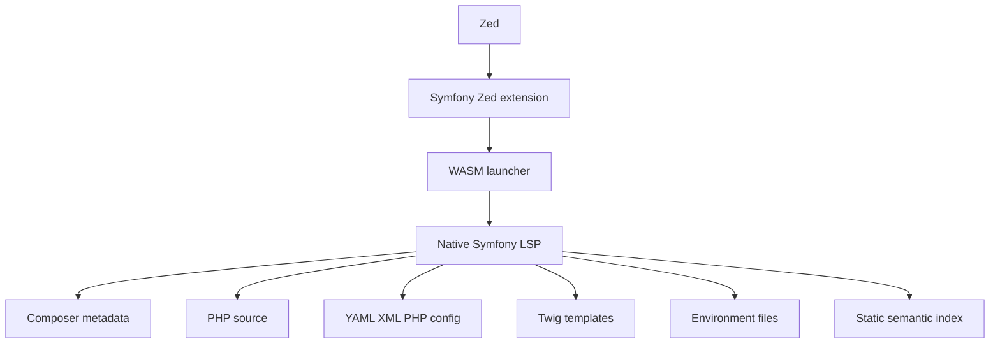

# Symfony Zed extension architecture

Phase 0 architecture decision.

## Decision

Build one installable Zed extension backed by a standalone native Symfony language server.

The extension and server should begin in the same repository as separate Cargo crates:

```text
zed-symfony/
├── extension.toml
├── Cargo.toml                 # Zed extension, compiled to WASM
├── src/
│   └── lib.rs                 # launcher and Zed integration
├── symfony-lsp/
│   ├── Cargo.toml             # native executable
│   └── src/
│       ├── main.rs
│       ├── server.rs
│       ├── index.rs
│       ├── parser/
│       ├── routing/
│       ├── services/
│       ├── twig/
│       └── diagnostics/
├── fixtures/
├── docs/
└── .github/workflows/
```

The two crates have different targets and should not share implementation dependencies. The extension crate targets Zed's `wasm32-wasip2` environment. The LSP crate produces platform-native binaries for the operating systems supported by Zed.

## Runtime flow



The extension is responsible for:

- Registering the Symfony language server.
- Associating it with `PHP`, `Twig`, `YAML`, `XML`, and `Env`.
- Finding a local development binary or downloading a pinned release binary.
- Detecting the host platform and architecture.
- Starting the server and forwarding the worktree environment.
- Forwarding initialization options and settings.
- Logging launch and version failures clearly.

The server is responsible for:

- Speaking LSP over stdio.
- Discovering the Symfony project.
- Building and maintaining the semantic index.
- Handling open buffers and watched-file changes.
- Providing Symfony-specific completion, navigation, hover, references, diagnostics, and code actions.
- Persisting a cache when that can be done without weakening correctness.

## Static-only boundary for version 1

The initial server must not boot the Symfony application or execute project PHP code. Its inputs are static project files and metadata:

- `composer.json`
- `composer.lock`
- `vendor/composer`
- PHP source and attributes
- YAML, XML, and PHP configuration
- Twig templates
- Translation files
- `.env*` files

The following are explicitly out of scope for the initial release:

- `bin/console` execution.
- Reading the compiled service container as runtime truth.
- Database connections.
- Profiler integration.
- Docker, DDEV, Symfony CLI, or remote-runtime orchestration.

Runtime-assisted inspection can be added later as an explicit opt-in mode, without changing the static mode's guarantees.

## Language ownership and coexistence

The Symfony extension must not add a `languages/` directory or grammar definitions in its first version.

| Language | Existing provider | Symfony behavior |
| --- | --- | --- |
| `PHP` | Official PHP extension and user-selected PHP LSP | Add Symfony metadata; do not duplicate generic PHP analysis |
| `Twig` | `zed-twig`, including Twiggy | Add Symfony template/framework intelligence; verify overlapping LSP behavior |
| `YAML` | Native Zed language support | Index Symfony configuration files |
| `XML` | `zed-xml` | Index Symfony service/configuration files |
| `Env` | `zed-env` | Index environment keys and references |

Twig is the main integration risk because `zed-twig` already registers Twiggy as a language server. Phase 1 must test whether both servers can run usefully together and whether duplicate completion, hover, diagnostics, or semantic-token responses need to be narrowed. The Symfony server should not replace Twiggy's generic Twig syntax support.

The PHP extension also exposes several PHP language servers. The Symfony server should be framework-specific and remain compatible with a user-selected generic PHP server rather than trying to become a replacement.

## Target language-server registration

The intended manifest registration is:

```toml
[language_servers.symfony-lsp]
name = "Symfony"
languages = ["PHP", "Twig", "YAML", "XML", "Env"]
```

The exact manifest field shape and multi-server behavior must be checked against the Zed extension API during Phase 1. The important architectural constraint is that these are existing language IDs owned by other providers; Symfony does not claim their grammars.

## Version handling

The server targets Symfony 6.4, 7.4, and 8.1. It should:

1. Read installed Symfony component versions from `composer.lock`.
2. Fall back to `composer.json` only when lock data is unavailable.
3. Detect optional components independently.
4. Select version-sensitive parsers and diagnostics conservatively.
5. Mark unknown framework relationships as unresolved instead of guessing.

## Release boundary

The extension and LSP are separate release artifacts even while they share a repository:

```text
Zed extension release  -> WASM extension package
LSP release            -> native binaries per supported platform
```

The extension should pin the LSP version it launches and validate downloaded release artifacts. A later standalone `symfony-lsp` repository is possible if the server gains users outside Zed or needs an independent release cadence.

## Testing strategy

The native LSP should have fast unit tests and fixture-based integration tests for:

- Composer and Symfony version detection.
- PHP attributes and class indexing.
- Routes and route references.
- Twig template relationships.
- Environment variables.
- YAML/XML/PHP service definitions.
- Incremental updates and watched files.
- Conservative behavior when metadata is ambiguous.

Zed-specific integration tests should cover extension installation, server launch, language IDs, coexistence with Twiggy and a PHP LSP, and the supported editor capabilities listed in the feature matrix.
