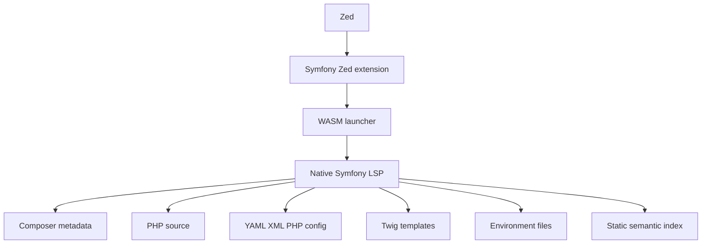

# Symfony Zed extension architecture

Architecture overview.

## Decision

Build one installable Zed extension backed by a standalone native Symfony language server.

The extension and server should begin in the same repository as separate Cargo crates:

```text
zed-symfony/
├── extension.toml
├── Cargo.toml                 # Zed extension (workspace root), compiled to WASM
├── src/
│   └── lib.rs                 # launcher and Zed integration
├── symfony-lsp/
│   ├── Cargo.toml             # native executable
│   ├── src/
│   │   ├── main.rs
│   │   ├── server.rs
│   │   ├── lsp_helpers.rs
│   │   ├── index.rs
│   │   ├── index/
│   │   │   ├── parser.rs
│   │   │   ├── project.rs
│   │   │   ├── doctrine.rs
│   │   │   └── forms_twig.rs
│   │   └── server/
│   │       ├── code_actions.rs
│   │       └── diagnostics.rs
│   └── tests/
│       └── lsp_e2e.rs
├── scripts/
│   └── lsp_smoke.py
├── docs/
└── .github/workflows/
```

The two crates have different targets and should not share implementation dependencies. The extension crate targets Zed's `wasm32-wasip2` environment. The LSP crate produces platform-native binaries for the operating systems supported by Zed.

## Runtime flow


```mermaid
flowchart TD
    Zed[Zed] --> Extension[Symfony Zed extension]
    Extension --> Launcher[WASM launcher]
    Launcher --> Server[Native Symfony LSP]
    Server --> Composer[Composer metadata]
    Server --> Source[PHP source]
    Server --> Config[YAML XML PHP config]
    Server --> Twig[Twig templates]
    Server --> Env[Environment files]
    Server --> Index[Static semantic index]
```

The extension is responsible for:

- Registering the Symfony language server.
- Associating it with `PHP`, `Twig`, `YAML`, `XML`, and `Env`.
- Finding a local development binary or downloading a pinned release binary.
- Detecting the host platform and architecture.
- Starting the server and forwarding the worktree environment.
- Forwarding initialization options and settings.
- Logging launch and version failures clearly.

The server is responsible for:

- Speaking LSP over stdio.
- Discovering the Symfony project.
- Building and maintaining the semantic index.
- Handling open buffers and watched-file changes.
- Providing Symfony-specific completion, navigation, hover, references, diagnostics, and code actions.
- Persisting a cache when that can be done without weakening correctness.

## Static-only boundary for version 1

The initial server must not boot the Symfony application or execute project PHP code. Its inputs are static project files and metadata:

- `composer.json`
- `composer.lock`
- PHP source and attributes
- YAML, XML, and PHP configuration
- Twig templates
- Translation files
- `.env*` files

The following are explicitly out of scope for the initial release:

- `bin/console` execution.
- Reading the compiled service container as runtime truth.
- Database connections.
- Profiler integration.
- Docker, DDEV, Symfony CLI, or remote-runtime orchestration.

Runtime-assisted inspection can be added later as an explicit opt-in mode, without changing the static mode's guarantees.

## Language ownership and coexistence

The Symfony extension does not add a `languages/` directory or grammar definitions; it attaches to Zed's existing language IDs.

| Language | Existing provider | Symfony behavior |
| --- | --- | --- |
| `PHP` | Official PHP extension and user-selected PHP LSP | Add Symfony metadata; do not duplicate generic PHP analysis |
| `Twig` | `zed-twig`, including Twiggy | Add Symfony template/framework intelligence; verify overlapping LSP behavior |
| `YAML` | Native Zed language support | Index Symfony configuration files |
| `XML` | `zed-xml` | Index Symfony service/configuration files |
| `Env` | `zed-env` | Index environment keys and references |

Twig is an integration risk because `zed-twig` already registers Twiggy as a language server. Coexistence and duplicate completion/hover/diagnostic behavior still require a Zed fixture test. The Symfony server should not replace Twiggy's generic Twig syntax support.

The PHP extension also exposes several PHP language servers. The Symfony server should be framework-specific and remain compatible with a user-selected generic PHP server rather than trying to become a replacement.

## Target language-server registration

The intended manifest registration is:

```toml
[language_servers.symfony-lsp]
name = "Symfony"
languages = ["PHP", "Twig", "YAML", "XML", "Env"]
```

The manifest uses Zed's `language_servers` registration for existing language IDs. The important architectural constraint is that these languages are owned by other providers; Symfony does not claim their grammars. PHP rename routing remains subject to Zed's primary-server selection (see `docs/compatibility.md`).

## Version handling

The server targets Symfony 6.4, 7.4, and 8.1. It:

1. Reads the installed Symfony version from `composer.lock`.
2. Falls back to the `composer.json` constraint only when lock data is unavailable.
3. Detects optional components independently.
4. Leaves version-sensitive behavior disabled when the version is unknown or below the 6.4 baseline.
5. Marks unknown framework relationships as unresolved instead of guessing.

v1 has no version-gated rules yet, so the detected version is recorded and logged rather than changing analysis.

## Release boundary

The extension and LSP are separate release artifacts even while they share a repository:

```text
Zed extension release  -> WASM extension package
LSP release            -> native binaries per supported platform
```

The extension should pin the LSP version it launches and validate downloaded release artifacts. A later standalone `symfony-lsp` repository is possible if the server gains users outside Zed or needs an independent release cadence.

## Testing strategy

The native LSP has fast unit tests plus end-to-end LSP tests in
`symfony-lsp/tests/lsp_e2e.rs`, which spawn the real server and drive it over
stdio JSON-RPC. Coverage includes:

- Composer and Symfony version detection.
- PHP attributes and class indexing.
- Routes and route references.
- Twig template relationships.
- Environment variables.
- YAML/XML/PHP service definitions.
- Watched-file updates and multi-file edits.
- Conservative behavior when metadata is ambiguous.

Zed-specific integration tests still need to cover extension installation,
server launch, language IDs, coexistence with Twiggy and a PHP LSP, and the
supported editor capabilities listed in the feature matrix; see
[`zed-integration.md`](zed-integration.md).
